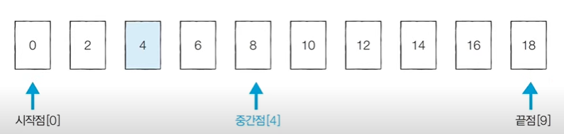
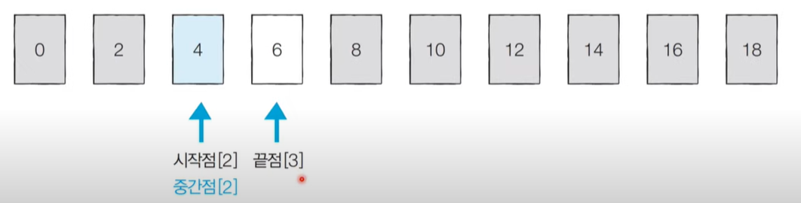
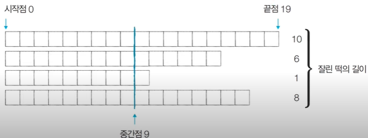
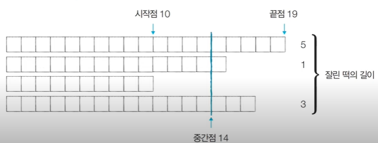
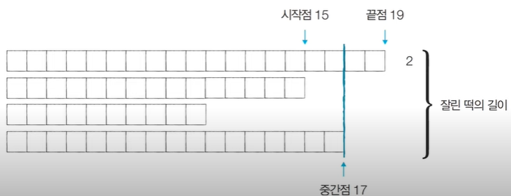
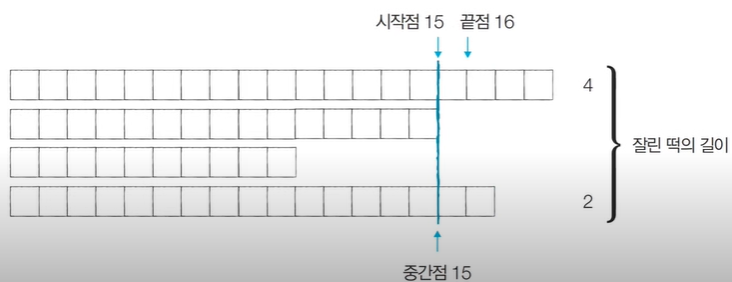

- 순차 탐색 : 리스트 안에 있는 특정 데이터를 찾기 위해 앞에서부터 데이터를 하나씩 확인하는 방법
- 이진 탐색 : 정렬되어 있는 리스트에서 탐색 범위를 절반씩 좁혀가며 데이터를 탐색하는 방법
    - 이진 탐색은 시작점, 끝점, 중간점을 이용하여 탐색 범위를 설정함

이진 탐색 과정
1. 리스트 중간에 있는 임의의 값을 선택하여 찾고자 하는 값 X와 비교한다
2. X가 중간 값보다 작으면 중간 값을 기준으로 좌측 데이터들을 대상으로, X가 중간값보다 크면 우측 데이터들을 대상으로 탐색한다
3. 동일한 방법으로 다시 중간의 값을 임의로 선택하고 비교한다
4. 해당 값을 찾을 때까지 이 과정을 반복한다

이진 탐색 예시
오름차순으로 정렬된 배열이 있다
> {0,2,4,6,8,10,12,14,16,18}
찾고자 하는 값이 4인 경우를 예시로 들고 아래 단계를 진행해보겠습니다

[Step1] 시작점: 0, 끝점: 9, 중간점: 4 (소수점 이하 제거)
- 시작점, 끝점, 중간점을 나타내는 숫자들은 index를 의미한다
- 아래의 사진에서와 같이 중간점이 두 개인 경우, 소수점 이하를 제거한 index를 중간점으로 지정한다

<div align='center'>
    <br>
</div>

[Step2] 시작점: 0, 끝점: 3, 중간점: 1 (소수점 이하 제거)
- 찾고자 하는 값, 4가 중간점인 8보다 작기에 중간점을 포함한 오른쪽 값들을 제거한다
- 끝점을 처음 지정한 중간점인 8 왼쪽으로 지정한다

<div align='center'>
    <br>
</div>

[Step3] 시작점:2, 끝점: 3, 중간점: 2 (소수점 이하 제거)
- 4는 2보다 크기에 중간점을 포함한 왼쪽 값들을 제거한다
- 시작점을 중간점(2) 오른쪽으로 이동한다
- 중간점 값은 찾고자 했던 값 4와 동일하기에 탐색을 마친다

<div align='center'>
    <br>
</div>

이진 탐색의 시간 복잡도
단계마다 탐색 범위를 2로 나누는 것과 동일하므로 연산 횟수는 **logN**에 비례한다
예를 들어 초기 데이터 개수가 32개일 때, 이상적으로 1단계를 거치면 16가량의 데이터만 남는다
2단 계를 거치면 8개, 3단계를 거치면 4개가량의 데이터만 남는다

아래 표를 통하여 자세히 알아보자

|비교|범위|
|:------:|:------:|
|q0|n|
|1|n/2|
|2|n/4|
|...|...|
|k|n/2^k|

표의 마지막 행에서 `n/2^k = 1` 이므로, k=log 2 n임을 알 수 있다
즉, 이진 탐색은 탐색 범위를 절반씩 줄여나가며 이에 따른 시간 복잡도는 **O(logN)**을 보장한다


순환호출을 이용한 이진 탐색 소스코드
```
int binarySearch1(int key, int low, int high) {
	int mid;

	if(low <= high) {
		mid = (low + high) / 2;

		if(key == arr[mid]) { // 탐색 성공 
			return mid;
		} else if(key < arr[mid]) {
			// 왼쪽 부분 arr[0]부터 arr[mid-1]에서의 탐색 
			return binarySearch1(key ,low, mid-1);  
		} else {
			// 오른쪽 부분 - arr[mid+1]부터 arr[high]에서의 탐색 
			return binarySearch1(key, mid+1, high); 
		}
	}

	return -1; // 탐색 실패 
}
```

반복 구조를 이용한 이진 탐색 소스코드
```
int binarySearch2(int key, int low, int high) {
	int mid;

	while(low <= high) {
		mid = (low + high) / 2;

		if(key == arr[mid]) {
			return mid;
		} else if(key < arr[mid]) {
			high = mid - 1;
		} else {
			low = mid + 1;
		}
	}

	return -1; // 탐색 실패 
}
```

이진 탐색을 활용한 알고리즘 문제
파라메트릭 서치(Parametric Search)
- 파라메트릭 서치란 최적화 문제를 결정 문제('예' 혹은 '아니오')로 바꾸어 해결하는 기법이다
    - 예시: 특정 조건을 만족하는 가장 알맞은 값을 빠르게 찾는 최적화 문제
일반적으로 코딩 테스트에서 파라메트릭 서치 문제는 이진 탐색을 이용하면 문제 해결이 가능하다

<문제> 떡볶이 떡 만들기:
- 오늘 상혁이는 여행 가신 부모님을 대신하여 떡집 일을 하기로 했습니다. 상혁이네 떡볶이 집은 재밌게도 떡볶이의 떡의 길이가 일정하지 않습니다. 대신 한 봉지 안에 들어가는 떡의 총 길이는 절단기로 잘라서 맞춰줍니다.
- 절단기에 높이(H)를 지정하면 줄지어진 떡을 한 번에 절단합니다. 높이가 H보다 긴 떡은 H 위의 부분이 잘릴 것이고, 낮은 떡은 잘리지 않습니다.
- 예를 들어 높이가 19, 14, 10, 17cm인 떡이 나란히 있고 절단기 높이를 15cm로 지정하면 자른뒤 떡의 높이는 15, 14, 10 ,15cm가 될 것입니다. 잘린 떡의 길이는 차례대로 4, 0, 0, 2cm입니다. 손님은 6cm만큼의 길이를 가져갑니다.
- 손님이 왔을 때 요청한 총 길이가 M일 때 적어도 M만큼의 떡을 얻기 위해 절단기에 설정할 수 있는 높이의 최대값을 구하는 프로그램을 작성하세요.

입력 조건
- 첫째 줄에 떡의 개수 N과 요청한 떡의 길이 M이 주어집니다. (1 <= N <= 1,000,000, 1 <= M <= 2,000,000,000)
- 둘째 줄에는 떡의 개별 높이가 주어집니다. 떡 높이의 총합은 항상 M이상이므로, 손님은 필요한 양만큼 떡을 사갈 수 있습니다. 높이는 10억보다 작거나 같은 양의 정수 또는 0입니다.

출력 조건
- 적어도 M만큼의 떡을 집에 가져가기 위해 절단기에 설정할 수 있는 높이의 최대값을 출력합니다.

입력 예시
>4 6
>19 15 10 17

출력 예시
>15

<문제 해결 아이디어>
- 적절한 높이를 찾을 때까지 이진 탐색을 수행하여 높이 H를 반복해서 조정하면 된다.
- '현재 이 높이로 자르면 조건을 만족할 수 있는가?'를 확인한 뒤에 조건의 만족 여부('예' 혹은 '아니오')에 따라 탐색 범위를 좁혀서 해결할 수 있다.
- 절단기의 높이는 0부터 10억까지의 정수 중 하나이다.
    - 이렇게 큰 탐색 범위를 보면 가장 먼저 **이진 탐색**을 떠올려야 한다.
- 문제에서 제시된 예시를 통해 그림으로 이해해보자.

[Step1] 시작점: 0, 끝점: 19, 중간점: 9
- 필요한 떡의 크기 M = 6 이므로, 결과 저장
- 필요한 떡의 크기보다 잘린 떡의 길이가 더 크므로 시작점을 처음 지정한 중간점 오른쪽으로 옮긴다

<div align='center'>
    <br>
</div>

[Step2] 시작점: 10, 끝점: 19, 중간점: 14
- 마찬가지로, 손님이 요구한 떡의 길이보다 길기에 시작점을 중간점 오른쪽으로 옮긴다

<div align='center'>
    <br>
</div>

[Step3] 시작점: 15, 끝점: 19, 중간점: 17
- 필요한 떡의 길이보다 적다
- 잘린 떡의 길이를 늘리기 위하여 끝점을 지정한 중간점(17) 왼쪽으로 옮긴다

<div align='center'>
    <br>
</div>

[Step4] 시작점: 15, 끝점: 16, 중간점: 15
- 손님이 요구한 떡의 길이를 얻을 수 있다
- 이진 탐색 수행을 중단한다

<div align='center'>
    <br>
</div>

```
public static void main(String[] args) {
    Scanner sc = new Scanner(System.in);

    //떡의 개수(N)와 요청한 떡의 길이(M)
    int n = sc.nextInt();
    int m = sc.nextInt();

    //각 떡의 개별 높이 정보
    int[] arr = new int[n];
    for(int i = 0; i < n; i++) {
        arr[i] = sc.nextInt();
    }

    //이진 탐색을 위한 시작점과 끝점 설정
    int start = 0;
    int end = (int) 1e9;
    //이진 탐색 수행(반복적)
    int result = 0;
    while(start <= end) {
        long total = 0;
        int mid = (start + end) / 2;
        for(int i = 0; i < n; i++) {
            //잘랐을 때의 떡의 양 계산
            if(arr[i] > mid) total += arr[i] - mid;
        }
        if(total < m) { //떡의 양이 부족한 경우 더 많이 자르기 (왼쪽 부분 탐색)
            end = mid - 1;
        }
        else { //떡의 양이 충분한 경우 덜 자르기 (오른쪽 부분 탐색)
            result = mid; // 최대한 덜 잘랐을 때가 정답이므로, 여기에서 result에 기록
            start = mid + 1;
        }
    }

    System.out.println(result);
}

