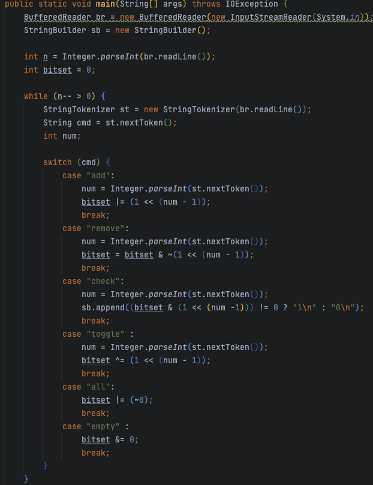
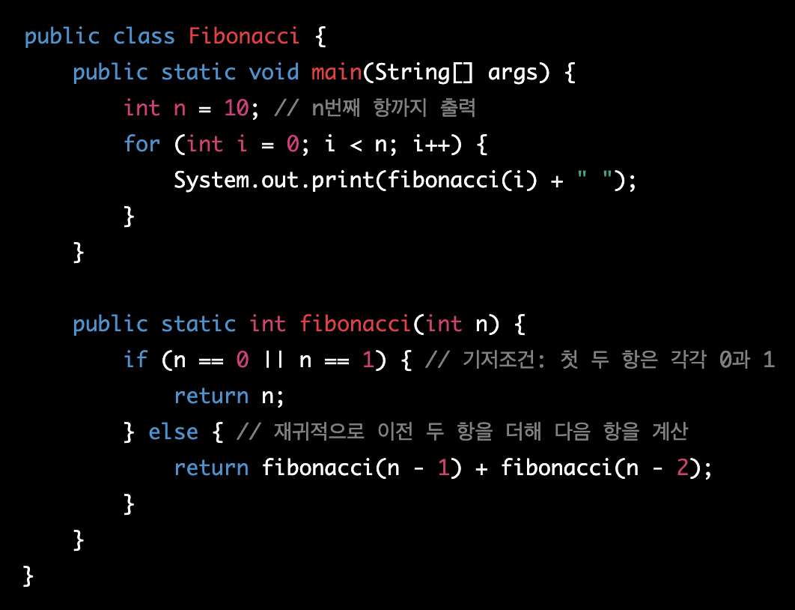
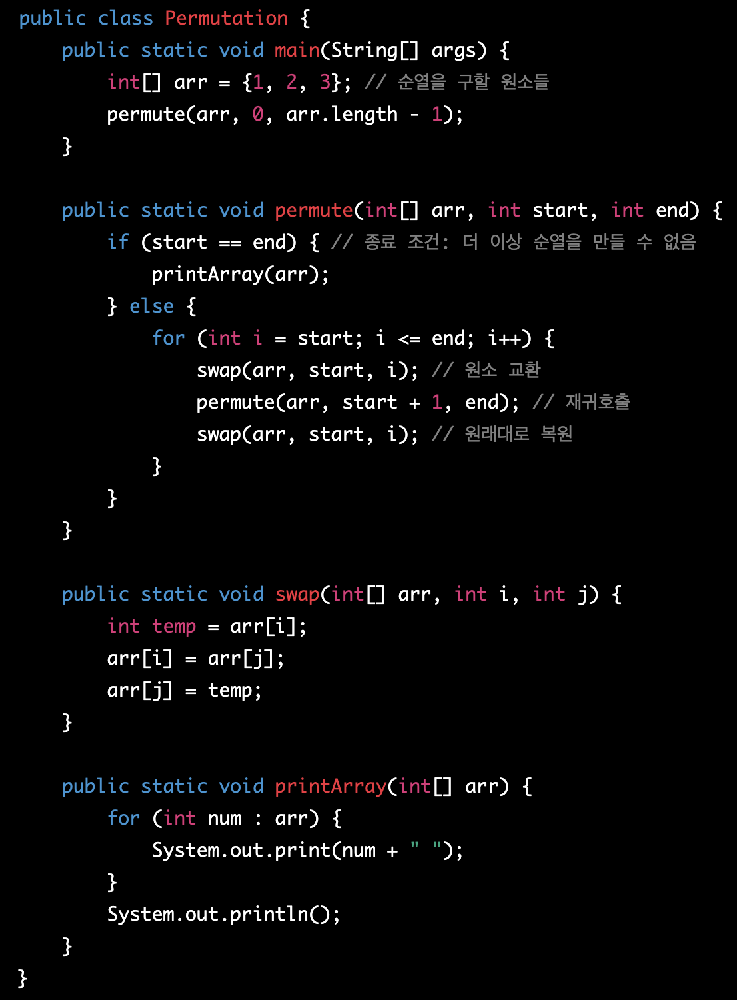
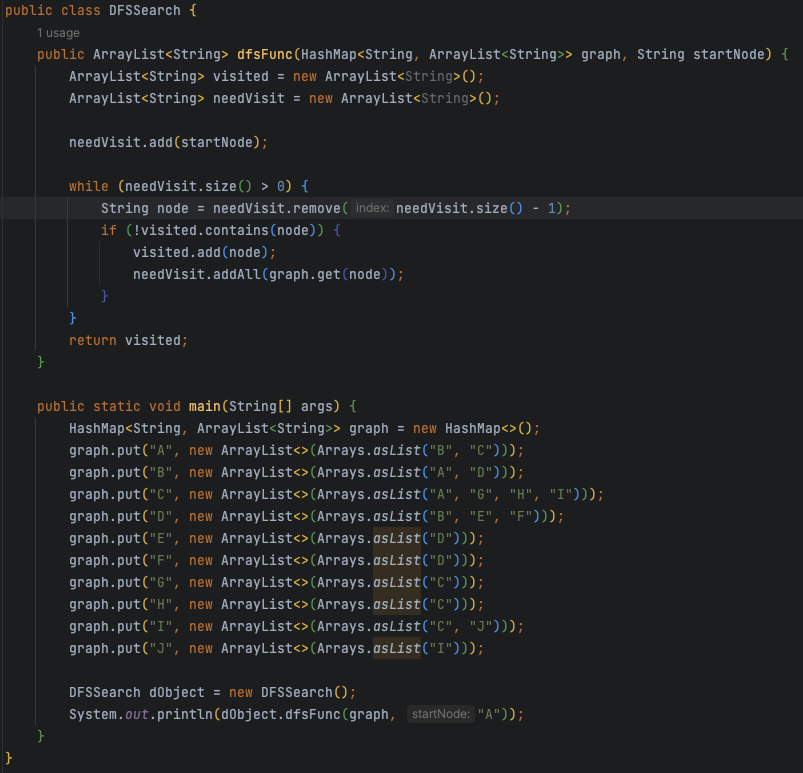
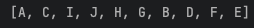
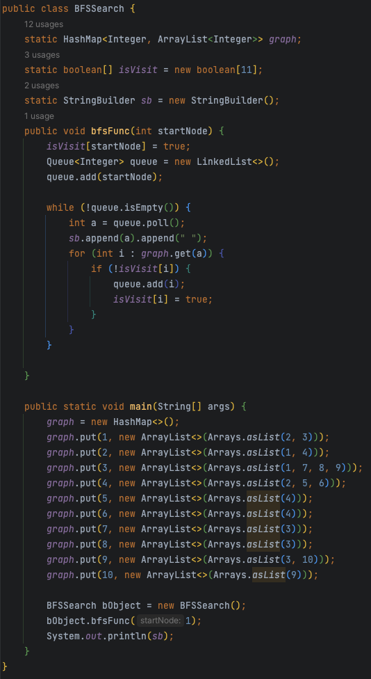
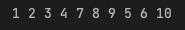

# 완전탐색(brute force search)

완전탐색은 문제 해결법 중 하나로, 가능한 모든 경우의 수를 다 검사하는것으로 다른 방법들보다 느리지만 항상 정확한 결과를 도출한다.

예를들어, 순열을 구하는 문제에서 완전탐색은 가능한 모든 조합을 다 찾아본다.

이러한 완전탐색은 문제 해결에 있어 유용하지만, 문제의 크기가 커질수록 시간 복잡도가 증가하기 때문에 주의하여야 한다.

## 완전 탐색 기법

- 단순 Brute-Force
    - 단순히 for문과 if문 등으로 모든 case들을 만들어 구한는 방법.
- 비트마스크
    - 나올 수 있는 모든 경우의 수가 각각의 원소가 포함되거나, 포함되지 않는 두 가지 선택으로 구성되는 경우 사용.
예시) 백준 11732: 집합
    

    

    
    - 재귀함수
비트마스크와 마찬가지로 주로 각 원소가 포함되거나, 포함되지 않는 두 가지 선택을 가질 때 이용.
포함이 되면 해당 원소를 넣어 함수를 호출하고, 포함되지 않으면 그 상태에서 함수를 호출하는 식
예시) 피보나치 수열
    

    

   
    
- 순열
서로 다른 N기를 일렬로 나열하는 경우의 수. 시간 복잡도 O(N!)이므로 코딩 테스트 등의 경우 다른 알고리즘을 고려해야 한다.

    

 
    
- BFS/DFS
길 찾기 등에서 추로 쓰임.
    - DFS
    깊이 우선 탐색. stack 또는 재귀함수를 이용하여 구현. 최대한 깊숙이 들어가서 확인한 뒤 다시 돌아가 다른 루트를 탐색.

    

 

    

   
    - BFS
    너비 우선 탐색. 그래프에서 가까운 노드부터 우선적으로 탐색하는 알고리즘. queue 자료구조 이용.

    

  

    

 
