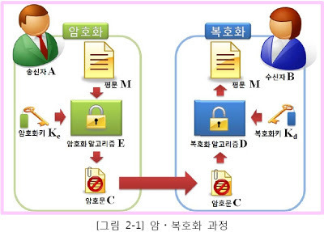
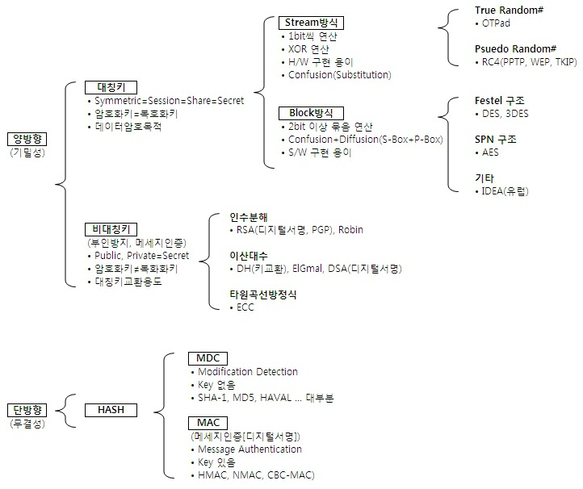
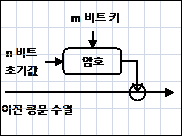
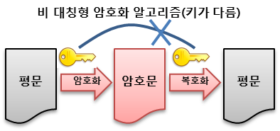
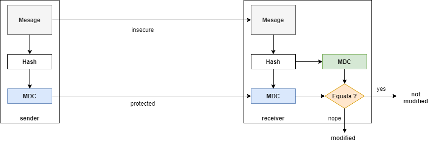
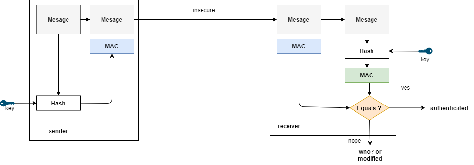

# 암호화 알고리즘🔐
> 데이터의 무결성 및 기밀성을 유지하기 위하여 정보를 쉽게 해독할 수 없도록 암호화하는 알고리즘

`암호화` : 메시지의 내용이 불명확하도록 평문(Plain text, 원본 데이터)재구성하여 암호화된 문장(Cipher text)으로 만드는 과정

```
평문 : 해독 가능한 형태의 텍스트
ex) 123456

암호문 : 해독 불가능한 형태의 텍스트
ex) aWfwlknr!
```

<br>

## 1. 암호화의 특성
| 특성 | 기능 | 적용기술 |
|------|------------|------|
| **인증(Authentication)** | PKI 사용자에 대한 신원 확인 기능 | 인증서 |
| **기밀성(Confidentiality)** | 송·수신자 이외는 송신내용 인지 불가 | 암·복호화 |
| **무결성(Integrity)** | 정보의 조작 및 변경 여부 확인 | 해쉬함수 |
| **부인 방지(Non-repudiation)** |  송수신자의 송수신 사실 부인 봉쇄 | 전자서명 |
| **가용성(Availability)** | 정합한 요구 시 서비스 제공 | 암호/인증 |


#### 부인 방지(Non-repudiation)
> 메시지의 송·수신이나 교환 후 또는 통신이나 처리가 실행된 후에 그 사실을 사후에 증명함으로써 사실 부인을 방지하는 보안기술

```
🙎‍♀️(은선) : 돈 좀 빌려줄 수 있어? 일주일 후에 갚을게
🙋‍♂️(상혁) : 알겠어 차용증에 서명 좀 해주라

<일주일 후>

💁‍♂️(상혁) : (차용증 제출) 빌린 돈 돌려줄래? 
🤷‍♀️(은선) : 나 돈 빌린 적 없는데? 그 서명도 내 서명 아니야~
```

상혁이 문서에 있는 서명이 은선의 것이 맞다는 것을 확인하는 것을 **부인 방지**라고 한다.

`대칭 키`의 경우에는 부인 방지가 불가능하다.
<br>`공개 키`의 경우에는 `발행자의 증명`과 동일한 절차로 부인 방지가 이루어진다.

<br>

## 2. 암호 시스템
### 암호화/복호화 개념도
<div align='center'>
    
</div>
침해자는 암호키가 없기 때문에 암호문 파악 불가

### 암호화 구성 요소
- `평문(Plaintext)` : 해독 가능한 형태의 메시지(암호화전 메시지)
- `암호문(Cipertext)` : 해독 불가능한 형태의 메시지(암호화된 메시지)
- `암호화(Encryption)` : 평문을 암호문으로 변환하는 과정
- `복호화(Decryption)` : 암호문을 평문으로 변환하는 과정
- `키(Key)` : 암호화 알고리즘의 매개변수
- `암호 알고리즘(Encryption Algortihm)` : 암호화와 복호화에 이용되는 알고리즘
- `암호 시스템(Cryptosystem)` : 암호화 기술과 복호화 기술의 통칭

<br>

## 3. 암호 알고리즘 분류
<div align='center'>
    
</div>

## 1) 양방향 방식
> 암호화와 복호화가 양방향으로 이루어지는 방식

### [ 대칭키 방식(Symmetric-key Cryptography) ]
> 암호화를 할 때와 복호화를 할 때 같은 암호키를 사용하는 알고리즘
<div align='center'>
    
</div>

- **암호키 = 복호키**
    - 키의 수 : **1개** - 두사람이 한 개의 비밀키를 공유
    - 키의 관리 : 모든 전송 당사자간암·복호화를 위한 키를 공유해야함
    - 암호화 키 : Secret Key
    - 복호화 키 : Secret Key
- 대칭키로 인하여 부인방지 불가능
- 비트 단위 암호화, 간단한 내부 구조로 상대적으로 빠른 속도 제공
- 용도 : 개인파일 암호화, 특정 불특정 그룹내의 통신에 사용
- 장점 : 구현 용이, 변형 가능
- 단점 : 상대적으로 쉽게 해독 가능(보안 취약)하며, 키 관리가 어려움
- 구현 방식 :
    - `블록 암호 방식(Block Cipher)`  고정 길이의 블록을 할당하여 암호화하는 방식(ex. DES, AES, SEED)
    - `스트림 암호 방식(Stream Cipher)`  유사 난수를 연속적으로 생성하여 암호문을 생성하는 방식(ex. RC4, A5/1, A5/2)

<br>

| 구분 | 블록 암호(Block Cipher) | 스트림 암호(Stream Cipher) |
|---|-------------------|-------------|
| 개념 | 평문을 일정한 **블록 단위**로 나누어서 각 블록마다 **암호화** 과정을 수행하여 고정된 크기의 블록단위의 암호문을 생성 | **평문과 같은 길이의 키 스트림**을 생성하여 평문과 키 **이진 수열**을 **비트단위**로 **배타적 논리합 이진연산**으로 결합하여 암호문 생성|
|장점|높은 확산, 기밀성, 해쉬함수 다양|암호 속도 빠름, 에러전파 현상 없음|
|단점|느린 암호화, 에러 전달| 낮은 확산|
|주요 대상| 일반데이터 전송, 스토리지 저장| 음성, 오디오 스트리밍, 비디오 스트리밍|
|예시|DES, AES, SEED|LFSR,RC4, A5/1, A5/2|
|단위|블록 단위|비트 단위|

<div align='center'>
    
    <p>블록 암호</p>
</div>

<div align='center'>
    
    <p>스트림 암호</p>
</div>

> **AES와 DES**
>
> 1975년부터 `DES`(Data Encryption Standard)라는 알고리즘이 사용되었음. 너무 오래되어 취약점이 발견되어 AES 등장
> <br> `AES`는 현 미국 표준 방식이며, 128~256비트의 키를 적용할 수 있어 보안성이 뛰어나며 공개된 알고리즘이라 누구나 사용 가능

<br>

### [ 비대칭키 방식(공개키 방식) ]
> 메시지 암호화 하는 키와 복호화 하는 키가 다른 알고리즘 (공개키와 암호화키)
<div align='center'>
    
</div>

- **암호키 ≠ 복호키**
    - 키의 수 : 전송 당사자간에 각각 **키쌍(Private Key, Public Key)**를 공유
    - 키의 관리 : 인증기관을 통해 전송 당사자 별 Private Key 발급
    - 암호화 키 : Public Key
    - 복호화 키 : Private Key
- 키의 이원화로 **부인방지 가능**
- 큰 소수를 찾거나, 곡률 방정식 등의 연산으로 속도가 느림
- 용도 : 다수의 정보교환(Key)에 주로 사용
- 장점 : 암호해독이 어려움(보안 강화), 전자서명
- 단점 : 해독시간이 상대적으로 오래 걸림
- 구현 방식 :
    - `소인수분해`(RSA), `이산대수`(DSA, ECC), `근저백터`(Lattice)
    - `전자 서명(Digital Signature)` : 인터넷 상에서 본인임을 증명하기 위해 서명을 하는 수단, 공개키 암호를 거꾸로 활용하는 방식(ex. DSA, RSA, Signature, ECDSA)

<br>

## 2) 일방향, 단방향 방식(해쉬 암호 방식)
- 해싱(Hashing)을 이용한 암호화 방식
- 임의의 길이의 메시지를 입력으로 받아 고정된 길이의 해시 값을 출력하는 함수
- 해시 함수에는 암호 키가 사용되지 않기 때문에, 같은 입력에 대해서 항상 같은 해시 값을 얻을 수 있음 -> `무결성`을 제공
- 평문을 암호문으로 암호화는 가능하지만 암호문을 평문으로 복호화 하는 것은 불가능

#### 암호학적 해쉬 함수가 가져야하는 특징
1. **역상 저항성(preimage resistance)**
    - 어떤 해시 값에 대하여, 원래 입력 값을 찾는 것이 어려워야함
    - 일방향성(One-wayness)라고도 함
2. **제 2 역상 저항성(second premimage resistance)**
    - 어떤 입력 값의 해시 값과 같은 또다른 입력값을 찾는 것이 어려워야 함
3. **충돌 저항성(collision resistance)**
    - 같은 해시 값을 갖는 두 입력 값을 찾는 것이 어려워야 함

<br>

디지털 메시지를 다룰 때, 그 메시지가 변경되었는지 혹은 내가 알고 있는 그 사람에게 온게 맞는지 확인할 필요가 있다. 이때, 변경 감지 코드(MDC)와 메시지 인증 코드(MAC)가 이용된다.

### [ MDC(Modification Detection Code, 변경 감지 코드) ]
> 변경 감지 코드로 메시지의 무결성을 보장해주는 알고리즘
>
> 변경메시지를 암호학적 해쉬 함수를 통해 해쉬값을 만든 것

<div align='center'>
    
</div>

`송신자` : 원본의 메시지는 그대로 보내고 해쉬값`MDC`를 만들어 안전한 채널에 보낸다.
<br> 이 때, 안전한 채널로 외부로부터 변경이 되지 않는다는 보장이 필요

`수신자` : 전달받은 메시지를 MDC로 다시 만들어 전달받은 MDC와 비교하여 이 둘이 같으면 변경되지 않은 것, 변경 되었다면 변경되었다고 판단
<br> => 메시지의 변경이 일어났는지 확인하면서 데이터 무결성을 판단

### [ MAC(Message Authentication Code, 메시지 인증 코드) ]
> 메시지 인증코드로 메시지의 무결성과 송신자의 인증을 보장 

메시지가 외부에 노출되어도 상관없을 때 사용한다. 

MAC 방식은 양방향 암호화 알고리즘보다 빠르다는 장점을 가지고 있지만, 기밀성을 제공하지 않기 때문에 보안에 취약하다는 단점이 있다.

<div align='center'>
    
</div>

`송신자` : 수신자와 미리 공유된 키를 가지고 메시지 해쉬값 `MAC`를 만들고 메시지와 함께 보냄

`수신자` : 송신자로부터 받은 MAC와 메시지를 키와 함께 해쉬값으로 만든 후 비교하여 같으면 송신자로 온 게 맞고 아니면 메시지 변경으로 판단


* * *

### ❓ 관련 질문
Q1. 비대칭키 암호화, 대칭키 암호화에 대해 간단히 설명해주세요.

Q2. 단방향 암호화에 대해서 간단히 설명해주세요.

Q3. OAuth에 대해 간단히 설명해주세요.


### 📖 참고 자료
[암호 알고리즘 개념 및 종류](https://for-it-study.tistory.com/65)

[[Programming] 암호화 알고리즘 종류와 분류](https://velog.io/@inyong_pang/Programming-%EC%95%94%ED%98%B8%ED%99%94-%EC%95%8C%EA%B3%A0%EB%A6%AC%EC%A6%98-%EC%A2%85%EB%A5%98%EC%99%80-%EB%B6%84%EB%A5%98)

[KISA 암호이용활성화](https://seed.kisa.or.kr/kisa/intro/EgovDefinition.do)

[암호화 알고리즘 종류](https://jusungpark.tistory.com/34)

[지덤사전 - 암호화(DES, SEED, ARIA 등)](http://www.jidum.com/jidums/view.do?jidumId=614)

[[암호학] MDC(MODIFICATION DETECTION CODE)와 MAC(MESSAGE AUTHENTICATION CODE) 개념과 차이, CMAC 설명](https://reakwon.tistory.com/102)
