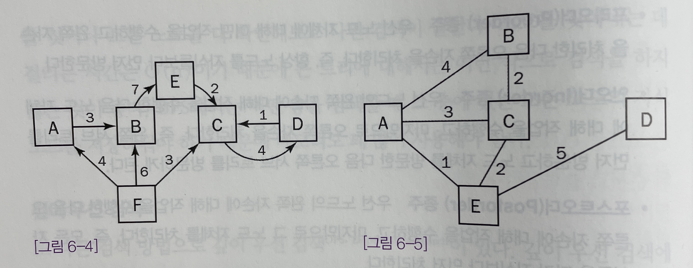
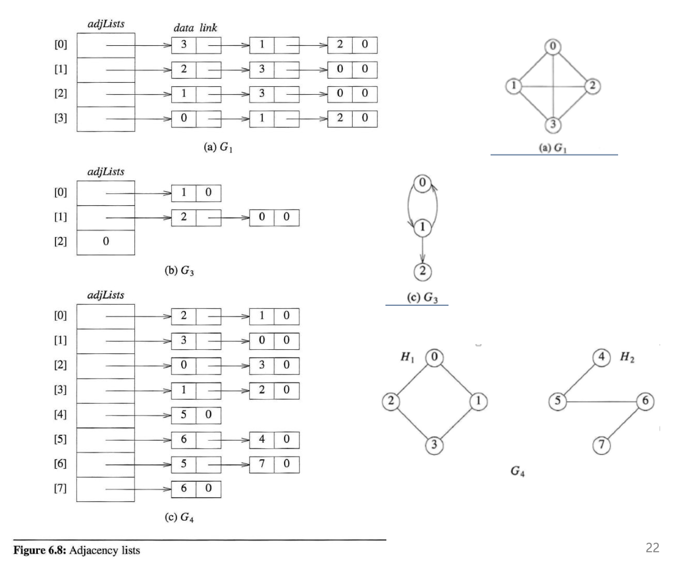
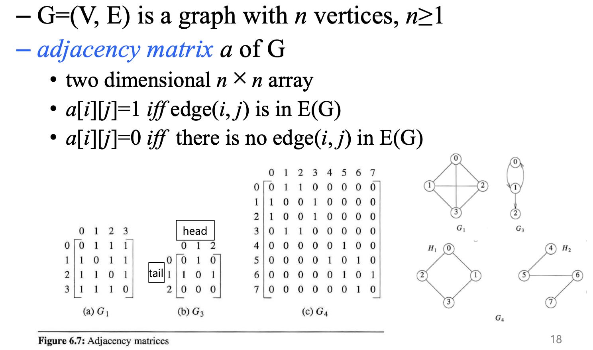

> 작성자 : 팬시 / [출처](https://fancy96.github.io/DataStructure-Graph/)

> 이 글의 코드와 정보들은 책을 공부하며 정리한 내용을 토대로 작성하였습니다.

## 그래프

* 그래프는 트리보다 복잡하다.

* 사실 트리가 그래프의 한 종류에 속한다.

* 하지만 트리와 달리 **한 노드에 부모가 여럿 있을 수 있고 사이클이 만들어질 수 있다**는 점이 다르다.

* 그리고 노드 자체가 아닌 노드 사이의 링크에도 값 또는 가중치가 있을 수 있다.

* 이렇게 다른 노드를 가리키는 기능 외에 별도의 정보를 담을 수 있는 링크를 `에지`(edge)라고 부른다.

* 그래프를 수학적 기호로 표현하면 $G = (V, E)$ 으로 쓰이고, `V`는 Vertex의 약자로 꼭짓점(=Node)을 의미하고, `E`는 Edge의 약자로 간선을 의미한다.

* 에지에는 당방향 에지와 양방향 에지가 있으며, 단방향 에지가 들어 있는 그래프는 `방향성 그래프`(directed graph), 양방향 에지만 들어 있는 그래프는 `무방향성 그래프`(undirected graph)라고 부른다.

* [그림 6-4]에는 방향성 그래프, [그림 6-5]에는 무방향성 그래프가 나와 있다.

* 그래프 자료구조에서 많이 쓰이는 방법 가운데 하나로 인접 리스트(Adjacency list) 또는 인접 행렬(Adjacency Matrix)를 들 수 있다.

* `인접 리스트`는 그래프의 각 노드에 인접한 노드들을 연결 리스트로 표현하는 자료구조다.

* n개의 vertics와 e개의 edges를 가진 무방향성 그래프인 G에서 edge의 최대 수는 **O(n+e)** 이다.

* `인접 행렬`은 노드 개수만큼의 차원 수로 만들어지는 정사각형 형태의 2차원 배열로 표현하는 자료구조다.

* n개의 vertics와 e개의 edges를 가진 무방향성 그래프인 G에서 edge의 최대 수는 **O(n^2)** 이다.

##  Reference

* [프로그래밍 면접 이렇게 준비한다](http://www.yes24.com/Product/Goods/75187284)

* [Fundamentals of data structures in C, 2nd edition - Trees](https://www.amazon.com/Fundamentals-Data-Structures-Ellis-Horowitz/dp/0929306406)

