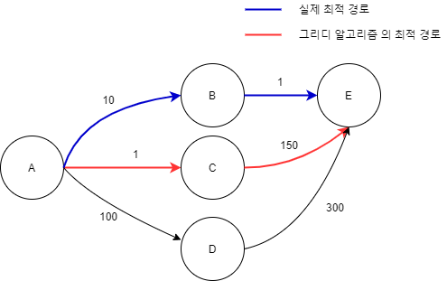

# 그리디 알고리즘(Greedy Algorithm) 💸
> **눈 앞의 이익만 우선 추구**하는 알고리즘
><br> 매 선택에서 **현재 당장 최적**인 답을 선택해 전체 적합한 결과를 도출하자는 알고리즘 기법

<div align='center'>
    
</div>
그리디 알고리즘을 이용하면, 부분 최적해는 구했지만 전체 선택에서는 오히려 최적이 아닌 경로를 선택하여 전체 문제에서의 최적값은 구하지 못하게 된다.

**특수한 조건**이 만족되어야만 그리디를 이용하여 최적해를 구할 수 있다.

<br>

## 그리디 알고리즘 문제를 해결하는 방법
### 1. 선택 절차 (Selection Procedure)
> 현재 상태에서의 최적의 해답을 선택한다.

### 2. 적절성 검사 (Feasibility Check)
> 선택된 해가 문제의 조건을 만족하는지 검사한다.

### 3. 해답 검사 (Solution Check)
> 원래의 문제가 해결되었는지 검사하고, 해결되지 않았다면 선택 절차로 돌아가서 위의 과정을 반복한다.

<br>

## 그리디 알고리즘이 성립하기 위한 조건
### [ 매트로이드(Matroid) ]
> 독립성이라는 성질을 만족하는 수학적 공간, 어떤 문제의 공간이 매트로이드를 이루면 이 문제를 위한 **최적해를 보장하는 그리디 알고리즘이 존재**한다. 그렇지만 그리디 알고리즘으로 최적해가 보장되는 모든 문제가 매트로이드 구조는 아니다.

### 1. 탐욕 선택 속성 (Greedy Choice Property)
> 이전의 선택이 이후에 영향을 주지 않음을 의미
### 2. 최적 부분 구조 (Optimal Substructure)
> 부분 문제의 최적결과가 전체에도 그대로 적용될 수 있어야함을 의미

그리디 알고리즘은 속도가 매우 빠르기 때문에 자주 사용될 수 있다. 하지만, 최적해가 되지 않으므로 특수한 조건이 만족되어야 한다. 그런데, 이 조건을 완적히 만족하는지, 그래서 해당 문제가 그리디 알고리즘으로 가능한 지 증명하는 것은 수학적 증명이 필요하기 때문에 어렵게 느껴질 수 있다. 

> 참고하고 싶으신 분을 위해 아래에 링크를 달아 놨습니다.
>
> [알고리즘 챕터 5장 : Greedy algorithms](https://baeseongsu.github.io/posts/algorithms-ch05/)
> <br> [[Algorithms] Matroid Theory | 매트로이드 이론](https://dad-rock.tistory.com/673)

<br>

## 예시
### 1. 거스름돈
```
💁‍♀️🍔: 계산이요~
🙍‍♂️: 4210원입니다.
💁‍♀️💰 : (5000원을 내밀며) 거스름돈은 동전으로 최소한의 개수로 주세요.
🤷‍♂️ : ?
```
1. `선택 절차` : 거스름돈 동전 개수를 줄이기 위해 가장 **가치가 높은 동전을 우선 선택**한다.
2. `적절성 검사` : 1번 과정을 통해 선택된 동전들의 합이 거스름 돈을 **초과**하는지 검사한다. 초과하면 가장 마지막 동전을 삭제하고 1번으로 돌아가 **한 단계 작은 동전을 선택**한다.
3. `해답 검사` : 동전들의 합이 거슬러 줄 금액과 **일치**하는지 검사한다. 액수가 부족하면 1번부터 재 반복

=> 500원 1개, 100원 2개, 50원 1개, 10원 4개 순서대로 거슬러준다.
이 문제의 구조는 매트로이드다. 그리디 알고리즘을 사용해도 언제나 최적해를 찾아낼 수 있다.

이 문제는 가지고 있는 동전 중 **'큰 단위'의 동전이 항상 '작은 단위'의 배수**이므로 **작은 단위 동전을 조합해 다른 해가 나올수 없**기 때문에 사용할 수 있다.
즉, 센트 문제는 그리디 알고리즘을 통해 풀 수 없다.(1,5,10,25 만 봐도 25는 10의 배수가 아님, 이럴 경우 DP로 해결해야함)

[그리디로 풀 수 있는 동전 문제 - 백준 : 동전0](https://www.acmicpc.net/problem/11047)
<br> [그리디로 풀 수 없는 동전 문제 - 백준 : 동전](https://www.acmicpc.net/problem/2091)

<br>

### 2. 활동 선택(Action Selection)
> 시간표짜기, 회의실 시간 분배 문제와 비슷한 문제 유형
>
> 한 강의실에서 여러개의 수업을 하려고 할 때, 한번에 가장 많은 수업을 할 수 있는 경우를 고르는 것

```
8개의 회의가 신청된 상황이라고 가정하자.
각 시작 시간과 종료 시간은 
(1, 6) (3, 5) (5, 9) (6, 7) (7, 14) (8, 13) (12, 18) (16, 20) 이다.

겹치는 회의가 없게 하면서 가장 많은 수의 회의를 소화할 수 있게 해야한다.
회의의 개수는?
```
1. `선택 절차` : 각 시작 시간과 종료 시간이 빠른 순서로 정렬한 다음, 가장 먼저 정렬된 회의를 선택한다.
2. `적절성 검사` : 1번 과정을 통해 선택된 회의가 그 전에 선택된 회의와 겹치는 시간이 없는 지 검사한다. 겹치는 시간이 있다면, 마지막 회의를 삭제하고 1번으로 돌아가 다음으로 정렬된 회의를 선택한다.
3. `해답 검사` : 선택된 회의들의 시간이 겹치지 않는지 검사한다. 만약 겹친다면 1번부터 재 반복


[백준 : 회의실 배정](https://www.acmicpc.net/problem/1931)

<br>
<br>

* * *

### 📖 참고 자료
[쉽게 배우는 알고리즘](http://www.yes24.com/Product/Goods/58154784)

[탐욕법(그리디) 알고리즘](https://velog.io/@contea95/%ED%83%90%EC%9A%95%EB%B2%95%EA%B7%B8%EB%A6%AC%EB%94%94-%EC%95%8C%EA%B3%A0%EB%A6%AC%EC%A6%98)

[[알고리즘] 탐욕 알고리즘(Greedy Algorithm)](https://hanamon.kr/%EC%95%8C%EA%B3%A0%EB%A6%AC%EC%A6%98-%ED%83%90%EC%9A%95%EC%95%8C%EA%B3%A0%EB%A6%AC%EC%A6%98-greedy-algorithm/)

[알고리즘 - 그리디 알고리즘(Greedy Algorithm)](https://hongjw1938.tistory.com/172)
