## 이진 트리(Binary Tree)
이진 트리(Binary Tree)란 한 노드가 최대 두개의 노드를 자식으로 가질 수 있는 트리이다

마지막 레벨을 제외한 모든 레벨에는 노드들이 가득차있고, 마지막 레벨의 노드들도 죄측부터 순서로 들어가있는 형태의 이진 트리를 `완전 이진 트리`라고 한다

구조적 특징 때문에 노드의 개수를 알면 트리의 구조를 특정가능하다는 성질을 가지고 있다

- 현재 노드의 parent node의 번호 = (i - 1) / 2
- 현재 노드의 left child node의 번호 = i * 2 + 1
- 현재 노드의 right child node의 번호 = i * 2 + 2

## 큐(Queue)
큐(Queue)는 먼저 들어오는 데이터가 먼저 나가는 FIFO(First In First Out) 형식의 자료구조이다

## 우선순위 큐(Priority Queue)
우선순위가 가장 높은 데이터를 가장 먼저 삭제하는 자료구조
우선순위 큐는 데이터를 우선순위에 따라 처리하고 싶을 때 사용
예시) 물건 데이터를 자료구조에 넣었다가 가치가 높은 물건부터 꺼내서 확인

우선순위 큐는 배열, 연결리스트, 힙으로 구현이 가능하나 이 중 힙(Heap)으로 구현하는 것이 가장 효율적이다

배열과 연결리스트는 선형 구조의 자료구조이기에 삽입 또는 삭제 연산을 위한 시간복잡도는 `O(N)`이지만 힙은 완전 이진 트리 구조이므로 힙 트리의 높이는 `log(N+1)`이며, 힙의 시간복잡도는 O(logN)이다

<div align='center'>
    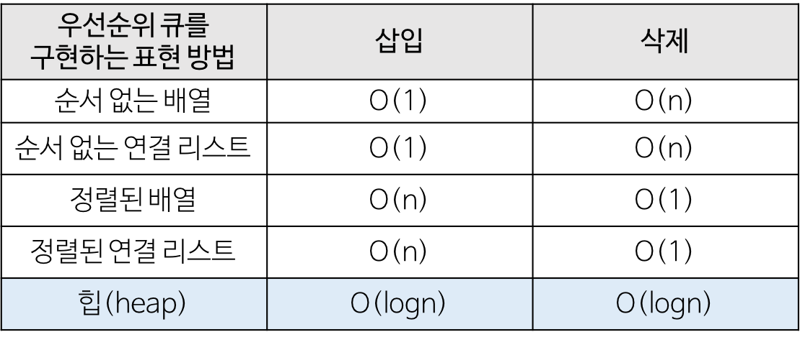<br>
</div>

## Heap(힙)
우선순위 큐를 위해 만들어진 자료구조

- 완전 이진 트리의 일종
- 여러 값 중 최댓값, 최솟값을 빠르게 찾아내도록 만들어진 자료구조로 `반정렬 상태(느슨한 정렬 상태)`이다
    - 큰 값이 상위 레벨에 있고 작은 값이 하위 레벨에 있다는 정도
    - 즉, 부모 노드의 키 값이 자식 노드의 키 값보다 항상 큰(작은) 이진 트리를 의미한다
    - 트리 구조를 배열에 저장한 것이므로 배열로만 보았을 때는 완전히 정렬된 상태로 보이지는 않는다
- 중복된 값을 허용한다 (이진 탐색 트리는 중복 값 허용 X)

### 힙의 종류
1. 최대 힙(max heap)
부모 노드의 키 값이 자식 노드의 키 값보다 크거나 같은 완전 이진 트리

**key(부모노드) >= key(자식노드)**

<div align='center'>
    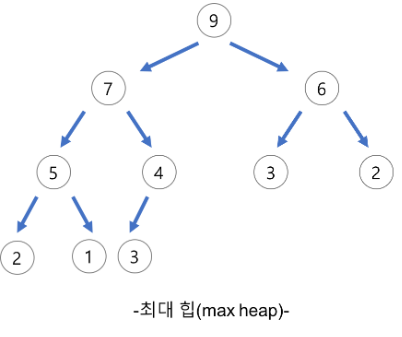<br>
</div>

2. 최소 힙(min heap)
부모 노드의 키 값이 자식 노드의 키 값보다 작거나 같은 완전 이진 트리

**key(부모노드) <= key(자식노드)**

<div align='center'>
    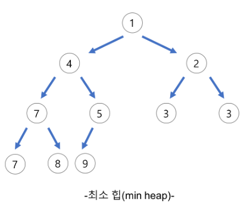<br>
</div>

### 힙의 활용 예시
- 시뮬레이션 시스템
- 네트워크 트래픽 제어
- 운영체제에서의 작업 스케줄링
- 수치 해석적인 계산

### 힙의 구현

- 힙을 저장하는 표준 자료구조는 `배열`이다
    - 완전 이진 트리를 기반으로 하기에 비어있는 공간이 없어 배열로 구현하기에 용이하다
- 쉽게 구현하기 위해 배열의 첫 번째 인덱스는 0은 사용하지 않는다
- 특정 위치의 노드 번호는 새로운 노드가 추가되어도 변하지 않는다(ex. 루트 노드(1)의 오른쪽 노드 번호는 항상 3)

<div align='center'>
    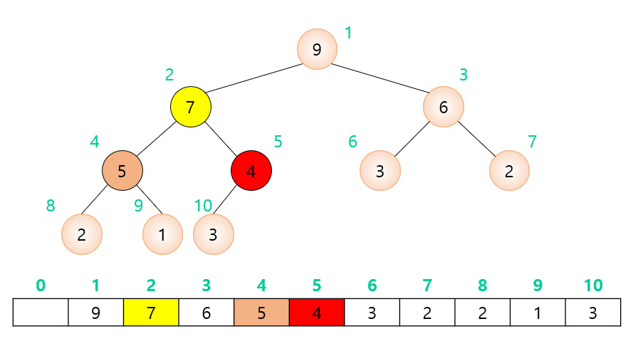<br>
</div>

>왼쪽 자식 index = (부모 index) * 2  
>오른쪽 자식 index = (부모 index) * 2 + 1  
>부모 index = (자식 index) / 2

힙에서 삽입 또는 삭제가 일어나는 경우 최대힙/최소힙의 조건이 깨질 수 있다.

이러한 경우에 조건을 만족할 수 있게끔 노드들의 위치를 바꿔가며 힙을 `재구조화(heapify)` 해주어야 한다

삽입과 삭제의 경우 연산 자체는 O(1)로 작동하지만 heapify의 과정을 거치기에 O(logN)의 시간복잡도를 가지게 된다

>**heapify**: 배열로 표현된 이진 트리의 자료구조를 갖는 힙을 생성하는 과정이다 

### 힙의 삽입
1. 힙에 새로운 요소가 삽입되면, 우선 새로운 노드를 힙의 마지막 노드에 삽입한다
2. 새로운 노드를 부모 노드들과 교환한다

아래 그림을 통한 예시로 자세히 살펴보자


- 가장 말단 노드에 새로운 요소를 삽입

<div align='center'>
    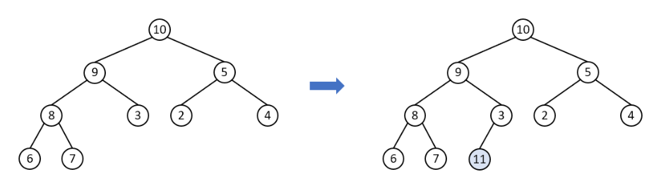<br>
</div>

- 부모 노드와 비교하여 값이 자식 노드가 더 크다면 교환하고 작다면 해당 부분에서 정지한다

<div align='center'>
    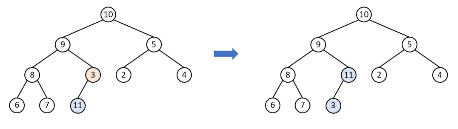<br>
</div>

- 다시 자신의 부모 노드와 비교를 수행, 크다면 교환, 작다면 해당 부분에서 정지

<div align='center'>
    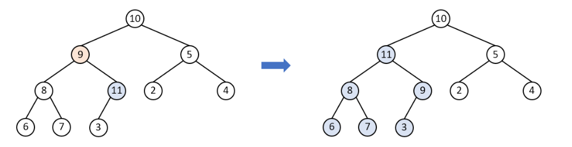<br>
</div>

- 교환한 노드에서 다시 큰 값을 가진 자식과 위치를 교환하며 최대 힙 구조가 유지되면서 삽입과정 완료

<div align='center'>
    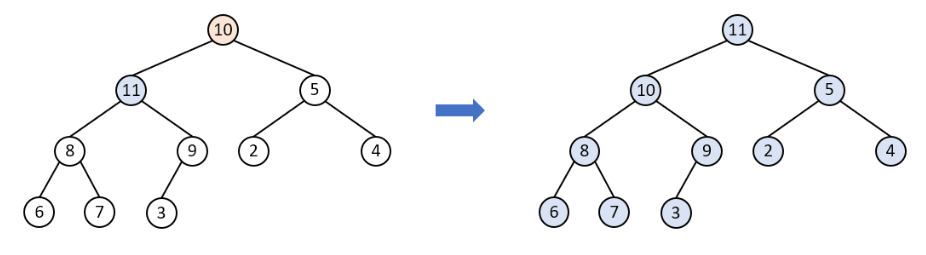<br>
</div>

코드를 통하여 위 예제를 살펴보자
```
void insert_max_heap(int x) {
    
    maxHeap[++heapSize] = x; 
    
    for( int i = heapSize; i > 1; i /= 2) {
        
        if(maxHeap[i/2] < maxHeap[i]) {
            swap(i/2, i);
        } else {
            break;
        }
        
    }
}
```

### 힙의 삭제
1. 최대 힙에서 최댓값은 루트 노드이므로 루트 노드가 삭제된다(최대 힙에서 삭제 연산은 최댓값 요소를 삭제하는 것)
2. 삭제된 루트 노드에는 힙의 마지막 노드를 가져옴
3. 힙을 재구성

아래 그림을 통한 예시로 자세히 살펴보자

- 루트 노드를 삭제하고 마지막 원소를 루트로 이동

<div align='center'>
    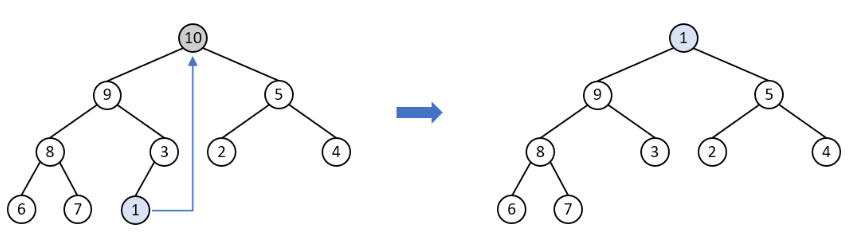<br>
</div>

- 큰 값을 가진 자식과 위치를 교환

<div align='center'>
    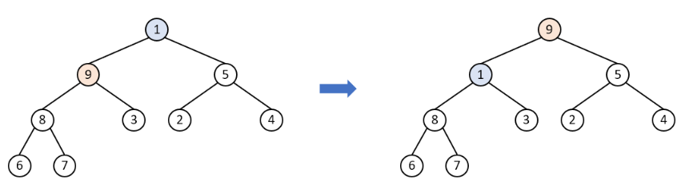<br>
</div>

- 교환한 노드에서 다시 큰 값을 가진 자식과 위치 교환

<div align='center'>
    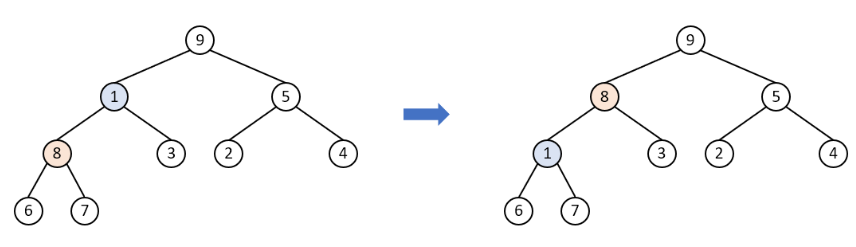<br>
</div>

- 교환한 노드에서 다시 큰 값을 가진 자식과 위치를 교환하며 힙 구조 완성

<div align='center'>
    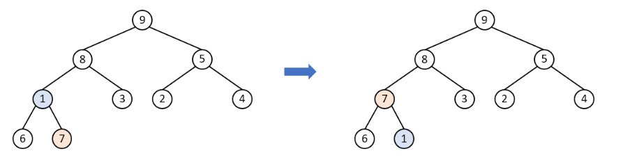<br>
</div>

코드를 통하여 위 예제를 살펴보자

```
int delete_max_heap() {
    
    if(heapSize == 0) 
        return 0;
    
    int item = maxHeap[1]; 		
    maxHeap[1] = maxHeap[heapSize]; 	
    maxHeap[heapSize--] = 0; 		
    
    for(int i = 1; i*2 <= heapSize;) {
        
        if(maxHeap[i] > maxHeap[i*2] && maxHeap[i] > maxHeap[i*2+1]) {
            break;
        }
        else if (maxHeap[i*2] > maxHeap[i*2+1]) {
            swap(i, i*2);
            i = i*2;
        }
        else {
            swap(i, i*2+1);
            i = i*2+1;
        }
    }
    
    return item;
    
}
```

### 힙이 아닌 배열을 힙으로 만들기(Build heap)
heapify의 경우 기본적으로 힙을 만족하는 경우에서 삽입 또는 삭제가 발생할 때 O(logN)의 시간복잡도로 다시 힙을 만드는 과정이다

**Build heap**은 이와 다르게 아예 힙의 조건을 만족하지 않는 배열을 힙으로 만드는 과정이다

여러 번의 heapify 과정을 거치기에 결과적으로 O(NlogN)의 시간복잡도를 가진다

아래 그림을 통한 예시로 자세히 살펴보자

<div align='center'>
    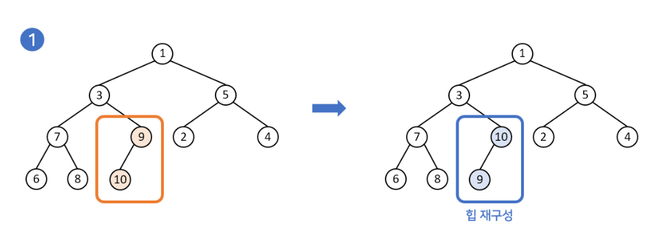<br>
</div>
<div align='center'>
    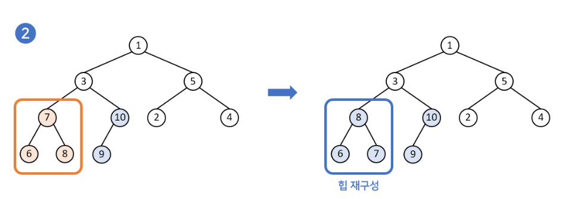<br>
</div>
<div align='center'>
    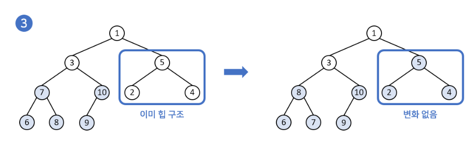<br>
</div>
<div align='center'>
    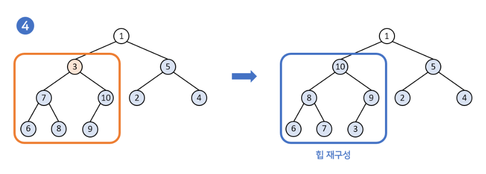<br>
</div>
<div align='center'>
    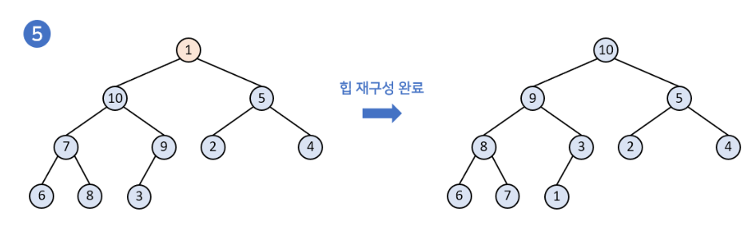<br>
</div>

---

### 📢 면접 질문

- 힙 구조에 대해서 설명해주세요
- 힙의 삽입 과정을 설명해주세요

--- 

### 📌 Reference

- https://chanhuiseok.github.io/posts/ds-4/
- https://gmlwjd9405.github.io/2018/05/10/data-structure-heap.html
