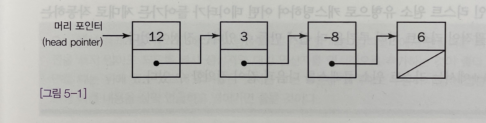
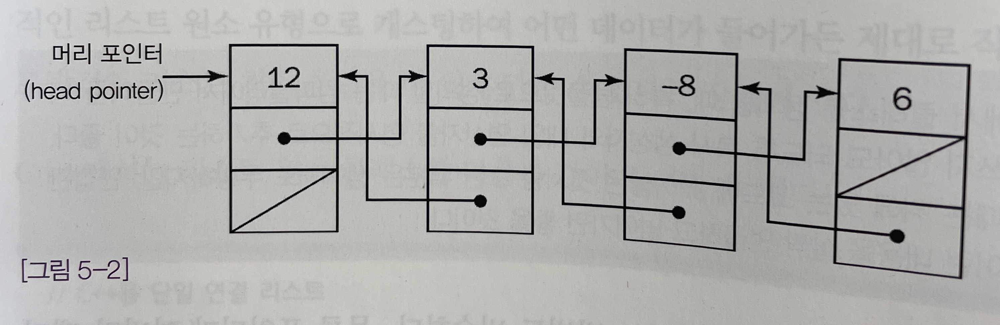
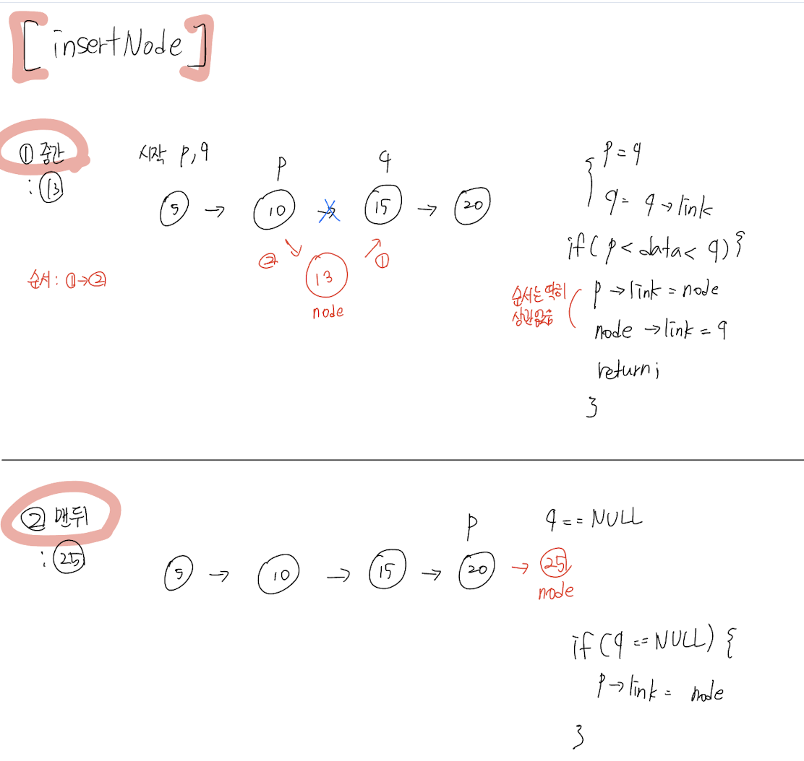
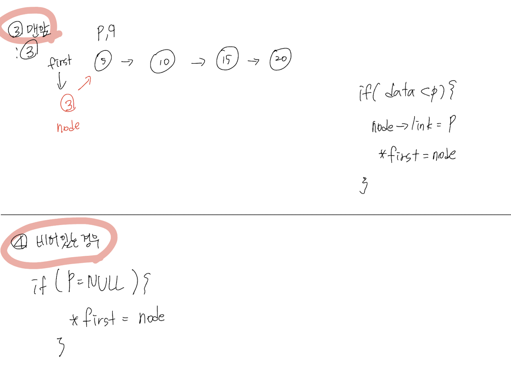
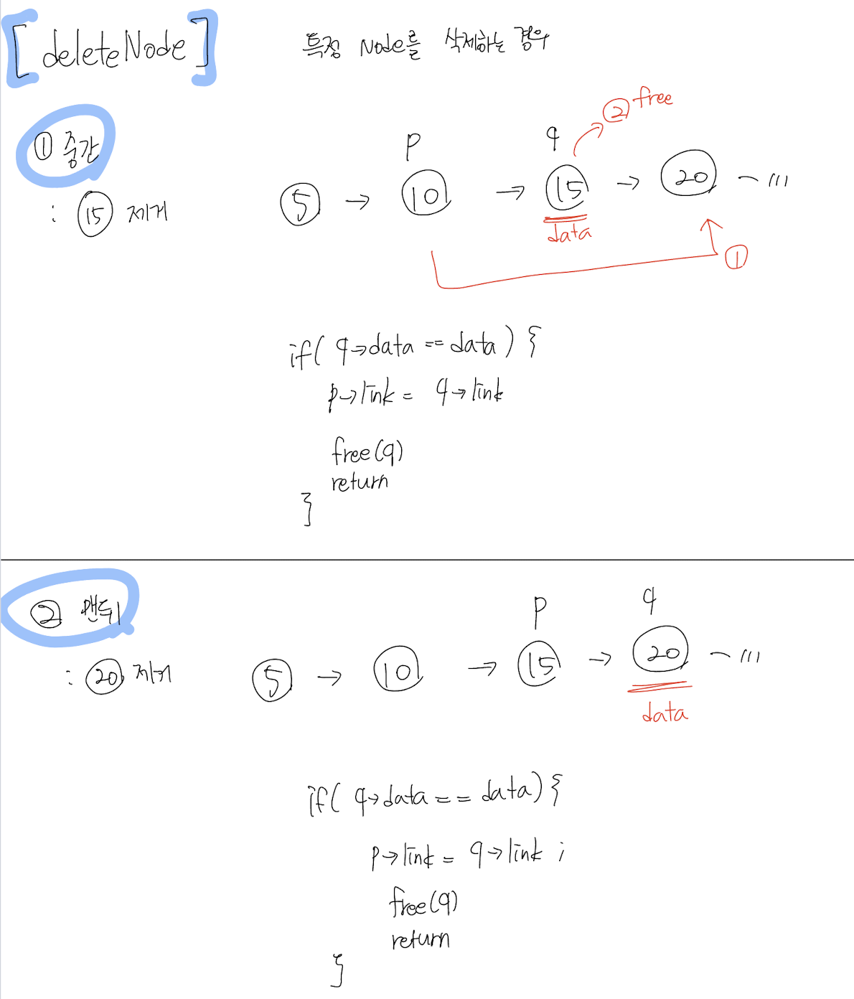
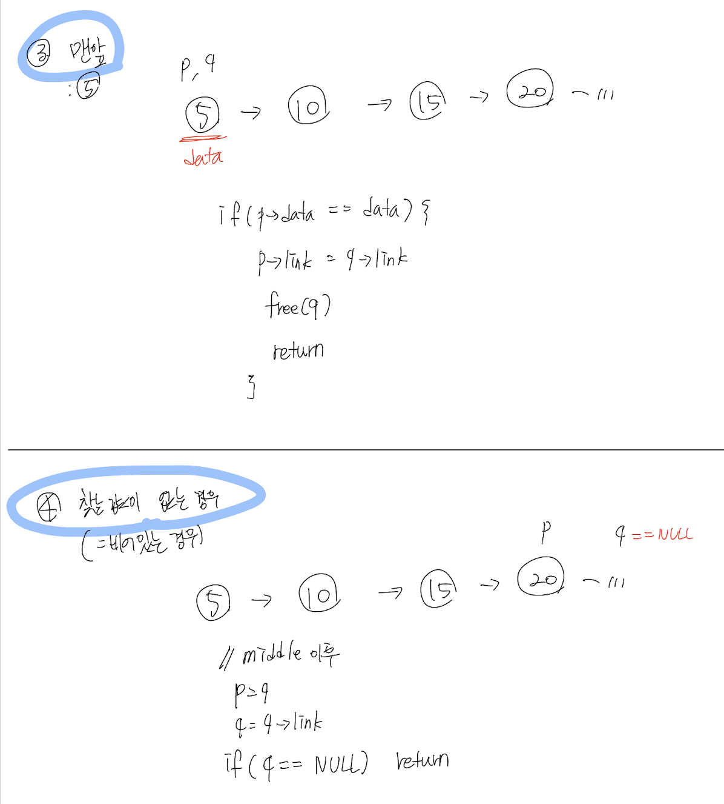
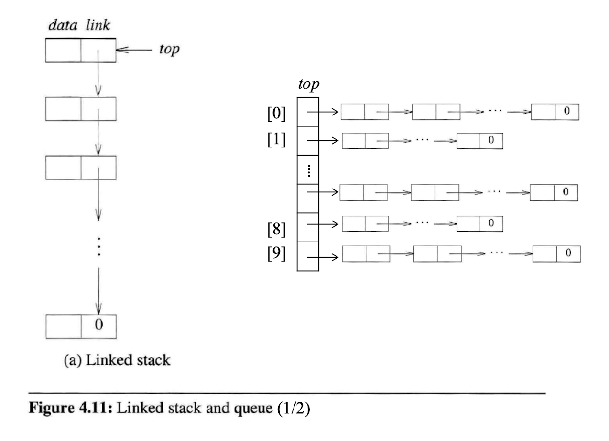

> 작성자 : 팬시 / [출처](https://fancy96.github.io/DataStructure-LinkedList/)
> 이 글의 코드와 정보들은 책을 공부하며 정리한 내용을 토대로 작성하였습니다.
# 연결 리스트

* `연결 리스트`는 동적인 데이터를 처리하는 것과 관련된 수많은 문제의 근간을 이루는 자료구조다.

## 연결 리스트의 종류

* 연결 리스트에는 단일 연결 리스트(singly-linked list), 이중 연결리스트(doubly-linked list), 원형 연결 리스트(circularly-linked list), 이렇게 세 가지 기본 유형이 있다.

* 면접에서는 대부분 **단일 연결 리스트**문제가 나오는 편이다.

### 단일 연결 리스트



* [그림 5-1]에 나와있는 것처럼 리스트에 들어가는 각 데이터 원소에는 리스트의 다음 원소에 대한 `연결고리(link)`가 들어있다.

* 단일 연결 리스트의 첫 번째 원소는 리스트의 `머리(head)`라고 부른다.

* 단일 연결 리스트의 마지막 원소는 `꼬리(tail)`라고 부르며 연결고리는 비어 있거나 널 연결고리로 이어져 있다.

* 단일 연결 리스트에 있는 연결고리는 다음 노드를 가리키는 포인터나 레퍼런스로만 구성되기 때문에 앞으로만 종주할 수 있다.

* 따라서 리스트를 완전 종주하려면 항상 **첫 번째 원소**부터 시작해야 한다.

* 바꿔 말하자면, 리스트에 있는 모든 원소의 위치를 파악하기 위해서는 **리스트의 첫 번째 원소에 대한 포인터나 레퍼런스가 있어야만 한다.**

* 기본적으로 **C**에서 단일 연결리스트의 형태를 다음과 같이 정의할 수 있다.

```cpp
typedef struct InteElement {
    struct IntElement *next;
    int data;
} IntElement;
```

* **자바**에서 제네릭을 써서 구현하는 방법도 비슷하다. 물론 포인터가 아니라 레퍼런스를 쓴다는 게 달라진다.

```java
// 탬플릿으로 만든 자바용 단일 연결 리스트
public class ListElement<T> {
    public ListElement(T value) { data = value; }
    public ListElement<T> next() { return next; }
    public T value() { return data; }
    public void setNext ( ListElement<T> elem ) { next = elem; }
    public void setValue( T value ) { data = value; }
    private ListElement<T> next;
    private T data;
}
```

### 이중 연결 리스트



* [그림 5-2]에 나와 있는 이중 연결 리스트는 **단일 연결 리스트의 여러 가지 단점**을 극복하기 위해 만들어졌다.

* `이중 연결 리스트`는 각 원소마다 리스트에서 그다음에 오는 원소에 대한 연결고리 외에 **그 앞에 있는 원소에 대한 연결고리도 들어 있다**는 점에서 단일 연결 리스트와 다르다.

* 이렇게 연결고리를 추가하면 리스트를 어느 방향으로든 종주할 수 있다.

* 어떤 원소에서 시작하든 리스트 전체를 종주하는 것이 가능하다.

* 이중 연결 리스트에도 단일 연결 리스트와 마찬가지로 머리와 꼬리가 있다.

* 리스트의 머리의 이전 원소에 대한 연결고리는 꼬리의 다음 원소에 대한 연결고리와 마찬가지로 비워두거나 널로 지정한다.

* 이중 연결 리스트는 면접 문제로는 그리 많이 나오지 않는다. 단일 연결 리스트를 쓰는 쪽이 더 어렵기 때문이다.

* 그리고 이중 연결 리스트를 쓰면 불필요하게 복잡해지기만 해서 쓰지 않게 되는 경우도 있다.

### 원형 연결 리스트

* 원형 연결 리스트에는 끝, 즉 머리나 꼬리가 없다.

* 원형 연결 리스트의 모든 원소에서 다음 원소를 가리키는 포인터나 레퍼런스에는 반드시 **널이 아닌 어떤 원소**가 들어가며, 이중 연결 리스트라면 포인터/레퍼런스에도 **널이 아닌 원소**가 들어가야 한다.

* 원소가 하나밖에 없는 리스트라면 그냥 **자기 자신**을 가리키면 된다.

* 원형 연결 리스트의 종주 문제로는 **사이클 회피 문제**가 많이 나온다. 시작점을 제대로 추적하지 않으면 리스트에서 **무한 루프**를 돌 수 있다.

* 원형 연결 리스트도 가끔 쓸 일이 있지만, 면접 문제로는 거의 나오지 않은 편이다.

## 기초적인 연결 리스트 연산

* 연결 리스트 문제를 제대로 풀려면 연결 리스트에 대한 기초적인 연산을 완벽하게 이해해야 한다.

* 기초 연산에는 리스트를 잃어버리지 않기 위한 `머리 원소 추적`, `리스트 종주`, `리스트 원소 추가 및 제거` 등이 있다.

* 여기에서는 단일 연결 리스트로 구현할 때 빠질 수 있는 함정에 초점을 맞춰보도록 한다.

### 머리 원소 추적

* 단일 연결 리스트에는 **반드시 머리 원소를 추적**해야 한다. 그러지 않으면 언어에 따라 가비지 컬렉터에 의해 제거되거나 어딘가에서 길을 잃고 말게 된다.

* 따라서 새로운 원소를 첫 번째 원소 앞에 **추가**한다거나 리스트의 첫 번째 원소를 **제거**할 때 **리스트의 머리에 대한 포인터 또는 레퍼런스를 갱신**해야 한다.

* 함수나 메서드 내에서 리스트를 **변형**시킬 때는 **머리 원소를 제대로 추적**할 수 있도록 주의해야 한다. 함수나 메서드를 호출한 쪽에 바뀐 새로운 머리 원소를 알려줘야 하기 때문이다.

* 예를 들어, 다음과 자바 코드는 리스트의 머리에 대한 레퍼런스를 갱신하기 위해서는 **새로운 머리 원소에 대한 레퍼런스를 반환**해야 한다.

```java
public ListElement<Integer> insertInFront (ListElement<Integer> list, int data) {
ListElement<Integer> l = new ListElement<Integer> (data);
    l.setNext(list);
    return l;
}
```

* 메서드를 호출한 쪽에서는 머리 원소에 대한 레퍼런스를 적당히 갱신해줘야 한다.

```java
int data = ...; // 삽입할 데이터
ListElement<Integer> head = ...; // 머리에 대한 래퍼런스
head = insertInFront(head, data);
```

* 리스트의 맨 앞에 새로운 원소를 추가하는 다음과 같은 `C 코드`를 생각해보자. 제대로 동작하기 위해서는 head 포인터에 대한 포인터를 넘겨줘야 한다.

```cpp
bool insertInFront( IntElement **head, int data) {
    IntElement *newElem = malloc(sizeof(IntElement));
    if( !newElem ) return false;
    
    newElem->data = data;
    newElem->next = *head;
    *head = newElem;
    return true;
}
```

* 이 함수에서는 리턴 값으로 메모리 할당 성패 여부를 돌려주기 때문에 자바에서처럼 새로운 헤드 포인터를 돌려줄 수가 없다. (C에는 예외 기능이 없음)

* C++에서는 머리 포인터에 대한 레퍼런스로 전달할 수도 있고, 새로운 머리 포인터를 리턴할 수도 있다.

### 리스트 종주

* 머리 원소가 아닌 다른 리스트 원소를 가지고 작업을 해야 하는 경우도 있다.

* 연결 리스트의 첫 번째 원소가 아닌 원소에 대한 연산을 하려면 리스트에 있는 원소 중 일부를 종주해야 할 수도 있으며, 이때 **항상 리스트가 끝나지 않는지 확인**을 해야 한다.

* **찾아낼 객체가 리스트에 있는 경우와 마지막 원소를 확인하는 경우**는 다음과 같은 코드로 생각해 볼 수 있다.

```java
public ListElement<Integer> find(ListElement<Integer> head, int data) {
    ListElement<Integer> elem = head;
    while( elem != null && elem.value() != data) {
        elem = elem.next();
    }
    return elem;
}
```

* 함수/메서드를 호출한 쪽에서는 반환 값이 널이 아닌지 확인하여 오류 조건을 찾아야 한다.

### 원소의 삽입과 삭제

* 단일 연결 리스트에 있는 원소들은 다음 원소에 대한 연결고리를 통해서만 관리할 수 있기 때문에 **리스트 중간에서 원소를 삽입 또는 삭제하려면 그 앞 원소의 연결고리를 수정**해야 한다.

* 삭제할 원소(또는 삽입해야할 원소)만 지정된 상황이라면 바로 앞 원소를 찾아낼 만한 다른 방법이 딱히 업기 때문에 **머리에서부터 리스트를 종주**해야만 할 수도 있다.

* 삭제할 원소가 머리 원소라면 한층 더 기울여야 한다.

* 리스트에 있는 한 원소를 삽입 또는 삭제하는 C 함수는 다음과 같이 만들 수 있다.

```cpp
// Insert
void insertNode(listPointer *first, listPointer node)
{   
    listPointer p, q;
    p = q = *first;
    // Empty (비어있는 경우)
    if(!p) {
        *first = node;
        return;
    }
    while(TRUE) {
        p = q;
        q = q->link;
        // Right (맨 끝)
        if(q == NULL) {
            p->link = node;
            return;
        }
    }
}
// Delete
void deleteNode(listPointer *first, int data)
{
    listPointer p, q;
    p = q = *first;
    // Empty (비어있는 경우)
    if(p == NULL) return;
    // Left (맨앞)
    if(p->data <= data) {
        *first = (*first)->link;
        free(p);
        return;
    }
    while(TRUE) {
        // Middle, Right
        if(q->data <= data) {
            p->link = q->link;
            free(q);
            return;
        }
        p = q;
        q = q->link;
        // No data (찾는 값이 없는 경우)
        if(q == NULL) return;
    }
}
```

* 위의 코드를 이해하기 아래와 같이 쉽게 그림으로 그렸다.

* 그림 옆에는 이해하기 쉽도록 슈도 코드(Pseudo-code)로 작성했다. (슈도 코드에는 **모든 경우의 수**를 생각하여 작성함)

> InsertNode [1] 중간 / [2] 맨뒤 / [3] 맨앞 / [4] 비어있는 경우




> deleteNode [1] 중간 / [2] 맨뒤 / [3] 맨앞 / [4] 비어있는 경우




## 연결 리스트 문제

* 자바나 C# 같은 언어에서는 연결 리스트를 직접 구현해서 쓰는 일이 거의 없기 때문에 답안은 모두 C로 구현했다.

* 연결 리스트를 활용한 스택에 대한 기본적인 구현법만 익히는 것을 목표로 정리했다.

### 스택 구현법

> 면접 문제 : 스택 자료구조에 대해 논하라.
>
> 연결 리스트 또는 동적 배열을 써서 C로 스택을 구현하고 그 자료구조를 사용한 이유를 설명하라.
>
> 완전하고 일관성 있으면서 사용하기 편리한 스택 인터페이스를 설계하라.
* 이 문제는 다음과 같은 세 가지를 중점적으로 살펴보기 위한 문제라고 할 수 있다.

1. 기본적인 자료구조에 대한 지식
2. 자료구조를 조작하기 위한 루틴을 만드는 능력
3. 일련의 루틴에 대한 일관성 있는 인터페이스를 설계하는 능력

---

* 위의 면접 문제에 대해 각 단계별로 나누어 정리했다.

> [1] 스택 자료구조에 대해 논하라.
* `스택`은 후입선출(LIFO, last-in-first-out), 즉 마지막에 들어간 것이 가장 먼저 나오는 자료구조다.

* 모든 원소는 접시를 쌓아놓았다가 꺼낼 때와 마찬가지로 들어간 순서와 반대 순서로 나온다.

* 원소를 삽입하고 삭제하는 연산은 각각 푸시(Push)와 팝(Pop)이라고 부른다.

* 스택은 여러 개의 하위 작업으로 나눌 수 있는 작업을 관리할 때 유용하게 쓰이는 자료구조다.

* 스택을 사용하는 대표적인 예로 **서브루틴에서 사용하는 반환 주소, 매개변수, 지역변수 등을 추적**하는 것을 들 수 있다. 프로그래밍 언어를 파싱할 때 **토큰을 추척**하는 것도 또 다른 예라고 할 수 있다. (`파싱`이란 웹페이지에서 원하는 데이터를 추출하여 가공하기 쉬운 상태로 바꾸는 것을 의미한다)

> [2] 연결 리스트 또는 동적 배열을 써서 C로 스택을 구현하고 그 자료구조를 사용한 이유를 설명하라.
* 스택을 구현하는 방법 가운데 하나로 배열이 추가될 때마다 필요에 따라 크기가 바뀌는 **동적 배열**을 사용하는 방법을 들 수 있다.

* 연결 리스트에 비하자면 `동적 배열`은 **배열 원소에 대한 임의 접근이 가능하다는 것이 가장 큰 장점**이라고 할 수 있다.

* 인덱스만 알면 어떤 원소든 즉시 접근할 수 있다.

* 하지만 스택에 대한 연산은 항상 자료구조의 한쪽 끝(스택 맨 위)에 대해서만 이뤄지기 때문에 동적 배열의 임의접근성이라는 장점이 별 힘을 발휘할 수 없다.

* 그리고 동적 배열이 커지면 그에 맞춰 크기를 조절해야 하고, 그 과정에서 기존 배열의 모든 원소들을 새 배열로 복사해야 하기 때문에 그만큼 시간이 오래 걸릴 수 있다.

* `연결 리스트`에서는 각 원소마다 메모리를 동적으로 할당해야한다. **메모리 할당자의 오버헤드**에 따라 동적 배열에서 필요한 복사 작업보다 메모리 할당에서 더 오랜 시간이 걸릴 수 있다.

* 게다가 동적 배열에서 인접한 원소는 메모리상에서도 인접해 있지만 **연결 리스트에서 인접한 원소는 메모리상에서 떨어져 있을 수도 있다**.

* 또한 동적 배열에서는 모든 원소마다 포인터와 관련된 오버헤드를 감수하지 않아도 된다.

* 따라서 동적 배열에서는 **메모리 국소성 면에서 장점**이 있는데 프로세스가 메모리보다 훨씬 빨라짐에 따라 그 중요성은 점점 더 커지고 있다.

* 이런 이유로 **동적 배열을 기반으로 하는 스택**이 연결 리스트를 기반으로 하는 스택에 비해 **대체로 빠른 편**이다.

* 동적 배열보다는 연결 리스트로 구현하는 것이 훨씬 덜 복잡하기 때문에 면접에서는 연결 리스트를 푸는 쪽이 훨씬 낫다.

> [3] 완전하고 일관성 있으면서 사용하기 편리한 스택 인터페이스를 설계하라.
* 스택을 구현할 때는 `push`와 `pop` 루틴이 필요하다. 각 함수에는 연산을 처리할 스택을 넘겨줘야 한다.

* `push` 연산에는 집어넣을(푸시할) 데이터를 넘겨줘야 하며, `pop` 연산에서는 스택에서 꺼낸 데이터를 반환해야 한다.

* 함수 원형을 만들기 위해서 스택에 저장할 데이터형을 알아야 하는데, 보통 조건이 주어지지 않는 경우라면 **void 포인터**를 저장해서 일반적인 데이터형을 모두 커버할 수 있도록 만드는 것도 나쁘지 않다.

```cpp
#defind MAX_STACKS 10 /* maximum number of stacks */
typedef struct {
    int key;
    /* other fields */
    } element;
typedef struct stack *stackPointer;
typedef struct stack {
    element data;
    stackPointer link;
    } Node;
stackPointer top[MAX_STACKS];
```



* 위과 같은 자료형을 가진 스택 기반의 연결 리스트일 때, push 연산과 pop 연산을 아래와 같이 구현할 수 있다.

> push(i, item) : Add to a linked stack
```cpp
void push(int i, element item)
{ /* add item to the ith stack */
    stackPointer temp;
    MALLOC(temp, sizeof(*temp));
    temp->data = item;
    temp->link = top[i];
    top[i] = temp;
}
```

> item = pop(i) : Delete a linked stack
```cpp
element pop(int i)
{   /* remove top element from the ith stack */
    stackPointer temp = top[i];
    element item;
    if (!temp)  // 비어있을 때
        return stackEmpty();
    item = temp->Data;
    top[i] = temp->link; // 아래로 한칸 이동
    free(temp);
    return item;
}
```

### 문제 설명 및 정답 코드

**연결 리스트를 활용하여 스택을 생성하고 실행하는 프로그램**을 만들어보자.

> 문제 : 다음과 같은 스택을 생성하고 실행하는 프로그램을 작성하라. 이를 위해 push, pop, stackEmpty 함수를 구현하여야 한다.
* (1) 실행 순서 - [1], [2]

* [1-1] 아래와 같은 입력으로 부터 **학번 순으로 미리 정렬된 데이터를 입력**받으면서 순서대로 Linked Stack을 구현한다.

  * (과목번호, 학번, 성적)의 쌍으로 데이터들이 입력되며 각 과목별로 스택에 저장된다.

  * (과목번호 : 1자리수, 학번 : 1자리수, 성적 : 2자리수)

```markdown
0 1 95
1 1 80
2 1 89
0 2 45
1 2 81
0 3 45
1 3 12
2 3 33
0 4 99
1 4 94
2 4 91
0 5 67
2 5 49
```

* [1-2] 각 과목 별로 학번의 역순으로 학번과 노드의 데이터(학번, 성적)을 출력하라.

  * (출력형식 - 과목번호 : %d, 학번 : %d, 성적 : %2d)

* (2) 구현 세부사항 - 반드시 linked list를 활용한 stack으로 작성해야 한다.

```cpp
#define MAX_STACK 3
typedef struct {
    int id;         // 학번
    int grade;      // 성적
    } element;
typedef struct stack *stackPointer;
typedef struct stack {
    element data;
    stackPointer link;
    } Node;
stackPointer top[MAX_STACKS];
/***************************
top[i] = NULL, 0 <= i < MAX_STACKS // initial codition
top[i] = NULL, iff ith stack is empty // boundary condition
***************************/
```

* (3) 실행 예

```markdown
0 1 95//서버 입력 시작
1 1 80
2 1 89
0 2 45
1 2 81
0 3 45
1 3 12
2 3 33
0 4 99
1 4 94
2 4 91
0 5 67
2 5 49
0 0 0//서버 입력 종료
0 5 67//사용자 출력 시작
0 4 99
0 3 45
0 2 45
0 1 95
1 4 94
1 3 12
1 2 81
1 1 80
2 5 49
2 4 91
2 3 33
2 1 89// 사용자 출력 종료
```


> Answer Code
```cpp
#define _CRT_SECURE_NO_WARNINGS
#include <stdio.h>
#include <stdlib.h>
#define MAX_STACKS 3
#define MALLOC(p,s){\
   if(!((p)=malloc(s))){\
      fprintf(stderr, "insufficient memory");\
      exit(EXIT_FAILURE);\
   }\
}
typedef struct {
   int id;
   int grade;
}element;
typedef struct stack* stackPointer;
typedef struct stack {
   element data;
   stackPointer link;
}Node;
stackPointer top[MAX_STACKS];
void push(int i, element item)
{
   stackPointer temp;
   MALLOC(temp, sizeof(*temp));
   temp->data = item;
   temp->link = top[i];
   top[i] = temp;
}
void stackEmpty()
{
   fprintf(stderr, "stack is empty");
   exit(1);
}
element pop(int i)
{
   stackPointer temp = top[i];
   element item;
   if (!temp)
      stackEmpty();
   item = temp->data;
   top[i] = temp->link;
   free(temp);
   return item;
}
void stackPrint() 
{
   element item;
   for (int i = 0; i < MAX_STACKS; i++)
   {
      while (top[i])
      {
         item = pop(i);
         printf("%d %d %2d\n", i, item.id, item.grade);
      }
   }
}
int main()
{
   int n, id, score;
   element item;
   for (int i = 0; i < 13; i++)
   {
      scanf("%d %d %d", &n, &id, &score);
      item.id = id;
      item.grade = score;
      push(n, item);
   }
   stackPrint();
   return 0;
}
```

## 면접 질문

* 연결리스트의 종류와 관련해서 설명해 주세요.

* 연결 리스트를 활용해서 C로 스택을 구현하고 그 자료구조를 사용한 이유를 설명해 주세요.

##  Reference

* [프로그래밍 면접 이렇게 준비한다: p.98 - p.117](http://www.yes24.com/Product/Goods/75187284)

* [Fundamentals of data structures in C, 2nd edition - Linked Lists](https://www.amazon.com/Fundamentals-Data-Structures-Ellis-Horowitz/dp/0929306406)