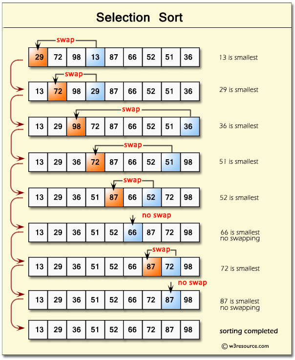
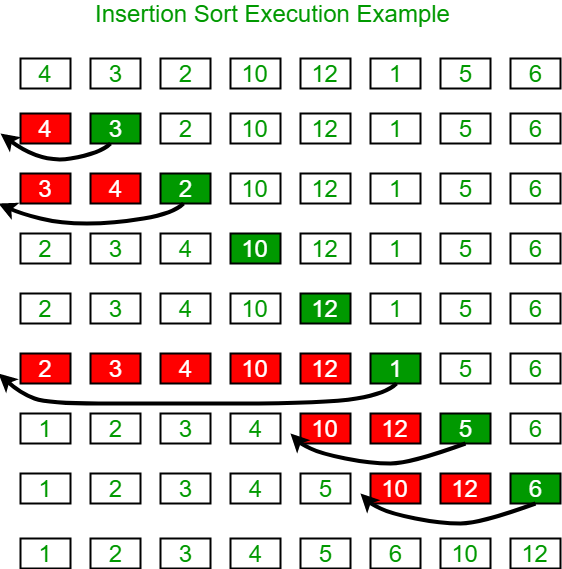
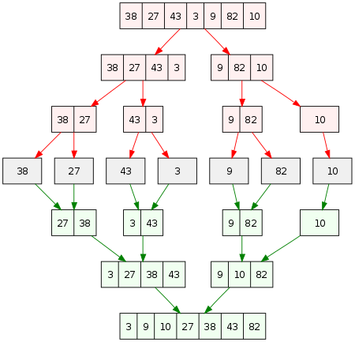

# sort

## 정렬의 종류
여러 정렬 중에 Bubble Sort, Selection Sort, Insertion Sort, Merge Sort, Quick Sort 등을 소개할려고 한다.

### Bubble Sort
Bubble Sort는 정렬되는 모습이 거품이 수면으로 올라오는 듯한 모습을 보이기 때문에 지어진 이름이다.

Bubble Sort는 배열의 두 수(a,b)를 선택한 후, 만약 두 수가 정렬되었다면 놔두고 아니라면 두 수를 바꾸는 방식으로 진행이 된다.

오름차순으로 정렬하면 a < b, 내림차순으로 정렬하면 a > b 여야 정렬된 것으로 판단한다

이를 배열의 처음부터 끝까지 반복한다

`7 2 65 64 47`

다음과 같은 배열을 오름차순으로 정렬을 해보자

7와 2를 비교해 보면, 7은 2보다 크므로 서로의 자리를 바꾸어야한다.

`2 7 65 64 47`

7과 65의 수를 비교하면, 65가 더 크므로 변경점이 없다.

`2 7 65 64 47`

65와 64를 비교하면 65가 크므로 자리를 바꾼다.

`2 7 64 65 47`

65와 47를 비교하면 65가 크므로 자리를 바꾼다.

다시 첫번째 요소로 가서 위의 과정을 반복한다.

`2 7 64 47 65`

2와 7을 비교하면, 7이 크므로 변경점이 없다.

`2 7 64 47 65`

7와 64를 비교하면, 64가 크므로 변경점이 없다.

`2 7 64 47 65`

64와 47을 비교하면, 64가 크므로 자리를 바꾼다.

`2 7 47 64 65`

64와 65을 비교하면, 65가 크므로 변경점이 없다.

`2 7 47 64 65`

첫번째 요소에서 마지막요소 까지 다시 한번 비교를 한 후, 변경점이 없으면 정렬을 그만한다.

`2 7 47 64 65`

최종적인 정렬된 모습이다.

자바로 코드를 짜면 아래와 같은 코드이다

### Selection Sort
Selection Sort은 배열 중에 하나의 요소를 선택하여 제일 앞으로 옮기는 방식으로 정렬하는 알고리즘이다.

다음과 같은 순서를 이루어진다.

1. 주어진 리스트 중에 최소값을 찾는다.
2. 그 값을 맨 앞에 위치한 값과 교체한다
3. 맨 처음 위치를 뺀 나머지 리스트를 같은 방법으로 교체한다.

### Insertion Sort
Insert Sort는 자료 배열의 모든 요소를 앞에서 차례대로 이미 정렬된 배열 부분과 비교하여, 자신의 위치를 찾아 삽입함으로써
정렬을 완성하는 알고리즘이다.

### Merge Sort
Merge Sort은 n개의 요소를 가진 리스트를 n개의 부분리스트를 분할 한후, 가까운 요소끼리 비교하여, 병합한다.

위의 방법을 반복하여 모든 요소가 결합되었을 때 정렬이 끝난다.

1. 정렬되지 않은 리스트를 각각 하나의 원소만 포함하는 n개의 부분리스트로 분할한다.
(한 원소만 든 리스트는 정렬된 것과 같으므로)
2. 부분리스트가 하나만 남을 때까지 반복해서 병합하며 정렬된 부분리스트를 생성한다.
마지막 나믄 부분리스트가 정렬된 리스트이다.

### Quick Sort
1. 리스트 가운데서 하나의 원소를 고른다 이렇게 고른 원소를 피벗이라고 한다.

2. 피벗 앞에는 피벗보다 값이 작은 모든 원소들이 오고, 피벗 뒤에는 피벗보다 값이 큰 모든 원소들이 오도록
피벗을 기분으로 리스트를 둘로 나눈다. 이렇게 리스트를 둘로 나누는 것을 분할이라고 한다. 분할을 마친 뒤에 피벗은 더 이상 움직이지 않는다.

3. 분할된 두개의 작은 리스트에 대해 재귀적으로 이 과정을 반복한다. 재귀는 리스트의 크기가 0이나 1이 될 때까지 반복한다.

### 알고리즘의 시간 복잡도

| 이름     |       Best        |       Avg       |        Worst        |
|--------|:-----------------:|:---------------:|:-------------------:|
| 버블 정렬  |        n^2        |       n^2       |         n^2         |
| 선택 정렬  |        n^2        |       n^2       |         n^2         |
| 삽입 정렬  |         n         |       n^2       |         n^2         |
| 퀵 정렬   |      nlog_2n      |     nlog_2n     |         n^2         |
| 힙 정렬   |      nlog_2n      |     nlog_2n     |       nlog_2n       |
| 병합 정렬  |      nlog_2n      |     nlog_2n     |       nlog_2n       |

## 면접 질문?

- 퀵 정렬에 대해 설명해주세요?

- 정렬의 최악의 경우는 O(n^2)인데, 이문제를 해결하는 방법이 있을까요?
