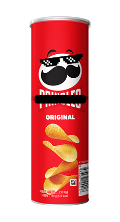

# Stack / Queue

## 📚 Stack



> 프링x스를 예시로 들어보자.  
> 통 안에 감자칩이 순서대로 차곡차곡 쌓여있다. 프링x스를 만들때는 통 가장 아래서부터 감자칩을 하나씩 차곡차곡 담는다.
> 프링x스를 산 사람은 뚜껑을 열고 위에서부터 하나씩(또는 여러개) 꺼내먹는다.

## 특징

### 후입선출(LIFO Last In First Out) 구조

`Stack`(이하 '스택')이란 데이터를 쌓아올린 형태의 자료구조를 뜻한다.  
데이터를 한 방향으로만 저장 할 수 있고 `최상층(Top)`으로 정한 곳에 위치한 데이터만 `삽입/조회/삭제` 할 수 있다.

## 주요 메서드

1. `isEmpty()`, `isFull()`
   - 각각 스택이 비어있는지, 가득찼는지를 boolean 형태로 리턴하는 메서드.
2. `push()`
   - 스택에 새로운 원소를 삽입한다. 
   - 가득 차 있다면 예외를 던진다.
3. `peek()`
   - 최상층에 위치한 데이터를 읽어온다.
4. `pop()`
   - 최상층에 위치한 데이터를 읽어오고 해당 데이터를 스택에서 제거한다.

## Java 의 Stack 구현

### 인터페이스 정의

```
public interface MyStack<T> {
    boolean isEmpty();
    boolean isFull();
    void push(T element);
    T peek();
    T pop();
    void clear();
}
```

### 클래스 구현

```
public class MyStackImpl<T> implements MyStack<T> {

    private List<Optional<T>> myStack;
    private int limit;

    public MyStackImpl(int size) {
        this.myStack = new LinkedList<>();
        this.limit = size;
    }

    @Override
    public boolean isEmpty() {
        return this.myStack.isEmpty();
    }

    @Override
    public boolean isFull() {
        return this.myStack.size() == limit;
    }

    @Override
    public void push(T element) throws FullException {
        if (this.myStack.size() == limit) {
            throw new FullException();
        }
        this.myStack.add(Optional.ofNullable(element));
    }

    @Override
    public T peek() throws EmptyException {
        try {
            return this.myStack.get(myStack.size() - 1).orElseThrow(EmptyException::new);
        } catch (IndexOutOfBoundsException e) {
            throw new EmptyException();
        }
    }

    @Override
    public T pop() throws EmptyException {
        try {
            return myStack.remove(myStack.size() - 1).orElseThrow(EmptyException::new);
        } catch (IndexOutOfBoundsException e) {
            throw new EmptyException();
        }
    }

    @Override
    public void clear() {
        myStack.clear();
    }
}
```

### 예외 처리

```
public class FullException extends RuntimeException {

    public FullException() {}

    public FullException(String message) {
        super(message);
    }
}
```

```
public class EmptyException extends RuntimeException {

    public EmptyException() {}

    public EmptyException(String message) {
        super(message);
    }
}
```

## 🍡 Queue


> 놀이공원이나 매표소 등 줄을 서서 차례로 업무를 처리하거나 웹 브라우저의 뒤로가기 기능을 수행할 때 등

## 특징

### 선입선출(FIFO First In First Out) 구조

`Queue`(이하 '큐')란 데이터를 순서대로 줄을 세운 형태의 자료구조를 뜻한다.  
`프론트(Front)`로 정한 곳에서는 `조회/삭제` 연산이 일어나고, `리어(Rear)`로 정한 곳에서 `삽입` 연산 발생.

## 주요 메서드

1. `isEmpty()`, `isFull()`
   - 앞서 설명한 스택과 동일, 각각 큐가 비었는지, 가득 찼는지를 boolean 형태로 반환.
2. `enqueue()`
   - 큐에 새로운 원소를 삽입한다.
   - 가득 차 있다면 예외를 던진다.
3. `peek()`
   - 최하층에 위치한 데이터를 읽어온다.
4. `dequeue()`
   - 최하층에 위치한 데이터를 읽어로고 해당 데이터를 큐에서 제거한다.

## Java 의 Queue 구현

### 인터페이스 정의

```
public interface MyQueue<T> {
    boolean isEmpty();
    boolean isFull();
    void enqueue(T element);
    T peek();
    T dequeue();
    void clear();
}
```

### 클래스 구현

```
public class MyQueueImpl<T> implements MyQueue<T> {

    private List<Optional<T>> myQueue;
    private int limit;

    public MyQueueImpl(int size) {
        this.myQueue = new LinkedList<>();
        this.limit = size;
    }

    @Override
    public boolean isEmpty() {
        return this.myQueue.isEmpty();
    }

    @Override
    public boolean isFull() {
        return this.myQueue.size() == limit;
    }

    @Override
    public void enqueue(T element) throws FullException {
        if (isFull()) {
            throw new FullException();
        }
        myQueue.add(Optional.ofNullable(element));
    }

    @Override
    public T peek() throws EmptyException {
        try {
            return this.myQueue.get(0).orElseThrow(EmptyException::new);
        } catch (IndexOutOfBoundsException e) {
            throw new EmptyException();
        }
    }

    @Override
    public T dequeue() throws EmptyException {
        try {
            return this.myQueue.remove(0).orElseThrow(EmptyException::new);
        } catch (IndexOutOfBoundsException e) {
            throw new EmptyException();
        }
    }

    @Override
    public void clear() {
        this.myQueue.clear();
    }
}
```

### 예외 처리

```
public class FullException extends RuntimeException {

    public FullException() {}

    public FullException(String message) {
        super(message);
    }
}
```

```
public class EmptyException extends RuntimeException {

    public EmptyException() {}

    public EmptyException(String message) {
        super(message);
    }
}
```

# 예상 질문

### Q1. 스택으로 큐를 구현 할 수 있는가? 그 반대는?

> 스택 두개를 사용 해 구현 가능합니다.

### Q2. 스택과 큐의 특성을 모두 사용해야한다면?

> `데크(Deque)`자료구조를 사용 할 수 있습니다. 삽입, 삭제, 조회 연산이 데크의 양 끝단에서만 이루어지는 구조입니다.