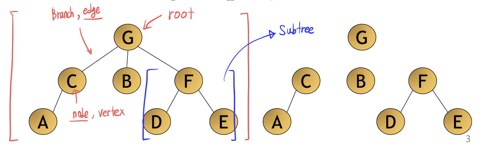
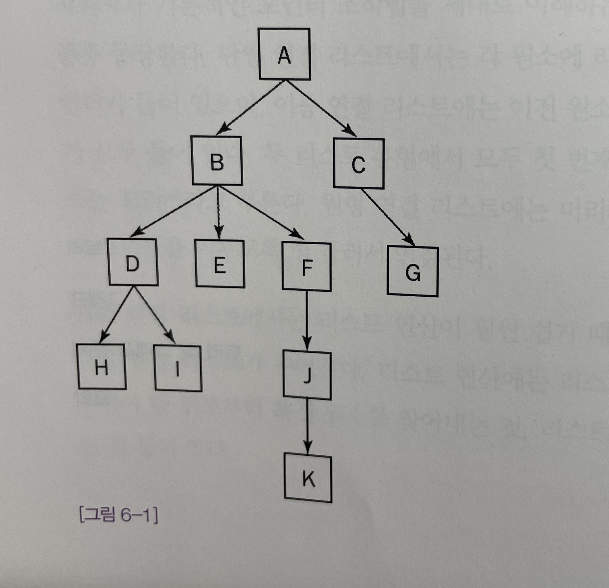
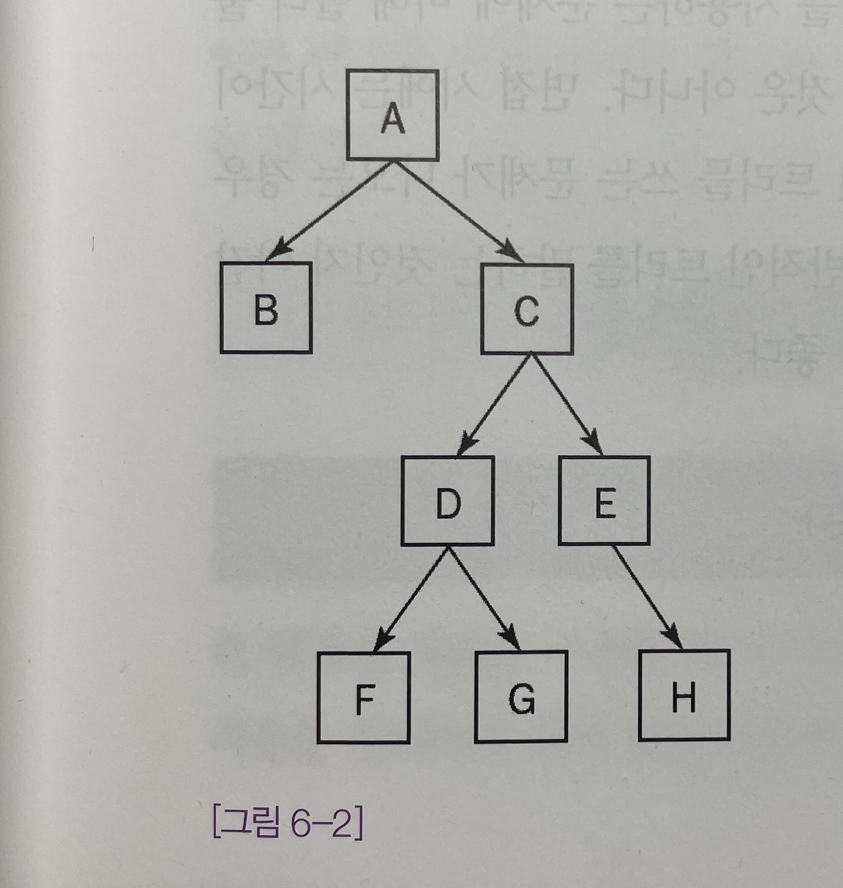
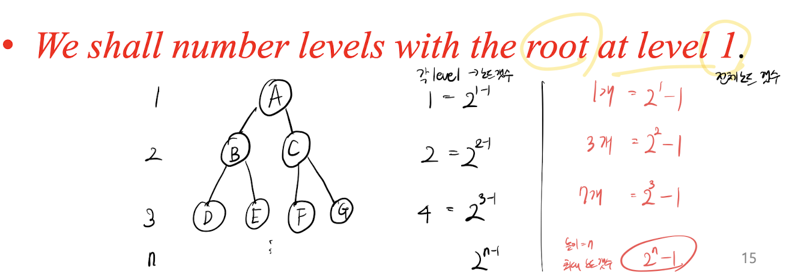
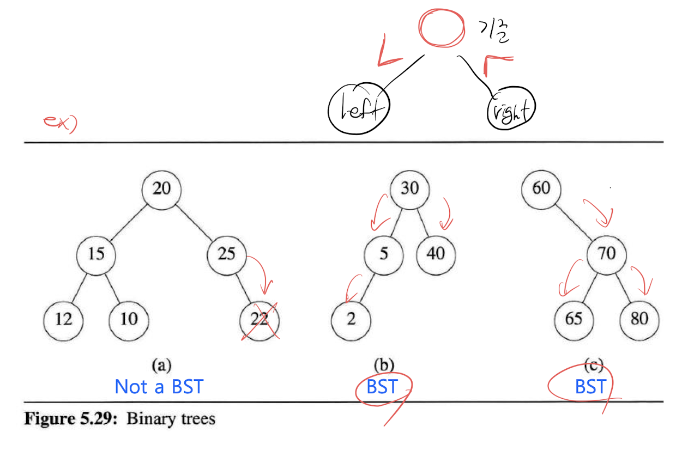
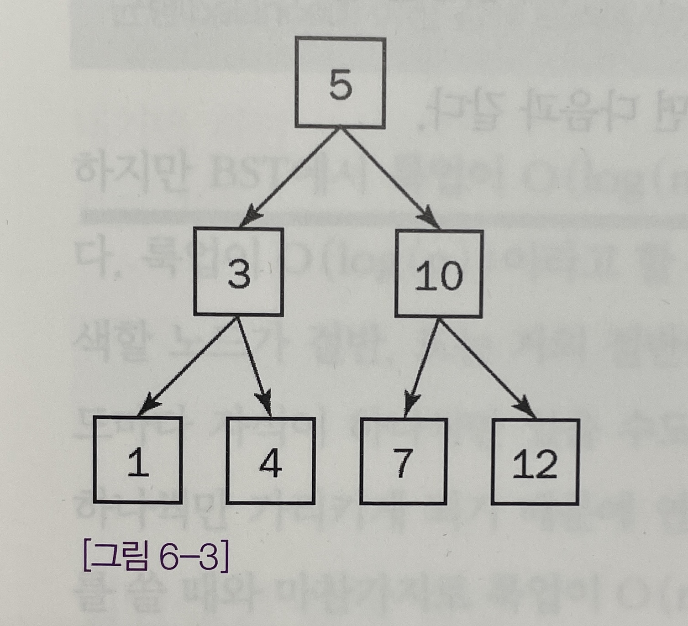
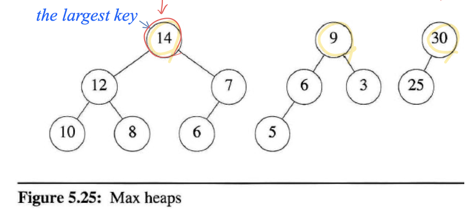

> 작성자 : 팬시 / [출처](https://fancy96.github.io/DataStructure-Tree/)

> 이 글의 코드와 정보들은 책을 공부하며 정리한 내용을 토대로 작성하였습니다.

## 트리

* `트리`는 0개 이상의 다른 노드에 대한 레퍼런스가 들어 있는 노드(데이터 원소)로 구성된다.

* 트리를 그림으로 표현하면 아래와 같다.



* 연결 리스트에서와 마찬가지로 `노드`는 구조체 또는 클래스로 표현되며, 트리는 포인터 또는 레퍼런스만 있다면 어떤 언어로든 구현할 수 있다.

* 객체지향 언어에서는 보통 노드의 공통적인 부분을 하나의 클래스로 정의하고, 노드에 들어가는 데이터를 위해 서브클래스를 만들어서 사용한다.

* 실제 코딩을 할 때는 children은 비공개(private)로 선언하고 그 배열을 건드리기 위한 메서드만 공개하는 방법을 써야 할 것이다.

* 정수가 저장되는 클래스를 메서드와 생성자를 모두 제대로 갖춘 **자바**로 만든다면 다음과 같은 식의 코드를 쓰면 된다.

```java
public abstract class Node {
    private Node[] children;
    
  public Node( Node[] children) {
      this.children = children;
  }
  
  public int getNumChildren() {
      return children.length;
  }
  
  public Node getChildren(int index) {
      return children[index];
  }
}

public class IntNode extends Node {
    private int value;
    
    public IntNode (Node [] children, int value) {
        super(children);
        this.value = value;
    }
    
    public int getValue() {
        return value;
    }
}
```

* 다음은 [그림 6-1]을 참고해서 트리와 관련된 용어들을 몇 가지 정리했다.



* 부모(Parent) : 다른 노드를 가리키는 노드는 그 노드의 부모가 된다. 루트를 제외한 모든 노드에는 부모가 하나씩 있다.

    * [그림 6-1]에서 B는 D, E, F의 부모 노드가 된다.

* 자식(Child) : 루트를 제외한 모든 노드는 그 노드를 가리키는 노드의 자식이 된다.

    * [그림 6-1]에서 D, E, F는 B의 자식 노드가 된다.

* 자손(Descendant) : 특정 노드로부터 자식 노드로 이어지는 경로를 따라 도달할 수 있는 모든 노드는 그 특정 노드의 자손이다.

    * [그림 6-1]에서 D, E, F, H, I, J, K는 모두 B의 자손이다.

* 조상(Ancestor) : 어떤 노드를 자손으로 삼고 있는 노드는 모두 그 노드의 조상이다.

    * 예를 들어 A, B, D는 모두 I의 조상이다.

* 잎(Leaves) : 자식이 없는 노드를 잎이라고 부른다. G, H, I, K는 모두 잎이다.


## 이진 트리

* 실전에서는 면접관이 **트리**라고 하면 보통 `이진 트리(binary tree)`라는 트리의 한 종류를 일컫는 경우가 많다.

* 이진 트리는 한 노드에 **자식이 최대 2개**까지만 있을 수 있으며, 그 두 자식은 각각 왼쪽 자식(left subtree)과 오른쪽 자식(right subtree)이라고 부른다.

* [그림 6-2]에 이진 트리의 예가 나와있다.



* 이진 트리를 간단하게 구현하면 다음과 같다. 편의상 한 클래스에 모든 것을 집어넣었다.

```java
public class Node {
    private Node left;
    private Node right;
    private int value;
    
    public Node(Node left, Node right, int value) {
        this.left = left;
        this.right = right;
        this.value = value;
    }
    
    public Node getLeft() {
        return left;
    }
    public Node getRight() {
        return right;
    }
    public Node getValue() {
        return value;
    }
}
```

* 어떤 원소에 왼쪽 또는 오른쪽 자식이 없으면 left or right에 NULL 레퍼런스를 집어넣는다.

## 이진 트리 속성

* 교재마다 시작 레벨을 다르게 하는 경우가 많은데, 여기서는 시작 레벨을 `1`로 가정한다고 치자.



* [1] 이진 트리의 레벨 i번째의 최대 노드 갯수는 **$2^{i-1}$** 이다. (단, i >=1 인 경우) 예를 들어 레벨이 3인 경우, 레벨 3의 최대 노드 갯수는 $2^{3-1} = 4$이다.

* [2] 높이 k인 이진 트리의 최대 노드 갯수는 **$2^{k} -1$** 이다. (단, k >=1 인 경우) 예를 들어 높이가 3인 경우, 전체 노드의 최대 갯수는 $2^{3} - 1 = 7$이다.

## 이진 검색 트리

* 트리를 써서, **정렬된**, 또는 **순서가 정해진 자료를 저장**하는 경우를 흔하게 볼 수 있다.

* 그중에서도 트리에 데이터를 저장할 때 가장 흔하게 쓰이는 것은 `이진 검색 트리`(BST, Binary Search Tree)이다.

* BST에서는 노드의 왼쪽 자식의 값이 **반드시 자신의 값 이하**이며, 오른쪽 자신의 값은 **반드시 자신의 값 이상**이다.

* 즉, BST의 데이터는 값으로 정렬된다.



* Key = {5, 3, 1, 4, 10, 7, 12}로 주어진다면, 아래와 같이 [그림 6-3]으로 나타낼 수 있다.



* 이진 검색 트리의 장점 가운데 하나로 **룩업 연산**(lookup, 트리에 있는 특정 노드의 위치를 알아내는 연산)을 빠르고 간단하게 처리할 수 있다는 점을 들 수 있다.

* 이런 장점은 **자료를 저장**할 때 그 위력을 발휘한다.

* BST를 다음과 같이 재귀 메서드와 반복 메서드로 구현할 수 있다.

```cpp
typedef int iType;
typedef struct {
    int key;  //찾을 값
    iType item; //저장할 값(이름, 주소, 전화번호)
} element;

typedef struct node *treePointer;
typedef struct node {
    element data;
    treePointer leftChild, rightChild;
} tNode;

/* Resursive */
element* search(treePointer root, int k) 
{ /* return a pointer to the element whose key is k, if there is no such element, return NULL. */
  if (!root) return NULL;
  if (k == root->data.key) return &(root->data);
  if (k < root->data.key)
    return search(root->leftChild, k);
  return search(root->rightChild, k);
}

/* Iterative */
element* iterSearch(treePointer tree, int k)
{ /* return a pointer to the element whose key is k, if there is no such element, return NULL. */

  while(tree) {
    if (k == tree->data.key) return &(tree->data);
    if (k < tree->data.key)
        tree = tree->leftChild;
    else
        tree = tree->rightChild;
    return NULL;
}
```

* `&`을 쓰는 이유는 비선형 자료구조며 Index가 존재하지 않고, 노드 자체를 return 하므로 **주소**로 접근해야 한다.

* 평균적인 케이스로 BST의 높이가 n일 경우 시간복잡도는 **O(log(n))** 이며, 최악의 케이스인 경우 **O(n)** 이 된다.

## 힙

* 힙도 매우 많이 쓰이는 트리 가운데 하나다.

* 힙은 이진 트리로, 노드의 각 자식의 값은 노드 자신의 값 이하여야 하며, 이를 보통 `max heap`이라고 부른다.



* 결과적으로 루트 노드의 값은 그 트리에서 가장 큰 값이며, **`우선순위 큐`(Priority queues)를 구현하기 위해 `max heap`을 사용**한다.

* 예를 들어, 병원 응급실에서 대기 중인 환자들을 힙으로 모델링할 수 있다. 환자가 들어올 때 손가락을 다쳐서 온 환자보다 심장마비 환자에게 **더 높은 우선순위를 부여**하는 식으로 

* 우선순위를 부여하여 힙에 집어넣는다. 의사가 다음 환자를 볼 수 있게 되면 가장 우선순위가 높은 환자부터 치료를 시작한다.

* 하지만 문제에 따라서 `min heap`이 주어지는 경우도 있다. `min heap`은 반대로 가장 작은 값이 루트에 오는 경우이다.


* 시간복잡도에 대해서 삽입과 삭제는 **O(log(n))** 이지만, 룩업은 **O(n)** 이다.

## 일반적인 검색 방법

* BST나 힙처럼 정렬되는 특성을 가진 트리가 아닌 가계도나 회사의 직위체계 등을 나타내는 트리가 있다.

* 이렇게 특정 노드를 검색하는 것과 관련된 문제들이 자주 나오는데, 이런 문제들을 해결하기 위해서는 가장 많이 쓰이는 알고리즘 두 가지를 쓰면 된다.

### 너비 우선 검색(BFS)

* 트리를 검색하는 방법 가운데 하나로 `너비 우선 탐색`(BFS, Breath-First-Search)가 있다.

* BFS에서는 루트에서 시작하여 둘째 층을 왼쪽에서 오른쪽으로 훑어나가고, 그 다음 층 역시 왼쪽에서 오른쪽으로 훑어나가는 식으로 검색을 한다.

* 원하는 노드를 찾거나 모든 노드를 다 확인하면 검색이 끝나는 검색(=탐색) 기법이다.

* 노드를 찾아내는 데 걸리는 시간은 **O(n)** 이므로 큰 트리에 대해서는 이런 식으로 검색하지 않는 것이 좋다.

* BFS에서는 어떤 층을 검색할 때 **그 층에 있는 모든 노드의 자식 노드를 저장**해둬야 하기 때문에 **메모리도 꽤 많이 사용**해야 한다.

### 깊이 우선 검색(DFS)

* 트리를 검색하는 두 번째 방법으로 `깊이 우선 검색`(DFS, Depth-First-Search)가 있다.

* 깊이 우선 검색에서는 원하는 노드를 찾거나 끝까지 다다를때 까지 한 가지를 따라 쭉 내려가는 방식이다.

* 더 이상 검색할 수 없다면 확인하지 않는 자식이 있는 가장 가까운 조상 노드로 돌아가서 검색을 계속하는 기법이다.

* DFS에서는 BFS와 다르게 각 층별로 모든 자식 노드를 저장해야 할 필요가 없기 때문에 **메모리 요구량이 훨씬 적다.**

* 그리고 특정 층을 마지막으로 검색하는 문제가 없다는 점도 장점이 될 수 있다. (BFS에서는 가장 낮은 층을 마지막에 확인함)

* 예를 들어, 회사의 조직도를 나타내는 트리가 주어졌는데, 신입사원을 찾는다면 트리 아래쪽에 주로 있을 것으로 예상할 수 있다.

* 이런 경우 BFS보다 DFS로 검색을 하면 원하는 노드를 빨리 찾을 수 있을 것이다.

## 종주(Traversal)

* 종주도 자주 나오는 문제 유형 가운데 하나다.

* 특정 노드를 찾으면 작업을 멈추는 검색과는 달리 종주를 할 때는 **모든 노드를 방문하면서 각 노드에 대해 어떤 작업을 수행**하게 된다.

* 종주에는 세 가지 방법이 있으며, 각 방법에 따라 노드를 방문하는 순서가 달라진다.

  * `Preorder`(VLR) : 우선 노드 자체에 대해 작업을 수행하고 왼쪽, 오른쪽 자손 순으로 처리한다. 항상 노드를 먼저 방문한다. Value -> Left -> Right

  * `Inorder`(LVR) : 우선 노드의 왼쪽 자손을 처리한 다음 노드 자체에 대해 작업을 수행하고, 마지막으로 오른쪽 자손을 처리한다. Left -> Value -> Right

  * `Postorder`(LRV) : 우선 노드의 왼쪽 자손을 처리한 다음, 오른쪽 자손을 처리하고 마지막에 그 노드 자체를 처리한다. Left -> Right -> Value

* 종주를 구현하는 가장 간단한 방법은 **재귀 호출**을 이용하는 방법이다.

* 아래와 같이 C언어로 구현했다.

```cpp
/* Preorder */
void preorder(treePointer ptr) 
{ /* preorder tree traversal */
  if (ptr) {
    print("%d", ptr->data);   //V
    preorder(ptr->leftChild);  //L
    preorder(ptr->rightChild); //R
}


/* Inorder */
void inorder(treePointer ptr) 
{ /* inorder tree traversal */
  if (ptr) {
    inorder(ptr->leftChild);  //L
    print("%d", ptr->data);   //V
    inorder(ptr->rightChild); //R
}


/* Postorder */
void postorder(treePointer ptr) 
{ /* postorder tree traversal */
  if (ptr) {
    postorder(ptr->leftChild);  //L
    postorder(ptr->rightChild); //R
    print("%d", ptr->data);   //V
}
```

##  Reference

* [프로그래밍 면접 이렇게 준비한다: p.152 - p.162](http://www.yes24.com/Product/Goods/75187284)

* [Fundamentals of data structures in C, 2nd edition - Trees](https://www.amazon.com/Fundamentals-Data-Structures-Ellis-Horowitz/dp/0929306406)
