> [해당 포스팅](https://hello-judy-world.tistory.com/199)에서도 내용을 확인할 수 있습니다.

> written by [judy](https://github.com/ParkJungYoon)


### [ 이진 탐색 트리(BST,Binary Search Tree)의 단점 ]

> `균등 트리` : 노드 개수가 N개일 때 O(logN) <br>
> `편향 트리` : 노드 개수가 N개일 때 **O(N)**

이진 탐색 트리는 최악의 경우 한쪽으로 편향된 트리일 때 O(N) 시간이 걸린다.

이 말은 모든 노드를 한 번씩 다 확인해줘야 한다는 의미이다.

<div align='center'>
    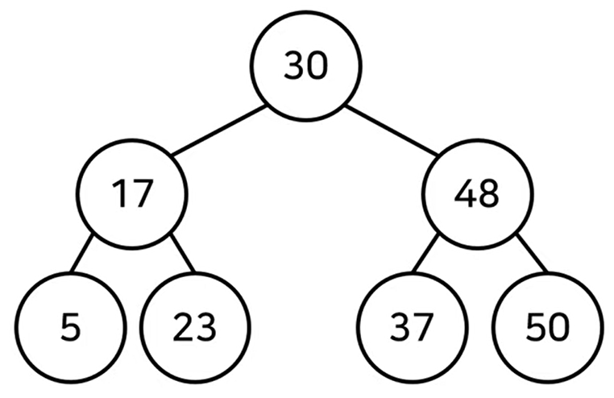<br>
</div>

<div align='center'>
    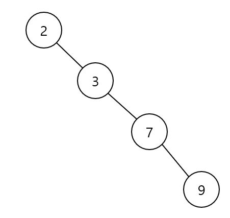<br>
</div>

이러한 단점을 개선한 **균형 트리**인 **Red-Black 트리**에 대해서 알아보자.

<br>

## 🔴 Red-Black 트리 ⚫️

> 이진 탐색 트리의 단점을 개선하기 위한 자료구조

- 이진 탐색 트리(BST)의 한 종류
- 스스로 균형(balancing) 잡는 트리
- BST의 worst case의 단점을 개선해서 모든 경우에 **O(logN)**
- 모든 노드는 **red** 혹은 **black**

<div align='center'>
    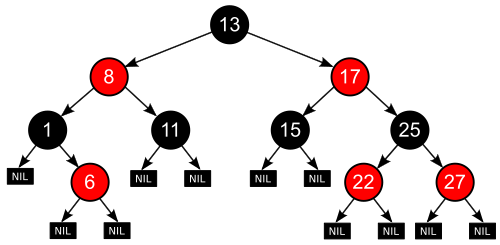
</div>

<br>

### ✔️  5가지 속성 

1. 모든 노드는 red 혹은 black
2. 루트 노드는 black
3. 모든 nil(leaf) 노드는 black
4. red의 자녀들은 반드시 black이어야 한다. (즉, red가 연속적으로 존재할 수 없다.)
5. 임의의 노드에서 자손 nil 노드들까지 가는 경로들의 black 수는 같다. (자기 자신은 카운트에서 제외)
    - 8번 노드를 예로 들어보자.
    - 8번 노드에서 자손 nil 노드들까지 가는 경로는 5가지이다.
    - 각각의 경로 모두 black의 수가 2개로 동일하다.

### [ nil 노드란? ]

- <u>존재하지 않음을 의미하는 노드</u>
- 자녀가 없을 때 자녀를 nil 노드로 표기
- 값이 있는 노드와 동등하게 취급
- RB 트리에서 leaf 노드는 nil 노드

### [ 노드 x의 black height ]

> `#5 속성`: 임의의 노드에서 자손 nil 노드들까지 가는 경로들의 black 수는 같다. (자기 자신은 카운트에서 제외)

- 노드 x에서 임의의 자손 nil 노드까지 내려가는 경로에서의 black 수 (자기 자신은 카운트에서 제외)
- 위의 `속성 중 5번`을 만족해야 성립하는 개념이다.

### [ 예시 ]

위의 그림을 다시 가져와 살펴보자.

<div align='center'>
    
</div>

- 노드 8의 black height : 2
- 노드 13의 black height : 2

<br>

### ✔️ Red-Black 트리는 어떻게 균형을 잡을까?

> `#4 속성`: **red**의 자녀들은 반드시 **black**이어야 한다. (즉, **red**가 연속적으로 존재할 수 없다.)

> `#5 속성`: 임의의 노드에서 자손 nil 노드들까지 가는 경로들의 black 수는 같다. (자기 자신은 카운트에서 제외)

삽입/삭제 시 주로 `속성 #4, #5`를 위반하며 이들을 해결하기 위해 구조를 바꾼다.

그러다 보면 자연스럽게 트리의 균형이 잡히게 된다.

이렇게 균형을 잡으며 편향되지 않는다.

<br>

### ✔️  삽입 동작 방식

전체 큰 그림으로 우선 살펴보자.

```
1. 삽입 전 RB 트리 속성 만족한 상태
2. 삽입 방식은 일반적인 BST와 동일
3. 삽입 후 RB 트리 위반 여부 확인
4. RB 트리 속성을 위반했다면 재조정
5. RB 트리 속성을 다시 만족
```

BST와 동일하게 삽입하고 트리 속성을 만족하도록 조정한다.

삽입하는 노드는 항상 **red**다.

### [ 예시 ] 

### 1. insert(50)

- 삽입하는 노드는 항상 **red**다.
- 삽입 시 nil 노드의 색은 **black**으로 고정한다.
    - <u>`#3 속성` 만족</u>
    - 모든 nil(leaf) 노드는 **black**
    - <u>` #2 속성` 위반 </u>
    - 루트 노드는 **black**

<div align='center'>
    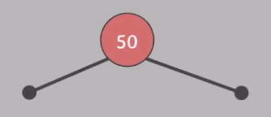
</div>

- 루트 노드를 **red**에서 **black**으로 바꿔준다.
    - <u>모든 속성 만족</u>

<div align='center'>
    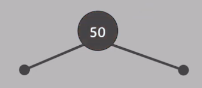
</div>

<br>

### 2. insert(20)

- 삽입하는 노드는 항상 **red**다.
    - <u>모든 속성 만족</u>

<div align='center'>
    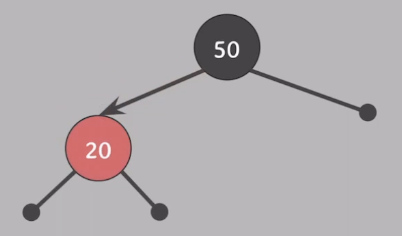
</div>

<br>

🧐❓ 왜 새로 삽입하는 노드는 **red**일까?

🙋‍♀️💡 삽입한 후에도 #5 속성을 만족하기 위해서

<br>

> `#5 속성`: 임의의 노드에서 자손 nil 노드들까지 가는 경로들의 black 수는 같다. (자기 자신은 카운트에서 제외)

<br>

### 3-1. insert(10)

- 삽입하는 노드는 항상 **red**다.
    - <u>`#4 속성` 위반</u>
    - **red**의 자녀들은 반드시 **black**이어야 한다. (즉, **red**가 연속적으로 존재할 수 없다.)

<div align='center'>
    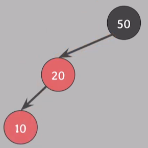
</div>

<br>

🧐❓이 상황은 어떻게 해결할 수 있을까?

🧐 **red**가 한 쪽으로 몰려 있으니 **red** 하나를 반대편으로 옮겨준다면?

🧐 구조를 바꿔준 뒤에도 BST의 특징 또한 유지되어야 한다!

🙋‍♀️💡 그 방법은 🌀**회전**🌀이다!!

<br>

<div align='center'>
    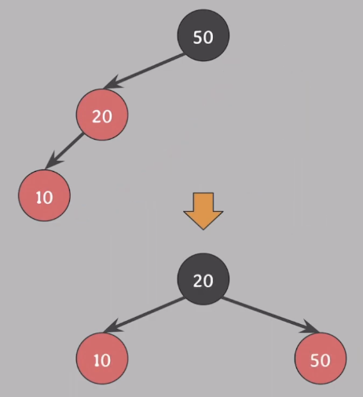
</div>

- `#4 속성` 위반을 해결하기 위해 **red** 하나를 옮겨야 함.
- BST 특징 또한 유지하면서 넘기기 위해 **회전**을 사용한다.
    1. 20과 50의 색을 바꿔준다.
    2. 50을 기준으로 오른쪽으로 회전한다.
    3. <u>모든 속성 만족</u>

<br>

### 3-2. insert(40)

2번 상황에서 또 다른 삽입 경우를 살펴보자.

- 삽입하는 노드는 항상 **red**다.
    - <u>`#4 속성` 위반</u>
    - **red**의 자녀들은 반드시 **black**이어야 한다. (즉, **red**가 연속적으로 존재할 수 없다.)

<div align='center'>
    
</div>

<br>

- 위의 3번 케이스(insert(10))와 다른 점은 루트 노트까지 경로가 **꺾여있다**.
- **회전**
    1. 20 기준으로 왼쪽으로 회전한다.
    2. 그다음 위의 케이스와 동일하게 회전해 준다.
    3. <u>모든 속성 만족</u>

<div align='center'>
    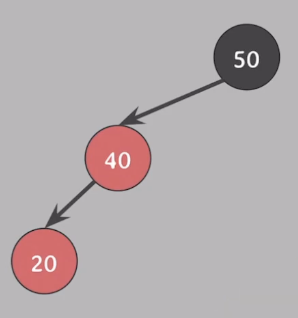
</div>

<div align='center'>
    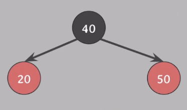
</div>

<br>

### 4. insert(30)

3-1번 상황에서 30을 삽입한 경우를 살펴보자.

- 삽입하는 노드는 항상 **red**다.
    - <u>`#4 속성` 위반</u>
    - **red**의 자녀들은 반드시 **black**이어야 한다. (즉, **red**가 연속적으로 존재할 수 없다.)

<div align='center'>
    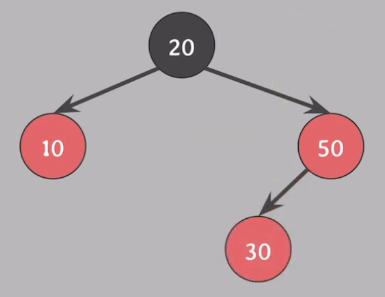
</div>

<br>

- 지난 케이스와 다르게 **red**가 한쪽으로 몰려있지 않아 노드를 옮길 수가 없다.
- 또한 `#5 속성`을 위반하지 않고 조정해줘야 한다.
- 자녀의 색상이 같으면 부모와 자녀의 색상을 서로 바꿔줘도 `#5 속성`을 위반하지 않는다는 특징이 있다.
    - 10,50 그리고 20의 색상을 바꿔준다.
    - <u>`#2 속성` 위반</u>
    - 루트 노드는 **black**

<div align='center'>
    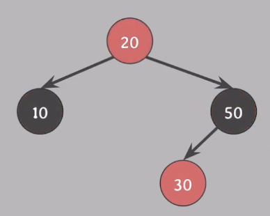
</div>

<br>

- 20을 **black**으로 바꿔준다.
    - <u>모든 속성 만족</u>

<div align='center'>
    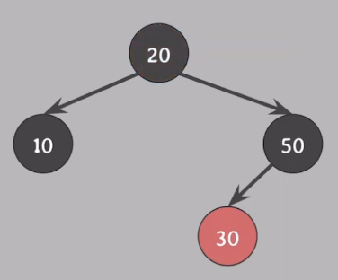
</div>

<br>

### [ 퀴즈 ] 

위의 내용을 바탕으로 이 상황에서 삽입을 하면 어떻게 될지 생각해 보자! (숙제!)

1. insert(40)
2. insert(35)
3. insert(25)

<div align='center'>
    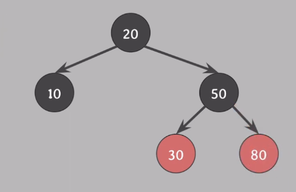
</div>

<br>

### ✔️  삭제 동작 방식

전체 큰 그림으로 우선 살펴보자.

```
0. 삭제 전 RB 트리 속성 만족한 상태
1. 삭제 방식은 일반적인 BST와 동일
2. 삭제 후 RB 트리 속성 위반 여부 확인
3. RB 트리 속성을 위반했다면 재조정
4. RB 트리 속성을 다시 만족
```

### [ 삭제 후 RB 트리 속성 위반 여부 확인 ]

💡 **삭제되는 색을 통해** 속성 위반 여부를 확인한다.

🧐❓삭제되는 색이 뭔데?

💡 삭제하려는 노드의 자녀가 없거나 하나라면 삭제되는 색은 **삭제되는 노드의 색**

💡 삭제하려는 노드의 자녀가 둘이라면 삭제되는 색은 **삭제되는 노드의 successor의 색**

🧐❓그게 무슨 소린데?

예시로 살펴보자!

<br>

### [ 예시 1 ]

> 삭제하려는 노드의 자녀가 없거나 하나일 때

<div align='center'>
    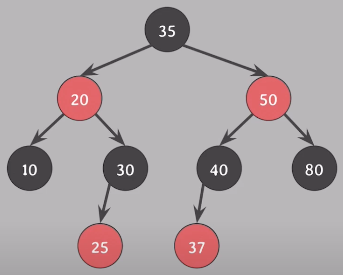
</div>

<br>

삭제되는 색은 **삭제되는 노드의 색**

1\) 25를 삭제하면 red 삭제

2\) 40을 삭제하면 black 삭제

<br>

### [ 예시 2 ]

> 삭제하려는 노드의 자녀가 둘일 때
 
위 그림 그대로 살펴보자.

삭제되는 색은 **삭제되는 노드의 successor의 색**

1\) 20을 삭제하면 successor 25가 20의 자리로 올라오고 색은 20을 이어받는다. 이때는 **삭제되는 색**은 25의 **red**이다.

* successor은 오른쪽 서브트리의 <u>가장 작은 값을 가지는 노드</u>이다.


2\) 50을 삭제하면 successor 80이 50의 자리로 올라오고 색은 **red**를 이어받는다. 이때 **삭제되는 색**은 80의 **black**이다.

삭제되는 색이 어떤 건지 알아봤다.

이제 이것으로 속성을 위반하는지 알아보자.

<br>

### 1) 삭제되는 색이 red일 때
 
💡 어떠한 속성도 위반하지 않는다!!


`속성 5가지`
```
1. 모든 노드는 red 혹은 black
2. 루트 노드는 black
3. 모든 nil(leaf) 노드는 black
4. red의 자녀들은 반드시 black이어야 한다. (즉, red가 연속적으로 존재할 수 없다.)
5. 임의의 노드에서 자손 nil 노드들까지 가는 경로들의 black 수는 같다. (자기 자신은 카운트에서 제외)
```

하나씩 살펴보자.

`#1` : 당연히 만족

`#2, #3` : 삭제되는 색이 **red**기 때문에 루트노드나 nil 노드가 삭제되는 것은 아니다.

`#4` : 이것 역시 **red**가 삭제된 것이기 때문에 위반되지 않는다.

`#5` : **red**가 삭제되었기 때문에 **black** 수에는 영향 X 

<br>

### 2) 삭제되는 색이 black일 때

💡 `#2, #4, #5 속성` 위반할 수 있다.

40을 삭제했다. 40의 자녀가 하나이기 때문에 삭제된 색은 **black**이다.

`#4` : **red**가 연속되기 때문에 위반한다.

`#5` : 모든 경로의 **black**가 같지 않다. 50에서 왼쪽을 타고 가면 **black**이 하나이고, 오른쪽으로 가면 2개이다. (nil노드 포함)

<div align='center'>
    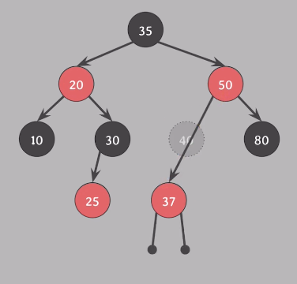
</div>

<br>

이번에는 아래 상황에서 35를 삭제한다. 자녀가 하나이기 때문에 삭제된 색은 **black**이다.

`#2` : 35가 삭제되고 50이 루트노드가 된다. 그러면 루트 노드가 **red**로 속성을 위반한다.

<div align='center'>
    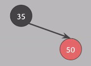
</div>

<br>

지금까지 위반여부를 확인하는 2번 과정까지 살펴봤다.

이제 위반된 경우 <u>**재조정하는 과정**</u>을 살펴보자!

<br>

### [ RB 트리 속성을 위반했다면 재조정 ]

#2를 위반하는 경우 같은 단순한 상황에서는 50을 **black**으로 바꾸면 된다.

그런데 보통의 경우는 항상 #5를 위반하게 된다. (black을 삭제했기 때문)

이럴 때 해결하는 방식의 **red-black tree**의 핵심이다!

<br>

### 💡 extra black 부여

#5 속성을 다시 만족시키기 위해 삭제된 색의 위치를 대체한 노드에 extra black을 부여한다.

### [ 예시 ]

1\) 10 삭제, 삭제되는 색은 **black**

<div align='center'>
    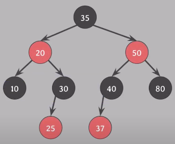
</div>

<br>

2\) `#5 속성` 위반

3\) 삭제된 10의 위치를 대체한 nil 노드에 extra black 부여

4\) `#5 속성` 만족

<div align='center'>
    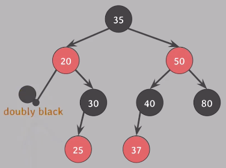
</div>

> * `doubly black` : extra black이 부여된 black 노드

> * `red-and-black` : extra black이 부여된  red 노드

<br>

### 💡 red-and-black이 되면 black으로 바꿔주면 끝!

### 💡 doubly black이 되면 case1, 2, 3, 4 중에서 해결하면 된다.

<br>

### [ case 4 ]

**doubly black**의 오른쪽 형제가 **black** & 그 형제의 오른쪽 자녀가 **red**일 때

👉 그 **red**를 **doubly black** 위로 옮기고 옮긴 **red**로 **extra black**을 전달해서 **red-and-black**으로 만들면 **red-and-black**을 **black**으로 바꿔서 해결

쉽게 말하라옹!

👉 오른쪽 형제는 부모의 색으로, 오른쪽 형제의 오른쪽 자녀는 **black**으로, 부모는 **black**으로 바꾼 후에 부모를 기준으로 왼쪽으로 회전하면 해결

<div align='center'>
    
</div>
<div align='center'>
    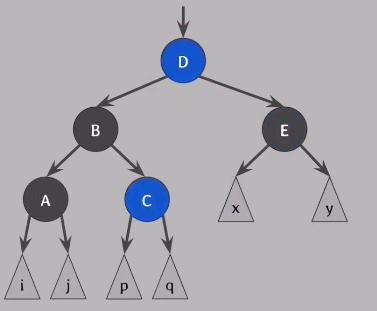
</div>

<br>

### [ case 3 ]

**doubly black**의 오른쪽 형제가 **black** & 그 형제의 왼쪽 자녀가 **red** & 그 형제의 오른쪽 자녀는 **black**일 때

👉  **doubly black**의 형제의 오른쪽 자녀가 **red**가 되게 만들어서 이후엔 case4를 적용하여 해결

👉 E 위치에 **red**가 오도록 만들기 위해 C와 D의 색을 바꾼 후에 D를 기준으로 오른쪽으로 회전하면 된다.

<div align='center'>
    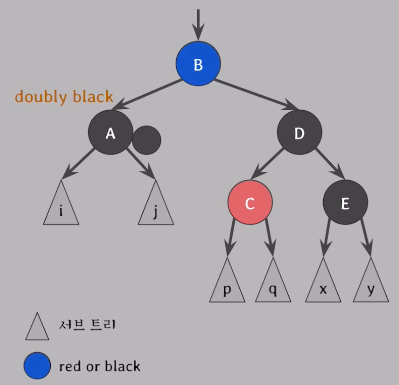
</div>
<div align='center'>
    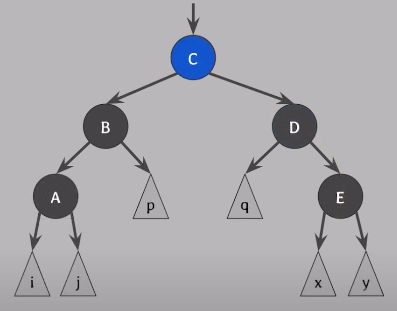
</div>

<br>

### [ case 2 ] 

**doubly black**의 형제가 **black** & 그 형제의 두 자녀 모두 **black**일 때

👉  **doubly black**과 그 형제의 **black**을 모아서 부모에게 전달해서 부모가 **extra black**을 해결하도록 위임한다.

<div align='center'>
    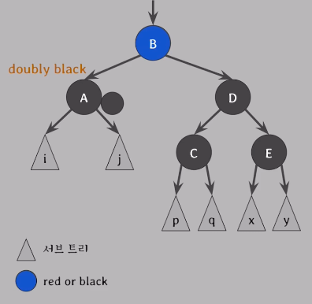
</div>

<br>

### [ case 1 ] 

**doubly black**의 형제가 **red**일 때

👉  **doubly black**의 형제를 **black**으로 만든 후 case 2, 3, 4 중 하나로 해결

<div align='center'>
    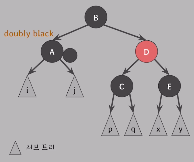
</div>
<br>

D를 black으로 만들기 위해서 B와 D 색상을 바꿔준다. 그리고 B를 기준으로 왼쪽으로 회전한다.

<div align='center'>
    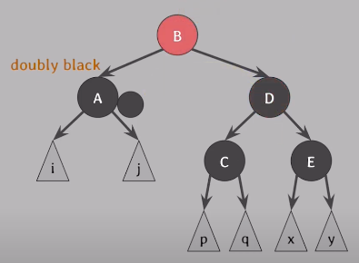
</div>
<div align='center'>
    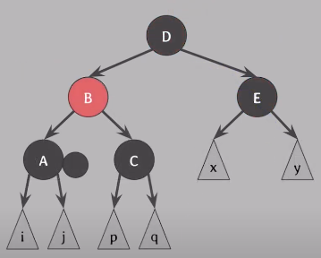
</div>

이 상태에서 다른 case 중에서 해결

<br>

### ✔️  시간 복잡도

> N = 트리의 노드 수

||avg|worst|
|:---:|:---:|:---:|
|insert|O(logN)|O(logN)|
|delete|O(logN)|O(logN)|
|search|O(logN)|O(logN)|

- AVL 트리와 비교했을 때!

    - 삽입/삭제가 거의 없고 **검색이 대부분**인 상황에서는 **AVL트리**를 사용하고 **삽입/삭제**가 많을 때는 **red-black tree**를 사용하면 좋다.
    - 왜냐하면 AVL트리는 검색 성능이 빠르고 red-black tree는 삽입/삭제 성능이 좋기 때문!
    - AVL트리는 균형을 좀 더 엄격하게 잡는다. 엄격하니깐 검색 성능은 더 좋지만 삽입/삭제는 red-black tree에 비해 느리다.

- `red-black tree`의 응용사례
    - linux kernel 내부에서 사용
    - Java에서 TreeMap 구현에도 사용된다.

---

### 📢 같이 공부하면 좋을 면접 질문

- 레드 블랙 트리에 대해 설명해주세요.
- 레드 블랙 트리를 사용하는 이유에 대해서 설명해주세요.

--- 

### 📌 Reference

- 쉬운 코드