# B tree, B+tree

## B tree

데이터가 정렬된 상태로 유지되어 있는 트리로 일반적인 이진 트리와 비슷하지만 한 노드 당 자식 노드가 2개 이상 가능한 트리. 어떤 값에 대해서도 같은 시간에 결과를 얻을 수 있는 것이 장점.

> 트리란?
 그래프의 일종으로, 한 노드에서 시작해서 다른 정점들을 순회하여 자기 자신에게 돌아오는 순환이 없는 연결 그래프
> 

    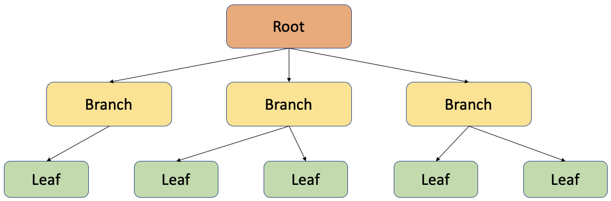

**B tree**

사각형으로 표시된 한 개의 데이터를 노드(node)

가장 상단의 노드를 루트 노드(root node)

중간 노드들을 브랜치 노드 (branch node)

가장 아래 노드 리프 노드(leaf node) 

### 특징

1. 균일성 : 어떤 값에 대해서도 같은 시간에 결과를 얻을 수 있다. 
    
    (트리 높이가 다를 경우, 약간의 차이는 있지만 O(logN))
    
2. 균형트리 : 루트로 부터 리프까지의 거리가 일정한 트리 구조. 성능이 안정화 되어 있음.
    
    (처음 생성 당시는 균형 트리이지만 갱신이 반복되면 서서히 균형이 깨지고, 성능도 약화 됨.
    
3. 항상 정렬된 상태로 특정 값보다 크고 작은 부등호 연산에 문제가 없다.
    
    

    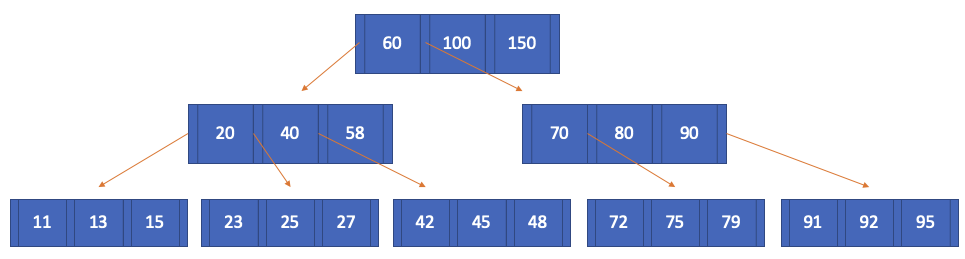
    

    
    b-tree 예시
    

데이터와 데이터 사이의 범위를 이용하여 자식 노드를 가리킨다.

노드 내 데이터들은 항상 정렬된 상태. 각 노드는 여러 개의 key를 가지고 있고 각 key에 대응하는 data도 가지고 있다.

### 삽입

1. 빈 트리일 경우 root node를 만들어 삽입한다. root node가 가득 찬 경우 노드를 분할하여 리프노드를 생성.
2. key가 들어갈 리프노드를 탐색한다.
3. 해당 리프 노드에 자리가 남아있다면 정렬을 유지하도록 알맞은 위치에 삽입하고, 리프 노드가 꽉 차 있다면 key를 삽입 후 해당 노드를 분할한다.
4. 노드가 분할되는 경우 노드의 중앙값을 기준으로 분할한다. 중앙값은 부모 노드로 합쳐지거나 새로운 노드로 생성되고, 중앙값을 기준으로 왼쪽의 키는 왼쪽 자식, 오른쪽의 키는 오른쪽 자식으로 생성된다.
    

    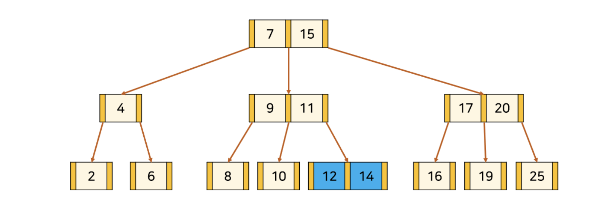
    

    이미지 출처 : [https://rebro.kr/169](https://rebro.kr/169) 13삽입 예시
    
    - 13삽입 완료 후
        
    

    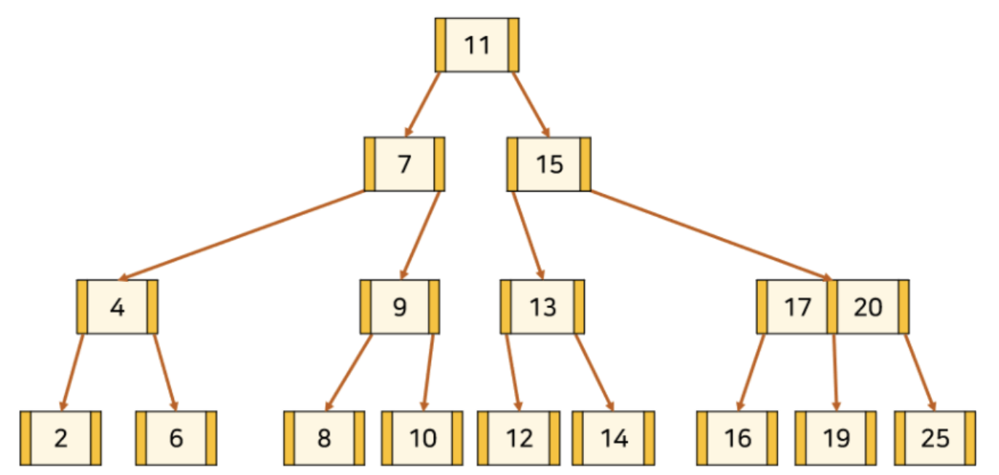
    

    이미지 출처 : [https://rebro.kr/169](https://rebro.kr/169) 13삽입 예시
        

### 삭제

1. 삭제할 key가 리프노드에 있는 경우
    
    a. 현재 노드의 key 수가 최소보다 큰 경우
    
    단순히 삭제해도 무방
    
    b.  현재 노드의 key 수가 최소이고, 왼쪽 또는 오른쪽 형제 노드의 key 수가 최소보다 큰 경우
    
    

    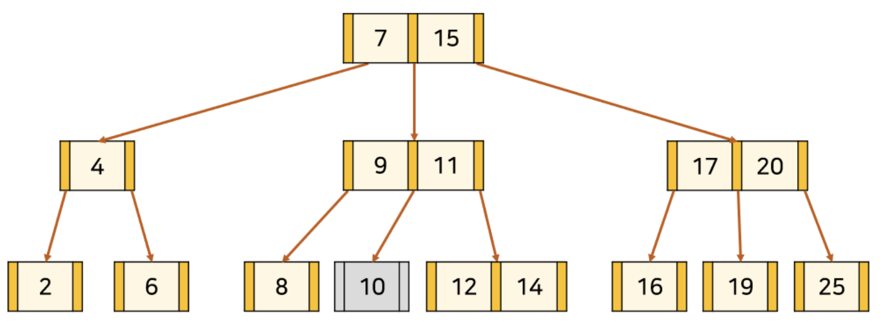
    

    이미지 출처 : [https://rebro.kr/169](https://rebro.kr/169) 10삭제 예시
    
    - 삭제 완료 후
    

    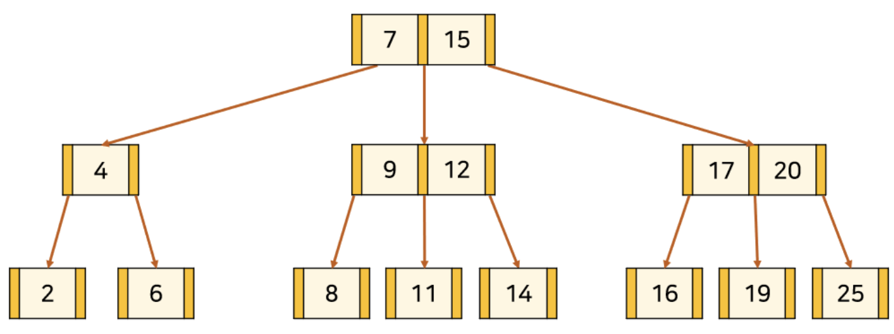
    

    이미지 출처 : [https://rebro.kr/169](https://rebro.kr/169) 10삭제 예시
        
    
    c. 현재 노드와 왼쪽, 오른쪽 형제 노드의 key 수가 최소이고, 부모 노드의 key 수가 최소보다 큰 경우
    
    

    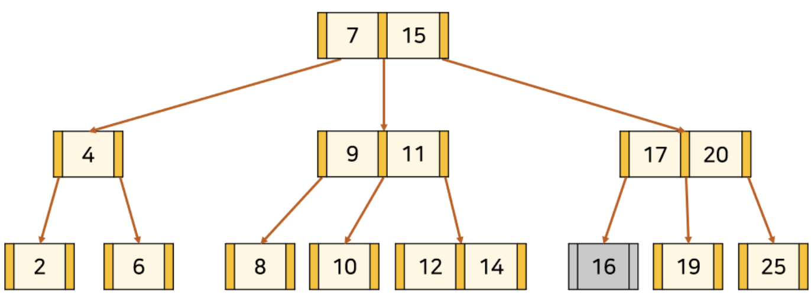
    

    이미지 출처 : [https://rebro.kr/169](https://rebro.kr/169) 10삭제 예시
    
    d. 현재 노드와 왼쪽, 오른쪽 형제 노드, 부모 노드 모두 key 수가 최소인 경우
    
    부모 모드가 루트인 경우 서브트리의 높이가 줄어들기 때문에 트리의 재구조화가 필요하다.
    
    2-2와 동일.
    
2. 삭제할 key가 리프 노드를 제외한 노드에 있는 경우
    
    a. 현재 노드 또는 자식 노드의 key 수가 최소보다 큰 경우
    
    

    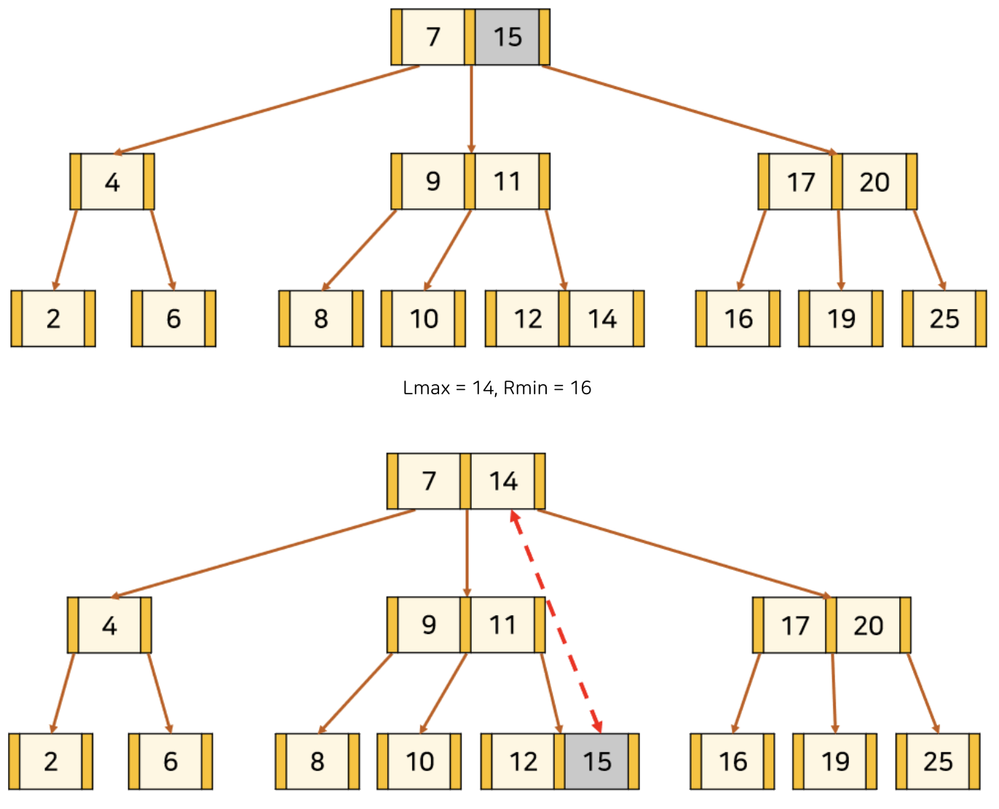
    

    이미지 출처 : [https://rebro.kr/169](https://rebro.kr/169) 15삭제 예시
    
    b. 현재 노드와 자식 노드 모두 key 수가 최소인 경우
    
    

    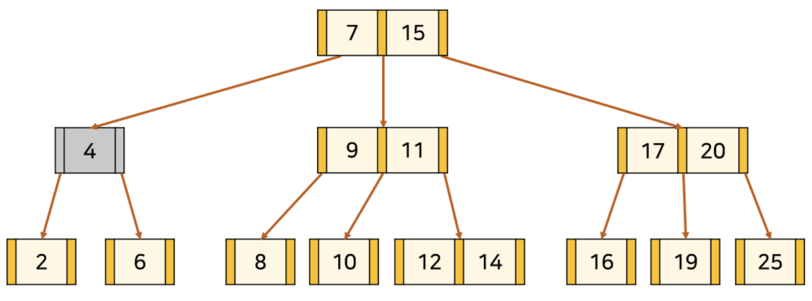
    

    이미지 출처 : [https://rebro.kr/169](https://rebro.kr/169) 4삭제 예시
    
    - 삭제 완료 후
    
    

    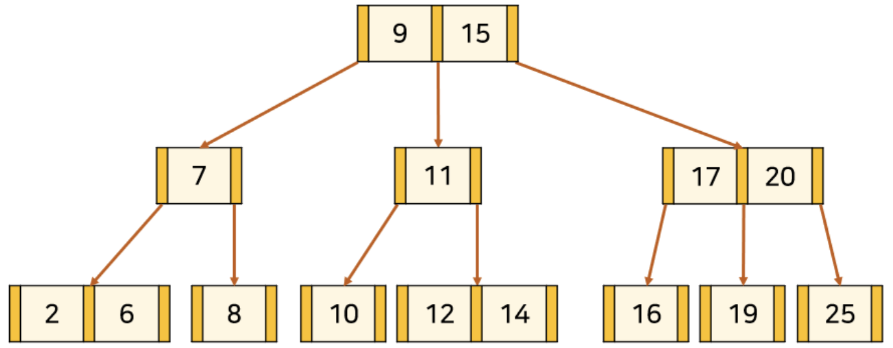
    

    이미지 출처 : [https://rebro.kr/169](https://rebro.kr/169) 4삭제 예시
        
    

## B+tree

B tree를 확장한 것으로 leaf node에만 데이터를 가지고 있고 나머지 노드들은 데이터를 위한 key만을 갖는다.

### 특징

1. 오직 리프노드에만 데이터 저장 가능
2. 리프 노드를 제외하고 데이터를 담아두지 않기 때문에 메모리를 더 확보함으로써 더 많은 key들을 수용할 수 있다. 하나의 노드에 더 많은 key들을 담을 수 있기 때문에 트리의 높이가 낮아진다.(chahe hit 높아짐.)
3. 중복된 키를 가질 수 있다.
4. 리프 노드끼리 링크드리스트로 연결되어 있다. 
5. 풀 스캔 시, B+tree는 리프노드에 데이터가 모두 있기 때문에 한 번의 선형탐색만 하면 되기 때문에 B tree에 비해 빠르다.
    
    

    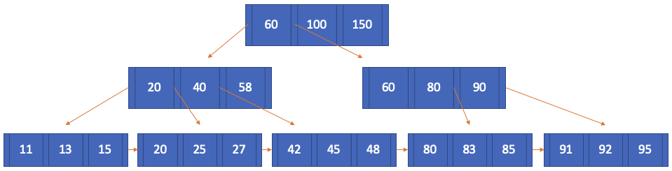
    

    
    ### 삽입
    
    **(1) key의 수가 최대보다 적은 leaf node에 삽입하는 경우**
    
    해당 노드의 가장 앞이 아닌 곳에 삽입되는 경우 단순히 삽입
    
    가장 앞에 삽입되는 경우 해당 노드를 가리키는 부모 노드의 포인터의 오른쪽에 위치한 key로 바꿔준다. 그리고 리프노드끼리 링크드 리스트로 이어줘야 하므로 삽입된 key에 링크드 리스트로 연결한다.
    
    **(2) key의 수가 최대인 leaf node에 삽입하는 경우**
    
    key의 수가 최대이므로 분할을 해야한다. 중간 node에서 분할이 일어나는 경우는 B tree와 동일하다.
    
    리프노드에서 분할이 일어나는 경우 중간 key를 부모 node로 올려주는데 이때, 오른쪽 node에 중간 key를 붙여 분할한다. 그리고 분할된 두 노드를 링크드 리스트로 연결한다.
    
    

    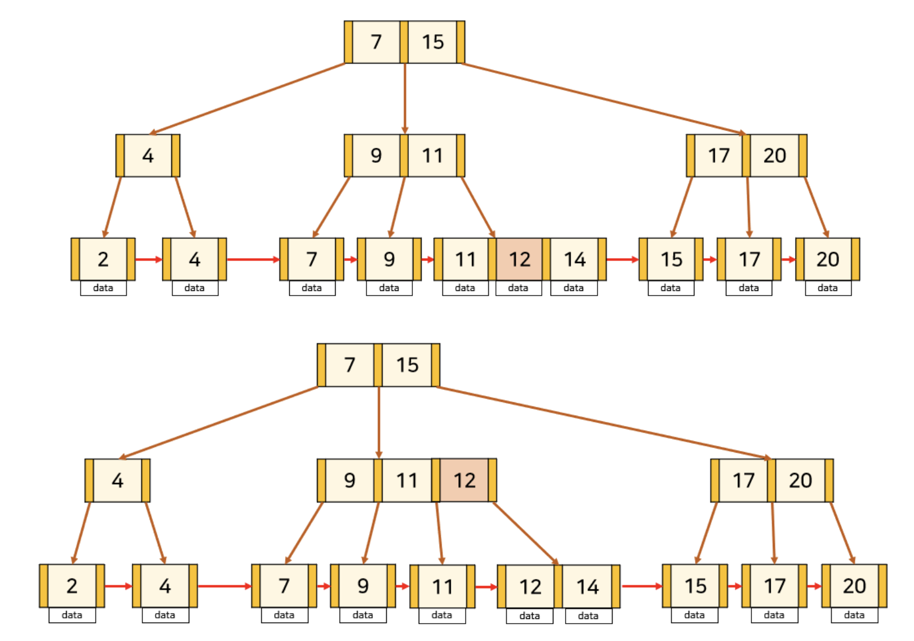
    

    이미지 출처 : [https://rebro.kr/167](https://rebro.kr/167)
    
    ### 삭제
    
    (1) 삭제할 key가 리프노드의 가장 앞에 있지 않은 경우
    
    B tree와 동일하다.
    
    (2) 삭제할 key가 리프노드의 가장 앞에 위치한 경우
    
    리프노드가 아닌 노드에 key가 중복해서 존재한다. 해당 key를 노드보다 오른쪽에 있으면서 가장 작은 값으로 바꿔줘야 한다.
    
    

    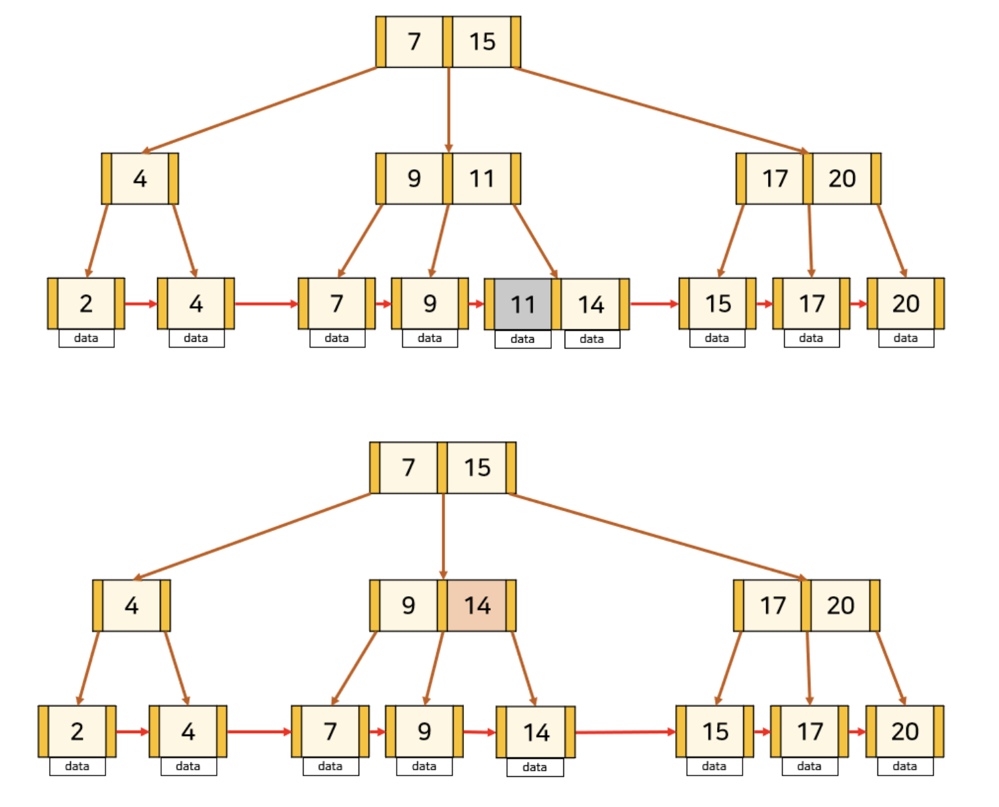
    

    
    이미지 출처 : [https://rebro.kr/167](https://rebro.kr/167)
    
    ### 예상질문
    
    데이터 검색을 할 때 hash table의 시간복잡도는 O(1)이고 B+tree는 O(log n)으로 더 느린데 왜 index는 hash table이 아니라 B+tree로 구현되나요?
    
    ## 답변
    
    Hash table을 사용하면 하나의 데이터를 탐색하는 시간은 O(1)으로 B+tree보다 빠르지만, 값이 정렬 되어 있지 않기 때문에 부등호를 사용하는 query에 대해서는 매우 비효율적이게 되어 데이터를 정렬해서 저장하는 B+tree를 사용한다. 데이터 탐색뿐 아니라 저장, 수정, 삭제에도 항상 O(long n)의 시간 복잡도를 갖는다.
    
    hash index는 등호 연산에만 특화되어 있어 데이터가 조금이라도 달라지면 hash function은 완전히 다른 hash값을 생성하는데, 이러한 특성 때문에 부등호 연산이 자주 사용되는 DB에는 적합하지 않다.
    
    > 참고한 블로그
    [https://rebro.kr/169](https://rebro.kr/169)
    [https://rebro.kr/167](https://rebro.kr/167)
    [https://zorba91.tistory.com/293](https://zorba91.tistory.com/293)
    [https://velog.io/@sem/DB-인덱스-자료-구조-B-Tree](https://velog.io/@sem/DB-%EC%9D%B8%EB%8D%B1%EC%8A%A4-%EC%9E%90%EB%A3%8C-%EA%B5%AC%EC%A1%B0-B-Tree)
    >
