# DB Connection이란?
DB를 사용하기 위해 DB와 애플리케이션 간 통신을 할 수 있는 수단이다

DB Connection은 Database Driver와 Database 연결 정보를 담은 URL을 필요로 한다

Java의 DB Connection은 JDBC를 주로 이용하며, URL 타입을 사용한다

<div align='center'>
    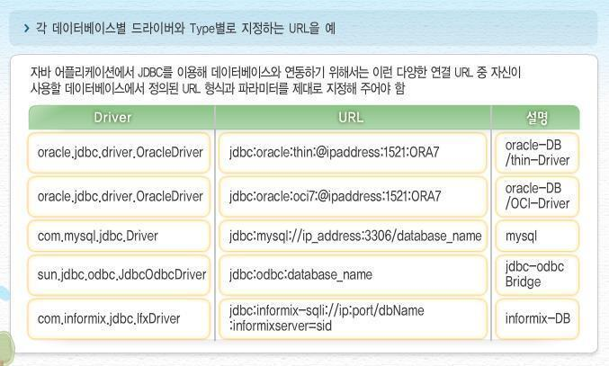
</div>

## DB Connection 구조
- 2Tier : 클라이언트의 자바 프로그램(JSP)가 직접 데이터베이스 서버로 접근하여 데이터를 엑세스 하는 구조

- 3Tier : 자바 프로그램과 데이터베이스 서버 중간에 미들웨어 층을 두어, 그 미들웨어 층에게 비지니스 로직 구현부터 트랜잭션 처리, 리소스 관리 등을 전부 맡기는 구조

## JDBC
JDBC(Java Database Connectivity)란 자바 언어로 다양한 관계형 데이터베이스(RDBMS, Relational Database Management System)에 접속하여 SQL문을 수행하여 처리하고자 할 때 사용되는 표준 SQL 인터페이스 API이다

각각의 DB에는 연결 방식과 통신 규격이 따로 있기에 프로그램을 DB와 연결한다면, 해당 DB와 관련된 기술적 내용을 배우고 DB가 변경될 시 많은 변경 사항이 존재하나 각 DBMS에 맞는 JDBC를 받아들인다면 쉽게 DBMS를 변경할 수 있다

즉, DBMS(MySQL, MsSQL, Oracle 등)에 관계없이 하나의 JDBC API만을 사용하여 데이터베이스 관련 작업을 처리할 수 있다

<div align='center'>
    
</div>

자바 애플리케이션에서 데이터베이스에 접근하기 위해서는 JDBC API를 이용하여 접근해야하며, JDBC API는 JDBC 드라이버를 거쳐 데이터베이스와 통신한다

### JDBC 드라이버란?
자바 프로그램 요청을 DBMS가 이해할 수 있는 프로토콜로 변환해 주는 클라이언트 사이드 어댑터이다

각각의 DBMS는 자신에게 알맞는 JDBC 드라이버를 제공한다

### JDBC 실행과정

<div align='center'>
    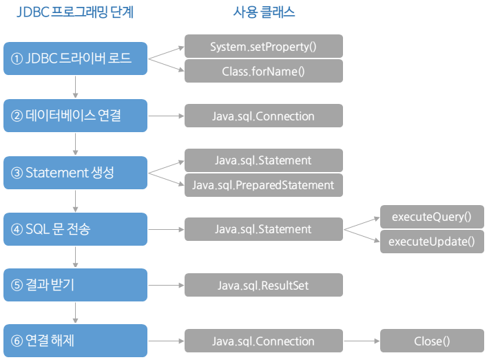
</div>

1. DB 벤더에 맞는 드라이버 로드

2. DB 서버의 IP,ID,PW 등을 DriverManager 클래스의 getConnection() 메소드를 사용하여 Connection 객체 생성

3. Connection에서 PreparedStatement 객체를 받음

4. executeQuery를 수행하고, ResultSet 객체를 받아서 데이터를 처리

5. 사용한 ResultSet, PreparedStatement, Connection을 close함

```
getConnection() : 
DriverManager.getConnection() 메소드는 자바 프로그램과 데이터베이스를 네트워크 상에서 연결하는 메소드

연결에 성공 시 DB와의 연결상태를 Connection 객체로 표현하여 반환함

부하가 가장 많이 걸리는 과정

Connection :
DB 연결 객체

데이터베이스로의 연결 기능 제공, Statement 객체 생성 기능 제공

SQL문을 데이터베이스에 전송하거나, SQL문을 commit/rollback하는데 사용

보통 Connection 하나 당 트랜잭션 하나를 관리함

Statement/PreparedStatement : 
SQL문 실행 객체

ResultSet :
쿼리문 결과 객체

Driver :
각 JDBC Driver 벤더에서 구현해야 하는 인터페이스

DriverManager : 
사용될 드라이버를 등록, 등록 해제 기능과 DB와 연결 기능 수행

```

### Connection Pool

```
Connection conn = null;
PreparedStatement  pstmt = null;
ResultSet rs = null;

try {
    sql = "SELECT * FROM T_BOARD"

    // 1. 드라이버 연결 DB 커넥션 객체를 얻음
    connection = DriverManager.getConnection(DBURL, DBUSER, DBPASSWORD);

    // 2. 쿼리 수행을 위한 PreparedStatement 객체 생성
    pstmt = conn.createStatement();

    // 3. executeQuery: 쿼리 실행 후
    // ResultSet: DB 레코드 ResultSet에 객체에 담김
    rs = pstmt.executeQuery(sql);
    } catch (Exception e) {
    } finally {
        conn.close();
        pstmt.close();
        rs.close();
    }
}
```

위 코드를 통해 우리는 알 수 있는 점은 자바에서 DB로 연결하여 처리하는 경우 JDBC Driver을 로드하고 Connection 객체를 받아와야 한다

즉, 요청이 있을 때마다 JDBC Driver을 로드하고 Connection 객체를 생성하여 연결 및 종료 과정을 거치기에 매우 비효율 적이다

이러한 단점 때문에 Connection Pool을 사용한다

<div align='center'>
    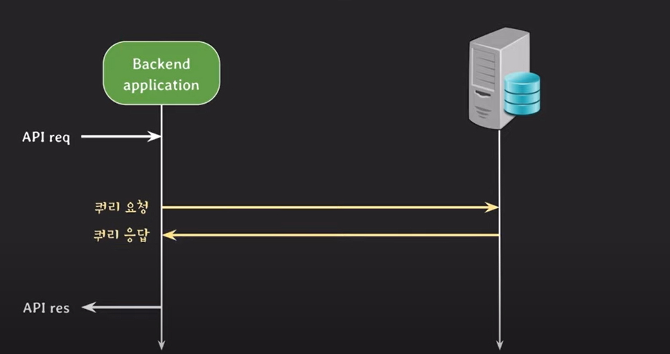
</div>

위 사진과 같이 백엔드 서버와 DB 서버가 존재한다고 가정

백엔드 서버가 API 요청을 받고 DB 데이터 조회 경우 발생

쿼리를 DB로 보내서 데이터를 찾고 쿼리 응답을 한다

처리를 한 다음 API 응답

보통 두 개의 서버는 각각의 컴퓨터에서 수행, 즉 네트워크 통신 과정이다

높은 송수신 신뢰성을 장점으로 한 `TCP` 기반으로 통신한다

TCP는 연결지향적이고 3-way-handshake/4-way-handshake 과정을 통하여 신뢰성을 구축하는 장점이 존재하지만 매번 connection을 열고 닫는 시간적 비용이 발생한다

이를 해결하기 위해 `DBCP(DataBase Connection Pool)`이 등장하였다!

# 데이터베이스 커넥션 풀(DBCP)이란?

<div align='center'>
    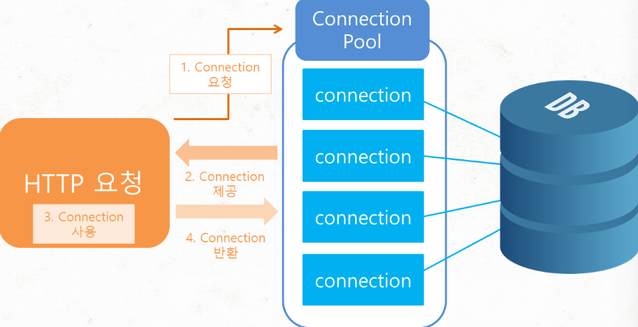
</div>

웹 컨테이너(WAS)가 실행되며 일정량의 Connection 객체를 미리 만들어서(TCP 기반) pool처럼 관리한다

클라이언트 요청이 오면 Connection 객체를 빌려와 쿼리 요청을 보낸다

작업이 끝나면 Connection Pool에 Connection 객체를 반환한다(Close Connection)

이러한 Connectoin Pool을 **DBCP(DataBase Connection Pool)**이라 부른다

## 데이터베이스 커넥션 풀(DBCP) 동작 원리
다양한 DBCP 중 하나인 HikariCP를 예로 설명하겠다

<div align='center'>
    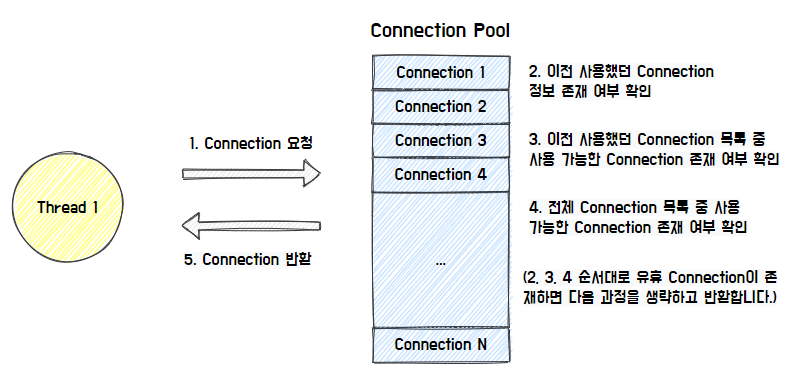
</div>

Thread가 Connection을 요청하면 Connection Pool 방식에 따라 유휴 Connection을 찾아서 반환한다.

Hikari CP의 경우, 이전에 사용한 Connection이 존재한다면, 우선적으로 반환한다

<div align='center'>
    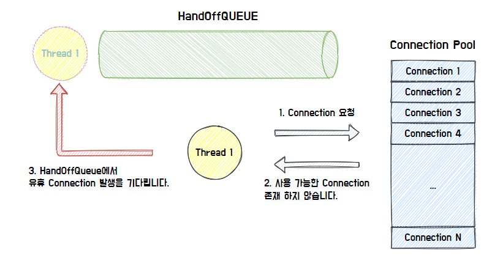
</div>

만약 유휴 Connection 객체가 존재하지 않는다면, HandOffQueue를 Polling 하여 다른 Thread가 Connetion을 반납하기를 기다린다

<div align='center'>
    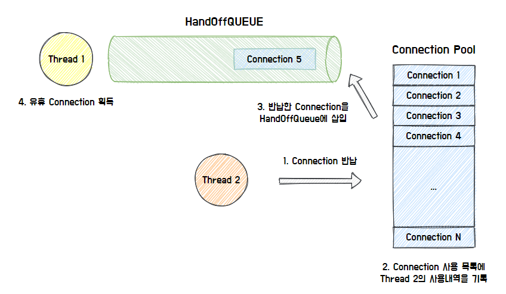
</div>

최종적으로 사용한 Connection을 반납하면 Connection Pool이 Connection 사용 내역 기록, HandOffQueue에 반납된 Connection 삽입한다

이를 통해 HandOffQueue를 Polling하던 Thread는 Connection을 획득하고 작업을 계속한다

## 데이터베이스 커넥션 풀(DBCP) 장점
- DB 접속 설정 객체를 미리 만들어 연결하여 메모리 상에 등록하기에 커넥션 생성 및 삭제 과정이 사라져 클라이언트가 빠르게 DB에 접속이 가능하다

- DB Connection 수를 제한할 수 있어 과도한 접속으로 인한 서버 자원 고갈 방지 가능

- DB 접속 모듈을 공통화하여 DB 서버의 환경이 바뀌어도 쉬운 유지 보수 가능

- 연결이 끝난 Connection을 Connection Pool에서 재사용함으로써 새로 객체를 만드는 비용 줄임

## 데이터베이스 커넥션 풀(DBCP) 설정 방법
DB는 MySQL를 예로 들어 설명, DBCP는 SpringBoot 2.0부터 들어간 HikariCP로 설명

DB connection은 BackendServer와 DB서버 사이의 연결을 의미하기에 설정 방법을 잘 알고 있어야한다

### DB 서버 설정방법

MySql에는 중요한 두 가지 파라미터 존재

1. max_connections : client와 맺을 수 있는 최대 connection 수 

>max_connections 수가 4, DBCP의 최대 connection 수가 4라면 max_connections가 어떤 영향을 미칠까?

dbserver입장에서는 max_connections수 만큼 connection을 맺고 있다고 가정해보자

<div align='center'>
    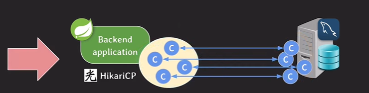
</div>

이러한 상황에서 backendserver에서 트래픽이 많이 왔다고 가정

DB 서버로 가는 요청이 증가, 즉, Connection 회전율 속도 증가

트래픽이 증가하면 CPU 및 메모리 사용량 증가함에 따라 backendserver의 connection pool의 connections도 모두 사용하고 backendserver 자체의 resource도 모두 사용하며 과부하 발생 가능

트래픽을 분산시키기 위해 서버를 하나 더 늘리자! 라고 결정

<div align='center'>
    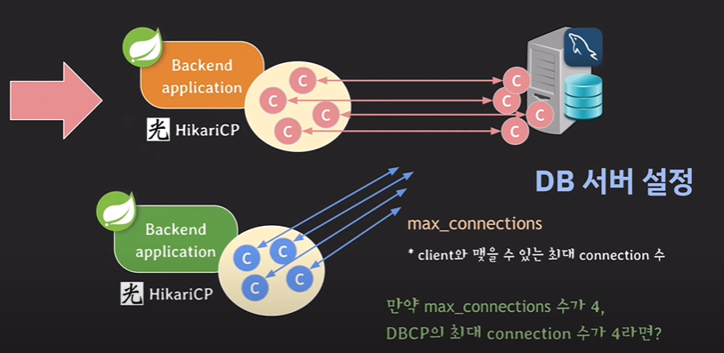
</div>

새로운 backendserver는 이미 맺을 수 있는 connections만큼 다 맺었기 때문에 새로운 서버가 맺고싶어도 맺을 수 없다

2. wait_timeout : connection이 inactive(놀고있는 상황)할 떄 다시 요청이 오기까지 얼마의 시간을 기다린 뒤에 close 할 것인지를 결정

<div align='center'>
    
</div>

>예로 db서버의 한 connection이 열려있지만 놀고있는 상태, 즉 idle한 상태라 가정해보자

정상적으로 backend서버에서 종료 요청이 온다면 절차를 걸쳐 종료가 가능하겠지만 만약 `비정상적인 connection 종료, 혹은 connection을 다 쓰고 반환이 안됨(버그), 네트워크 단절 등으로 인한 이상현상`이 발생한다면?

db서버 입장에서는 이 connection이 정상적으로 열려있는 상태라 생각한다.

TCP 동작 특성상, 요청을 기다리고 있기에 하염없이 열려있는 상태로 기다리는 중이다

이러한 상황이 증가하면 resource 사용 증가 -> 악영향
이기 때문에 wait_timeout이 사용됨

만약 wait_timeout설정보다 먼저 요청이 온다면, 요청을 처리하고 다시 시간 count!

### DBCP 설정
HikariCP 기준으로 설명하겠다

1. minimumidle : pool에서 유지하는 최소한의 idle connection 수

connection이 연결되었지만 아무런 일을 하지 않는 유휴자원의 수를 결정하는 파라미터이다

2. maximumPoolSize : pool이 가질 수 있는 최대 connection 수

여기서 최대 connection은 idle과 active(in-use) connection 합쳐서 최대 수를 의미

만약 DBCP 설정에서 idle connection 수가 minimumidle 보다 작고 전체 connection 수도 maximumPoolSize 보다 작다면 신속하게 추가로 connection을 만든다

>만약 minumumidle이 2, maximumPoolSize가 4라면?

<div align='center'>
    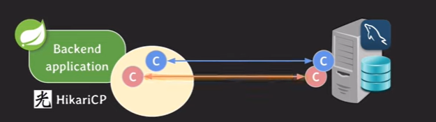
</div>

요청이 들어와 하나의 connection이 사용되고 있다고 가정
이 순간에 minimumidle이 1이 된다 

하지만 minimumidle의 수를 2로 지정했기 때문에 하나의 connection을 더 늘려준다 

계속 트래픽이 들어와 idle connection이 1이 된 경우, connection을 늘려준다

connection pool에서 사용되고 있는 connection이 3개이고 idle connection의 수가 1개인 경우 minimumidle 수보다 작지만 maximumPoolSize가 4이기에 추가 불가!

이러한 의미 때문에 maximumPoolSize의 우선순위가 minimumidle보다 높다는 의미이다

이렇게 동작하다 트래픽이 들어오지 않으면 요청을 처리한 connections들이 다시 pool로 돌아온다

이렇게 되면 idle connection의 수가 4가 된다

하지만 설정에서 minimumidle의 수를 2로 지정했기에 2개의 connection을 끊어줘야한다

**권장사항!**
minimumIdle의 default 값은 maximumPoolSize와 동일(==pool size 고정) 따로 설정하지 말자

pool size를 고정하는 이유는 만약 minimumIdle의 수를 maximumIdle의 수보다 작게 설정한 경우, 트래픽이 증가하여 connection을 증가시켜줘야하는데 이는 앞서 말한 TCP의 단점이다. 

또한 connection이 생성되는 속도보다 트래픽이 더 빨리 밀려온다면 이 때는 backendserver 응답이 느려진다. 이에 poolsize를 고정!

3. maxLifetime : pool에서 connection의 최대 수명
maxLifetime을 넘기면 idle일 경우 pool에서 바로 제거, active인 경우 pool로 반환된 후 제거

만약 dbcp size를 4로 고정했다면 제거를 한 경우 3으로 바뀌지 않고 바로 새로운 connection을 생성하여 추가한다

<div align='center'>
    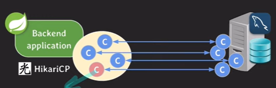
</div>

**중요 포인트!**
pool로 반환이 안되면 maxLifetime 동작 안함

**권장 사항!**
maxlifetime 설정 시 db connection time limit보다 몇 초 짧게 설정해야한다

4. connectionTimeout : pool에서 connection을 받기 위한 대기 시간. 즉, backend서버로 요청이 들어왔을 때 요청을 처리하기하다가 dbserver로 접근할 일이 발생하였을 때 connectionPool에서 connection을 받아야하는데 이 때 소요되는 시간을 의미

<div align='center'>
    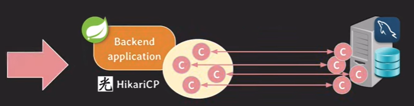
</div>


>만약 connectionTimeout이 30초라면 어떻게 동작할까?

평상시에는 idle connection을 사용하겠지만 트래픽이 급증하여 백엔드서버 cpu도 사용, connection pool의 connection도 모두 사용. 

하지만 사용가능한 connection이 없다. 회전이 되니 기다리다보면 요청을 처리하기 위한 connection이 돌아오겠지만 또다른 요청은 기다리다 30초를 넘길 수 있다. 

이 때 connectionTimeout이 발동하며 exception 뱉는다. 또한 무한정 기다릴 수 없기에 사용되는 파라미터이다. 

---

### 📢 면접 질문
1. Connection Pool 이란?
2. Connectoin Pool을 왜 쓰는가?
3. 실시간 통신과 Pool 사용시 차이가 무엇인가?

---

## References
- https://d2.naver.com/helloworld/5102792
- https://brownbears.tistory.com/289