# ERD
ERD(Entity Relationship Diagram)는 요구 분석 사항에서 얻은 엔티티와 속성들의 관계를 그림으로 나타낸 개체-관계 모델이다

테이블과의 관계를 설명하는 다이어그램이며, 이를 통해 프로젝트에서 사용하는 데이터베이스의 구조를 한눈에 파악할 수 있다

데이터베이스를 구축 시 뼈대 역할을 하며, 서비스 구축 시 제일 먼저 신경써야 할 부분이다

이를 통하여 API를 보다 효율적으로 뽑아낼 수 있다

ERD의 역사

1970년도에 데이터 모델링이 이미 필수적으로 자리를 잡았지만, 데이터베이스 모델 또는 비지니스 프로세스에 대한 표준이 없었다

많은 모델들이 제시되고 논의를 거쳤지만, 표준으로 삼을만큼 널리 채택된 것은 없었다

Peter Chen은 그의 논문 `The Entity Relationship Model-Toward a Unified View of Data` 에서 널리 채택된 ER 모델을 소개하여 공로를 인정받았다

엔티티와 그 관계에 중점을 두었고 데이터베이스 디자인을 위한 다이어그램 표현도 도입했다

그의 모델은  Charles Bachman의 데이터 구조 다이어그램에서 영감을 받았다.

ER 다이어그램의 초기 형태 중 하나인 Bachman 다이어그램은 그 이름을 따서 명명되었다

관심이 있다면 아래 링크를 통해 ER 다이어그램의 자세한 역사를 확인할 수 있습니다
- https://www.dataversity.net/a-short-history-of-the-er-diagram-and-information-modeling/

## ERD 사용법

### 1) 데이터베이스 모델링
관계형 데이터베이스에서 주로 널리 사용된다

엔티티와 속성들을 테이블과 컬럼들로 변환할 수 있다

테이블들과 관계들을 시각화 할 수 있기 때문에 설계 문제점을 파악 가능하다

### 2) 소프트웨어 엔지니어링
소프트웨어 계획 단계에서 사용된다

서로 다른 시스템 요소와 서로 간의 관계를 식별하는데 도움이 된다

data flow diagram의 기초로써 종종 사용된다

## ERD 그리기

### 엔티티(Entity)
엔티티는 정의 가능한 사물 또는 개념을 의미한다

사람도 될 수 있으며 프로필, 도서정보와 같은 무형의 정보도 데이터화가 가능하다

`데이터베이스의 테이블`이 엔티티로 표현된다고 보면 된다

예를 들어 학생 엔티티는 아래의 그림과 같이 표현된다

    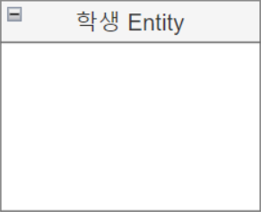

### 엔티티 속성(Entity Attribute)
엔티티에서는 개체가 가지고 있는 속성(Attribute)를 포함한다

예를 들어 학생 엔티티에는 학번, 이름, 주소, 전공 등 속성이 있다

`데이터베이스의 테이블의 각 필드(컬럼)` 들이 엔티티 속성이라고 보면 된다

    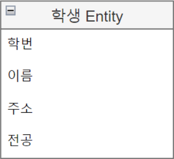

### 엔티티 도메인(Entity Domain)
도메인은 속성의 값, 타입, 제약사항 등에 대한 값의 범위를 표현하는 것이다

사용자 기호에 따라 속성 타입만 그릴수도 있고, 가독성을 위해 생략도 가능하다

데이터 타입을 명시할 때, 데이터베이스가 지원하는 타입에 맞게 작성해야한다

    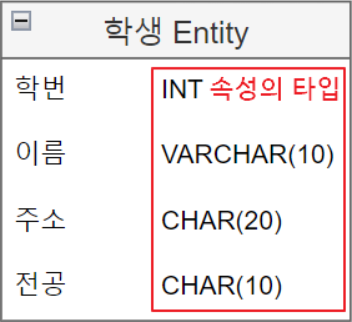

## 엔티티 분류
엔티티는 저장하는 데이터 정보 주제에 따라 종류가 나뉜다

고객 정보같은 물리적인 형태의 정보와 구매 이력같은 무형적이고 개념적인 정보가 있다

|구분|내용|
|---|---|
|유형 엔티티|물리적인 형태 (예: 고객, 상품, 거래처, 학생, 교수 등)|
|무형 엔티티|물리적인 형태가 없고 개념적으로만 존재하는 엔티티 (예: 인터넷 장바구나, 부서 조직 등)|
|문서 엔티티|업무 절차상에서 사용되는 문서나 장부, 전표에 대한 엔티티 (예: 거래명세서, 주문서 등)|
|이력 엔티티|업무상 반복적으로 이루어지는 행위나 사건의 내용을 일자별, 시간별로 저장하기 위한 엔티티 (예: 입고 이력, 출고 이력, 구매 이력 등)|
|코드 엔티티|무형 엔티티의 일종으로 각종 코드를 관리하기 위한 엔티티 (예: 국가코드, 각종 분류 코드)|

다음은 학생 엔티티에 학생별 취미를 표현하는 엔티티를 추가하였다. 학생 엔티티는 유형 엔티티에 속하며, 학생별 취미는 무형 엔티티에 속한다.

    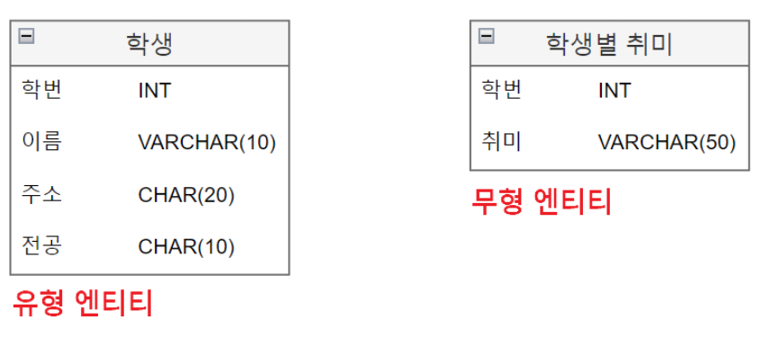

## ERD 엔티티 관계 표시법

|항목|식별자 관계|비식별자 관계|
|---|---|---|
|목적|강한 연결관계 표현|약한 연결관계 표현|
|자식 주식별자 영향|자식 주식별자의 구성에 표함됨|자식 일반 속성에 포함됨|
|표기법|실선 표현|점선 표현|
|연결 고려사항|반드시 부모 엔티티 종속, 자식 주식별자 구성에 부모 주식별자 포함 필요, 상속받은 주식별자 속성을 타 엔티티에 이전 필요|약한 종속관계, 자식 주식별자 구성을 독립적으로 구성, 자식 주식별자 구성에 부모 주식별자 구분 필요, 상속받은 주식별자 속성을 타 엔티티에 차단 필요, 부모쪽의 관계참여가 선택관계

### 식별자 관계
실선으로 표현

부모 자식 관계에서 자식이 부모의 주 식별자(PK)를 외래 식별자(FK)로 참조하여 자신의 주 식별자로 설정

    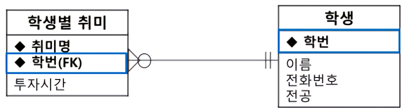

### 비식별자 관계
점선으로 표현

부모 자식 관계에서 자신이 부모의 주 식별자를 외래 식별자로 참조해서 일반 속성으로 사용

    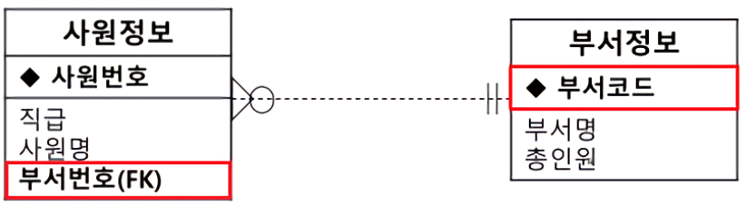

## ERD Notation

    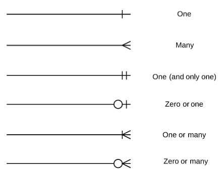

### 1) One
일대일 혹은 일대다 관계

주로 하나의 외래키가 걸린 관계

### 2) Many
다대다 관계

중계 테이블을 통하여 여러개의 데이터를 바라보고 있을 때 사용

### 3) One(and only One)
일대일 관계이나, 하나의 row 끼리만 연결된 데이터

### 4) Zero or one
일대일 혹은 일대다 관계를 가지고 있으나 필수 조건이 아님을 의미

### 5) One or Many
일대일 혹은 다대다 관계를 가지고 있음을 의미

관계를 가지고 있으나, 참조되는 row값들이 불명확함을 의미

### 6) Zero or Many
참조하는 테이블과의 관계가 불명확한 경우

장바구니처럼 row 생성값이 없을수도, 하나일수도, 여러개일수도 있는 경우

## ERD 관계 참여도
관계선 각 측 끝자락에 기호를 표시

`|` 표시가 있는 곳은 필수적으로 존재해야 하는 개체

`O` 표시가 있다면 없어도 되는 개체

    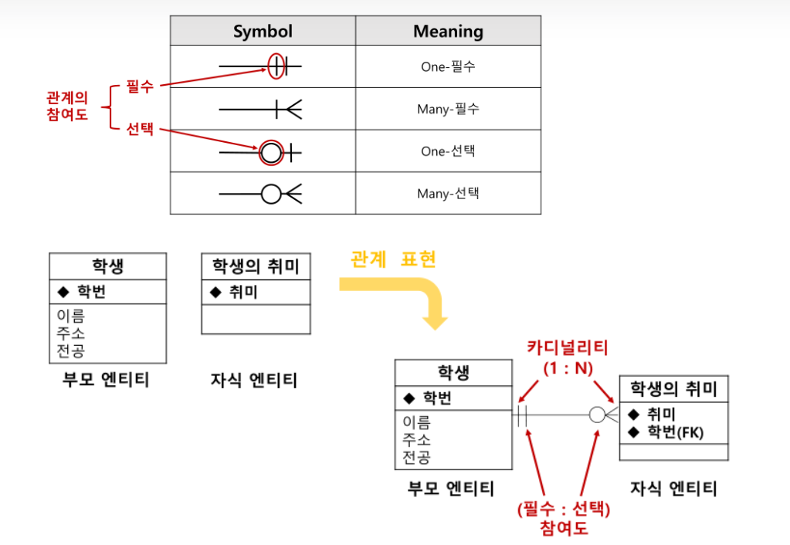

## ERD 관계 카디널리티
> Cardinality는 한 개체에서 발생할 수 있는 발생 횟수를 정의하며, 다른 개체에서 발생가능한 발생 횟수와 연관됨

대표적인 카디널리티는 다음과 같다

1. 1 대 1 대응(One to One)
2. 1 대 다 반응(One to Many)
3. 다 대 1 반응(Many to One)
4. 다 대 다 반응(Many to Many)

위의 카디널리티를 따라 선을 막 긋는다면, 가독성이 안좋아지며 표가 더러워지는 단점이 존재한다

이에 ERD에서는 선 끝 모양을 다르게 표시하여 가독성을 높이는 방법을 따른다

### One-to-One Cardinality
학생과 학생의 신체정보는 1:1로 매칭된다

한명의 학생은 하나의 신체정보를 가지고 있기 때문이다

    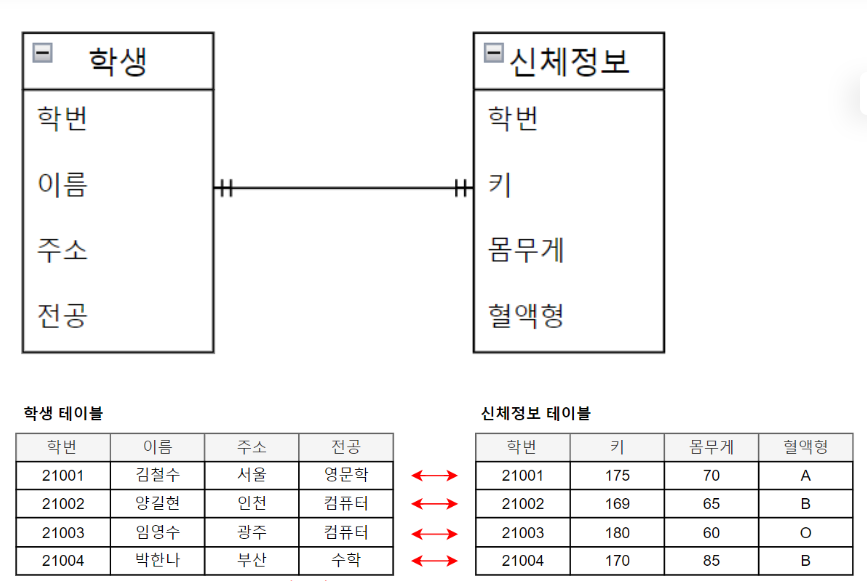

### One-to-Many Cardinality
한명의 학생은 여러개의 취미를 가질 수 있다

    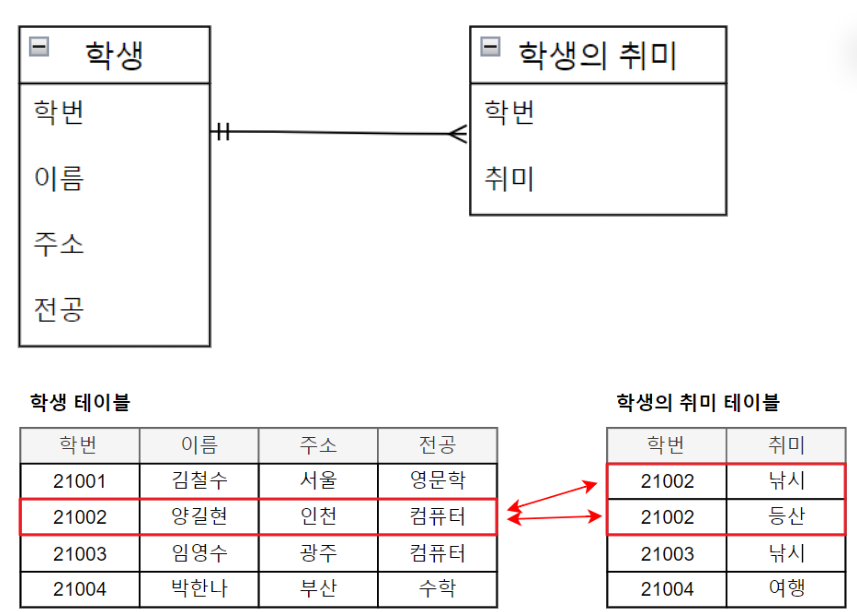

### Many-to-Many Cardinality
제품 엔티티에서 바라보았을 때, tv 제품은 여러 제조업체들을 가질 수 있다

냉장고, 세탁기도 마찬가지이다

제조업체 엔티티 입장에서 삼성 제조업체는 세탁기뿐만 아니라 MP3와 같은 다른 물건도 제조한다

따라서 제품과 제조업체 관계는 다 대 다 관계이다

    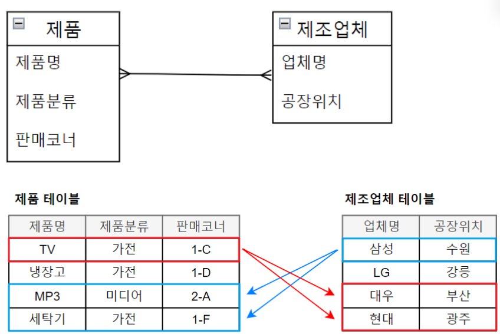

그런데, 데이터 모델링에서는 M:N 관계를 완성되지 않은 모델로 간주하여 두 엔티티의 관계를 1:N, N:1로 조정하는 중간 엔티티를 두는 작업이 필요하다

    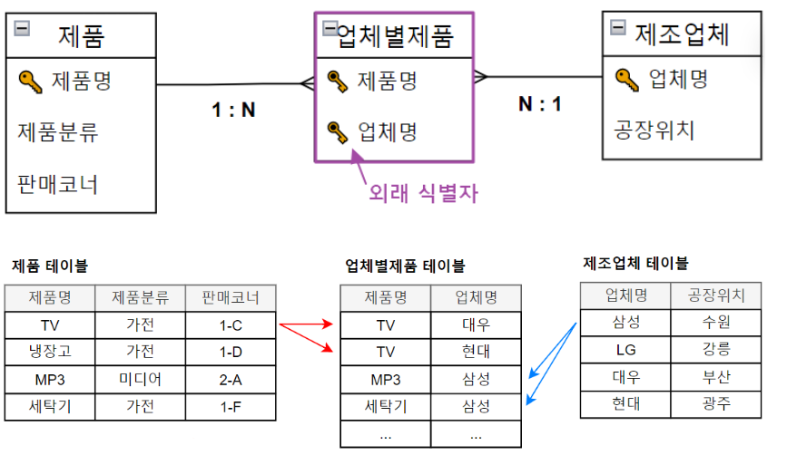

# 정규화 과정
정규화를 수행한다는 것은 데이터를 결정하는 `결정자`에 의해 `함수적 종속`을 가지고 있는 일반 속성을 의존자로 하여 입력/수정/삭제 이상현상을 제거하는 것이다

데이터의 중복 속성을 제거하고 결정자에 의해 동일한 의미의 일반 속성이 하나의 테이블로 집약되므로 한 테이블의 데이터 용량이 최소화 되는 효과가 있다

정규화된 테이블은 데이터를 처리할 때 속도가 빨라질수도 혹은 느려질수도 있는 특성을 가지고 있다

> 함수적 종속성(FD: Functional Dependency) : 테이블의 특정 컬럼 A의 값을 알면 다른 컬럼 B 값을 알 수 있을 때, 컬럼 B는 컬럼 A에 함수적 종속성이 있다고 함

> 결정자(Determinant) : 함수적 종속성 설명에서, 컬럼 A를 결정자라고 함

> 다치종속(MVD: MultiValued Dependency) : 결정자 컬럼 A에 의해 컬럼 B의 값을 다수 개 알 수 있을 때 컬럼 B는 컬럼 A에 다치종속 되었다고 함

    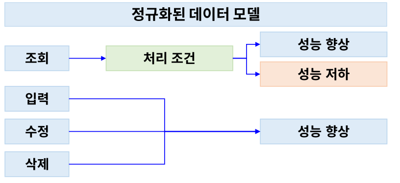

정규화된 데이터 모델은 조회 시 처리 조건에 따라 성능이 향상 혹은 저하 된다

정규화된 데이터 모델은 입력/수정/삭제 시 무조건 성능이 향상된다

### 정규화 효과 및 장점
상호 종속성이 강한 데이터 요소들을 분리, 독립된 개념(엔티티, 테이블)으로 정의하게 됨에 따라 High Cohesion & Loose Coupling 원칙에 충실해지며 이로 인해 유연성이 극대화됨

> High Cohesion & Loose Coupling : 응집도가 높은 모듈(기능단위)은 프로그램 전체에서 담당하는 기능을 수행하는 것에 있어서는 다른 모듈과의 상호작용이 거의 없이도 단일 기능을 수행할 수 있게된다

## 정규화 이론
1. 1차 정규화: 함수종속, 복수의 속성값을 갖는 속성을 분리, 속성의 원자성 확보
2. 2차 정규화: 함수종속, 주식별자에 완전 종속적이지 않은 속성의 분리, 부분종속 속성(Partial Dependenty Attribute)를 분리
3. 3차 정규화: 함수 종속, 일반 속성에 종속적인 속성의 분리, 이전종속 속성(Transitive Dependenty)의 분리
4. 보이스-코드 정규화: 함수종속, 결정자 안에 함수종속을 가진 주식별자 분리
5. 4차 정규화: 다가 종속(Multi-Valued Dependency) 속성 분리
6. 5차 정규화: 결합 종속(Join Dependency)일 경우는 두 개 이상의 N개로 분리

### 1) 제 1 정규형
- 모든 속성은 원자 값을 가져야 함
- 다중 값을 가질 수 있는 속성은 분리되어야 함

아래는 위반 사례이다

    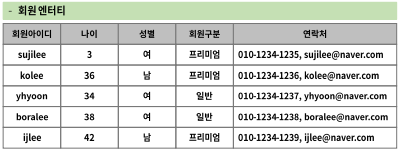

위반 해소

    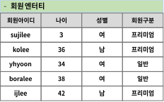
    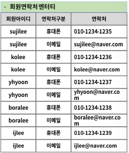

### 2) 제 2 정규형
- 제 1 정규형을 만족하고 모든 Non-Key 컬럼은 기본 키(PK) 전체에 종속되어야 함
- 기본 키에 종속적이지 않거나 기본 키 일부 컬럼(들)에만 종속적인 컬럼은 분리되어야 함

아래는 위반 사례이다

    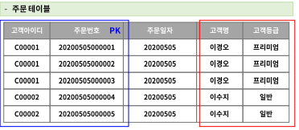

위반 해소

    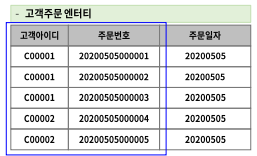
    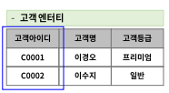

### 3) 제 3 정규형
- 제 2 정규형을 만족하고 일반 속성들간에도 종속관계가 존재하지 않아야 함
- 일반 속성들 간 종속관계가 존재하는 것들은 분리되어야 함

아래는 위반 사례이다

    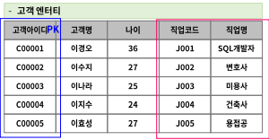

위반 해소

    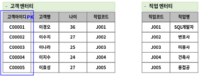

---

### 📢 면접 질문
1. 데이터베이스에서 다양한 유형의 관계를 설명해 주세요
    - 일대일, 일대다, 다대다 관계를 정의
2. 정규화는 무엇이며 이의 장점에 대해 설명해 주세요
3. ER 모델은 무엇인지 설명해 주세요

---

### 📌 References
- https://taehoon9393.tistory.com/42
- https://boyboy94.tistory.com/2
- https://congsoony.tistory.com/240
- https://choiseungyoun.github.io/posts/what-is-erd/

