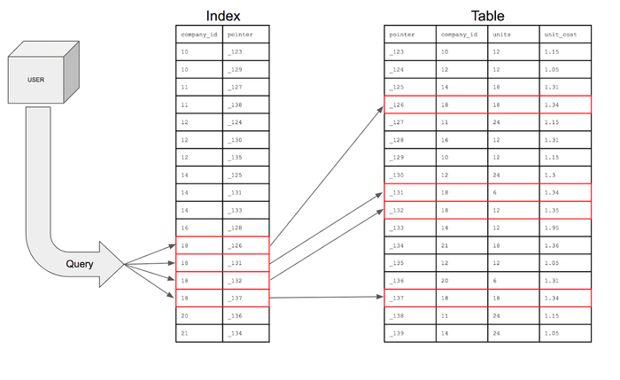
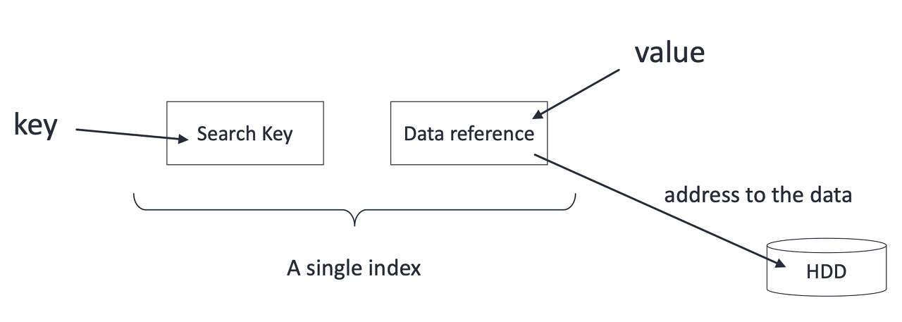
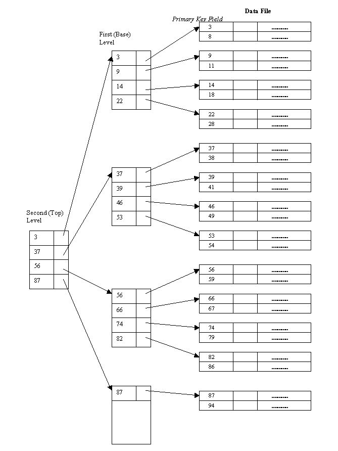
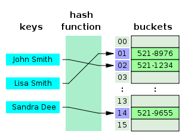
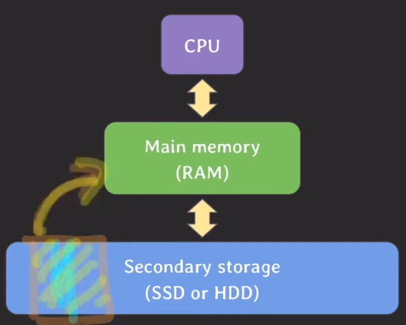
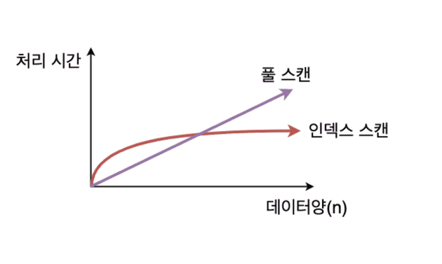
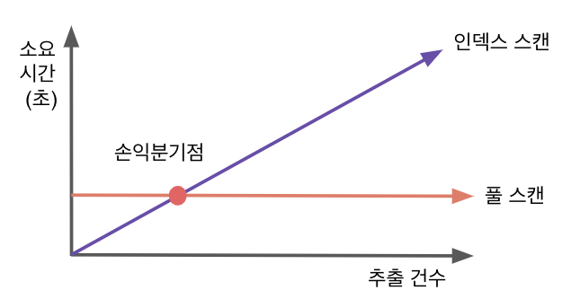
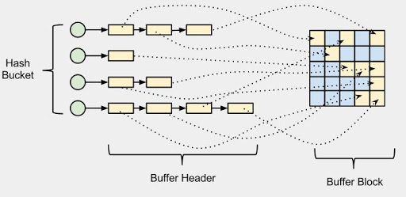

> [해당 포스팅](https://hello-judy-world.tistory.com/198)에서도 내용을 확인할 수 있습니다.

> written by [judy](https://github.com/ParkJungYoon)

## 🔖  인덱스 (index)

> 추가적인 쓰기 작업과 저장 공간을 활용하여 데이터베이스 테이블의 **검색 속도를 향상**시키기 위한 자료구조

즉, index는 데이터의 주소값을 저장하는 별도의 특별한 자료 구조이다. index를 활용해서 빠르게 원하는 데이터를 찾을 수 있다.


<div align='center'>
    <br>
    <a href="https://chartio.com/learn/databases/how-does-indexing-work/">출처: How Does Indexing Work (Posted by Tim Miller)</a>
</div>

<br>

### ✔️ Point 1 : DB 테이블에 인덱스(index)가 필요한 이유

### 🧐 만약 table에 index를 걸지 않으면 어떻게 될까?

```sql
SELECT *
FROM customer
WHERE first_name = "Jeongyoon";
```

원하는 데이터를 찾고 싶을 때 table 전체를 `full scan` 해야 한다. 

즉, first_name에 index가 걸려있지 않다면 "Jeongyoon"을 찾기 위해서는 모든 데이터를 하나씩 확인해야 한다.

> `full scan(=table scan)` : row를 하나하나씩 모두 확인하는 것을 의미 <br>
`시간복잡도` : **O(N)**

full scan은 시간이 오래 걸리기 때문에 서비스에 좋지 않은 영향을 끼친다.

<br>

### 🤔 만약 index가 걸려있다면?

> `시간복잡도` : **O(logN)** (B-tree based index)

index의 자료구조에 대해서는 조금 뒤에 자세하게 살펴보자.

<br>

### 💡 index를 쓰는 이유
 
- 조건을 만족하는 튜플(들)을 **빠르게 조회**하기 위해서!
- 빠르게 정렬(`order by`)하거나 그룹핑(`group by`)하기 위해서!

<br>

### [ 인덱스 설정 : MySQL ]

### 1. 이미 테이블과 데이터가 존재하는 경우

다음과 같은 테이블이 있다고 가정하자.

```sql
CREATE TABLE PLAYER (
  id INT PRIMARY KEY, 
  name VARCHAR(255) NOT NULL,
  team_id INT NOT NULL, 
  back_number INT NOT NULL
);
```

그리고 다음과 같은 두 가지 쿼리문이 있다.

```sql
SELECT * FROM player WHERE name = "Sonny";
SELECT * FROM player WHERE team_id = 105 and back_number = 7;
```

이때 이렇게 index를 생성할 수 있다.

두 번째 쿼리문의 index는 player 테이블에 각 데이터를 유니크하게 식별할 수 있어 UNIQUE INDEX로 생성했다.

```sql
-- single column index
CREATE INDEX player_name_idx ON player (name);
-- multi column index
CREATE UNIQUE INDEX team_id_back_number_idx ON player (team_id, back_number);
```

### 2. 테이블 생성 시 index 생성

```sql
CREATE TABLE PLAYER (
  id INT PRIMARY KEY, 
  name VARCHAR(255) NOT NULL,
  team_id INT NOT NULL, 
  back_number INT NOT NULL,
  INDEX player_name_idx (name),
  UNIQUE INDEX team_id_back_number_idx (team_id, back_number)
);
```

* `참고`: 대부분의 RDBMS는 primary key에는 index가 자동으로 생성된다.

<br>

### [ Multi Column Index ] 

### 1) 고려사항

위의 예시에서 multi column index를 생성했다.

```sql
-- multi column index
CREATE UNIQUE INDEX team_id_back_number_idx ON player (team_id, back_number);
```

🧐 어떤 경우에 **multi column index** 생성을 고려해야 할까

🙋‍♀️💡 WHERE절에서 AND 연산자에 의해 **자주 같이 질의되는 칼럼**인 경우

- `WHERE team_id = 105 and back_number = 7`
- 만약 team_id에만 index가 걸려있다면 team_id가 105인 데이터 중에서 back_number를 찾는 것은 team_id=105은 데이터들 중에서 `full scan`이기 때문에 index 설정을 고려해봐야 한다.

<br>

🧐 어떻게 **정렬**될까

🙋‍♀️💡index를 생성할 때 **칼럼의 순서에 따라** 정렬된다. 

현재 예시에서는 **INDEX(team_id, back_number)** 순으로 index가 걸려있다.

<br>

🧐 만약 `WHERE back_number=7` 조건문이 들어오면 성능은 어떨까?

🙋‍♀️💡현재 **multi column index**는 우선 team_id를 기준으로 정렬되어 있다. 그래서 성능이 full scan과 같거나 더 좋지 않을 수도 있다.

- 그래서 이럴 경우에는 **back_number만 single column index**를 생성하여 조회하거나 인덱스를 타지 않는 방법이 있다.
- 따라서, multi column index를 생성할 때 **순서에 따라** 성능이 달라질 수 있기 때문에 이 점을 고려하여 개발해야 한다.

<br>

### 2) 장점: Covering Index

위의 예시처럼 **INDEX(team_id, back_number)** 이 걸려있다. 이때 다음과 같은 쿼리가 들어온다.

```sql
SELECT team_id, back_number FROM player WHERE team_id = 5;
```

모든 Attribute를 가져오는 것이 아니라 `team_id, back_number` 두 가지 정보만 가지고 온다. 

그러면 인덱스에서 검색한 이후 **물리적인 데이터 블록을 읽을 필요가 없다.**

<br>

**정리하면,**

- 조회하는 attribute(s)를 index가 모두 cover할 때
- 조회 성능이 더 빠르다.

<br>

다음과 같이 index를 설정해서 검색 속도를 향상시킬 수 있다. 하지만 무조건 index를 설정한다고 해서 검색 속도가 향상되는 것은 아니다.

사용되는 쿼리에 맞춰서 적절하게 index를 설정해야 쿼리가 빠르게 처리될 수 있다.

 

그래서 적절하게 index를 설정하려면 개발자가 **index의 구조와 동작 방식**을 이해하는 것이 중요하다.

<br>

### ✔️ Index 구조

### [ Single-Level Ordered Indexes ]

- 각 엔트리는 `<탐색 키, 레코드에 대한 포인터>`
- 엔트리들은 탐색 키 값의 **오름차순으로 정렬**

<div align='center'>
    <br>
    <p>출처: 경북대학교 컴퓨터학부 수업 자료</p>
</div>

#### 1) Primary index (기본 인덱스) | sparse index

- 탐색 키 값에 따라 정렬된 데이터 파일에 대해 정의
- 탐색 키가 테이블의 `기본 키`(primary key)인 인덱스

> `Dense index`: 모든 key value에 대해 index entry를 준다. 즉, 모든 레코드에 대해 색인을 만든다.

> `Sparse index`: 몇몇 값에 대해서만 entry를 만든다. <u>대부분 기본적으로 sparse index를 사용</u>한다.
Primary index도 sparse index이다.

#### 2) Clustering index (클러스터링 인덱스) | sparse index

- 탐색 키 값에 따라 정렬된 데이터 파일에 대해 정의
- 많은 레코드가 ordering field에 대한 공통된 값을 가질 경우 사용할 수 있다.

#### 3) Secondary index (보조 인덱스) | dense index

- 다른 인덱스를 돕는 보조 인덱스이며 레코드가 어디 위치한지만 알려주는 역할
- 주키가 아니라 보조 키를 이용하여 추가적인 방법으로 원하는 값을 가져올 수 있다.  

<br>

### [ Multi-level Indexes ]

- 인덱스 자체가 큰 경우 인덱스를 탐색하는 시간도 오래 걸릴 수 있다.
- 인덱스 엔트리를 탐색하는 시간을 줄이기 위해서 Single-Level Ordered Indexes를 디스크 상의 하나의 순서 파일로 생각하고, 이것에 대해 다시 인덱스를 정의할 수 있다.
- 가장 상위 단계 인덱스를 **마스터 인덱스**(master index)
- 대부분은 **B+트리**를 사용한다.

<div align='center'>
    
</div>

<br>

### ✔️ Point 2 : 동작 방식 (자료구조)

그럼 index는 어떤 자료구조를 쓰기 때문에 조회가 빠를까. 그리고 항상 조회 성능이 빠를까? 이러한 궁금증을 해소하기 위해 자료구조에 대해서 살펴보자.

DB index에 자주 쓰이는 자료구조는 `B-Tree, B+Tree, Hash Table`이다.

<br>

### B-tree

> `시간복잡도` : O(**logN**)

- B-Tree란 자식 노드가 2개 이상인 트리
- **균형 트리**(Balanced Tree)로서, 최상위 루트 노드에서 리프 노드까지의 거리가 모두 동일

<br>

### ⭐️ B+tree

- B+Tree는 B-Tree를 확장 및 개선한 자료 구조
- 데이터의 빠른 접근을 위한 인덱스 역할만 하는 비단말 노드(not Leaf)가 분리되어 있다.
- 관계형 DB에서 가장 많이 사용한다.

<div align='center'>
    <br>
    <p>출처: 위치백과</p>
</div>

<br>

### Hash Table

> `시간복잡도` : O(**1**)

<div align='center'>
    
</div>

위에 살펴본 B-Tree 보다 빠른 결과를 도출할 수 있다. 그런데 왜 B-Tree 계열을 쓸까

#### [ 단점 ]

- 해시는 등호(=) 연산에만 특화되어 있어 부등호 연산(>, <)이 자주 사용되는 데이터베이스 검색에는 해시 테이블이 적합하지 않다.
    - 즉, `equality` 비교만 가능하고 `range` 비교는 불가능하다.
- multi column index의 경우, 전체 attributes에 대한 조회만 가능하다.
    - 예를 들어, 위의 B-트리 기반의 인덱스에서는 **INDEX(team_id, back_number)** 는 상황에 따라 **team_id 칼럼**만으로 조회를 할 수 있었다.
    - 하지만 hash index는 무조건 두 칼럼 모두 사용해서 조회해야 한다.

<br>

### ✔️  왜 Index로 B tree 계열이 사용될까

### [ Secondary storage (SSD or HDD) ]

<div align='center'>
    
</div>

- 데이터를 처리하는 속도가 가장 느리다.
- 디스크 I/O (특히 랜덤 I/O)가 많이 발생하면 느리다.
- 데이터를 저장하는 용량이 가장 크다.
- **block 단위**로 데이터를 읽고 쓴다.

이때 데이터베이스는 secondary storage에 저장된다.

위의 특징을 고려했을 때 데이터베이스에서 데이터를 조회할 때 secondary **storage에 최대한 적게 접근하는 것이 성능 면에서 좋다.**

(데이터베이스의 I/O 는 디스크를 통해 물리적인 작업을 거치기 때문에)

또한 block 단위로 읽고 쓰기 때문에 **연관된 데이터를 모아서 저장하면 더 효율적**으로 읽고 쓸 수 있다.

<br>

💡 정리하면 **secondary storage에 최대한 적게 접근**해야 한다. 

🧐 그런데 왜 이진트리(Binary Tree), 레드 블랙 트리를 사용하지 않고 B-트리 계열을 사용할까.

💡 B-트리 계열을 사용하면 다른 트리(Binary Tree, 레드 블랙 트리)보다 데이터를 찾을 때 **탐색 범위를 빠르게 좁힐 수 있다**.

💡 또한 B-트리 노드는 여러 개의 데이터를 저장할 수 있다. (=여러 개의 자녀 노드를 가질 수 있다.)

<br>

그럼 지금까지 index가 어떤 자료구조로 생성될 수 있는지 알아보았다.

(자세한 내용은 나중에 자료 구조를 다룰 때 정리하도록 하겠다.)

그럼 여기까지만 읽어보면 검색 속도가 향상되기 때문에 무조건 index를 생성하는 게 쿼리 성능에 좋아 보일 수 있다.

하지만 index를 생성함으로써 성능이 저하되는 상황도 생긴다.

그래서 index를 설정할 때 어떤 점을 고려해야 하는지 살펴보자.

<br>

### ✔️ Point 3 : Index를 설정할 때 고려할 사항

### [ 성능 저하 ]

- 테이블에 write 작업(INSERT, DELETE, UPDATE)을 할 때 index도 추가적인 연산이 발생
- 추가적인 저장 공간 차지

그래서 불필요한 index는 만들지 않는 것이 좋겠다.

### [ Full scan이 성능이 더 좋은 경우 ]

> full scan을 할지 여부는 optimizer가 판단한다.
 
### 1) 테이블에 데이터가 조금 있을 때

<div align='center'>
    <br>
    <a href="https://kyungyeon.dev/">출처: DB Index 동작원리를 알아보자 (Post by Eric's DevLog (데브로그))</a>
</div>

<br>

### 2) 조회하려는 데이터가 테이블의 상당 부분을 차지할 때

> 인덱스는 큰 테이블에서 소량 데이터를 검색할 때 사용한다. 온라인 트랜잭션 처리(OLTP) 시스템에서는 소량 데이터를 주로 검색하므로 인덱스 튜닝이 무엇보다 중요하다. <br> *- 친절한 SQL 튜닝*


보통 전체 데이터의 5 ~ 10% 정도로 걸러지는 경우 index를 사용했을 때 좋은 효율을 낼 수 있다.

아래 예시의 데이터가 전체 데이터의 20%가 넘어가는 경우에 오히려 full scan이 빠를 수 있다.

```sql
SELECT * FROM customer WHERE mobile_carrier = "SK";
```

<br>

- **`인덱스 손익분기점`**

    - **`Table Full Scan`** : 시퀀셜 엑세스(순차 접근), 멀티블록 I/O
    - **`Index Range Scan`** : 랜덤 엑세스, 싱글블록 I/O

**인덱스를 튜닝한다는 것은 테이블 엑세스를 줄이는 것이다.** 인덱스에서 레코드 주소를 이용한 테이블 엑세스는 생각보다 고비용 구조이다.

따라서 읽어야 할 데이터가 일정량을 넘는 순간 테이블 전체를 스캔하는것보다 오히려 느려진다.

왜냐하면 읽어야할 데이터가 많아지면 인덱스 스켄량도 늘고, 테이블 랜덤 엑세스가 늘어나기 때문이다.

이 지점을 `인덱스 손익분기점`이라고 한다.

<div align='center'>
    <br>
    <p>출처: 주디</p>
</div>

- **`랜덤 엑세스`**

랜덤 엑세스는 인덱스를 이용해서 데이터가 있는 주소를 보고, 해당 장소로 이동해서 데이터를 가져오는 것이다.

<div align='center'>
    
</div>

추출할 데이터가 적을 경우에는 필요한 장소에만 이동하면 되기 때문에 효과적이다. 

하지만 대부분의 장소를 들린다면 오고 가는 시간이 계속 소요된다.

- **`시퀀셜 엑세스(순차 접근)`**

시퀀셜 엑세스는 블록별로 순차적으로 접근한다. 오고 가는 시간이 줄어들어 접근비용이 감소한다.

<br>

### [ Index 설정 기준 ]

그렇다면 어떤 기준으로 인덱스를 설정해야 할까.

### 1) 카디널리티 (Cardinality)

- **카디널리티가 높을수록** 인덱스 설정에 좋은 칼럼이다. = 한 컬럼이 갖고 있는 값의 중복 정도가 낮을수록 좋다.
- 즉, 인덱스를 통해 불필요한 데이터의 대부분으 걸러낼 수 있다.
- 위에서 WHERE절로 걸러낸 데이터가 원본 데이터의 대부분을 차지할 경우 성능이 떨어질 수 있다고 했다. 그것을 생각하면 이 점이 이해가 되리라 생각한다.

<br>

### 2) 선택도 (Selectivity)

- **선택도가 낮을수록** 인덱스 설정에 좋은 칼럼이다. **(일반적으로 5~10%가 적당)**
- 선택도가 낮다는 의미는 한 칼럼이 갖고 있는 값 하나로 적은 row가 찾아지는 것을 의미한다.

> * 선택도 계산법 (전체 레코드 중에서 조건절에 의해 선택되는 레코드 비율) <br>
칼럼의 특정 값의 row 수 / 테이블의 총 row 수 * 100

#### [ 예시 ]

100명의 학생 중에 20명이 같은 나이(age) 일 때

선택도 = (20/100) * 100 = 20%

<br>

### 3) 활용도

- **활용도가 높을수록** 인덱스 설정에 좋은 칼럼이다.
 
<br>

### 4) 수정 빈도

- **수정 빈도가 낮을수록** 인덱스 설정에 좋은 칼럼이다.
- 인덱스 설정된 칼럼이 값이 바뀌게 된다면 인덱스도 새로 갱신해주어야 하기 때문이다.
 
<br>

---
### 📢 같이 공부하면 좋을 면접 질문

- index를 사용하는 이유
- index를 걸면 좋을 상황과 안 좋은 상황
- index 내부 원리에 대해서 설명해 주세요.

---
### 📌 Reference

- [쉬운 코드](https://www.youtube.com/@ez.)
- 친절한 SQL 튜닝
- [이화여대, 용환승 교수님, 데이터베이스 강의](http://www.kocw.net/home/cview.do?cid=d549f8570583094b)
- [Tecoble, DB Index 입문](https://tecoble.techcourse.co.kr/post/2021-09-18-db-index/)
- [Eric's DevLog (데브로그), DB Index 동작원리를 알아보자](https://kyungyeon.dev/)