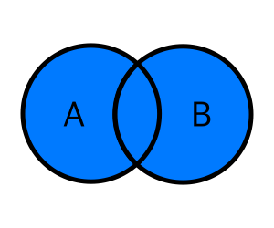
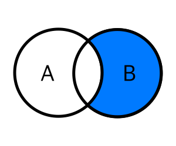
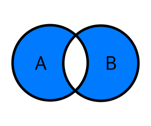

# Join

## 0. Join?

`RDB` 에서 `기본키`-`외래키`로 연관된 두 테이블을 묶어 하나의 테이블로 만드는 방법.
`RDB` 를 사용함에 있어 가장 중요한 역할.  
책 목록, 각 책의 저자 명단, 각 저자의 소속 출판사 목록 세 가지 테이블의 조인 방식과 예제를 `SQL`의 한 종류인 `MariaDB`를 통해 알아 들어보자.

- 연관관계를 사용하지 않고 책 제목, 저자, 출판사 내용을 모두 담은 테이블

| id  | book           | author | publisher |
|-----|----------------|--------|-----------|
| 1   | Java           | jimmy  | malang    |
| 2   | C/C#           | jose   | malang    |
| 3   | Linear Algebra | tom    | dandan    |
| 4   | Calculus       | jimmy  | malang    |
| 5   | SQL            | NULL   | NULL      |

- 책 목록 테이블

| book_id | name           | author_id |
|---------|----------------|-----------|
| 1       | Java           | 1         |
| 2       | C/C#           | 2         |
| 3       | Linear Algebra | 3         |
| 4       | Calculus       | 1         |
| 5       | SQL            | NULL      |

- 저자 명단 테이블

| author_id | name   | publisher_id |
|-----------|--------|--------------|
| 1         | jimmy  | 1            |
| 2         | jose   | 1            |
| 3         | tom    | 2            |
| 4         | george | NULL         |

- 출판사 목록 테이블

| publisher_id | name     |
|--------------|----------|
| 1            | malang   |
| 2            | dandan   |
| 3            | moolcung |

## 🖇️ 1. Inner Join

- 교집합 연산과 유사. **하나로 합칠 두 테이블에 모두 연관된 값이 있는 유효한 레코드만** 가져오는 방법.
- 두 테이블 중 어느 한쪽이라도 비어있는 값이나 연관성이 없는 값은 제외된다.
- `Inner Join`에는 `Explicit Inner Join`과 `Implicit Inner Join`이 있다. 결과는 같지만 약간의 문법 차이가 있다.

### Explicit Inner Join

- 기본 구조

  ```
  SELECT {columns} 
  FROM {tableA} INNER JOIN {tableB} 
    ON {join condition} 
  WHERE {optional conditions};
  ```

### Implicit Inner Join

- 기본 구조

  ```
  SELECT {columns} 
  FROM {tableA}, {tableB} 
  WHERE {join condition} 
    AND {optional conditions};
  ```

### 사용 예

- 책 테이블 + 저자 명단 테이블

  ```
  MariaDB [join_example]> SELECT *
      -> FROM book INNER JOIN author
      -> ON book.author_id = author.author_id;
  +---------+----------------+-----------+-----------+-------+--------------+
  | book_id | name           | author_id | author_id | name  | publisher_id |
  +---------+----------------+-----------+-----------+-------+--------------+
  |       1 | Java           |         1 |         1 | jimmy |            1 |
  |       2 | C/C#           |         2 |         2 | jose  |            1 |
  |       3 | Linear Algebra |         3 |         3 | tom   |            2 |
  |       4 | Calculus       |         1 |         1 | jimmy |            1 |
  +---------+----------------+-----------+-----------+-------+--------------+
  4 rows in set (0.002 sec)
  ```
  
  > 책 목록에서 저자 식별자 값이 `NULL`인 `SQL`책이 제외됐고 `george`가 저자로 등록된 책이 없으므로 저자 명단에서 `george`가 제외됐다.

- 책 테이블 + 저자 명단 테이블 + 출판사 목록 테이블
  ```
  MariaDB [join_example]> SELECT * 
      -> FROM book INNER JOIN author 
      -> ON book.author_id = author.author_id
      -> INNER JOIN publisher
      -> ON author.publisher_id = publisher.publisher_id;
  +---------+----------------+-----------+-----------+-------+--------------+--------------+--------+
  | book_id | name           | author_id | author_id | name  | publisher_id | publisher_id | name   |
  +---------+----------------+-----------+-----------+-------+--------------+--------------+--------+
  |       1 | Java           |         1 |         1 | jimmy |            1 |            1 | malang |
  |       2 | C/C#           |         2 |         2 | jose  |            1 |            1 | malang |
  |       3 | Linear Algebra |         3 |         3 | tom   |            2 |            2 | dandan |
  |       4 | Calculus       |         1 |         1 | jimmy |            1 |            1 | malang |
  +---------+----------------+-----------+-----------+-------+--------------+--------------+--------+
  4 rows in set (0.002 sec)
  ```

  > 같은 원리로 출판사 `moolcung`에 소속된 저자가 없으므로 출력에서 제외됐다.

- 조인 된 테이블에서 저자 이름이 `jimmy`인 레코드만 출력

  ```
  MariaDB [join_example]> SELECT *
      -> FROM book INNER JOIN author 
      -> ON book.author_id = author.author_id
      -> INNER JOIN publisher
      -> ON author.publisher_id = publisher.publisher_id
      -> WHERE author.name = 'jimmy';
  +---------+----------+-----------+-----------+-------+--------------+--------------+--------+
  | book_id | name     | author_id | author_id | name  | publisher_id | publisher_id | name   |
  +---------+----------+-----------+-----------+-------+--------------+--------------+--------+
  |       1 | Java     |         1 |         1 | jimmy |            1 |            1 | malang |
  |       4 | Calculus |         1 |         1 | jimmy |            1 |            1 | malang |
  +---------+----------+-----------+-----------+-------+--------------+--------------+--------+
  2 rows in set (0.006 sec)
  ```

- 프로젝션을 적용한 경우

  ```
  MariaDB [join_example]> SELECT  
      -> book.book_id AS id,
      -> book.name AS book,
      -> author.name AS author,
      -> publisher.name AS publisher
      -> FROM book INNER JOIN author
      -> ON book.author_id = author.author_id
      -> INNER JOIN publisher
      -> ON author.publisher_id = publisher.publisher_id
      -> WHERE author.name = 'jimmy';
  +----+----------+--------+-----------+
  | id | book     | author | publisher |
  +----+----------+--------+-----------+
  |  1 | Java     | jimmy  | malang    |
  |  4 | Calculus | jimmy  | malang    |
  +----+----------+--------+-----------+
  2 rows in set (0.002 sec)
  ```

## 🔗 2. Outer Join

`Outer Join`은 하나로 합칠 두 테이블 중 어느 하나라도 값을 가진 레코드가 있으면 모두 출력하는 조인 방법이다.
`Left`, `Right`, `Full`로 나뉜다.

### Left(Right) Join

기준 테이블의 모든 값을 출력하고 기준 테이블에 연관된 데이터를 조인해 출력하는 방법
기준 테이블의 특정 값과 매칭되는 값이 없을경우 자동으로 `NULL`값으로 채워짐

- 기본 구조

  ```
  SELECT {columns} 
  FROM {tableA} {LEFT | RIGHT} JOIN {tableB} 
    ON {join condition} 
  WHERE {optional conditions}
  ```

### 사용 예

- 책 목록 + 저자 명단 / 기준 테이블 : `book`
  
  ```
  MariaDB [join_example]> SELECT *
      -> FROM book LEFT OUTER JOIN author
      -> ON book.author_id = author.author_id;
  +---------+----------------+-----------+-----------+-------+--------------+
  | book_id | name           | author_id | author_id | name  | publisher_id |
  +---------+----------------+-----------+-----------+-------+--------------+
  |       1 | Java           |         1 |         1 | jimmy |            1 |
  |       2 | C/C#           |         2 |         2 | jose  |            1 |
  |       3 | Linear Algebra |         3 |         3 | tom   |            2 |
  |       4 | Calculus       |         1 |         1 | jimmy |            1 |
  |       5 | SQL            |      NULL |      NULL | NULL  |         NULL |
  +---------+----------------+-----------+-----------+-------+--------------+
  5 rows in set (0.040 sec)
  ```
  
  > 기준 테이블인 `book`에 있는 `SQL`은 저자 정보가 `NULL`로 채워져 있다.


- 책 목록 + 저자 명단 + 출판사 목록 / 기준 테이블 : `author`

  ```
  MariaDB [join_example]> SELECT *
    -> FROM book RIGHT OUTER  JOIN author 
    -> ON book.author_id = author.author_id
    -> LEFT OUTER JOIN publisher
    -> ON author.publisher_id = publisher.publisher_id;
  +---------+----------------+-----------+-----------+--------+--------------+--------------+--------+
  | book_id | name           | author_id | author_id | name   | publisher_id | publisher_id | name   |
  +---------+----------------+-----------+-----------+--------+--------------+--------------+--------+
  |       1 | Java           |         1 |         1 | jimmy  |            1 |            1 | malang |
  |       2 | C/C#           |         2 |         2 | jose   |            1 |            1 | malang |
  |       3 | Linear Algebra |         3 |         3 | tom    |            2 |            2 | dandan |
  |       4 | Calculus       |         1 |         1 | jimmy  |            1 |            1 | malang |
  |    NULL | NULL           |      NULL |         4 | george |         NULL |         NULL | NULL   |
  +---------+----------------+-----------+-----------+--------+--------------+--------------+--------+
  5 rows in set (0.042 sec)
  ```
  
  > 기준테이블인 `author`의 값 중 `george`에 해당하는 열의 나머지 컬럼은 `NULL`로 채워진다.

- 프로젝션 적용

  ```
  MariaDB [join_example]> SELECT 
    -> book_id AS id,
    -> book.name AS book,
    -> author.name AS author,
    -> publisher.name AS publisher
    -> FROM book RIGHT OUTER JOIN author
    -> ON book.author_id = author.author_id
    -> LEFT OUTER JOIN publisher
    -> ON author.publisher_id = publisher.publisher_id;
  +------+----------------+--------+-----------+
  | id   | book           | author | publisher |
  +------+----------------+--------+-----------+
  |    1 | Java           | jimmy  | malang    |
  |    2 | C/C#           | jose   | malang    |
  |    3 | Linear Algebra | tom    | dandan    |
  |    4 | Calculus       | jimmy  | malang    |
  | NULL | NULL           | george | NULL      |
  +------+----------------+--------+-----------+
  5 rows in set (0.006 sec)
  ```

### Full Outer Join

`DBMS`별 지원 여부가 다르다. `오라클`의 경우 `Full Outer Join`구문을 지원 하지만 `Mysql/MariaDB`의 경우 지원하지 않아서 `UNION`구문을 사용해야 함.

- 기본 구조 

  ```
  SELECT {columns} 
  FROM {tableA} FULL OUTER JOIN {tableB}
    ON {join condition}
  
  // myslq
  {LFET OUTER JOIN Query}
  UNION
  {RIGHT OUTER JOIN Query}
  ```

### 사용 예

- 책 목록 + 저자 명단 
  ```
  MariaDB [join_example]> SELECT * 
      -> FROM book LEFT OUTER JOIN author 
      -> ON book.author_id = author.author_id
      -> UNION
      -> SELECT * 
      -> FROM book RIGHT OUTER JOIN author 
      -> ON book.author_id = author.author_id;
  +---------+----------------+-----------+-----------+--------+--------------+
  | book_id | name           | author_id | author_id | name   | publisher_id |
  +---------+----------------+-----------+-----------+--------+--------------+
  |       1 | Java           |         1 |         1 | jimmy  |            1 |
  |       2 | C/C#           |         2 |         2 | jose   |            1 |
  |       3 | Linear Algebra |         3 |         3 | tom    |            2 |
  |       4 | Calculus       |         1 |         1 | jimmy  |            1 |
  |       5 | SQL            |      NULL |      NULL | NULL   |         NULL |
  |    NULL | NULL           |      NULL |         4 | george |         NULL |
  +---------+----------------+-----------+-----------+--------+--------------+
  6 rows in set (0.022 sec)
  ```
  
## 👀 3. 벤 다이어그램으로 보는 상황별 조인 쿼리


```
SELECT {columns} 
FROM {tableA} LEFT OUTER JOIN {tableB} 
  ON {join condition};
```


```
SELECT {columns} 
FROM {tableA} RIGHT OUTER JOIN {tableB} 
  ON {join condition};
```


```
SELECT {columns} 
FROM {tableA} INNER JOIN {tableB} 
  ON {join condition};
```



```
SELECT {columns} 
FROM {tableA} FULL OUTER JOIN {tableB} 
  ON {join condition};

//or

SELECT {columns} 
FROM {tableA} LEFT OUTER JOIN {tableB} 
  ON {join condition}
UNION
SELECT {columns} 
FROM {tableA} RIGHT OUTER JOIN {tableB} 
  ON {join condition};
```


```
SELECT {columns} 
FROM {tableA} LEFT OUTER JOIN {tableB} 
  ON {join condition} 
WHERE {tableB.col} IS NULL;
```



```
SELECT {columns} 
FROM {tableA} RIGHT OUTER JOIN {tableB} 
  ON {join condition} 
WHERE {tableA.col} IS NULL;
```



```
SELECT {columns} 
FROM {tableA} FULL OUTER JOIN {tableB} 
  ON {join condition} 
WHERE {tableA.col} IS NULL OR {tableB.col} IS NULL

// or

SELECT {columns} 
FROM {tableA} LEFT OUTER JOIN {tableB} 
  ON {join condition} 
WHERE {tableB.col} IS NULL
UNION
SELECT {columns} 
FROM {tableA} RIGHT OUTER JOIN {tableB} 
  ON {join condition} 
WHERE {tableA.col} IS NULL;
```

---

## 📚 References
[혼자서 공부하는 SQL - 한빛소프트](https://www.hanbit.co.kr/store/books/look.php?p_code=B6846155853)