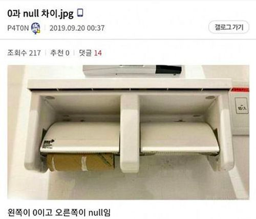

# 🗝️ Key

> ### 📚 Backgrounds
> 
> #### 💍 데이터베이스 무결성
> 
> - **_개체 무결성 Entity Integrity_**
>   - 첫번째 조건 : 기본키를 구성하는 속성은 `null`값을 가질 수 없다
>   - 두번째 조건 : 기본키를 구성하는 속성은 다른 레코드와 `중복`될 수 없다.
>   - ex) `a'`, `b'`, `c'`를 필드로 가지는 릴레이션 `A`에서 `a'`가 기본키인 경우 
>   b'와 c'에는 값을 입력하지 않거나 다른 레코드와 중복된 값을 가질 수 있으나 
>   a'는 반드시 값을 입력하고 그 값이 다른 레코드와 중복될 수 없다.
> 
> - **_참조 무결성 Referential Integrity_**
>   - 왜래키를 구성하는 속성은 참조 릴레이션(테이블)의 `기본키` 값과 동일해야한다.
>   - ex) `a1(기본키)`, `a2`, `a3`를 필드로 가지는 릴레이션 `A`와
>   `b1(기본키)`, `b2(왜래키)`, `b3`를 필드로 가지는 릴레이션 `B`가 있을때
>   릴레이션 `B`의 `b2`속성은 `a1`속성에 없는 값을 입력할 수 없고 `a1`은 반드시 기본키로 설정되어야 한다.
> 
> - **_도메인 무결성 Domain Integrity_**
>   - 속성값은 속성이 정의된 도메인의 범위를 벗어날 수 없다.
>   - ex) 특정 릴레이션에서 생물학적 성별을 나타내는 속성은 `male`, `female`을 의미하는 값을 벗어날 수 없다.
> 
> #### ☝️ 최소성과 유일성
> - **_유일성_**
>   - **_하나의 키값으로 레코드를 식별할 수 있는 성질._**  
>   여러개의 레코드가 존재할 때 각각의 레코드는 유일해야 하며 **유일성**을 입증하고 각각의 레코드를 구분할 수 있는 속성이 필요하다.  
>   상품의 정보(`상품일련번호`, `상품명`, `판매가` 등)를 저장한 릴레이션이 존재할 때 `상품명`과, `판매가` 속성은 **중복**될 여지가 있는 속성이다. 
>   하지만 `상품일련번호` 속성에서 **중복**은 발생할 수 없다. 
>   여기서 키는 `상품일련번호`가 될것이며 이 상품 번호로인해 각 레코드를 구분할 수 있는 **유일성**이 보장된다.
> 
> - **_최소성_**
>   - 키를 구성하는데 여러 속성을 묶어서 키로 지정할 수 있다. **_이 때 키를 구성하는 최소로 필요한 속성들로만 키를 구성하는 성질._**  
>   다시한번 상품의 정보(`상품일련번호`, `상품명`, `판매가` 등)를 저장한 릴레이션이 존재하고 
>   `상품일련번호`와 `상품명`을 묶어 키로 지정되어있다고 할 때 이 키는 각 레코드를 구분할 수 있다. 
>   하지만 `상품일련번호`라는 하나의 속성을 통해 레코드의 **유일성**을 보장 할 수 있으므로 `상품일련번호`와 `상품명`을 묶은 키는 **최소성**을 만족한다고 볼 수 없다.

## 💡 의미

- 데이터 베이스에서 조건에 만족하는 레코드(튜플)를 찾거나 정렬 할 떄 기준이 되는 속성 또는 그러한 속성의 집합.

## ✔️ 종류

각 키를 설명하기에 앞서 `말랑몰`의 상품리스트와 고객정보, 장바구니 릴레이션을 예로 들어보자.

- 상품 리스트

| 상품 번호 | 상품명 | 판매가 | 상품 정보 |
| --- | --- | --- | --- |
| 0001 | 말랑쿠션 | 3,000 | blah blah |
| 0002 | 말랑모찌슬라임 | 2,000 | blah blah |
| 0003 | 말랑양말 | 2,000 | blah blah |

- 회원 정보

| 회원 아이디 | 비밀번호 | 회원 등급 | 주민등록번호 |
| --- | --- | --- | --- |
| malang123 | abc123 | 실버 | 900101-1xxxxxx |
| dandan | abc123 | 골드 | 900102-1xxxxxx |
| marin | sdf90djfng | 실버 | 900103-1xxxxxx |
| firebet | fd900fj43n | 골드 | 900104-1xxxxxx |

- 장바구니

| 주문번호 | 주문자 | 상품 목록 | 수량 | 합계 금액 |
| --- | --- | --- | --- | --- |
| 0001 | malang123 | 0001, 0002 | 1, 2 | 6,000 |
| 0002 | marin | 0003 | 4 | 8,000 |

### 🪄 슈퍼 키 Super Key

- **_유일성_**
- 상품 리스트 릴레이션을 보면 상품번호, 상품명, 판매가, 상품 정보의 속성이 있다.
이 중 개별 속성 뿐만아니라 각 속성을 묶어서 하나의 속성으로 만드는것도 가능한데 `상품 번호 + 상품명`으로 속성을 만들 수 있고
`판매가 + 상품 정보`로도 가능하다.
- 이 경우 `판매가 + 상품정보` 속성은 중복값이 발생할 수 있으므로 슈퍼키가 될 수 없지만 `상품번호 + 상품명` 속성은 슈퍼키가 될 수 있다.
- 정리하자면 **_어떤 속성끼리 묶어도, 또는 묶지 않아도 각 레코드를 구별 할 수 있다면(유일성을 확보할 수 있다면) 그 속성은 슈퍼키가 될 수 있다._**

### 🖇️ 후보 키 Candidate Key

- **_유일성, 최소성_**
- 앞서 본 개체 `무결성 원칙`에 위배되지 않아야 한다.
- 앞서 설명했듯 여러개의 상품을 구분하는 슈퍼 키가 모여있는데 이들 중 키를 구성하는 속성의 수가 가장 적은 키만이 후보 키가 될 수 있다.
- 상품 리스트 릴레이션을 기준으로 보면 슈퍼 키는
`상품 번호`, `상품명`, `상품번호 + 상품명`, `상품번호 + 판매가`, `상품번호 + 상품명 + 판매가` 등 이 있는데
이들 중 `상품 번호`와 `상품명`만이 최소성을 확보해 후보 키로 지정 될 수 있다.
- 만약 말랑몰 관리자가 실수로 상품명을 중복해서 등록했다면 `상품명`은 후보 키가 될 수 없다.

### 🔐 기본 키 Primary Key

- **_후보 키 중 선택된 키. 릴레이션에서 기본 키는 반드시 유일해야한다._**
- 이번엔 `회원 정보` 릴레이션을 살펴보자. 여기서 `후보 키`는 `회원 아이디`, `주민등록번호`가 될 수 있고
둘 중 어느 하나가 기본키로 지정 되면 나머지 하나는 대체키로 정해진다.
그런데 만약 국가에서 '**_온라인상에서 주민등록번호를 수집하면 안된다_**'는 법이 생겨 `주민등록번호`가 아닌 `생년월일`로 정보를 변경한다고 하면
`생년월일`은 **유일성**을 만족하지 못하게 된다. 이에따른 문제는 `자연 키`와 `인조 키`에 대한 이슈를 가져온다.
- 자연 키
  - `회원 정보` 릴레이션에서 `비밀번호`, `회원 등급` 기본 키로 사용할 수 없다. 
  이때 자연스럽게 레코드를 구분 할 수 있는 속성으로 남는게 `회원 아이디`와 `주민등록번호`가 된다.
  이렇게 하나의 릴레이션에서 레코드를 구분 할 수 있는 것을 '**자연스레**' 뽑다 나오는 키를 가리켜 `자연키`라고 한다.
- 인조 키
  - `상품 정보` 릴레이션에서 `상품 번호` 속성은 쇼핑몰 관리자가 레코드를 등록하며 인위적으로 생성한 키 속성이므로 인조 키에 해당한다.
- **식별자로 자연 키? 인조 키?**
  - 인조 키를 식별자로 지정하는것이 적절하다.
  - 자연 키는 변경될 수 있다.
    - `회원 정보` 릴레이션에서 `전화번호` 항목을 수집한다고 가정해보자
    `전화번호`는 유일하지만 회원의 상황에 따라 변경될 여지가 충분하기때문에 식별자로 적절하지 못하다.
  - 환경이 변할 수 있다.
    - 위에서 언급했듯 `주민등록번호`를 수집해 식별자로 사용하다가 
    국가에서 해당 속성을 수집하지 못하게 한다면 또 다른 대체 키 중에서 식별자를 선택해야하는 상황이 발생한다.

### 📎 대체 키 Alternate Key

- 후보 키 중 기본 키를 제외한 나머지 모든 키.

### 🔑 복합 키 Composite Key

- 다수(2개 이상)의 속성을 사용한 키
- 앞서 언급한 `상품 번호 + 상품명`, `상품번호 + 판매가`, `상품번호 + 상품명 + 판매가` 등

### 🔨 외래 키 Foreign Key

- **_다른 릴레이션의 기본 키를 참조하는 속성, 왜래키를 통해 테이블간 관계 표현이 가능하다._**
- `장바구니` 릴레이션을 살펴보자. 기본 키로 `주문 번호`를 가지고있고 `주문자` 속성은 `회원 아이디`를 참조하는데 이를 **외래 키**라 한다.
- **외래 키 존재 이유?**
  - 항상 정확한 값을 유지하는 **데이터 무결성** 때문
  - 예를 들어 `회원 아이디`가 변경됐는데 `장바구니` 릴레이션에서 `주문자` 속성은 변하지 않는다면
  `주문자` 속성은 존재하지 않거나 잘못된 값을 참조 하는것이 되고 이로인해 **무결성**이 깨지게 된다.

### 🔧 유일(고유) 키 Unique Key

- `중복값`을 허용하지 않지만 `null`값이 허용되는 키, 릴레이션에서 여러 속성에 지정 할 수 있다.

### 🙋 What is null?

---

## ❓ 예상질문

- **Q1. 유일 키와 기본 키의 차이를 설명하세요.**
  > **A1.**
  > 기본 키는 각 레코드를 식별하기 위해 사용되며 
  > 특징으로는 개체 무결성 두가지 조건에 따라 null 값을 허용하지 않고 중복값을 허용하지 않으며 하나의 릴레이션 안에 오직 하나만 설정할 수 있습니다.  
  > 유일 키는 어떠한 속성의 유일성을 확보하기 위해 사용되며 
  > 기본 키 처럼 중복값을 허용하지 않지만 null 값을 허용하고 하나의 릴레이션 안에 여러개를 지정 할 수 있습니다.  

---

## 📚 References
[기본 키 매핑 전략](https://velog.io/@skyepodium/JPA-%EA%B8%B0%EB%B3%B8%ED%82%A4-%EB%A7%A4%ED%95%91-%EC%A0%84%EB%9E%B5)  
[키의 개념과 종류](https://kosaf04pyh.tistory.com/201)  
[[DB] 📚 데이터베이스 키(KEY) 종류 🕵️ 정리](https://inpa.tistory.com/entry/DB-%F0%9F%93%9A-%ED%82%A4KEY-%EC%A2%85%EB%A5%98-%F0%9F%95%B5%EF%B8%8F-%EC%A0%95%EB%A6%AC)
