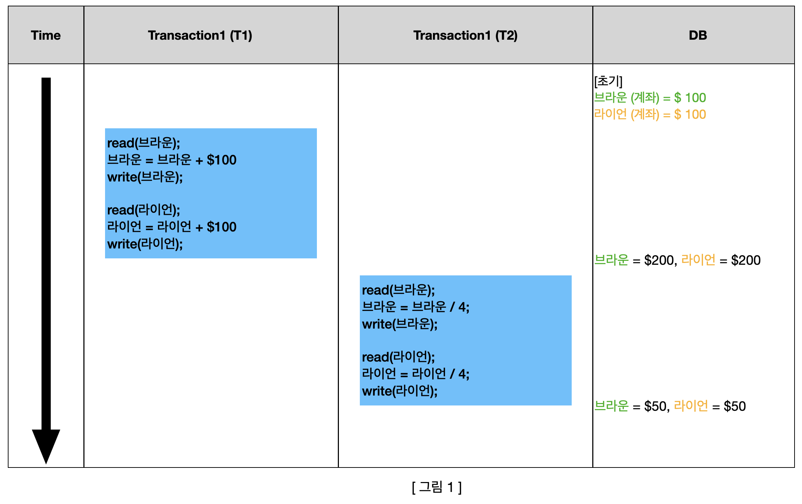
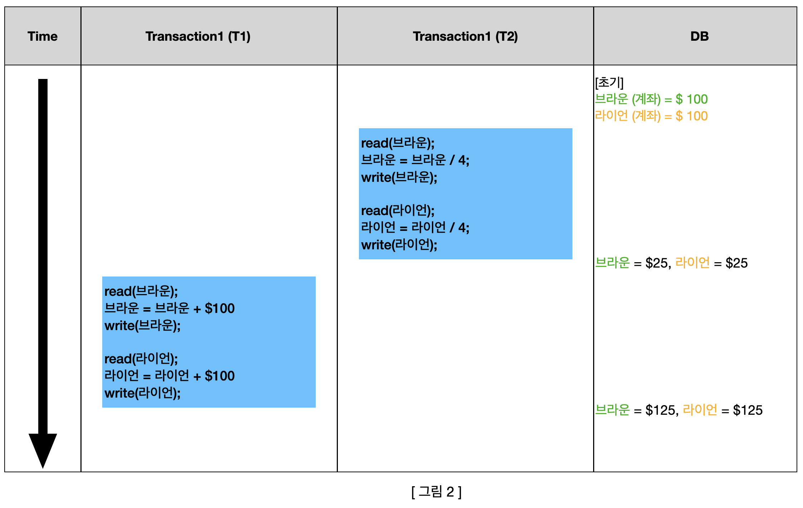
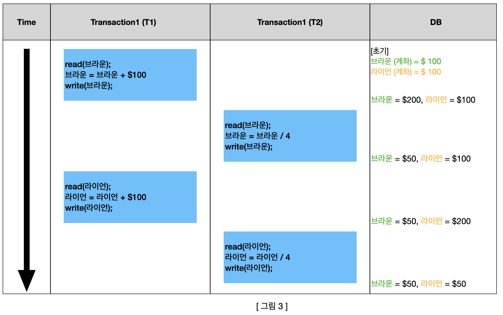
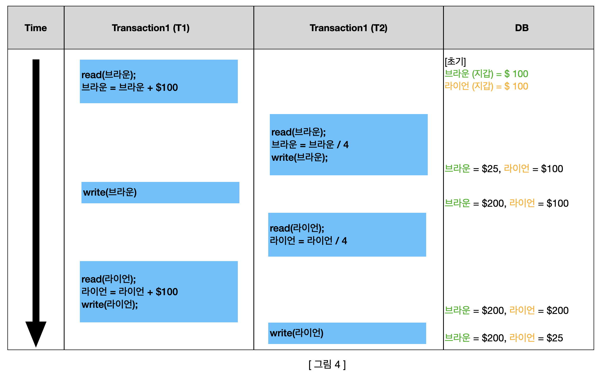
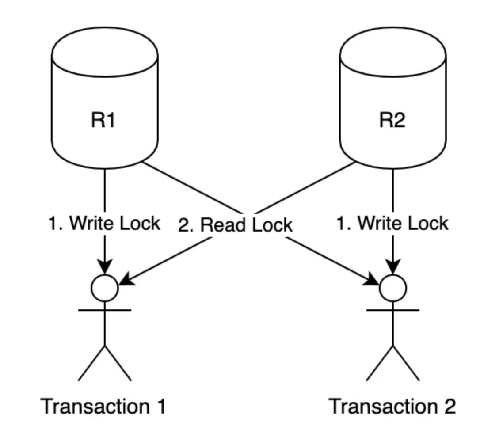

# DB Locking

## 트랜잭션 스케줄 유형

* `병행 수행`이란 트랜잭션들이 차례로 번갈아 가면서 수행되는 **인터리빙 방식**으로 진행된다.

* 트랜잭션 스케줄은 트랜잭션에 포함되어 있는 **연산들을 수행하는 순서**다.

* 트랜잭션 스케줄에는 세 가지 유형으로 구분할 수 있다.

  * `직렬 스케줄` : 인터리빙 방식을 이용하지 않고 트랜잭션별로 **순차적**으로 실행하는 것이다.

  * `비직렬 스케줄` : 인터리빙 방식을 이용하여 트랜잭션을 병행하여 수행시키는 것이다.

  * `직렬 가능 스케줄` : 직렬 스케줄과 같은 결과를 생성하는 비직렬 스케줄이다.

### 직렬 스케줄 

* `직렬 스케줄`(**Serial Schedule**)은 인터리빙 방식을 이용하지 않고 트랜잭션별로 연산들을 순차적으로 실행시키는 것이다.

* 트랜잭션이 직렬 스케줄에 따라 수행되면, 모든 트랜잭션이 완료될 때까지 다른 트랜잭션의 방해를 받지 않고 **독립적**으로 수행된다.

  그래서 직렬 스케줄에 따라 트랜잭션이 수행되고 나면 **항상 모순이 없는** 정확한 결과를 얻는다.

* 두 트랜잭션을 대상으로 하는 직렬 스케줄의 예를 살펴보면 다음과 같다.

* [그림 1]은 트랜잭션 T1을 수행한 이후에 트랜잭션 T2를 수행한 예시다. (T1 -> T2)

* [그림 2]은 트랜잭션 T2을 수행한 이후에 트랜잭션 T1를 수행한 예시다. (T2 -> T1)

* 직렬 스케줄에 따라 여러 트랜잭션을 수행하면 정확한 결과를 얻을 수 있지만, **인터리빙 방식을 사용하지 않고** 각 트랜잭션이 **독립적**으로 수행하기 때문에 트랜잭션들이 동시에 수행되는 **병행 수행**이라고 할 수 없다.

* 그래서 직렬 스케줄은 일반적으로 사용하지 않는다.

### 비직렬 스케줄

* `비직렬 스케줄`(**Non-Serial Schedule**)은 인터리빙 방식을 이용하여 트랜잭션을 병행해서 수행시키는 것이다.

* 트랜잭션이 비직렬 스케줄에 따라 수행되면, 하나의 트랜잭션이 완료되기 전에 다른 트랜잭션의 연산이 실행될 수 있다.

  여러 트랜잭션을 병행 수행하게 되면 **갱신 분실**, **모순성**, **연쇄 복귀** 등의 문제가 발생할 수 있어 최종 수행 결과의 정확성을 보장할 수 없다.

* 두 트랜잭션을 대상으로 하는 비직렬 스케줄의 예를 살펴보면 다음과 같다.

* [그림 3]은 트랜잭션 T1,T2를 직렬 스케줄로 수행한 [그림 1]과 결과가 같으므로 모순이 없는 정확한 값이다.

* [그림 4]은 트랜잭션 T1,T2를 직렬 스케줄로 수행한 [그림 1], [그림 2] 모두와 결과가 다르므로 정확하지 않는 값이다.

### 직렬 가능 스케줄

* `직렬 가능 스케줄`(**Serializable Schedule)** 은 직렬 스케줄에 따라 수행한 것과 같이 **정확한 결과**를 생성하는 **비직렬 스케줄**이다.

* 직렬 가능 스케줄을 이용해 트랜잭션을 병행 수행해야 하지만 직렬 가능 스케줄인지 여부를 판단하는 일은 쉽지 않다.

  다수의 트랜잭션을 대상으로 비직렬 스케줄을 찾아내는 것도 어려울 뿐만 아니라, 하나씩 수행해보면 직렬 스케줄과 같은 결과가 나오는지 비교하는 것도 간단한 작업이 아니기 때문이다.

* 그래서 DBMS에서는 **병행 제어 기법**을 사용한다.

## 병행 제어 기법

* `병행 제어 기법`은 여러 트랜잭션이 병행 수행하면서도 **정확한 결과**를 얻을 수 있는 **직렬 가능성**을 보장받기 위해 사용한다.

* 기본 원리는 모든 트랜잭션이 따르면 직렬 가능성이 보장되는 나름의 규약을 정의하고, 트랜잭션들이 이 규약을 따르는 것이다.

  그러므로 스케줄 내의 모든 트랜잭션이 병행 제어 기법에서 정의한 규약을 따르면 **직렬 가능성**을 보장받을 수 있다.

* 가장 많이 사용되는 병행 제어 기법인 **Locking** 기법을 중심으로 병행 제어 기법을 자세히 알아보자.

## Locking 개념

* `Lock`이란 **트랜잭션 처리의 순차성**을 보장하기 위한 방법이다.

  **Locking 기법**은 병행 수행되는 트랜잭션들이 동일한 데이터에 동시에 접근하지 못하도록 lock과 unlock이라는 2개의 연산을 이용해 제어한다.

  기본 원리는 한 트랜잭션이 먼저 접근한 데이터에 대한 연산을 모두 마칠 때까지, 다른 트랜잭션이 접근하지 못하도록 상호 배제하여 직렬 가능성을 보장하는 것이다.

  `lock` 연산은 트랜잭션이 사용할 데이터에 대한 **독점권**을 가지기 위해 사용한다.

  `unlock` 연산은 트랜잭션이 데이터에 대한 **독점권을 반납**하기 위해 사용한다.

> Locking 기법에서 모든 트랜잭션이 지켜야 하는 **기본 Locking 규약**을 알아보자.

1. Locking 기법을 사용해 트랜잭션이 **DB에 있는 데이터에 접근하는 연산을 실행**하려면, 먼저 해당 데이터에 lock 연산을 실행하여 **독점권을 획득**해야 한다.

2. 트랜잭션이 lock 연산을 통해 독점권을 획득한 데이터에 대한 **모든 연산을 수행하고 나면** unlock 연산을 실행해서 **독점권을 반납**해야 한다. 그래야 다른 트랜잭션이 해당 데이터에 접근할 수 있기 때문이다.

3. 데이터에 **lock 연산을 실행한** 트랜잭션만 해당 데이터에 unlock 연산을 실행할 수 있다. 즉, 데이터에 대한 독점권을 부여받은 트랜잭션만 해당 데이터에 대한 독점권을 반납할 수 있다.

## Lock 단위 설정

* lock 연산은 크게 전체 DB부터 DB를 구성하는 속성에 이르기까지 다양한 크기의 데이터를 대상으로 실행할 수 있다. (ex. 릴레이션, 튜플)

* **전체 DB**에 lock 연산을 실행하면 제어가 간단하다는 장점이 있지만 DB에 하나의 트랜잭션만 수행하므로 병행 수행이라 할 수 없다.

  반면, **가장 적은 단위**의 속성에 lock 연산을 실행하면 독점하는 범위가 좁아 많은 수의 트랜잭션을 병행 수행할 수 있다는 장점이 있지만, 제어가 복잡하다는 단점이 있다.

  즉, Locking 단위가 커질수록 병행성은 낮아지지만 제어는 쉽고, 

  Locking 단위가 작아질수록 제어는 어렵지만 병행성은 높아진다.

  그러므로 시스템에 따라 적절한 Locking 단위를 선택하는 것이 중요하다.

## Lock 연산 종류

* Shared Lock(공유 잠금) : 해당 데이터에 read 연산만(write 연산은 실행X) 실행할 수 있다. 그리고 해당 데이터에 대한 다른 트랜잭션도 shared lock 연산을 동시에 실행할 수 있다.(동시에 접근이 가능하다)

* Exclusive Lock(배타 잠금) : 해당 데이터에 read 연산과 write 연산을 모두 실행할 수 있다. 하지만 lock이 해제될 때까지 해당 데이터에 다른 트랜잭션이 어떤 lock 연산도 실행할 수 없다(접근 불가능)

## Blocking

* `Blocking`이란 Lock의 경합(=서로 경쟁)이 발생하여 특정 세션이 작업을 진행하지 못하고 멈춰선 상태를 말한다.

* Shared Lock과 Exclusive Lock 또는 Exclusive Lock과 Exclusive Lock끼리 Blocking이 발생할 수 있다.

* 이를 해결하는 방법은 Transaction commit(종료) 또는 Rollback 하는 방법이다.

* 해결방안

  [1] SQL 문장에 가장 빠르게 실행되도록 리펙토링하는 것이 가장 기본이며 효과적인 방법이다. (속도 개선)

  [2] 트랜젝션을 가능한 짧게 정의하면 경합을 줄일 수 있다. (허용시간 단축)

  [3] 동일한 데이터를 동시에 변경하는 작업을 하지 않도록 설계한다.

  [4] 대용량작업이 불가피할 경우, 작업단위를 쪼개거나 `lock_timeout`을 설정하여 해당 Lock의 최대 시간을 설정할 수 있다.

## DeadLock

* `DeadLock`(교착 상태)란 각 트랜잭션들이 lock를 획득하기 위해 상대가 독점하고 있는 데이터에 unlock 연산이 실행되기를 서로 기다리면서 수행을 중단하고 있는 상태를 말한다.

* 교착 상태에 빠지면 트랜잭션들은 더 이상 수행하지 못하고 상대 트랜잭션이 먼저 unlock 연산을 실행해주기를 한없이 기다리게 된다.

* 1번 트랜잭션에서는 2번 데이터의 Lock을 획득하고, 2번 트랜잭션에서는 1번 데이터의 Lock을 획득한 상태이다.

* 이때, 동시에 상대방의 데이터를 접근하려면 unlock 연산이 실행될 때까지 기다려야 한다.

## Pessimistic lock

* 비관적 락(Pessimistic lock)은 Repeatable_Read 또는 Serializable 정도의 격리성 수준을 제공한다.

  (DB 트랜잭션 격리 수준에 대해 모르겠다면, [트랜잭션 격리 수준](https://fancy96.github.io/DB-Transaction-Isolation-Level/)을 참고하시길 바랍니다)

* 비관적 락이란 지원 요청에 따른 동시성 문제가 발생할 것이라고 예상하고 **lock**을 걸어버리는 방법이다.

* 다시 말해서, 트랜잭션이 시작될 때 **Shared Lock 또는 Exclusive Lock을 걸고 시작**하는 방법이다.

  Shared Lock을 걸면 read 연산밖에 못하기 때문에, write 연산을 하기 위해서는 Exclusive Lock을 얻어야 한다.

  하지만, 만약 Shared Lock이 다른 트랜잭션에 의해 걸려 있으면 해당 Lock을 얻지 못하므로 업데이트를 할 수 없다.

  데이터를 수정하기 위해서는 해당 트랜잭션을 제외한 모든 트랜잭션이 종료(Commit)되어야 한다.

* 아래의 도식도를 보면서 비관적 락에 대해 제대로 이해해보자.

1. Transaction_1(T1)에서 Table Id 2번을 읽는다. (Name = Lion)

2. Transaction_2(T2)에서 Table Id 2번을 읽는다. (Name = Lion)

3. Transaction_2(T2)에서 Table Id 2번의 Name `Fancy`로 변경을 요청한다 (NAME = Fancy)

    하지만, Transaction_1(T1)에서 이미 Shared Lock을 걸고 있기 때문에 **Blocking** 된다.

4. Transaction_1(T1)에서 해당 트랜잭션을 종료(Commit)한다.

5. Blocking되었던 Transaction_2(T2)의 Update 요청이 정상 처리된다.(Name = Fancy)

* 이렇게 비관적 락은 **Transaction 과정을 통해 충돌을 예방**한다.

### 장점

* **충돌이 자주 발생하는 환경**에서 롤백의 횟수를 줄일 수 있으므로 성능에서 유리하다.

* 데이터의 무결성을 보장하는 수준이 매우 높다.

### 단점

* 데이터 자체에 lock을 걸어버리기 때문에 **동시성이 떨어져 성능 손해**를 많이 보게 된다. 특히 읽기가 많이 이루어지는 DB의 경우 손해가 더 심해진다.

* 서로 자원이 필요한 경우에, 락이 걸려있으면 **Deadlock**이 일어날 가능성이 있다.

## Optimistic lock

* 낙관적 락(Optimistic lock)은 **자원에 lock을 걸어서 선점하지 말고, 동시성 문제가 발생하면 그때 가서 처리**하는 방법이다.

  T1가 해당 값을 첫 번째로 수정한 이후에 같은 조건으로 T2가 해당 값을 수정할 수 없게 하는 것이다.

* 이 특징은 DB에서 동시성을 처리하는 것이 아닌 **Application Level**에서 처리하는 Lock이다.

* 아래의 도식로를 보면서 낙관적 락에 대해 제대로 이해해보자.

1. A가 Table Id 1번을 읽는다. (Name = Brown, Version = 1)

2. B가 Table Id 1번을 읽는다. (Name = Brown, Version = 1)

3. B가 Table Id 1번, Version 1인 row 값을 갱신한다. (Name = Brown, Version = 2) **성공**

4. A가 Table Id 1번, Version 1인 row 값을 갱신한다. (Name = Brown, Version = 2) **실패**

  Id 1번은 이미 Version이 2로 업데이트되었기 때문에, A는 해당 row를 갱신하지 못한다.

* 위 흐름을 통해 같은 row에 대해 각기 다른 2개의 수정 요청이 있었지만, **1개가 업데이트가 이미 되어서 Version이 변경되었기 때문에 그 뒤의 수정 요청은 반영되지 않는다**.

* 이때 여러 작업이 묶인 트랜잭션으로 요청이 간 경우가 **실패**한 경우, **개발자가 직접 롤백 처리**를 해줘야 한다.

* 이렇게 낙관적 락은 version 등의 구분 컬럼을 이용해서 충돌을 예방한다.

### 장점

* 충돌이 안난다는 가정하에, **동시 요청**에 대해서 처리 성능이 좋다.

### 단점

* 잦은 충돌이 일어나는 경우, **롤백 처리**에 대한 비용이 많이 들어 성능에서 손해볼 수도 있다.

* 롤백 처리를 구현하는게 복잡할 수 있다.

## 예상 질문

* Locking 단위 설정에 대한 장점과 단점이 무엇인가요?

* Lock 연산 종류 2가지에 대해 설명해 주세요.

* Optimistic Lock/Pessimistic Lock에 대해 설명해 주세요.

* Optimistic Lock/Pessimistic Lock의 장단점에 대해 설명해 주세요.

## Reference

* [데이터베이스 개론](https://product.kyobobook.co.kr/detail/S000001743852)

* [[DB] Lock에 대해서 알아보자 - 기본편](https://sabarada.tistory.com/121)

* [[DB] Lock이란?](https://chrisjune-13837.medium.com/db-lock-%EB%9D%BD%EC%9D%B4%EB%9E%80-%EB%AC%B4%EC%97%87%EC%9D%B8%EA%B0%80-d908296d0279)

* [[DB] 낙관적 락(Optimistic Lock)과 비관적 락(Pessimistic Lock)](https://sabarada.tistory.com/175)

* [[DB] 낙관적(Optimistic) 락과 비관적(Pessimisitc)락](https://unluckyjung.github.io/db/2022/03/07/Optimistic-vs-Pessimistic-Lock/)