데이터베이스는 기본적으로 하나의 서버, 하나의 스토리지를 가지고 있다.

<div align='center'>
    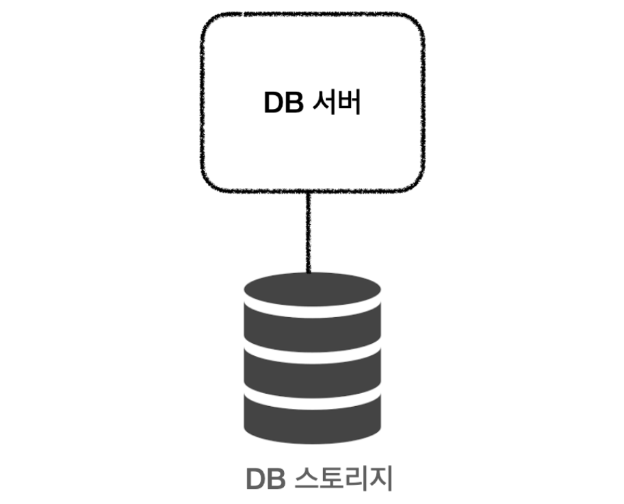
</div>

# Clustering
```
🤷‍♂️ 데이터 베이스 서버가 죽으면?

🙋‍♀️ 서버를 여러개로 만들자!(클러스터링)
```
- 여러 개의 DB를 **수평적인 구조**로 구축하는 방식
- 분산 환경을 구성하여 Single point of failure와 같은 문제를 해결할 수 있는 Fail Over 시스템을 구축하기 위해서 사용
- **동기 방식**으로 노드들 간의 데이터를 동기화

> **single point of failure(단일 장애점,SPOF)**
> 
> 시스템 구성 요소 중에서, 동작하지 않으면 전체 시스템이 중단되는 요소
> 이중화가 되어 있지 않은 요소라면 SPOF일 가능성 높음

> **Fail over**
>
> 실 운용환경(컴퓨터 서버, 시스템, 네트워크) 등에서 이상이 생겼을 때, 대체 작동 또는 장애 극복(조치)을 위해 예비 운용환경으로 자동전환되는 기능

## 1. Active & Active
<div align='center'>
    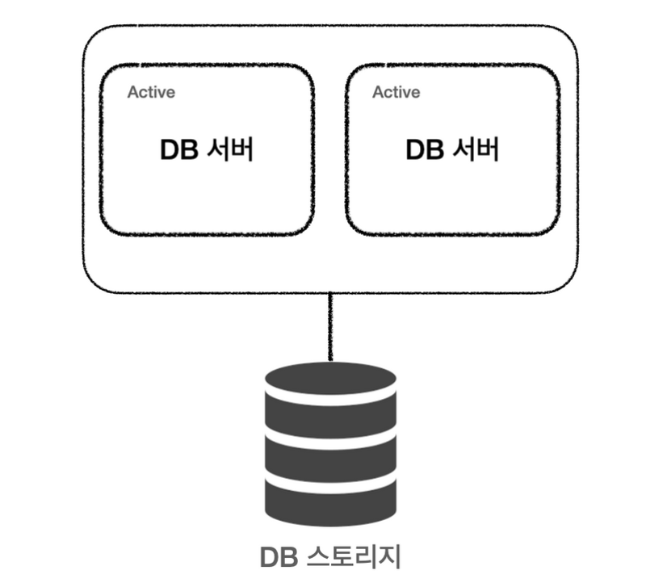
</div>

- 서버 한대가 죽더라도 하나의 서버가 동작하고 있어서 서비스에 큰 문제 X
- 다른 서버가 동작하는 동안 복구를 하여 서비스의 중단 없음
- 하나의 데이터베이스에 가해지는 부하가 두개로 나눠지므로 CPU, Memory 부하도 줄어듦
- 여러 개의 서버가 하나의 스토리지 공유하기 때문에 병목현상 발생

## 2. Active & Stand-By
<div align='center'>
    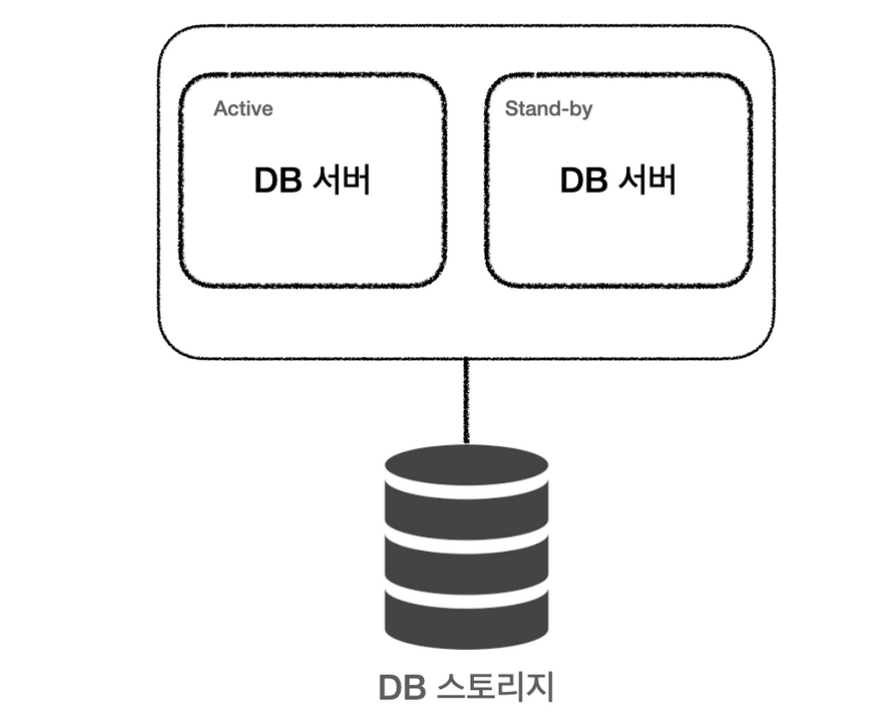
</div>

- Active 상태의 서버에 문제가 생겼을 때 Fail over를 하여 Stand-by 서버를 Active로 전환하여 문제에 대응
- Fail over가 발생하는 시간동안에는 서비스가 중단될 수 밖에 없음
- 결론적으로 한 대만 운영 -> 효율은 Active&Active의 절반


# Replication
```
🤷‍♂️ 저장된 데이터가 손실되면 어쩌지?

🙋‍♀️ 실제 데이터가 저장되는 저장소도 복제하자!(레플리케이션)
```
<div align='center'>
    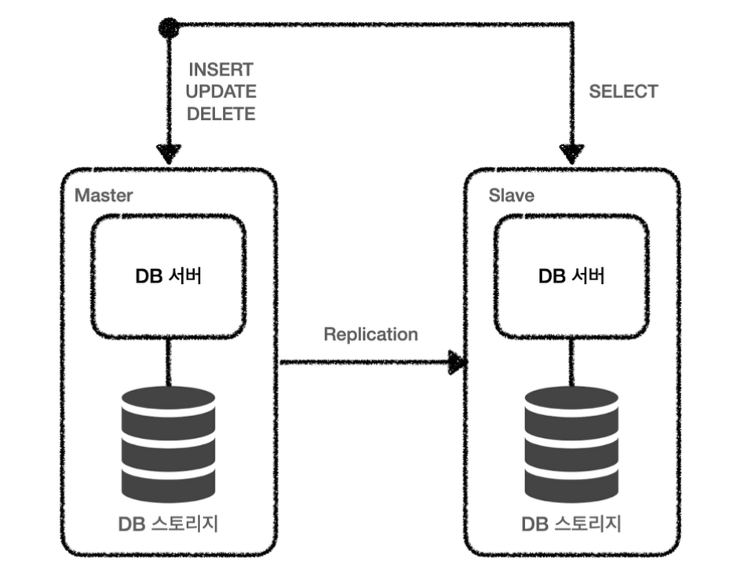
</div>

- 데이터베이스 스토리지 복제
- 데이터베이스 서버를 확장한 Clustering과 달리 서버와 스토리지 모두 확장
- 여러 개의 DB를 권한에 따라 **수직적인 구조**(Master-Slave)로 구축하는 방식
    - Master : INSERT, UPDATE, DELETE
    - Slave : SELECT
- Slave 서버 여러개를 통해 분산하여 처리할 수 있어 성능 향상에 도움이 된다.
- 버전 관리 필요, 적어도 Slave가 상위버전
- **비동기**방식으로 데이터 동기화하기 때문에 일관성있는 데이터 얻지 못 할 수 있음
    - 동기 방식으로 Replication할 수 있지만, 속도가 느려짐
- Master 서버가 다운되면 복구 및 대처 까다로움

> 현재는 master-slave 단어를 안쓰는 추세인 만큼 source-replica 구조로 불리기도 함.

### [ 구축 목적 ]
- **스케일 아웃**
    - 갑자기 늘어나는 트래픽에 대해 부하를 줄이기 위해 서버를 늘리는 것
- **데이터 백업**
    - 백업 과정은 실제 실행중인 쿼리에 영향을 줄 수 있다.
    - => 레플리카 서버에서 데이터 백업을 진행
- **데이터 분석**
    - 데이터 분석의 경우, 대량의 데이터 조회, 복잡한 쿼리가 많을 수 있다.
    - 소스 서버에서 데이터 분석을 할 경우, 실제 서비스에 문제가 생길 수 있다.
    - => 데이터 분석 전담 서버를 두는 것이 좋다.
- **데이터의 지리적 분산**
    - 데이터베이스 서버가 멀리 떨어져 있다면 빠른 응답을 받기 어렵다.
    - 다양한 지역에 레플리카 서버를 두어 응답 속도를 높일 수 있다.

# Sharding

```
🤷‍♂️ 데이터가 많아서 검색이 느린데 더 빠르게 할 수 있는 방법이 있을까?

🙋‍♀️  테이블을 나눠서 검색하자! (샤딩)
```

<div align='center'>
    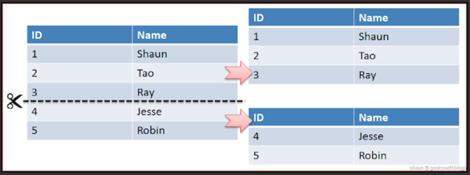
</div>

- 같은 테이블 스키마를 가진 데이터를 다수의 데이터베이스에 분산하여 저장하는 방법
- **테이블을 특정 기준으로 나눠서 저장 및 검색**
- **Sharding Key** : 나눠진 Shard 중 어떤 shard를 선택할 지 결정하는 키, 결정방식에 따라 Sharding 방법이 나누어짐

### [ Shard Key 결정 방식 ]

**Hash Sharding**

<div align='center'>
    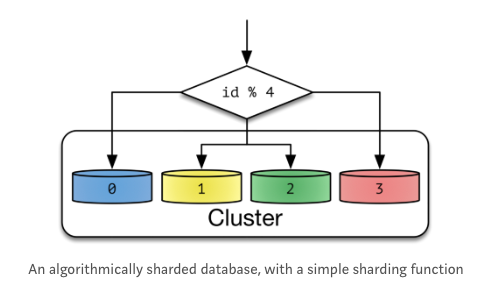
</div>

- Shard Key : **Database id를 Hashing 하여 결정**
    - Hash크기는 Cluster안에 있는 Node개수로 정하게 됨
- **구현이 간단**하다(key-value)
- **확장성이 떨어진다**
    - Node개수를 늘리거나 줄일 경우, Hash 크기와 Key가 변함 -> Data 분산 Rule 어긋남
    - \=> Resharding 필요
- **공간에 대한 효율을 고려하지 않는다**

**Dynamic Sharding**

<div align='center'>
    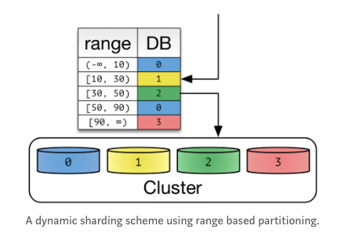
</div>

- **확장에 용이**하다
    - Node의 개수를 늘릴 경우 : Locatoer Service에 Shard Key 추가만 하면 됨
    - 기존 Data Shard Key 변경 X
- 데이터를 재배치 시 Locator Service의 Shard Key Table도 동기화 해야한다.
- Locator Service를 통해 Shard Key를 얻는다.
- **Locator에 의존적**이다.
    - Locator가 성능을 위해 Cache하거나 Replication할 경우, 잘못된 Routing을 통해 Data 찾지 못하고 Error 발생
- ex) HDFS : Name Node, MongoDB : Config Server

> Hash Sharding과 Dynamic Sharding은 **Key-Value 형태를 지원**하기 위해 나온 방법

**Entity Group**

<div align='center'>
    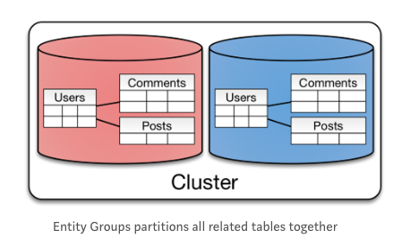
</div>

- Key-Value가 아닌 다양한 객체로 구성된 경우 Applicaiton의 복잡도를 줄이는 방향으로 Sharding하는 방법
- 관계가 있는 Entity끼리 같은 Shard 내에 공유하도록 만든 방식
- **단일 Shard** 내에서 쿼리가 **효율적**
- 단일 Shard 내에서 **강한 응집도**를 가진다
- **다른 Shard의 Entity와 연관되는 경우 비효율**적
- **사용자가 늘어남에 따라 확장성이 좋은** Partitioning
- **cross-partition 쿼리는 single partition 쿼리보다 consistency의 보장과 성능을 잃음**


# MySQL 사용 시(RDB)
## [ clustering ]
Tungsten, MySQL Replicaiton, NDB, Galera 등 존재

**Galera Clustering**

<div align='center'>
    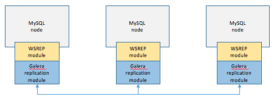
    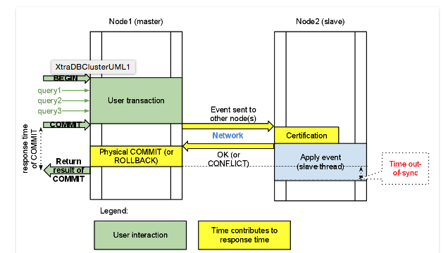
</div>

```
처리순서
- 1개의 노드에 쓰기 트랜잭션이 수행되고, COMMIT을 실행한다.
- 실제 디스크에 내용을 쓰기 전에 다른 노드로 데이터의 복제를 요청한다.
- 다른 노드에서 복제 요청을 수락했다는 신호(OK)를 보내고, 디스크에 쓰기를 시작한다.
- 다른 노드로부터 신호(OK)를 받으면 실제 디스크에 데이터를 저장한다.
- WSREP 모듈 : 데이터베이스에 복제를 위한 범용 모듈
```

- 데이터가 전체 노드에 **일관성**있게 저장됨
- **모든 노드가 마스터 노드**로 작동하며, 특정 노드에 장애가 나더라도 서비스에 큰 문제 없음
    - MySQL Replication의 경우 마스터 노드가 장애가 나면 슬레이브 노드 중 하나를 마스터로 승격해야하는 등 운영 프로세스가 복잡
- 데이터 디스크 저장 전, 모든 노드에 데이터 복제 요청을 보내기 때문에 **replication에 비해 쓰기 성능이 떨어짐**
- LOCK 문제가 생기거나 슬로우 쿼리 들이 많이 발생할 때 장애를 다른 노드로 전파시킬 가능성 높음
- 하나의 클러스터에서 유지할 수 있는 노드의 수에 한계가 있어(전체 노드가 많아지면 시간 오래걸리기 때문), **횡적 스케일링의 한계** 올 수 있음 

## [ replication ]
**MySQL Replication**

<div align='center'>
    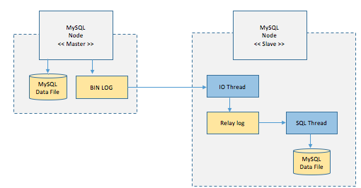
</div>

```
처리순서
- Master node는 데이터를 저장하고, 트랜잭션에 대한 로그 BIN LOG에 저장(시간 순)
- Slave node는 BIN LOG 복사(IO Thread가 수행)
- Replay Log에 기록됨
- SQL Thread가 읽어와 하나씩 수행하여 Data File에 저장
```

- **master / slaves** 로 구성 (single point of failure 해결)
    - **master DBMS** : 웹서버로 부터 데이터 등록/수정/삭제 요청시 바이너리로그(Binarylog)를 생성하여 Slave 서버로 전달 (**DML 처리만 수행**)
    - **slave DBMS** : Master DBMS로 부터 전달받은 바이너리로그(Binarylog)를 데이터로 반영 (**read만 수행, 여러대 가능**)
- 특정 노드는 쓰기를 담당하고, 나머지는 읽기 담당
- 방식이 단순하여 **신뢰도 높음**
- 데이터 복제가 동기방식이 아닌 비동기방식, master node에 적용한 데이터 변경사항이 slave에 반영될 때까지 일정시간 걸림 => **일시적 데이터 불일치성 발생 가능**

# MongoDB 사용 시(NoSQL)
## [ clustering ]
**Sharded cluster**

<div align='center'>
    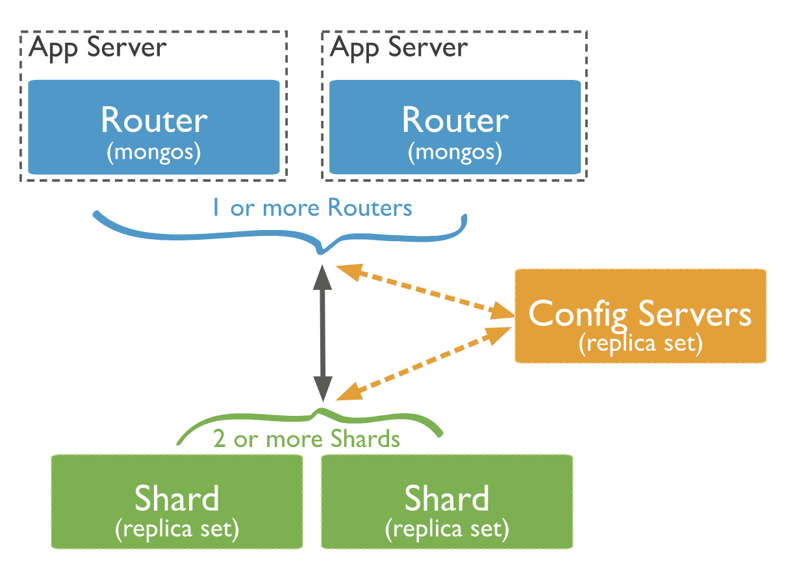
</div>

<div align='center'>
    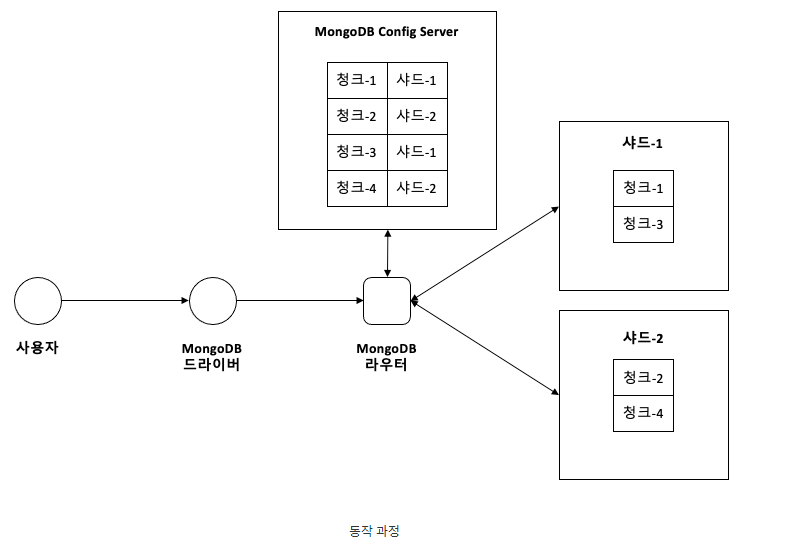
</div>

```
처리과정
- 쿼리가 참조하는 컬렉션의 Chunk metadata를 Config Server로부터 가져와 router의 메모리에 캐시한다.
- 쿼리의 조건에서 Sharding Key 조건을 찾는다.
- 1) Sharding Key 존재할 경우 : 해당 Sharding Key가 포함된 Chunk 정보를 router의 캐시에 검색하여 Shard서버로만 사용자 쿼리를 요청
- 2) Sharding Key 없을 경우 : 모든 Shard 서버로 쿼리를 요청한다.
- 쿼리를 전송한 대상 Shard 서버로부터 쿼리 결과가 도착하면 결과를 병합하여 사용자에게 결과를 반환한다.
```

- Mongodb는 직접 특정 Shard에 접근할 수 없음
- Query Router에 명령을 하고, Query Router가 Shard에 접근하는 방식(Config Server정보기반으로 data chunk 위치를 찾아가는 것도 이때 수행됨)
    - **query router** : 쿼리를 받아 각 샤드로 보내주는 역할, **데이터 저장되어 있진않고 router 역할만 수행**
    - **shard** : 실제 데이터가 저장되는 **저장소**
    - **config** : 어떤 shard가 어떤 데이터(data chunk)를 가지고 있는지, data chunk들을 어떻게 분산해서 저장하며 관리하라 지 알 수 있음
- 성능 문제를 위해 shard 여러개를 두고 분산처리
    - scaling을 통해 늘리고 즐일 수 있음
    - 보통 3개의 shard 구성(SPOF막기위해)
- Query Router는 Shard정보를 찾는 부분의 성능을 위해 **Config Server의 metadata를 cache로 저장**해둔다.
    - metadata : 데이터가 저장되어 있는 shard 정보 및 sharding key 정보


## [ replicaiton ]
**replica-set**
<div align='center'>
    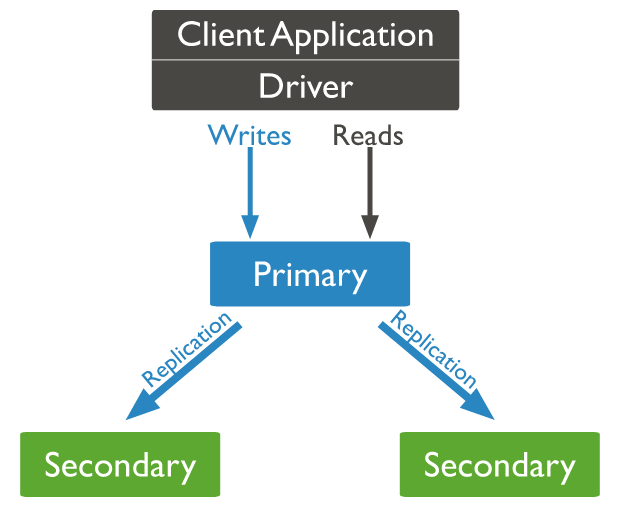
    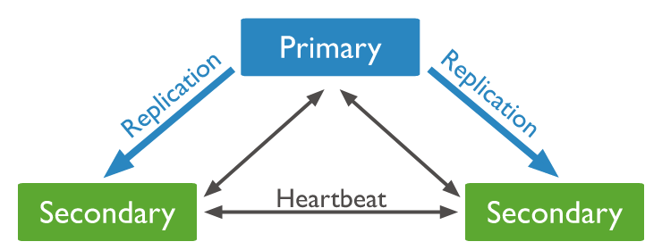
    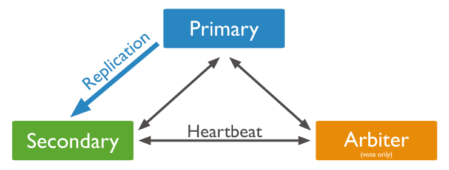
</div>

- **Primary node / Secondary node** 로 구성
    - Primary node : 모든 쓰기 작업 수행, 기본적으로 읽기 작업도 Primary 몫
- 노드 간 **heartbeat**을 통해 상태체크
- Primary node 사용할 수 없는 경우(장애나 네트워크 이슈) 적격한 Secondary node는 새로운 Primary 노드 선택을 위한 투표 개최 => **홀수 노드 구성이 좋다**
    - 짝수로 구성하게 되면 홀수로 구성한 경우와 다르지 않아 서버 낭비로 이어짐, 쿼럼(Quorum) 구성이 어려울 수 있음
- Arbiter 모드 : Primary node 선출을 위한 투표만 참여, 디스크 저장X, 하나 이상 필요 X

- - -

## ❓ 관련 질문
Q. 데이터베이스 클러스터링과 리플리케이션의 차이에 대해 설명해주세요.

Q. mongoDB에서 Config Server에 저장된 metadata는 무엇인가요?

Q. Replication의 구축목적은 무엇인가요?

## 📖 참고 자료
[MySQL 클러스터링을 위한 Galera Cluster](https://bcho.tistory.com/1062)

[[10분 테코톡] 히브리의 Sharding, Clustering, Replication](https://youtu.be/y42TXZKFfqQ)

[Replication과 Clustering](https://tecoble.techcourse.co.kr/post/2021-09-18-replication_clustering/)

[MongoDB Clusters](https://www.mongodb.com/basics/clusters)

[[MongoDB]Sharding](https://ozofweird.tistory.com/entry/MongoDB-Sharding)

