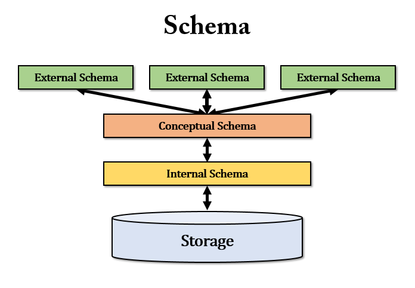

# 📕스키마란 무엇인가?
___

스키마는 데이터베이스의 구조와 제약 조건에 관한 전반적인 명새를 기술한 메타데이터의 집합이다.

> 메타데이터(meta data): 데이터에 대한 데이터로 어떤 목적을 가지고 만들어진 데이터

상세히 설명하면, 데이터베이스를 구성하는 데이터 개체(Entity), 속성(Attribute), 관계(Relationship) 및 데이터 조작 시 데이터 값들이 갖는 제약 조건 등에 관해 전반적으로 정의한다.

위의 정의를 들으면 동일한 특징을 가진 ERD가 생각이 난다.

ERD(Entity Relationship Diagram): 개체-관계 모델로 테이블간의 관게를 설명해주는 다이어그램이다. 테이블의 속성들을 상세히 표시하기도 한다.

>### 스키마와 ERD의 차이점은 무엇일까?
>간단히 말하면, ERD(Entity Relationship Diagram)은 설계도이고, 스키마는 구현의 차이이다.
데이터베이스를 생성하기 전에, 설계를 미리 생각을 해야 합니다. 그때 작성하는 것이 ERB입니다.
그것을 통해서 데이터베이스를 생성을 하면 DBMS에서 생성하는 게 스키마이다.

## 스키마의 특징

스키마는 데이터 사전(Data Dictionary)에 저장되며, 다른 이름으로 메타데이터라고 한다.

> 데이터 사전(Data Dictionary): 데이터베이스 관리 시스템(DBMS)을 효율적으로 사용하기 위해 데이터베이스에 저장된 정보를 요약한 것읠 의미

시간에 따라 불변인 특성을 갖는다.

데이터의 구조적 특성을 의미하며, 인스턴스에 의해 규정된다.

## 스키마의 3계층
데이터 관리 시스템(DBMS)은 외부적 스키마에 따라 명시된 사용자의 요구를 개념적 스키마에 적합한 형태로 변경하고 이를 다시 내부적 스키마에 적합한 형태로 변환한다.

스키마의 3계층 사용자의 관점에서 설계된 것이다. 외부 스키마는 사용자의 입장, 내부 스키마는 사용자의 관점으로 데이터베이스의 전체적인 구조와 논리적으로 정의한 것, 
외부 스키마는 컴퓨터의 입장에서 데이터의 저장 위치등 등을 나타낸 것이다.

제목에 있는 '='은 등의어를 나타낸 것이다.

### 외부 스키마(External Schema) = 사용자 뷰(View) = 서브 스키마(Sub Schema)
- 외부스키마는 사용자나 응용프로그래머가 각 개인의 입장에서 필요로 하는 데이터베이스의 논리적 구조를 정의한 것이다.

- 외부스키마는 전체 데이터베이스의 한 논리적 부분으로 볼 수 있으므로 서브 스키마(Sub Schema)라고도 한다.

- 하나의 데이터베이스 시스템에는 **여러개의 외부 스키마**가 존재할 수 있으며 하나의 외부 스키마를 여러개의 응용 프로그램이나 사용자가 공유할 수 도 있다.

- 같은 데이터베이스에 대해서도 서로 다른 관점을 정의할수 있도록 허용한다.

- 일반 사용자는 질의어(SQL)을 이용하여 DB를 쉽게 사용할 수 있다.

- 응용 프로그래머는 C,JAVA등의 언어를 사용하여 DB에 접근한다.

### 개념 스키마(Conceptual Schema) = 전체적인 뷰(View)
- 개념 스키마는 데이터베이스의 전체적인 논리적 구조로서, 모든 응용 프로그램이나 사용자들이 필요로하는 데이터를 종합한 조직 전체의 데이터베이스로 하나만 존재한다.

- 개념 스키마는 개체간의 관계와 제약 조건을 나타내고, 데이터베이스의 접근 권한, 보안 및 무곃성 규칙에 관한 명세를 정의한다.

- 데이터베이스 파일에 저장되는 데이터의 형태를 나타내는 것으로 단순히 스키마(Schema)라고 하면 개념 스키마를 의미한다.

- 기관이나 조직체의 관점에서 데이터베이스를 정의한다.

- 데이터베이스 관리자(DBA)에 의해서 구성된다.

### 내부 스키마(Internal Schema) = 저장 스키마(Storage Schema)

- 내부 스키마는 물리적 저장장치(컴퓨터)의 입장에서 본 데이터베이스 구조로 물리적인 저장장치와 밀접한 계층이다.

- 내부 스키마는 실제로 데이터베이스에 저장될 레코드의 물리적인 구조를 정의하고, 저장 데이터 항목의 표현방법. 내부 코드의 물리적 순서등을 나타낸다.

- 시스템 프로그래머나 시스템 설계자가 보는 관점의 스키마이다.