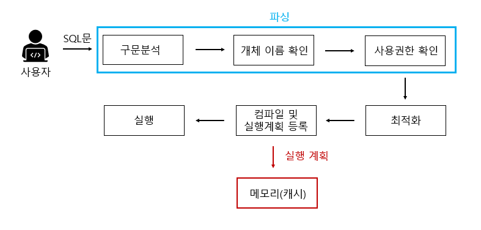
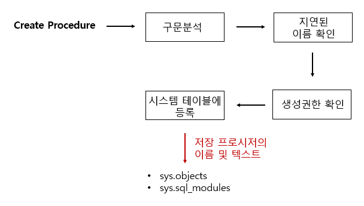
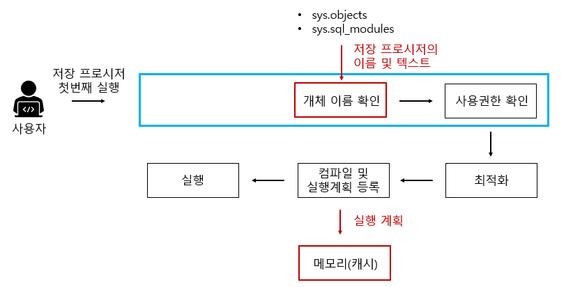
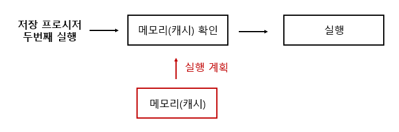
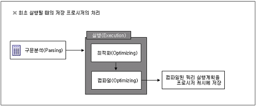

# 저장 프로시저(Stored Procedure, SP)

> 일련의 쿼리를 마치 하나의 **함수**처럼 실행하기 위한 **쿼리문들의 집합**

✔ 즉, **특정 로직의 쿼리를 함수로 만들어 놓은 것**

> **저장프로시저와 함수의 차이**
>
> - 저장 프로시저 :
> 일련의 작업을 저리한 절차, 리턴값이 없거나 많을 수도 있음, 
> 서버에서 실행되기 때문에 속도가 빠르다
>
> - 함수 :
> 여러 작업을 위한 기능, 리턴값이 필수, 
> 클라이언트에서 실행되기 때문에 프로시저보다 느리다

<br>

## 일반 쿼리문 vs 저장 프로시저
### [ 일반 쿼리문 작동 방식 ]
<div align='center'>
    
</div>

#### 🙋‍♀️예시
```
SELECT name FROM userTbl;
```

1. **`구문 분석`** : 구문 자체에 오류가 없는지 분석, 오타가 있으면 이 단계에서 에러메시지 출력
2. **`개체 이름 확인`** : userTbl 이라는 테이블이 현재 데이터베이스에 있는지 확인, 만약에 userTbl이 있으면 그안에 name이라는 열이 있는지를 확인
3. **`사용권한 확인`** : userTbl을 현재 접근중인 사용자가 권한이 있는지를 확인
4. **`최적화`** : 해당 쿼리문이 가장 좋은 성능을 낼 수 있는 경로를 결정, 인덱스 사용여부에 따라 경로가 결정됨. 위의 쿼리의 경우 전체 데이터를 가져오기 때문에 아마도 테이블 스캔이나 클러스터 인덱스 스캔이 될 것이다.
5. **`컴파일 및 실행 계획 등록`** : 해당 실행계획 결과를 메모리(캐시)에 등록
6. 컴파일된 결과 **`실행`**

<br>

### [ 저장 프로시저 ]
### 🥚 1. 저장프로시저 정의 단계
<div align='center'>
    
</div>

- **`구문분석`** : 구문의 오류 파악
- ✔ **`지연된 이름 확인`** : 저장 프로시저를 정하는 시점에서 해당 개체(ex. 테이블)가 존재하지 않아도 상관없다. 프로시저 실행 당시에 테이블 존재 여부 확인함(개체이름 확인).
- **`생성권한 확인`** : 현재 사용자가 저장 프로시저를 생성할 권한이 있는지 확인
- **`시스템 테이블 등록`** : 저장 프로시저의 이름 및 코드가 시스템 테이블에 등록.

> 지연된 이름 확인의 경우, 테이블이 존재한다면 확인하기 때문에 테이블의 열,이름이 틀리면 오류발생
> <br> 실무에서 없는 테이블 프로시저 정의에 사용하는 등의 실수에 주의해야한다.

### 🐣 2. 처음 저장 프로시저 실행
<div align='center'>
    
</div>

구문 분석 단계를 제외하고 일반적 쿼리문과 동일

지연된 이름 확인에서 미루어 두었던 해당 개체 존재 유무를 개체 이름 확인을 통해 수행한다.

### 🐥 3. 이후 저장 프로시저 실행
<div align='center'>
    
</div>

<br>

## 🤔 굳이 저장 프로시저를 써야하나? (장점)
<div align='center'>
    
</div>

1. **SQL Server의 성능을 향상**
    - 여러개의 쿼리를 한번에 실행할 수 있다.
    - 캐시에 있는 것을 가져와 사용하므로 속도가 빨라진다.
    - 쿼리를 쓸 때마다 옵티마이저가 구문을 분석하고 실행 가능한 코드로 바꿀려면 많은 비용이 드는데, 이 비용을 없앨 수 있음

2. **유지보수 및 재활용 측면**에서 좋다.
    - 개발 언어에 비의존적
    - 응용프로그램에서 직접 SQL문을 호출하지 않고 SP를 호줄하도록 설정하여 사용하는 경우가 많다. SP 파일만 수정하면 되기 때문에 유지보수에 유리하다.

3. **보안을 강화**
    - 사용자 별로 테이블에 권한을 주지 않고, SP에만 접근 권한을 주는 방식

4. **네트워크 부하 줄일 수 있음**
    - 클라이언트에서 서버로 쿼리의 모든 텍스트가 전송될 경우 네트워크에는 큰 부하가 발생
    - 저장 프로시저를 사용하면 저장프로시저의 이름, 매개변수 등 몇글자만 전송하면 되기 때문에 부하를 크게 줄일 수 있다.

<br>

## 🤨 단점
1. **DB 확장 어려움**
    - 서버의 수를 늘려야할 때, DB의 수를 늘리는 것이 더 어렵다. 
    - DB 교체는 거의 불가능하다.

2. **데이터 분석의 어려움**
    - 개발된 프로시저가 여러 곳에서 사용 될 경우 수정했을 때 영향의 분석이 어렵다(별도의 Description 사용).
    - 배포, 버전 관리 등에 대한 이력 관리가 힘들다.
    - APP에서 SP를 호출하여 사용하는 경우 문제가 생겨도 해당 이슈에 대한 추적이 힘들다(별도의 에러 테이블 사용).

3. **낮은 처리 성능**
    - 문자, 숫자열 연산에 SP를 사용하면 오히려 c, java보다 느린 성능을 보일 수 있다.

<br>

## 📌 문법과 예시
### [ 예시 1 : 프로시저 정의 ]
```
DELIMITER $$
CREATE PROCEDURE 'TEST_PROC' (
    -- 파라미터 선언
    PARAM_NAME VARCHAR(20),
    PARAM_AGE INT
)
BEGIN
    -- 변수 선언
    DECLARE PARAM_NUM INTEGER;
    
    -- 쿼리문1
    SELECT COUNT(*) + 1
    	INTO PARAM_NUM
        FROM table1;
        
    -- 쿼리문2
    INSERT INTO table1(total_count, user_name, user_age) VALUES(PARAM_NUM, PARAM_NAME, PARAM_AGE);
END $$
DELIMITER ;
```

`파라미터 선언`은 프로시저명()안에서 선언

`SQL문`과 `변수 선언`은 BEGIN ~ END 사이 작성

`SELECT` 사용시 조회한 컬럼(데이터)을 반드시 `INTO`로 변수 안에 넣어줘야함

프로시저 내부 SQL문은 일반 SQL문이기 때문에 `세미콜론(;)`으로 문장을 끝맺음

> `DELIMITER` : 프로시저 작성이 완료되지 않았음에도 SQL문이 실행되는 것을 막기위해 사용

### [ 예시 1 : 호출 ]
```
CALL TEST_PROC('테스트이름', 21);
```

`CALL 프로시저명(파라미터);` 로 함수처럼 사용 가능

프로시저를 호출하면 `DataBase카탈로그`에서 프로시저 이름을 찾아 `SQL문을 컴파일`하고 `메모리 공간(Cache)`에 저장한 뒤 프로시저를 실행시킨다.

`If, case, loop` 같은 제어,반복문을 사용해 보다 향상된 SQL코드를 작성할 수 있고 프로시저 내에서 다른 프로시저를 호출할 수도 있다.

### [ 예시 2 : IN,OUT,INOUT 사용 ]
```
DELIMITER $$
CREATE PROCEDURE 'TEST_PROC2'(
    IN loopCount1 INT,     -- input : 10
    IN loopCount2 INT,     -- input : 20
    OUT rst1 INT,
    OUT rst2 INT,
    INOUT rst3 INT
)
BEGIN
    DECLARE NUM1 INTEGER DEFAULT 0;    -- DEFAULT : 초기값 설정
    DECLARE NUM2 INTEGER DEFAULT 0;
    DECLARE NUM3 INTEGER DEFAULT 0;
    
    WHILE NUM1<loopCount1 DO           -- NUM1은 0~9까지 10번반복
        WHILE NUM2<loopCount2 DO       -- NUM2는 0~19까지 20번반복
            SET NUM3 = NUM3 + 1;
            SET NUM2 = NUM2 + 1;
        END WHILE;                     -- NUM2가 19가 되면 나옴
        
        SET NUM1 = NUM1 + 1;
        SET NUM2 = 0;
    END WHILE;
    
    SET rst1 = NUM1;
    SET rst2 = NUM3;
    SET rst3 = rst1 + rst2 + rst3;
END $$
DELIMITER ;
```

**`IN`**

- 프로시저에 값을 전달하며, 프로시저 내부에서 값을 수정할 수는 있지만 프로시저가 반환되고 나서 호출자가 수정은 불가능
- 즉 원본 값은 프로시저가 끝난 후에도 유지되며, 프로시저는 IN 파라미터의 복사본을 사용한다.

**`OUT`**

- 프로시저의 값을 호출자에게 다시 Return
- 초기값은 프로시저 내에서 NULL이며 프로시저가 반환될 때 새로운 값이 호출자에게 Return되고 프로그램이 시작될 때, OUT 파라미터의 초기값에 접근할 수 없다.

**`INOUT`**

- IN+OUT
- 호출자에 의해 하나의 변수가 초기화되고 프로시저에 의해 수정된다.
- 프로시저가 Return될 때 프로시저가 변경한 사항은 호출자에게 Return된다.

<br>

### [ 예시 2 : 호출 ]
```
-- 변수 초기화
DECLARE @NUM1 = 0;
DECLARE @NUM2 = 0;
DECLARE @NUM3 = 0;

-- NUM3에 값 30 할당(@는 전역변수, 프로시저가 끝나도 계속 유지되는 값)
SET @NUM3 = 30;
-- (10(IN), 20(IN), Return받을 변수(OUT), Return받을 변수(OUT), Return도 받고 값도 가지고 있는 변수(INOUT))
CALL TEST_PROC2(10, 20, @NUM1, @NUM2, @NUM3);

SELECT @NUM1, @NUM2, @NUM3;
-- RESULT => @NUM1 : 10, @NUM2 : 200, @NUM3 : 240
```

### 프로시저 목록 확인
```
SHOW PROCEDURE STATUS;
```

### 프로시저 내용 확인
```
SHOW CREATE PROCEDURE 프로시저이름;
```

### 프로시저 삭제
```
DROP PROCEDURE 프로시저이름;
```

<br>


* * *

### ❓ 관련 질문
Q. 함수와 프로시저의 차이

Q. 저장 프로시저의 장점

Q. 저장 프로시저 내에서 저장 프로시저를 호출할 수 있습니까?


### 📖 참고 자료
[저장 프로시저 (Stored Procedure)](https://velog.io/@sweet_sumin/%EC%A0%80%EC%9E%A5-%ED%94%84%EB%A1%9C%EC%8B%9C%EC%A0%80-Stored-Procedure)

[[MSSQL] 저장 프로시저 (Stored Procedure) 란?](https://devkingdom.tistory.com/323)

[[MySQL] 스토어드 프로시저(Stored Procedure) 기본](https://spiderwebcoding.tistory.com/7)

[[Database] 저장 프로시저(Stored Procedure)](https://pangtrue.tistory.com/196)
