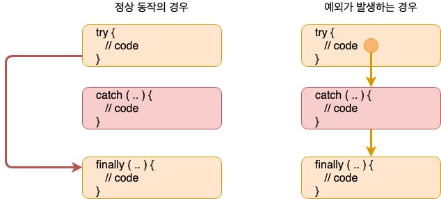
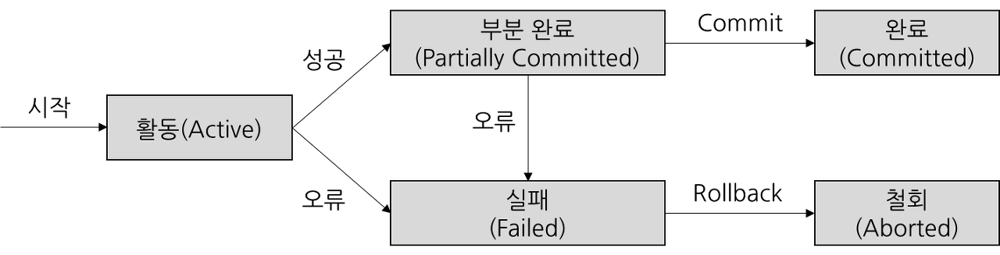
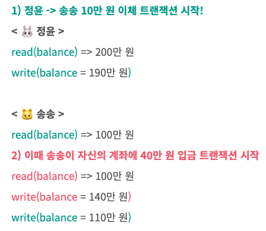

> [해당 포스팅](https://hello-judy-world.tistory.com/195)에서도 내용을 확인할 수 있습니다.

> written by [judy](https://github.com/ParkJungYoon)

## 🔎 트랜잭션 (Transaction) #1

대용량 데이터 **동기화** 등을 처리하다 보면 개발자가 트랙잭션을

어떻게 처리 하느냐에 따라 **데이터의 정합성** 등에 영향을 주게 된다. 

그래서 백엔드 개발자로서 **트랜잭션**은 중요한 개념이다.

## 개념과 ACID 속성

- 트랜잭션은 데이터베이스에서 <u>**하나의 논리적 기능을 수행하기 위한 작업의 단위**</u>를 말하며 데이터베이스에 접근하는 방법은 쿼리이므로, 즉 **여러 개의 쿼리들을 하나의 묶는 단위**를 말한다.

- 트랜잭션은 **데이터의 정합성을 보장**하기 위한 기능이다.

- 논리적인 작업 셋을 모두 완벽하게 처리(`Commit`)하거나 또는 처리하지 못할 경우에는 원 상태로 복구(`Rollback`)해서 작업의 일부만 적용되는 현상이 발생하지 않게 만들어주는 기능이다.

#### COMMIT

- 지금까지 작업한 내용을 DB에 영구적으로 저장한다.
- transaction을 종료한다.

#### ROLLBACK

- 지금까지 작업들을 모두 취소하고 transaction 이전 상태로 되돌린다.
- transaction을 종료한다.

#### AUTOCOMMIT

- 각각의 쿼리에 자동으로 transaction 처리를 해주는 개념
- 쿼리가 성공하면 자동으로 commit 한다.
- 실행 중에 문제가 생기면 rollback 한다.
- MySQL에서는 default로 autocommit이 enabled 되어 있다.
- MySQL에서 START TRANSACTION 실행을 하면 그 동시에 autocommit은 off된다.
- COMMIT/ROLLBACK과 함께 transaction이 종료되면 원래 autocommit 상태로 돌아간다.

내용 참 많다. 두 줄 요약

> 트랜잭션은 데이터베이스에서 하나의 논리적 기능을 수행하기 위한 작업의 단위 <br>
all or nothing | 완료 -> Commit, 실패 -> Rollback

<br>

### [ 예시 : 계좌 간의 자금 이체 ]

한 계좌에서 10만 원을 인출하여 다른 계좌로 10만 원 입금하는 이체 작업은 전체 작업이 **정상적으로 완료**되거나, 만약 정상적으로 처리될 수 없는 경우에는 **아무것도 실행되지 않은** 처음 상태로 되돌려져야 한다.

더 자세하게 상황을 살펴보자.

주디가 송송에게 10만 원을 이체하려고 한다.

```
🐰 주디 계좌 : 200만 원
🐱 송송 계좌 : 100만 원
```

이때 두 가지 작업이 일어난다.

<br>

#### 1) 🐰 주디 계좌 - 10만 원

```sql
UPDATE account SET balance = balance - 100000 WHERE id = "주디";
```

#### 2) 🐱 송송 계좌 + 10만 원

```sql
UPDATE account SET balance = balance + 100000 WHERE id = "송송";
```

이때 이 두 작업 중 하나만 성공한다면 정상적인 작업이 아니다.

두 가지 작업 모두 성공해야 '이체'라는 기능이 성공하기 때문에 이 작업을 묶은 것을 `트랜잭션`이라고 한다.

<br>

### [ 예시 : MySQL ]

위의 예시를 MySQL로 살펴보자.

```sql
START TRANSACTION;
UPDATE account SET balance = balance - 100000 WHERE id = "주디";
UPDATE account SET balance = balance + 100000 WHERE id = "송송";
COMMIT;
```

트랜잭션이 종료되면 주디와 송송의 계좌에는 각각 190만 원, 110만 원이 있다. 

```
🐰 주디 계좌 : 190만 원
🐱 송송 계좌 : 110만 원
```

이때 한번 더 작업을 수행한다.

UPDATE문이 수행된 직후 주디 계좌에는 180만 원이 있다.

```sql
START TRANSACTION;
UPDATE account SET balance = balance - 100000 WHERE id = "주디";
ROLLBACK;
```

이때 롤백하게 되면 주디 계좌에 돈은 다시 190만 원이 된다.

<br>

### [ 예시 : JAVA ]

트랜잭션 부분만 대략적으로 코드로 보자.

```java
public void transfer(String fromId, String toId, int amount) {
        try {
            Connection connection = ...;      // get DB connection ..
            connection.setAutoCommit(false);  // means START TRANSACTION
            ...                               // update at fromId
            ...                               // update at toId
            connection.commit();
        } catch (Exception e) {
            ...
            connection.rollback();
            ...
        } finally {
            connection.setAutoCommit(true);
        }
}
```

<div align='center'>
    
</div>
<br>

스프링 부트에서는 `@Transactional` 이라는 어노테이션으로 간단하게 구현할 수 있다.

<br>

### ✔️ 트랜잭션  상태

위에서 알게된 Commit과 Rollback은 트랜잭션이 어떤 상태일 때 발생할 수 있을까

<div align='center'>
    
</div>
<br>

- **Active**: 트랜잭션이 실행 중이며 동작 중인 상태
- **Partially Committed**: 트랜잭션이 실행되고 데이터 변경을 DB에 적용 전 메모리 공간에만 변경해놓은 상태.
- **Committed**: 트랜잭션이 정상적으로 완료 상태. 즉 실제로 메모리에에서 DB에 데이터를 쓴 상태. Rollback 불가능.
- **Failed**: 오류로 트랜잭션 실패 상태.
- **Aborted**: 트랜잭션이 취소 상태. 트랜잭션 실행 이전 데이터로 돌아감.

<br>

### ✔️ ACID 속성

#### 1) 원자성(`Atomicity`)

- 트랜잭션과 관련된 일이 **모두 수행되었거나 되지 않았거나**를 보장하는 특징이다.
- all or nothing
- <u>Commit 이전</u>에는 디스크에 쓰지 않고 **메모리 버퍼에만 저장**해 두었다가 중간에 실패하면 디스크에 반영하지 않는 방식

<br>

#### 2) 일관성(`Consistency`)

- 트랜잭션이 완료된 다음의 상태에서도 트랜잭션이 일어나기 전의 상황과 **동일하게** 데이터의 일관성을 보장해야 한다.
- 그래서 constraints, trigger 등을 통해 DB에 정의된 rules을 transaction이 위반했다면 rollback 해야 한다.

<br>

#### [ 예시 : 주디 -> 송송 이체 ]

위에 예시를 다시 가지고 와서 주디와 송송의 계좌에는 현재 각각 200만 원, 100만 원이 있다.

```
🐰 주디 계좌 : 200만 원
🐱 송송 계좌 : 100만 원
```

이때 주디가 210만 원을 추가 이체한다고 생각해보자.

그럼 주디의 계좌는 -10만 원이 된다.

그런데 account 테이블에 balance가 음수가 될 수 없다는 제약사항이 있다.

```sql
CREATE TABLE account (
    ...,
    balance INT,
    check (balance >= 0)
)
```

그렇다면 210만 원을 이체하는 UPDATE문은 <u>일관성을 깨뜨리기 때문에</u>(`Inconsistent`) 실패하게 된다.

그래서 롤백한다.

<br>

#### 3) 격리성(`Isolation`)

- 각각의 트랜잭션이 서로 간섭 없이 **독립적으로 수행**되는 것을 말한다.
- 복수의 병렬 트랜잭션은 서로 격리되어 마치 순차적으로 실행되는 것처럼 작동되어야 하고, 데이터베이스는 여러 사용자가 같은 데이터에 접근할 수 있어야 한다.
- 여러 종류의 `isolation level`을 제공한다. 

<br>

#### [ 예시 : 주디 -> 송송 이체, 송송 ATM -> 송송 입금 ]

동시에 트랜잭션이 실행하는 경우 문제가 생길 수 있다. 그래서 isolation은 트랜잭션에서 중요한 특징이다.

```
🐰 주디 계좌 : 200만 원
🐱 송송 계좌 : 100만 원
```



* 마크다운 색상이 적용 문제로 이미지로 대체

<br>

#### 4) 지속성(Durability)

- 성공적으로 수행된(=커밋된) 트랜잭션은 **영구적으로** 데이터베이스에 작업의 **결과가 저장**되어야 한다.
- 시스템 장애가 발생해도 원래 상태로 복구하는 기능이 있다. (체크섬, 저널링, 롤백)

아래 그림처럼 완료된 상태에서 철회할 수 없다.

<div align='center'>
    
</div>

<br>

❓ 왜 트랜잭션을 공부해야할까

💡 transaction을 어떻게 정의하고 사용할 지는 개발자의 역량이다.

구현하려는 기능과 ACID 속성을 이해해야 transaction을 적절하게 정의할 수 있다.

---

### 📌 Reference

- [[NAVER D2] DBMS는 어떻게 트랜잭션을 관리할까?](https://d2.naver.com/helloworld/407507)
- 쉬운 코드 채널
