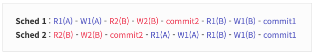
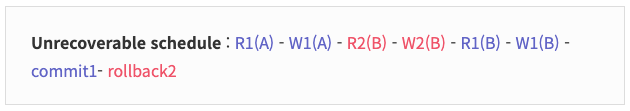
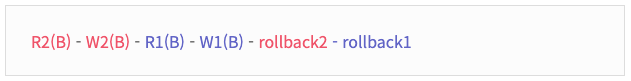
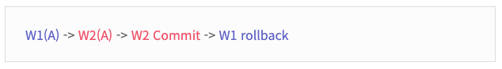
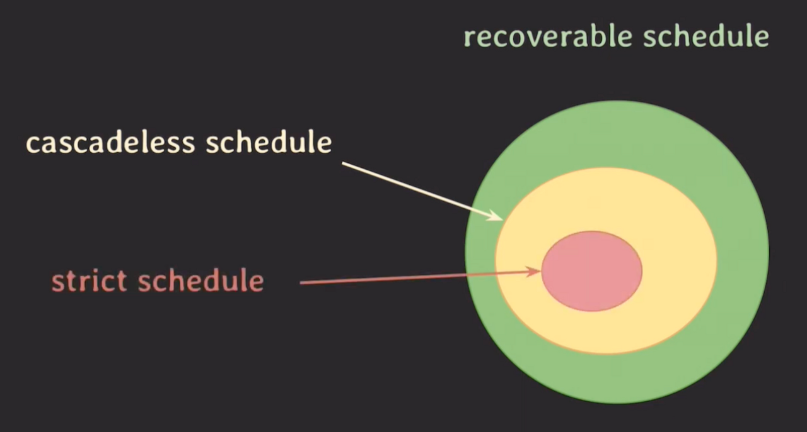

> [해당 포스팅](https://hello-judy-world.tistory.com/196)에서도 내용을 확인할 수 있습니다.

> written by [judy](https://github.com/ParkJungYoon)

## 🔎 트랜잭션 (Transaction) #2

1부에서 트랜잭션에 대한 개념과 속성에 대해서 알아봤다.
ACID 중 '`Isolation`'은 복수의 트랜잭션을 동시에 실행할 경우, 이상 현상이 일어나지 않도록 한다.
이것을 보장하기 위한 중요한 속성이 `Serializability`과 `Recoverable`이다.

* 참고로 DBMS의 `concurrency control`(동시성 제어)이 이 두 가지를 제공해야 한다.

## concurrency control(동시성 제어)

### 1. Serializability

위의 ACID 중 Isolation에 이런 설명이 있었다.

> 복수의 병렬 트랜잭션은 서로 격리되어 **마치 순차적으로 실행되는 것처럼** 작동되어야 하고, 데이터베이스는 여러 사용자가 같은 데이터에 접근할 수 있어야 한다.

마치 순차적으로 실행되는 것처럼???? 😲 <br>
그래 이게 **Serializability**이다.

내용에 들어가기에 앞서 예시를 위해 용어를 정리하고 가자.

```
R1(A) : A에 대한 트랜잭션1 Read 작업
W1(A) : A에 대한 트랜잭션1 Write 작업
operation : R1(A)와 같은 작업
schedule : 여러 transaction들이 동시에 실행될 때 각 transaction에 속한 operation들의 실행 순서
```

<br>

### ✔️ Serial schedule

> transaction들이 겹치지 않고 한 번에 하나씩 실행되는 schedule <br>
즉, 🍽️ **식당**에 자리가 하나라서 합석하지 않고 한 명이 식사가 끝나면 다음 손님이 앉아 식사하는 것이다.

#### [ 장점 ]

직렬화의 장점은 하나씩 수행되기 때문에 순서와 정합성이 보장된다는 것이다.

#### [ 단점: 성능 ]

하지만 R1(A)와 W1(A) 작업은 디스크 I/O 작업이다. 이 오래 걸리는 작업을 하는동안 CPU는 놀고 있기 때문에 낭비된다.

즉, 좋은 성능을 낼 수 없다.

현실에서는 사용할 수 없다.

<br>

### ✔️ non-serial schedule

> transaction들이 겹쳐서(interleaving) 실행되는 schedule <br>
즉, 🍽️ **식당**에 자리를 늘려서 한 명이 식사 중이더라도 다음 손님은 다른 자리에 앉아서 식사할 수 있다.

#### [ 장점 : 성능 ]

이번에는 병렬적으로 처리하기 때문에 **동시성**이 높아진다.

그래서 같은 시간에 더 많은 transaction을 처리할 수 있다.

R1(A)와 W1(A) 작업와 같은 오래 걸리는 디스크 I/O 작업을 하는 동안 트랜잭션2와 같은 다음 작업을 수행할 수 있다.

#### [ 단점: 이상 현상 ]

transaction이 어떤 형태로 겹쳐 실행되는지에 따라 의도치 않은 결과가 나올 수 있다.

<br>

🤯 : 엥 그럼!! 어쩌라는거야!?!

🐰 **주디** : 트랜잭션을 겹쳐서 실행하면서(non-serial schedule) 성능을 높이고, 이상 현상은 없게 만들면 돼!

😲💡: serial schedule과 동일한 결과를 내면서 non-serial schedule를 실행하자!

그래 하나씩 알아보자. <br>
쉽게 말하면 **병렬적으로 처리하면서 순차적으로 실행했는 것과 결과가 동일하게 낼 수 있는 방법은 conflict serializable**이다.

<br>

### ✔️ Conflict serializable ⭐️

> **Conflict serializable** : serial schedule과 conflict equivalent일 때 <br>
non-serial schedule이지만 Conflict serializable일 때 정상적인 결과를 낼 수 있다.

결론이 나왔다. **conflict serializable**. 그래 이것이 뭔지 알기 위해 Conflict와 Conflict equivalent 설명을 읽고 오자.

<br>

### ✔️ Conflict

> 두 개의 operation이 세 가지 조건을 모두 만족하면 conflict라고 한다.
 
```
1. operation이 서로 다른 트랜잭션 소속
2. operation이 같은 데이터에 접근
3. 최소 하나는 write operation
```

### [ 예시 ]

아래 예시에서는 R2(B)와 W1(B), W2(B)와 R1(B), W2(B)와 W1(B)가 conflict다.


💡 이것이 중요한 이유는 복수의 트랜잭션이 동시에 처리될때 conflict operation은 실행 순서가 바뀌면 실행 결과도 바뀐다.

<br>

예를 들어 W2(B)와 R1(B)를 보자.

- B 계좌 기존 잔액 : 100만 원 / 트랜잭션2는 30만 원 입금.
- **기존)** W2(B) -> R1(B) : B에 130만 원 쓰기. **B에서 130만 원 읽음.**
- **순서가 바뀜)** R1(B) -> W2(B) : **B에서 기존 잔액 100만 원 읽기.** B에서 130만 원 쓰기.
- 순서가 바뀌면 트랜잭션1이 B에서 읽어온 값이 달라진다.

<br>

### ✔️ Conflict equivalent

> 두 개의 schedule이 두 가지 조건을 모두 만족하면 conflict equivalent

```
1. 두 schedule은 같은 transaction을 가진다.
2. 두 schedule 내에 conflict operation의 실행 순서가 동일하다.
```

### [ 예시 ]

1. Sched 1과 Sched 2는 같은 transaction을 가지고 conflict operation의 실행 순서가 동일하다. **(= conflict equivalent)**
2. Sched 2는 트랜잭션이 순차적으로 실행된다. (=serial schedule)



💡 즉, **serial schedule과 conflict equivalent일 때 <u>conflict serializable</u>이라고 한다.**

<br>

그럼 RDBMS는 이상 현상 없이 데이터의 무결성을 위해 <u>**conflict serializable한 non-serial schedule를 허용**</u>할 것이다.

그럼 이것을 어떻게 구현할까.

schedule이 conflict serializable하도록 보장하는 **프로토콜**을 적용하면 된다.

> 마치 순차적으로 실행되는 것처럼 작동되는 것이 Serializability이라고 했다.

💡 `concurrency control` : 어떤 schedule도 Serializable(Serializability)하게 동작하도록 해주는 것

💡 `Isolation`과 관련 있다.

<br>

### 2. Recoverability

> 트랜잭션이 실패했을 때의 회복 가능성

한 트랜잭션이 rollback 했을 때 다른 트랜잭션이 영향을 받지 않는 것 또한 isolation에 있어서 중요하다.

### ✔️ Unrecoverable schedule

> 롤백해도 이전 상태로 회복 불가능한 스케줄 (-> DBMS가 허용하면 안된다) <br>
schedule 내에서 commit된 transaction이 rollback된 transaction이 write 했던 데이터를 읽은 경우

### [ 예시 ]

rollback2를 하려고 한다.

`R2(B) - W2(B)`가 한 작업을 `R1(B) - W1(B)`가 작업했기 때문에 트랜잭션2도 rollback을 해야한다.

하지만 이미 트랜잭션1은 커밋했기 때문에 **durability(지속성)** 속성 때문에 rollback할 수 없다.

트랜잭션2가 작업이 완료되지 않은 상태에서 트랜잭션1이 읽는 경우가 **DIRTY READ** (더티 리드)이다.

> **DIRTY READ** (더티 리드): 어떠한 트랜잭션에서 처리한 작업이 완료되지 않았음에도 불구하고 다른 트랜잭션에서 볼 수 있게 되는 현상.



<br>

### ✔️ recoverable schedule

> 자신이 읽은 데이터를 write한 transaction이 먼저 commit, rollback 되기 전까지 commit하지 않는 스케줄

### [ 예시 ]

트랜잭션 2번이 먼저 commit/rollback한다.



### [ cascading rollback ]

위의 예시로 이야기하면 트랜잭션2가 rollback을 하면 트랜잭션1은 트랜잭션2의 결과를 읽어왔기 때문에 의존성을 지니고 있다.

그래서 트랜잭션1도 함께 rollback한다. 이것이 **cascading rollback**이다.

이것은 비용이 크다. 그래서 **cascadeless schedule**이 등장한다.

<br>

### ✔️ cascadeless schedule

> 데이터를 write한 transaction이 commit/rollback된 뒤에만 데이터를 읽을 수 있는 스케줄 <br>
즉, commit되지 않은 write한 데이터는 **읽지도** 않는다.

하지만 🍽️ **식당**에서 떡볶이 가격을 5000원이라고 생각해보자.

동시에 사장님(트랜잭션1)은 4000원으로 쓰려고 하고, 점장님(트랜잭션2)는 3000원으로 쓰려고 한다.

이 상태에서 트랜잭션1을 롤백하면 기존 가격인 5000원으로 돌아온다. 그러면 점장님(트랜잭션2)가 설정한 3000원 가격은 그대로 사라진다.



그래서 **strict scedule** 등장!

<br>

### ✔️ strict scedule

> commit되지 않은 write한 데이터는 **읽지도 쓰지도** 않는다.

좀 더 엄격한 스케줄이 나왔다.

<br>

### 정리

<div align='center'>
    
</div>

<br>

> 회복 가능한 속성이 Recoverability이라고 했다.

💡 `concurrency control` : 어떤 schedule도 Recoverable(Recoverability)하게 동작하도록 해주는 것

💡 `Isolation`과 관련 있다.

---

### 📌 Reference

- [[NAVER D2] DBMS는 어떻게 트랜잭션을 관리할까?](https://d2.naver.com/helloworld/407507)
- 쉬운 코드 채널