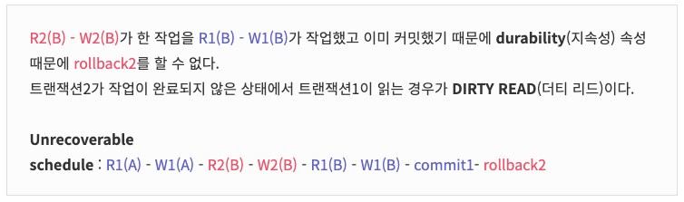
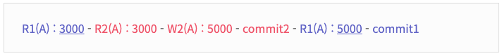
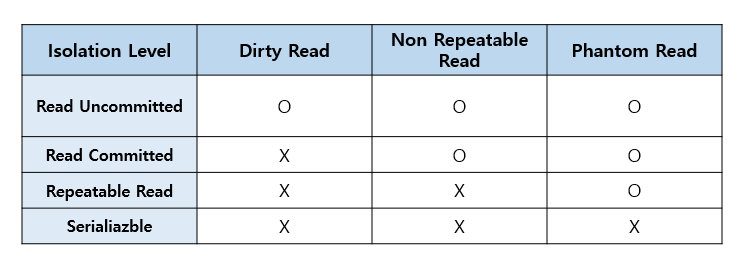

> [해당 포스팅](https://hello-judy-world.tistory.com/197)에서도 내용을 확인할 수 있습니다.

> written by [judy](https://github.com/ParkJungYoon)

## 🔎 트랜잭션 (Transaction) #3

2부에서 concurrency control(Serializability, Recoverability)에 대해서 알아봤다.

트랜잭션의 Isolation이 제대로 유지되려면 복수의 트랜잭션을 동시에 실행할 경우, 이상 현상이 일어나지 않도록 한다.

이것을 보장하기 위한 중요한 속성이 `Serializability`과 `Recoverable`이다.

즉, 이 두 가지 속성이 보장될 수 있도록 해야 한다.

하지만 이때 동시에 처리할 수 있는 트랜잭션의 수가 줄어들어서 DBMS의 퍼포먼스가 하락한다는 단점이 있다.

이를 해결하기 위해 DBMS의 **concurrency control**은 여러 종류의 **Isolation level**을 제공해서

개발자가 데이터 정합성과 성능 사이에서 어느 정도 트레이드 할 수 있도록 한다.

 

Isolation level에 대해 학습하기 전 Isolation이 안될 때 나타날 수 있는 현상들에 대해 먼저 살펴보자.

 

### ✔️ 격리 수준에 따라 발생하는 현상

### 1) DIRTY READ (더티 리드)

- 어떠한 트랜잭션에서 처리한 작업이 <u>완료되지 않았음에도 불구하고 다른 트랜잭션에서 볼 수 있게</u> 되는 현상.
- ex) 사용자  A가 키를 171에서 177로 변경한 내용이 '커밋되지 않은' 상태라도 그 이후 사용자 B가 조회한 결과가 177로 나오는 경우를 말한다.

이전 2부 `Unrecoverable schedule`에 대한 예시에서 더티 리드에 대해서 언급했다.

### [ 예시 ]

 

### 2) NON-REPEATABLE READ (반복 가능하지 않은 조회, FUZZY READ)

- 동일한 SELECT 쿼리를 실행했을 때 항상 같은 결과를 보장해야 한다는 "REPEATABLE READ" <u>정합성에 어긋나는 현상</u>.
- 한 트랜잭션 내의 같은 행에 두 번 이상 조회가 발생했는데, 그 값이 다른 현상이다.

### [ 예시 ]

[ 예시 ]

떡볶이 가격이 3000원이다. 트랜잭션1 내에서 같은 데이터를 두 번 Read를 했는 데 다른 값이 나왔다.

Isolation 속성에 따르면 복수의 트랜잭션이 동시에 실행해도 마치 혼자 실행하는 것처럼 동작해야 한다.

그런데 트랜잭션2에 영향을 받고 있다. 이것은 이상 현상이다.

 

### 3) PHANTOM READ (팬텀 리드)

- 한 트랜잭션 내에서 동일한 쿼리를 두 번 보냈을 때, 첫 번째 쿼리에서 존재하지 않던 유령(Phantom) 레코드가 두 번째 쿼리에서 나타나는 현상.
- ex) 사용자 A가 물품 테이블에 금액이 5000원 이상인 물품을 조회하는 쿼리를 보냄. -> **3개** 조회됨. -> 사용자 B가 금액이 6000원인 물품 레코드를 삽입한다. -> 그다음은 **4개**가 조회됨.

 

당연히 이런 이상 현상은 발생하면 안 된다.

하지만 이런 이상 현상을 모두 발생하지 않게 한다면 **제약사항이 많아져** 동시 처리 가능한 트랜잭션 수가 **줄어들게** 된다.

그러면 결국 DB의 **전체 처리량**(throughput)이 하락하게 된다.

그래서 일부 이상 현상은 허용하는 몇 가지 level을 만들어 개발자가 필요에 따라 적절하게 선택할 수 있도록 4단계로 그 수준을 분리했다.

 

##  트랜잭션 격리 수준 (Isolation level)

> SQL 표준에서 정의된 Isolation level

아래 표로 알 수 있듯이 엄격해질수록 이상 현상을 허용하지 않는다.

격리 수준은 세 가지 이상 현상을 정의한 뒤 어떤 현상을 허용하는지에 따라서 `Isolation level`이 나뉜다.

그래서 개발자는 이 Isolation level을 통해 `전체 처리량(throughput)`과 `데이터 일관성` 사이에서 trade할 수 있다.

    

 

### 1) READ UNCOMMITTED (커밋되지 않은 읽기) (팬텀 리드, 반복 가능하지 않은 조회, 더티 리드)

- 다른 트랜잭션에서 커밋되지 않은 내용도 조회할 수 있다.
- 무결성을 위해 사용하지 않는 것이 좋다.
 

### 2) READ COMMITTED (커밋된 읽기) (팬텀 리드, 반복 가능하지 않은 조회)

- 다른 트랜잭션에서 커밋된 데이터만 조회할 수 있다.
- 하지만 어떤 트랜잭션이 접근한 행을 **다른 트랜잭션이 수정할 수 있다.**
- 가장 많이 사용되는 격리 수준, 많은 데이터베이스의 default 값
 

### 3) REPEATABLE READ (반복 가능한 읽기) (팬텀 리드)

트랜잭션에 진입하기 이전에 커밋된 내용만 조회할 수 있다.
하나의 트랜잭션이 수정한 행을 **다른 트랜잭션이 수정할 수 없도록** 막아주지만 **새로운 행을 추가하는 것은 막지 않는다.**
 

### 4) SERIALIZABLE (직렬화 가능)

- 트랜잭션을 **순차적**으로 진행, 매우 엄격하다.
- 트랜잭션에 진입하면 **락을 걸어** 다른 트랜잭션이 접근하지 못하게 한다.
- **교착 상태**가 일어날 확률이 높고 **성능이 매우 떨어진다.**

위로 갈수록 동시성이 강해지지만 격리성은 약해지고, 아래로 갈수록 동시성은 약해지고 격리성이 강해진다.

 

#### 정리

- 주요 RDBMS는 SQL 표준에 기반해서 isolation level을 정의한다.
- RDBMS마다 제공하는 isolation level이 다르다.
- 같은 이름의 isolation level이라도 동작 방식이 다를 수 있다.
- 그래서 우리가 개발할 때에는 사용하는 RDBMS의 isolation level을 잘 파악해서 적절한 isolation level을 사용해야 한다.

 

---

### 📢  같이 공부하면 좋을 면접 질문

- 트랜잭션에 대해서 설명해 주세요. 그리고 왜 사용해야 하는지 말씀해 주세요.
    - 키워드 : 논리적인 작업 단위, 데이터베이스 안전성 보장
    - 트랜잭션이란 데이터베이스의 상태를 변화시키는 하나의 논리적인 작업 단위라고 할 수 있으며, 트랜잭션에는 여러 개의 연산이 수행될 수 있습니다. 트랜잭션은 수행 중에 한 작업이라도 실패하면 전부 실패하고, 모두 성공해야 성공이라고 할 수 있습니다.
- A 계좌에서 B계좌로 일정 금액을 이체하는 작업에 대해 생각해 봅시다. 이때 트랜잭션은 어떻게 정의할 수 있을까요?
- ACID에 대해서 설명해 주세요.
- 트랜잭션 격리 수준(Transaction Isolation Levels)에 대해서 설명해 주세요. 그리고 왜 필요한가요?
- 트랜잭션의 Commit 연산에 대해서 트랜잭션의 상태를 통해 설명해 주세요.
- 트랜잭션의 Rollback 연산에 대해서 트랜잭션의 상태를 통해 설명해 주세요.
- Partial Committed 상태에서 Committed 상태가 되는 과정에 대해 자세히 설명해 주세요.
- 트랜잭션을 사용할 때 주의할 점

 

---

### 📌 Reference

- [[NAVER D2] DBMS는 어떻게 트랜잭션을 관리할까?](https://d2.naver.com/helloworld/407507)
- 쉬운 코드 채널
- 주홍철, 『면접을 위한 CS 전공지식 노트』, 깃벗(2022), p224-231.