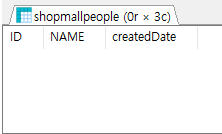
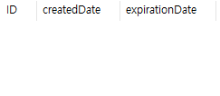
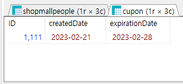

# 트리거란?
트리거는 총의 방아쇠를 의미로, 총알이 방아쇠를 당겨서 발사가 되듯이 어느 특정한 동작에 반응해 자동으로 필요한 동작을 하는 것을 의미한다. 이런한 의미로 DB에서는 아래와 같은 의미입니다<br/>
<br/>
>트리거(trigger): 어떤 트랜잭션이 일어나면 거기에 반응해서 다른 명령을 실행하게 하는 기능

<br/>

예를 들어 상품을 주문하였을 때, 자동을 배송 내역으로 들어가는 경우나, 회원가입을 하였을 때, 자동으로 가입을 축하하는 할인 쿠폰의 경우도 트리거라고 볼수 있다.

# 트리거의 유형
- 행 트리거: 테이블 안의 영향을 받은 행 각각에 대해 실행된다. 변경 전 또는 변경 후의 행은 OLD, NEW라는 가상 줄 변수를 사용하여 읽을 수 있다
<br/><br/>
- 문장 트리거: INSERT, UPDATE,DELETE 문에 대해 한 번만 실행된다.

# 트리거의 속성
- BEFORE 또는 AFTER : 트리거가 실행되는 시기를 지정한다.
<br/><br/>
- INSTEAD OF : 트리거가 실행되는 시기를 지정한다.
  <br/><br/>
- WHEN : 트리거를 시작하는 조건식을 수행한다.

## 트리거의 경우
트리거가 실행되는 경우는 세가지가 있다
- INSERT
  <br/><br/>
- UPDATE
  <br/><br/>
- DELETE


# 트리거 예시
회원가입을 한 후, 쿠폰을 발급하는 트리거를 짜는 예시이다.<br/>
먼저 회원을 저장할 shopMallPeople 테이블과 cupon테이블을 생성하였다.<br/><br/>

```sql
CREATE TABLE shopMallPeople(
	ID INT NOT NULL,
	NAME VARCHAR(15) NOT NULL,
	createdDate DATE NOT NULL
);
```


```sql
CREATE TABLE cupon(
	ID INT NOT NULL,
	createdDate DATE NOT NULL,
	expirationDate DATE NOT NULL
);
```


newPropleTrigger라는 이름의 트리거를 생성한다.<br/>
이 트리거는 shopMallPeople 테이블에 데이터가 들어오면, 유효기간이 일주일인 쿠폰을 쿠폰데이터에 저장하는 일을 한다.

```sql
DELIMITER //
CREATE TRIGGER newPeopleTrigger
	AFTER INSERT
	ON shopMallPeople
	FOR EACH row
BEGIN
	INSERT INTO cupon VALUES (
		NEW.ID, NEW.createdDate, DATE_ADD(NEW.createdDate, INTERVAL 7 DAY));
END //
DELIMITER ;
```
shopMallPeople에 데이터가 삽입 할때, 삽입한 데이터를 활용하여 cupon테이블에 넣는 코드이다.
<br/><br/>

`DELIMITER // ~ DELIMITER ;`
트리거의 시작과 끝을 표시한다.

`CREATE TRIGGER [트리거이름]`
트리거의 이름을 설정한다.

`
AFTER [INSERT | DELECT | UPDATE]
ON [테이블명]
FOR EACH ROW`
어떠한 테이블의 행이 삭제 또는, 삽입, 수정일 때의 조건을 작성한다.

BEGIN
실행문
END //

```sql
INSERT INTO shopMallPeople VALUES(1111,'judy',CURDATE());
```
```sql
SELECT * FROM shopMallPeople;
SELECT * FROM cupon;
```



## 트리거 확인하기
```sql
show triggers;
```
## 트리거 삭제하기
```sql
drop trigger [트리거명];
```

# 트리거의 장단점
## 장점
- 데이터 무결성 강화 (참조 무결성)
- 업무 규칙의 설정
- 검사 기능의 확장

## 단점
- 유지보수의 어려움
- 예상치 못한 오류를 유발할 수 있음

# 면접 질문?
## 트리거랑 프로시저의 차이점은 무엇인가요?
프로시저은 사용자가 미리 명령어를 저장해서, 사용자가 실행하면 실행이 되지만, <br/> 트리거는 특정 조건이 만족되면, 자동으로 저장되었던 명령어가 실행됩니다.

# 레퍼런스
[트리거 이해를 위해 참고한 사이트](https://hanhyx.tistory.com/20)
[날짜 계산을 참고한 사이트](https://lcs1245.tistory.com/entry/SQL-%EB%82%A0%EC%A7%9C%EA%B3%84%EC%82%B0%ED%95%98%EA%B8%B0-Oracle-MySQL-MSSQL)
[트리거 키워드 참고한 사이트](https://m.blog.naver.com/alcmskfl17/221859839012)