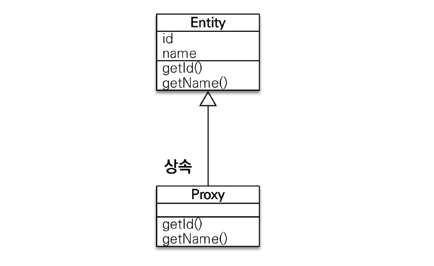
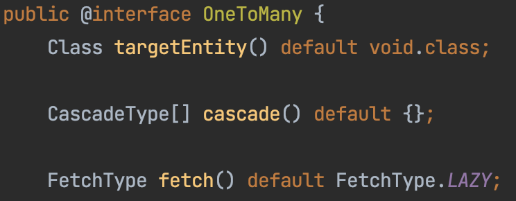
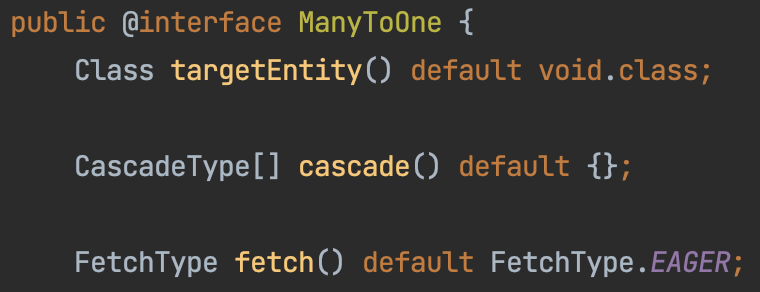
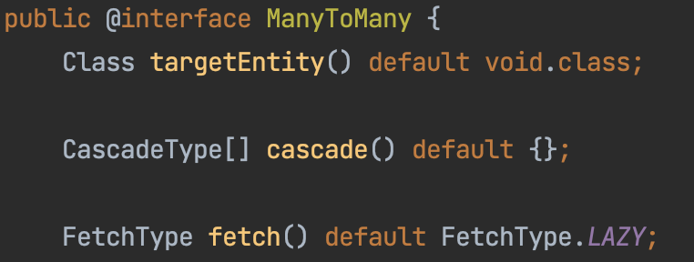
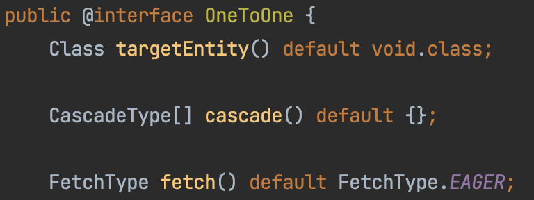

# ⏰ Eager Loading / Lazy Loading
> 즉시 로딩과 지연 로딩

<br>

Spring Data JPA에 **@ManyToOne(N:1)** 으로 연관관계가 설정되어 있는 2개의 Entity가 존재할 때, 데이터베이스 입장에서 보면 **join**이 필요하다.

@ManyToOne의 경우 FK쪽의 엔티티를 가져올 때 PK쪽의 엔티티도 같이 가져오게 되는데, 실무에서는 서비스의 규모가 대부분 크기 때문에, 연관된 데이터를 한번에 가져오는 행동은 부담이 크다.

JPA는 참조하는 객체들의 데이터를 가져오는 시점을 정할 수 있는데, 이것을 **Fetch Type**이라고 한다. Fetch Type에는 **Eager**와 **Lazy**가 존재한다.

<br>

> **[ @ManyToOne(N:1)의 관계 ]**
>
> ex) Board(게시글)과 Member(회원)의 관계
> <br> 한 명의 회원은(1) 여러 게시글을(N)을 작성할 수 있다.

<br>

> **[ Fetch Type 이란? ]**
>
> JPA가 하나의 Entity를 조회할 때, 연관관계에 있는 객체들을 어떻게 가져올 것이냐를 나타내는 설정값
> - JPA는 ORM기술로, 사용자가 직접 쿼리를 생성하지 않고, JPA에서 JPQL을 이용하여 쿼리문을 생성하기 때문에 객체와 필드를 보고 쿼리를 생성한다.
> - 따라서 다른 객체와 연관관계 맵핑이 되어있으면 그 객체들까지 조회하게 되는데, 이때 이 객체를 어떻게 불러올것인가를 설정할 수 있다.

<br>

> **[ n+1문제 ]**
>
> 1번의 쿼리를 날렸을 때 의도하지 않은 N번의 쿼리가 추가적으로 실행되는 것
>
> ex) 1000개의 주문을 조회했을 때, 그 주문자를 찾기 위해 1000개의 멤버를 찾는 쿼리도 함께 발생한다.
>
> 개발자가 예상한 것 보다 더 많은 쿼리가 진행되기 때문에 예상치 못한 큰 비용이 발생할 수 있고, 서비스의 규모가 커질수록 기하급수적으로 비용이 발생한다.
>
> JPA Fetch전략이 Eager 전략으로 데이터를 조회하는 경우
> JPA Fetch전략이 Lazy 전략으로 데이터를 가져온 이후에 연관 관계인 하위 엔티티를 다시 조회하는 경우


<br>

## 🚀 Eager Loading(즉시 로딩)
> 특정 엔티티를 조회할 때 연관된 모든 엔티티를 조인(join)을 통해 함께 조회하는 방식

엔티티 A조회 시 관련되어 있는 엔티티 B를 같이 가져온다. 실제 엔티티를 맵핑한다. Join을 사용하여 한번에 가져온다.(즉시 로딩은 항상 외부 조인(Outer Join)을 사용한다.)

### 장점
- 지연된 초기화와 관련해서 성능적인 영향이 없다.
- 연관된 엔티티를 모두 가져올 수 있다.

### 단점
- 지연 로딩보다 긴 초기의 로딩 시간이 필요하다.
- 불필요한 데이터를 많이 로딩하면 성능에 영향을 줄 수 있다.
    - 엔티티간의 관계가 복잡해질수록 조인으로 인한 성능저하가 나타날 수 있다.
    - ex) Order 연관된 객체 Member가 N개라면, Order 1개 조회 시 필요하지않은 Member 객체를 조회하는 쿼리가 N개 생성될 수 있다.

<br>

## 🛶 Lazy Loading(지연 로딩)
> 자신과 연관된 엔티티를 실제로 사용할 때 연관된 엔티티를 조회(select)하는 방식

엔티티 A를 조회 시 관련(reference)되어 있는 엔티티 B를 한번에 가져오지 않는다. **프록시**를 맵핑하고 실제 B를 조회할 때 쿼리가 나간다.

쿼리가 두번 나간다(A 조회 시 한번, B 조회 시 한번)

<div align='center'>
    
    <p>프록시 객체 구조</p>
</div>

프록시는 실제 객체의 상속본이다.

<br>

지연 로딩을 하면 연결된 다른 엔티티의 값을 가져올 수 없다. 이러한 문제를 해결하기 위해서는 데이터베이스와의 재연결이 필요한데, **@Transactional** 어노테이션을 통해 해결할 수 있다.

**@Transactional** 어노테이션은 해당 메서드를 하나의 **트랜잭션**으로 처리하라는 의미이다.
트랜잭션으로 처리하면 속성에 따라 다르게 동작하지만, 기본적으로는 필요할 때 다시 데이터베이스와의 연결이 생성되기 때문에 정상적으로 실행이 된다.


> **트랜잭션**
>
> 모든 작업들이 성공적으로 완료되어야 작업 묶음의 결과를 적용하고, 오류가 발생했을 때에는 이전에 있는 모든 작업들이 성공적 이었더라도 없었던 일처럼 되돌리는 것

<br>

#### 각 연관관계의 default 속성
- @OneToMany : LAZY
<div align='center'>
    
</div>

- @ManyToOne : EAGER
<div align='center'>
    
</div>

- @ManyToMany : LAZY
<div align='center'>
    
</div>

- @OneToOne : EAGER
    
</div>

실무에서는 Lazy를 사용하는 것을 가급적으로 권장하기 때문에, `ManyToOne`과 `OneToOne`의 연관관계만 직접 Lazy로 설정하는 것을 추천한다.


### 장점
- 다른 접근 방식보다 훨씬 적은 초기의 로딩 시간
- 다른 접근 방식에 비해 메모리 소비량 감소
- 요청된 경우에만 사용자에게 콘텐츠를 제공하여 대역폭을 절약

### 단점
- 초기화가 지연되면 원하지 않는 순간 성능에 영향을 줄 수 있음

<br>

## 예시
```
@ToString
@AllArgsConstructor
@NoArgsConstructor
@Builder
@Getter
@Entity
public class Member {
 
    @Id
    @GeneratedValue(strategy = GenerationType.IDENTITY)
    private Long id;
 
    @Column(nullable = false)
    private String name;
 
    @Column(nullable = false)
    private String email;
 
    private String password;
}
```

```
@Test
void 데이터_조회() {
    /* given */
    Optional<Board> result = boardRepository.findById(1L);
    /* when */
    Board board = result.get();
    /* then */
    System.out.println(board);
}
```

### Eager Loading
```
@ToString(exclude = "member")
@AllArgsConstructor
@NoArgsConstructor
@Builder
@Getter
@Entity
public class Board {
 
    @Id
    @GeneratedValue(strategy = GenerationType.IDENTITY)
    private Long id;
 
    @Column(length = 500, nullable = false)
    private String title;
 
    @Column(columnDefinition = "TEXT", nullable = false)
    private String content;
 
    @ManyToOne
    private Member member;
}
```

```
Hibernate:
    select
        board0_.id as id1_0_0,
        board0_.content as content2_0_0_,
        board0_.member_id as member_i4_0_0_,
        board0_.title as title3_0_0_,
        member1_.id as id1_1_1_,
        member1_.email as email2_1_1_,
        member1_.name as name3_1_1_,
        member1_.password as password4_1_1_,
    from
        board board0_
    left outer join
        member member_1
            on board0_.member_id=member1_.id
    where
        board0_.id=?
```

실행된 SQL문을 보면 board외에도 member테이블이 함께 조인된다.
연관된 엔티티를 모두 가져온다는 장점이 있지만 JPQL에서 N+1문제를 일으킨다.


### Lazy Loading
```
@ToString(exclude = "member")
@AllArgsConstructor
@NoArgsConstructor
@Builder
@Getter
@Entity
public class Board {
 
    @Id
    @GeneratedValue(strategy = GenerationType.IDENTITY)
    private Long id;
 
    @Column(length = 500, nullable = false)
    private String title;
 
    @Column(columnDefinition = "TEXT", nullable = false)
    private String content;
    
    /* lazy loading 사용 */
    @ManyToOne(fetch = FetchType.LAZY)
    private Member member;
}
```

```
Hibernate:
    select
        board0_.id as id1_0_0,
        board0_.content as content2_0_0_,
        board0_.member_id as member_i4_0_0_,
        board0_.title as title3_0_0_
    from
        board board0_
    where
        board0_.id=?
```

Board 엔티티에 지연 로딩을 적용하고 SQL쿼리문을 확인해보면 Board 테이블만 조회되는 것을 볼 수 있다.

```
@Test
    void 데이터_조회() {
        Optional<Board> result = boardRepository.findById(1L);
 
        Board board = result.get();
 
        System.out.println(board);
        System.out.println(board.getMember()); //Error
    }
```

만일 지연로딩인 상태에서 Board의 Member에 접근하면 DB와 연결된 Connection이 없다는 오류가 나타난다.(정확히는 이미 커넥션에 키밋을 날리고 트랜잭션이 닫힌것을 의미)


## 주의할 점
- 가급적이면 **지연 로딩(Lazy Loading)** 만 사용한다.(특히 실무에서)
- **즉시 로딩(Eager Loading)** 은 예측이 어렵고, 어떤 SQL이 발생할지 예측하기 어렵다.
    특히 JPQL에서 N+1 문제를 일으킨다.
- 연관된 엔티티를 함께 DB에서 조회해야 하면, fetch join 또는 엔티티 그래프 기능을 사용한다.
- @XToOne(OneToOne, ManyToOne) 관계는 기본이 즉시로딩이므로 직접 지연로딩으로 설정해야 한다.

### 참고 자료
[Spring Data JPA 즉시 로딩(Eager Loading)](https://zzang9ha.tistory.com/347)

[[Spring/JPA] 즉시 로딩(Eager Loading)과 지연 로딩(Lazy Loading)](https://velog.io/@ssssujini99/SpringJPA-%EC%A6%89%EC%8B%9C-%EB%A1%9C%EB%94%A9Eager-Loading%EA%B3%BC-%EC%A7%80%EC%97%B0-%EB%A1%9C%EB%94%A9Lazy-Loading)

[[Sequelize] Lazy Loading / Eager Loading (feat.N+1문제, include)](https://velog.io/@newdana01/Sequelize-Lazy-Loading-Eager-Loading-feat.N1%EB%AC%B8%EC%A0%9C)

[(JPA) 프록시, 지연로딩, 즉시로딩 (Proxy / Lazy Loading / Eager Loading)](https://lion-king.tistory.com/entry/JPA-%ED%94%84%EB%A1%9D%EC%8B%9C-%EC%A7%80%EC%97%B0%EB%A1%9C%EB%94%A9-%EC%A6%89%EC%8B%9C%EB%A1%9C%EB%94%A9-Proxy-Lazy-Loading-Eager-Loading)

[Eager/Lazy Loading in Hibernate](https://www.baeldung.com/hibernate-lazy-eager-loading)

[lazy loading과 eager loading 의 차이점](https://it-jerryfamily.tistory.com/entry/lazy-loading%EA%B3%BC-eager-loading-%EC%9D%98-%EC%B0%A8%EC%9D%B4%EC%A0%90)

[Transactional 어노테이션](https://tecoble.techcourse.co.kr/post/2021-05-25-transactional/)

[JPA Eager Loading VS Lazy Loading](https://binco.tistory.com/entry/JPA-EagerLoading-VS-LazyLoading)

[[JPA] 즉시로딩과 지연로딩 알아보기(FetchType.EAGER, LAZY)](https://dev-coco.tistory.com/139)
