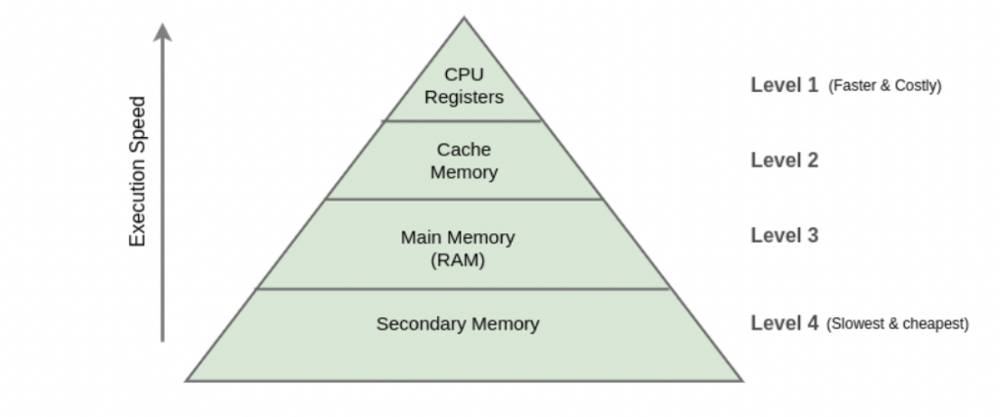
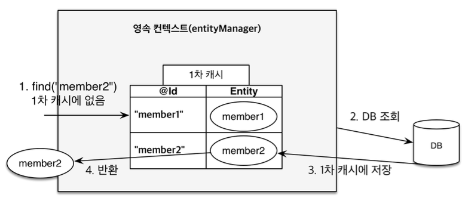
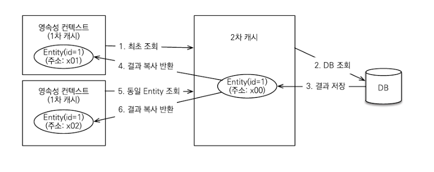

> [해당 포스팅](https://hello-judy-world.tistory.com/218)에서도 내용을 확인할 수 있습니다.

> written by [judy](https://github.com/ParkJungYoon)

역시 일단 캐시가 뭔지 알아야겠징?!

캐시부터 알아보자!

## ✅ 캐시 (Cache)

> '사용되었던 데이터는 다시 사용될 가능성이 높다'는 개념을 이용하여 데이터나 값을 미리 복사해 놓는 임시 장소

우리가 생각하는 것보다 네트워크를 통해 데이터베이스에 접근하는 시간 비용은 애플리케이션 서버에서 내부 메모리에 접근하는 시간 비용보다 훨씬 비싸다.

아래 메모리 계층 사진을 보아 알 수 있듯이 위로 올라갈수록 <u>용량이 적고 가격이 비싸지만, 속도가 빠른</u> 것을 알 수 있다.

    

Secondary Memory는 SDD, HDD이다. 즉, 데이터베이스는 Secondary Memory에 저장된다. 그래서 캐시 메모리에 접근하면 훨씬 더 빠르다.

> 🤖 : 결론 한 줄 요약!!!

> 🐰 : 조회한 데이터를 메모리에 캐싱하여 데이터베이스 접근 횟수를 줄이면 애플리케이션 성능을 개선할 수 있어!

(그래서 현재 프로젝트에서도 CDN을 구축하려고 하고 있다.)

이렇게 캐시는 성능 개선에 도움이 되기 때문에 컴퓨터 전반에 걸쳐 많은 곳에서 사용된다.

- CPU - L1, L2, L3
- DRAM, HDD
- CDN
- HTTP Cache
- Application Cache
- Proxy Cache

그러면 이제 JPA 1차 2차 캐시에 대해서 알아보자!

> 🤖 : 삐빅. 뭔데 캐시가 1차 2차까지 있냐 삐빅

> 🐰 : 에이 다 알면서. 하나씩 따라와 봐!

 

## 1️⃣ 1차 캐시 (First-Level Cache)
 
JPA에서 가장 중요한 개념 중 하나가 영속성 컨텍스트이고, 영속성 컨텍스트의 이점 중 하나가 **1차 캐시**라는 것을 들어본 적이 있을 것이다.

1차 캐시는 영속성 컨텍스트 내부에 엔티티를 저장하여 빠른 데이터 조회와 업데이트를 지원하는 메모리 기반 캐시이다.

1차 캐시는 **객체의 동일성**을 보장한다.

 

### [ 1차 캐시 조회 과정 ]

**1\) 1차 캐시에 엔티티가 있는 경우**

- 엔티티 조회
- 1차 캐시에서 결과 반환

**2\) 1차 캐시에 엔티티가 없는 경우**

- 엔티티 조회
- 데이터베이스 조회
- 1차 캐시에 결과 저장
- 저장한 결과 반환

    

최종적으로 트랜잭션이 커밋되거나 플러시를 호출하면 1차 캐시의 엔티티 변경 내역이 데이터베이스에 동기화된다.

 

### [ 1차 캐시 한계 ]

- 1차 캐시는 <u>**트랜잭션 범위**</u> 내에서만 유효하다.
- 트랜잭션이 커밋되거나 롤백되면 1차 캐시에 저장된 엔티티는 삭제되고, 다음 트랜잭션에서는 다시 데이터베이스에서 조회하게 된다.

 

## 2️⃣ 2차 캐시 (Second-Level Cache)

애플리케이션에서 공유하는 캐시를 JPA는 공유 캐시(Shared Cache)라고 한다. 일반적으로 2차 캐시 (Second Level Cache, L2 Cache)라고 부른다.

<u>**2차 캐시는 애플리케이션 범위의 캐시**</u>이다.

따라서 애플리케이션을 종료할 때까지 캐시가 유지된다.

2차 캐시는 영속성 컨텍스트가 다르면 **객체 동일성을 보장하지 않는다.**

 

### [ 2차 캐시 조회 과정 ]

**1\) 2차 캐시에 엔티티가 있는 경우**

- 엔티티 조회
- 2차 캐시에서 결과 반환

**2\) 2차 캐시에 엔티티가 없는 경우**

- 엔티티 조회
- 데이터베이스 조회
- 2차 캐시에 결과 저장
- 2차 캐시는 **복사본**을 만들어서 1차 캐시에 반환

 

    

 

### [ 🤔 왜 2차 캐시는 복사본을 반환할까? ]

> 🐰 : 정답! 동시성!

### ✔️ 동시성

만약 캐시한 객체를 그대로 반환하면 <u>**멀티 스레드 환경에서 동시성 이슈**</u>가 발생할 수 있다. 즉, 캐시 한 객체를 여러 곳에서 수정하는 문제가 발생할 수 있다.
 
이를 해결하기 위해 `락(Lock)`을 거는 방법도 있는데, `락(Lock)`을 사용해서 해결하는 것보다 객체를 복사해서 반환하는 것의 비용이 더 저렴하다고 한다. 

 

### [ 실무에서 2차 캐시는? ]

> [인프런 김영한 님 답변](https://www.inflearn.com/questions/33629/%EA%B0%95%EC%9D%98%EC%97%90%EB%8A%94-%EC%97%86%EB%8A%94-%EB%82%B4%EC%9A%A9%EC%9D%B4%EC%A7%80%EB%A7%8C-cache-%EA%B4%80%EB%A0%A8%ED%95%B4%EC%84%9C-%EC%A7%88%EB%AC%B8%EC%9D%B4-%EC%9E%88%EC%8A%B5%EB%8B%88%EB%8B%A4)

하이버네이트 2차 캐시보다는 스프링이 지원하는 캐시를 서비스 계층에서 사용하는 게 더 효과적이다.

2차 캐시는 설정도 복잡하고, 지원하는 캐시 라이브러리도 작습니다.

무엇보다 실무에서는 <u>서비스 계층에서 복잡하게 외부 API도 호출하고, 여러 엔티티도 조회</u>해서 그 결과로 **DTO를 생성**합니다. 스프링을 사용하면 이 **DTO를 효과적으로 캐시** 할 수 있고, 지원하는 캐시 라이브러리도 풍부하다.

그런데 2차 캐시는 단순히 엔티티 조회(쿼리포함)와 관련된 부분만 캐시가 지원된다.

---

### 📌 Reference

- [[Spring Docs] JPA Repositories](https://docs.spring.io/spring-data/jpa/docs/current/reference/html/#reference)
- [[JPA] 트랜잭션과 락, 2차 캐시](https://steady-coding.tistory.com/607)