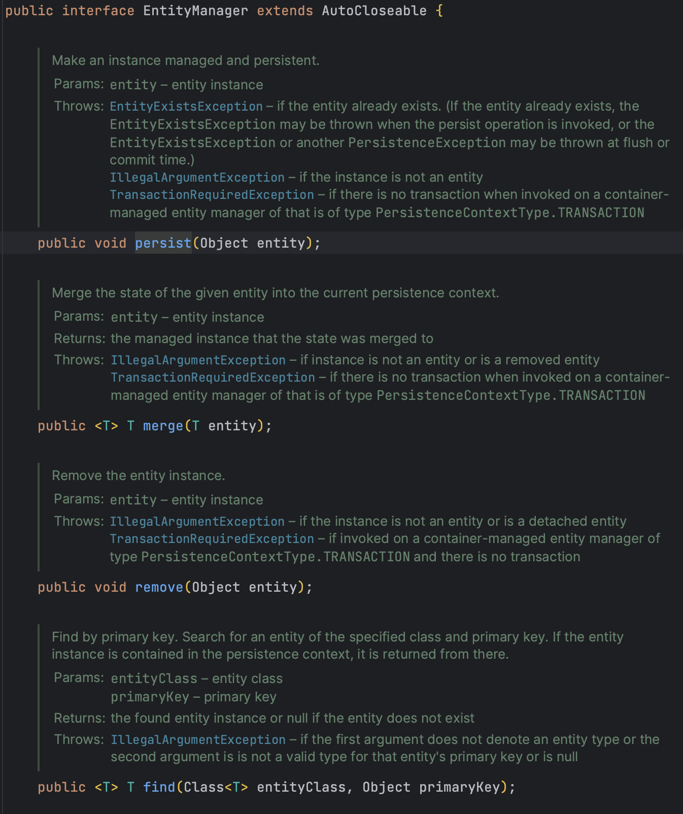

# JPA와 Hibernate

## JPA란?

자바 진영의 ORM 기술 표준으로 사용되는 인터페이스 모음.

JPA의 EntityManager interface 일부

> ORM이란 - Object-relational mapping (객체 관계 매핑) 객체는 객체대로, 관계형 DB는 관계형DB대로 설계하고 ORM프레임워크가 중간에서 매핑
> 

JPA는 애플리케이션과 JDBC 사이에서 동작

JPA는 DB와 자바 객체를 매핑하기 위한 인터페이스(API)를 제공하고 hibernate, OpenJPA, EclipseLink 등이 인터페이스를 구현하고 있음. 그 중 가장 많이 쓰이고 있는 것이 hibernate.

### JPA를 사용하는 이유

1. SQL 중심적인 개발에서 객체 중심으로 개발
2. 패러다임의 불일치 해결 (상속 등)
3. 데이터 접근 추상화와 벤더 독립성
4. 반복전인 CRUD SQL을 처리해줌.

### 장점

1. SQL이 아닌 메소드로 DB를 조작하여 객체 모델을 이용하여 비즈니스 로직을 구성하는데에만 집중 가능
2. 객체지향적인 코드 작성 가능.
3. DB를 변경해야 하는 경우 새로 쿼리를 짜지 않아도 됨.

### 단점

1. 잘못 설계할 경우 속도 저하가 생김
2. 복잡한 query의 경우 별도의 튜닝이 필요하기 때문에 sql을 써야할 수 도 있음.

 

## Hibernate 란?

JPA의 구현체로 JPA의 인터페이스를 구현하며, 내부적으로 JDBC API 사용

hitbernate 구현체 일부

Hibernate를 사용하면 상속, 다형성, 연결, 구성 및 JAVA 컬렉션 프레임워크를 포함하여 자연스러운 객체 지향 관용구를 따르는 영구 클래스를 개발할 수 있다.

개발자 생산성과 런타임 성능 측면에서 JDBC 코드 보다 우수한 성능을 일관되게 제공함.

---

### 자료 출처

- [https://dbjh.tistory.com/77](https://dbjh.tistory.com/77)

- [https://hibernate.org/](https://hibernate.org/)

- 인프런 JPA 강의 자료