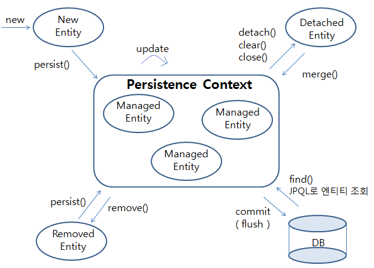
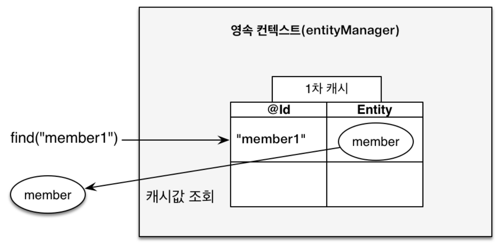
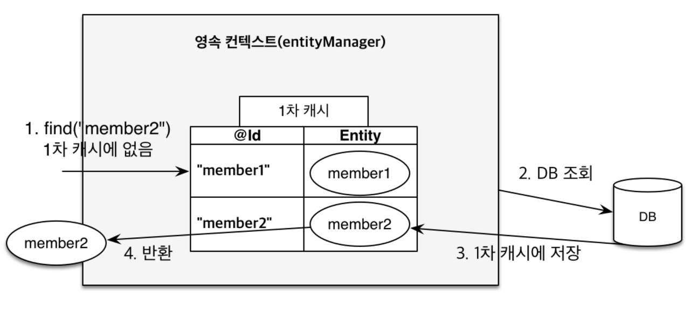
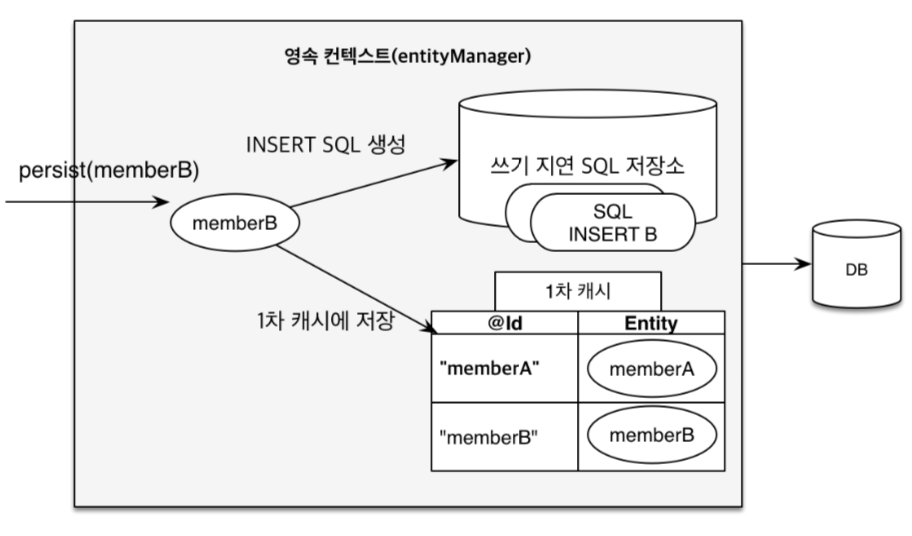
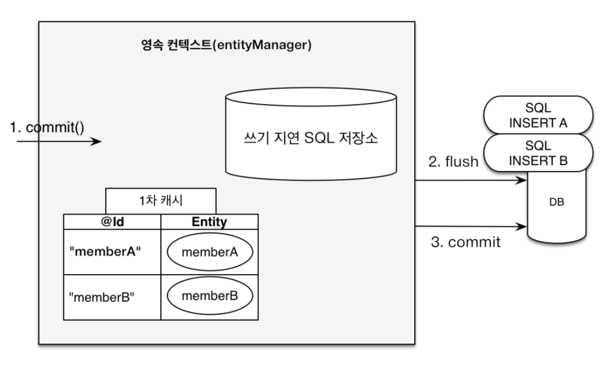
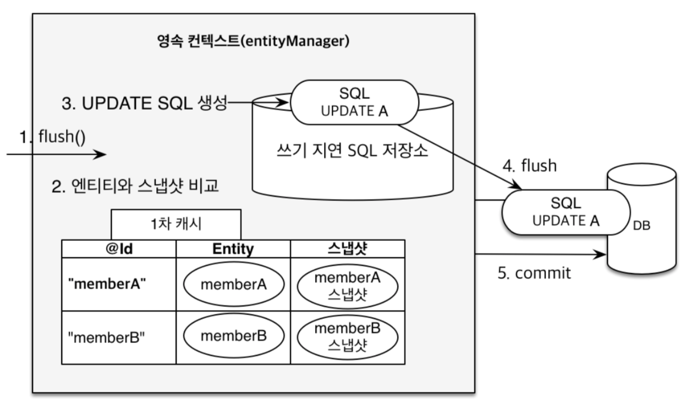

# 🚀 영속성 컨텍스트 Persistence Context

## 📌 0. 들어가기 전에

### 0.1 영속성, Persistence가 뭔데?

- 사전적 의미: 영구적인 성질. 또는 그러한 능력.
- 프로그래밍에서 영속화란?
  - 어플리케이션의 상태와 상관 없이 물리적인 저장을 통해 데이터를 저장하는 행위.

## 🔍 1. 개요

- 엔티티를 영구적으로 저장하는 환경. 일종의 인메모리 저장소.
- `EntityManger`의 메서드들을 이용한다.
- `${EntityManager객체}.persist(${Entity객체});`를 실행 하면 엔티티 객체가 영속성 컨텍스트에 의해 관리된다.
- `EntityManger`가 커밋 시점에 영속성 컨텍스트에 의해 관리되던 객체들의 변경사항을 감지, 추적해 저장소에 반영하는 요청을 보낸다.

## 🤖 2. 엔티티의 생명주기



- **New / Transient**
  - 비영속 상태
  - 엔티티가 생성, 영속성 컨텍스트에 저장되지 않은 상태.
- **Managed**
  - 영속 상태
  - 엔티티 매니저로 영속성 컨텍스트에 저장된 상태.
  - DB에 반영되지 않고 영속성 컨텍스트에의해 관리됨.
- **Detached**
  - 준영속 상태
  - 영속성 컨텍스트에 의해 관리되다가 분리된 상태.
- **Removed**
  - 삭제된 상태
  - 영속성 컨텍스트와 DB에서 제거된 상태

## 📃 3. 영속성 컨텍스트의 특징

### 식별자 값
- 영속성 컨텍스트는 `식별자값(PK)`으로 엔티티를 구분한다.
- 모든 영속상태의 엔티티는 식별자 값을 가지고 있어야한다. **없다면 예외**를 뱉어낸다.

### 커밋 & 플러시
- 영속성 컨텍스트에 엔티티를 저장하고 **트랜잭션을 커밋**해야 실제 DB에 반영된다.
- **플러시**: Flush, 현재 영속성 컨텍스트의 변경내용 데이터베이스에 반영하는 작업.

### 1차 캐시




- 영속성 컨텍스트 내부에는 엔티티 인스턴스를 캐싱하는 `1차 캐시`가 있다.
- 일반적으로 **트랜잭션 내에서 유효한 생명주기**를 갖는다.
- 같은 트랜잭션 내에서 1차 캐시에 존재하는 엔티티를 조회할 때 데이터베이스에 접근 하지 않아도 된다.
- **트랜잭션이 커밋되면 소멸**한다.

<details>
<summary>예제 코드</summary>
<div>

```
  ...
  tx.begin();                             // 트랜잭션 시작

  em.persist(new MyEntity(1, "entity1")); // 새 엔티티 인스턴스 영속화

  tx.commit();                            // 트랜잭션 종료, 데이터베이스 반영
  ...
```

</div>
</details>

### 동일성 보장

- 앞서 살펴본 1차 캐시에서는 엔티티 인스턴스를 `Map`의 구조로 캐싱한다.
- 따라서 **같은 식별자**를 통해 1차캐시에서 얻은 엔티티 인스턴스는 `==`연산을 통해 동일성을 보장한다.

<details>
<summary>예제 코드</summary>
<div>

```
  ...
  MyEntity newEntity = new MyEntity(1, "entity1");

  em.persist(newEntity);                              // 새 엔티티 인스턴스 영속화
  MyEntity foundEntity = em.find(MyEntity.class, 1);  // 1차 캐시에 올라가 있는 엔티티 조회

  System.out.println(foundEntity == newEntity);       // 결과는?
  ...
```

</div>
</details>

### 쓰기 지연




- 트랜잭션 내에서 영속화된 엔티티에 대한 쿼리를 **쓰기 지연 SQL 버퍼**에 저장해두었다가 `commit` 또는 `flush` 시점에 데이터베이스로 요청한다.

<details>
<summary>예제 코드</summary>
<div>

```
  ...
  tx.begin(); // 트랜잭션 시작
  System.out.println("transaction began\n");

  MyEntity newEntity = new MyEntity(1, "entity1");
  em.persist(newEntity);                              // 새 엔티티 인스턴스 영속화
  MyEntity foundEntity = em.find(MyEntity.class, 1);  // 1차 캐시에 올라가 있는 엔티티 조회
  System.out.println(foundEntity);

  tx.commit(); // 트랜잭션 종료, 데이터베이스 반영
  System.out.println("\ntransaction committed");
  ...

  Result ======================================================

  ...
  transaction began

  MyEntity(id=1, value=entity1)
  Hibernate: 
      /* insert example.entity.MyEntity
          */ insert 
      into
          MyEntity (value, id) 
      values
          (?, ?)

  transaction committed
  ...
```

</div>
</details>

### 변경 감지 (더티체크)



- 엔티티 인스턴스를 영속성 컨텍스트에 보관 할 때, 최초 상태에 대한 **스냅샷**을 저장해둔다.
- 커밋(또는 플러시) 시점에 각각의 엔티티의 상태를 **스냅샷**과 비교하는데 변경된 엔티티가 있으면 쓰기 지연 SQL 버퍼에 `update` 쿼리를 추가한다.

<details>
<summary>예제 코드</summary>
<div>

```
  ...
  tx.begin();
  System.out.println("transaction began\n");

  foundEntity = em.find(MyEntity.class, 1);
  foundEntity.setValue("changed value");

  tx.commit();
  System.out.println("\ntransaction committed");
  ...

  Result ======================================================

  ...
  transaction began

  Hibernate: 
      select
          m1_0.id,
          m1_0.value 
      from
          MyEntity m1_0 
      where
          m1_0.id=?
  Hibernate: 
      /* update
          example.entity.MyEntity */ update MyEntity 
      set
          value=? 
      where
          id=?

  transaction committed
  ...
```

</div>
</details>

---

### 🧐 예상 질문

#### Q1. 영속성 컨텍스트의 내용을 데이터 베이스에 반영하려면?
- 엔티티 매니저의 `flush()` 메서드를 직접 호출.
- 트랜잭션 커밋.
- JPQL 쿼리 실행
  - 자동으로 `flush()` 메서드가 호출된다.
  - 플러시 모드 옵션을 통해 트랜잭션을 커밋 할 때만 반영하게 할 수 있다.
    - FlushModeType.AUTO : 커밋, 쿼리를 실행할 때 (Default)
    - FlushModeType.COMMIT : 커밋할 때만
    
#### Q2. JPQL 쿼리를 실행 할 때 왜 플러시 되나요?

```
em.persist(newEntityA);
em.persist(newEntityB);
em.persist(newEntityC);

// JPQL
query = em.createQuery("select m from Entity m", Entity.class);
List<MyEntity> entities = query.getResultList();
```

- 위처럼 엔티티를 영속상태로 만들고 JPQL을 실행할 때, 데이터베이스에 반영이 안된다면 영속화 된 newEntityA, B, C는 JPQL을 통해 조회되지 않는다.
- 따라서 쿼리 실행 전 데이터베이스에 반영한 뒤 JPQL을 실행한다.

#### Q2. Flush와 Commit의 차이?
- `flush`는 **쿼리를 전송하는 역할**
- `commit`은 `flush`를 수행하고 **트랜잭션을 끝내는 역할**

---

### 📚 References

- [자바 ORM 표준 JPA 프로그래밍](https://www.yes24.com/Product/Goods/19040233)
- [[JPA] 영속성 컨텍스트 #2](https://velog.io/@conatuseus/%EC%98%81%EC%86%8D%EC%84%B1-%EC%BB%A8%ED%85%8D%EC%8A%A4%ED%8A%B8-2-ipk07xrnoe#%EB%B3%80%EA%B2%BD-%EA%B0%90%EC%A7%80)
- [JPA 2-2강 영속성 컨텍스트의 이해(1)](https://youtu.be/QBISxH_KHog)
- [JPA 2-2강 영속성 컨텍스트의 이해(2)](https://youtu.be/vMdpdui4VkA)