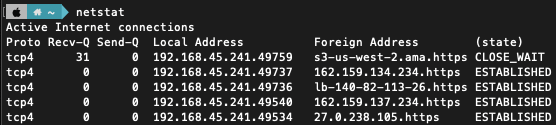

# 네트워크 기초

### 네트워크란?

컴퓨터 등의 장치들이 통신 기술을 이용하여 구축하는 연결망을 지칭

노드(node)와 링크(link)가 서로 연결되어 있으며 리소스를 공유하는 집합

## 처리량과 지연시간

### 좋은 네트워크란?

많은 처리량을 처리할 수 있으며 지연 시간이 짧고 장애 빈도가 적으며 좋은 보안을 갖춘 네트워크

### 처리량

링크를 통해 전달되는 단위 시간당 데이터 양

단위로는 bps(bits per second)를 사용. 초당 전송 또는 수신되는 비트 수

처리량은 사용자들이 많이 접속할 때마다 커지는 트래픽, 네트워크 장치 간의 대역폭(주어진 시간 동안 네트워크 연결을 통해 흐를 수 있는 최대 비트 수), 네트워크 중간에 발생하는 에러, 장치의 하드웨어 스펙에 영향을 받습니다.

    

### 지연 시간

지연 시간(latency)이란 요청이 처리되는 시간을 말하며 어떤 메시지가 두 장치 사이를 왕복하는 데 걸린 시간.

매체 타입(유선, 무선), 패킷 크기, 라우터의 패킷처리 시간에 영향을 받음.

## 네트워크 토폴로지와 병목 현상

### 네트워크 토폴로지

네트워크 토폴로지(network topology)는 노도의 링크가 어떻게 배치되어 있는지에 대한 방식이자 연괼 형태를 의미

- 트리 토폴로지

계층형 토폴로지라고 하며 트리 형태로 배치한 네트워크 구성

노드의 추가, 삭제가 쉬우며 특정 노드에 트래픽이 집중될 때 하위 노드에 영향을 끼칠 수 있음.

    

- 버스 토폴로지

중앙 통신 회선 하나에 여러 개의 노드가 연결되어 공유하는 네트워크 구성.

근거리 통신망 (LAN)에서 사용.

설치 비용이 적고 신뢰성이 우수하며 중앙 통신 회선에 노드 추가, 삭제가 쉬움. 그러나 스푸핑이 가능함.

    

> 스푸핑이란
> 

LAN상에서 송신부의 패킷을 송신과 관련 없는 다른 호스트에 가지 않도록 하는 스위칭 기능을 마비시키거나 속여서 특정 노드에 해당 패킷이 오도록 처리하는 것을 말함.

    

    

- 스타 토폴로지

중앙에 있는 노드에 모두 연결된 네트워크 구성.

노드 추가 및 에러를 탐지하기 쉽고 패킷의 충돌 발생 가능성이 적음. 어떤 노드에 장애가 발생해도 쉽게 에러를 발견할 수 있음. 장애 노드가 중앙 노드가 아닐 경우 다른 노드에 영향을 적게 끼침. 중앙 노드에 장애 발생시 네트워크 전체가 마비되며 설치 비용이 고가.

    

- 링형 토폴로지

각각의 노드가 양 옆의 두 노드와 연결하여 전체적으로 고리처럼 하나의 연속된 길을 통해 통신을 하는 망 구성 방식. 데이터는 노드에서 노드로 이동하게 되며, 각각의 노드는 고리 모양의 길을 통해 패킷 처리.

노드 수가 증가되어도 네트워크상의 손실이 거의 없고 충돌이 발생되는 가능성이 적고 노드의 고장 발견을 쉽게 할 수 있음.

네트워크 구성 변경이 어렵고 회선에 장애가 발생하면 전체 네트워크에 영향을 끼침.

    

- 메시 토폴로지

망형 토폴로지라고도 하며 그물망처럼 연결되어 있는 구조

한 단말 장치에 장애가 발생해도 여러 개의 경로가 존재하므로 네트워크를 계속 사용 가능하고 트래픽 분산 처리도 가능.

노드의 추가가 어렵고 구축 비용과 운용 비용이 고가

    

### 병목 현상

* `병목(bottleneck)현상`은 전체 시스템의 성능이나 용량이 하나의 구성 요소로 인해 제한을 받는 현상. 

* 서비스에서 이벤트를 열었을 때 트래픽이 많이 생기고 그 트래픽을 잘 관리하지 못하면 병목 현상이 생겨 사용자는 웹 사이트로 들어가지 못함.

> 회선 추가 전

    

토폴로지가 중요한 이요는 병목 현상을 찾을 때 중요한 기준이 되기 때문.

> 회선 추가 후

    

네트워크 토폴리지가 어떻게 되어 있나 확인하고, 서버와 서버 간 그리고 게이트웨이로 이어지는 회선을 추가해서 병목을 해결. 네트워크가 어떤 토폴로지를 갖는지, 또한 어떠한 경로로 이루어져 있는지 알아야 병목 현상을 올바르게 해결 가능.

## 네트워크 분류

네트워크는 규모를 기준으로 분류할 수 있음.

- LAN : 사무실과 개인적으로 소유 가능한 규모

근거리 통신망을 의미. 같은 건물이나 캠퍼스 같은 좁은 공간에서 운용. 전송 속도가 빠르고 혼잡하지 않음.

- MAN : 서울시 등 시 정도의 규모

대도시 지역 네트워크를 나타내며, 도시 같은 넓은 지역에서 운영, 전송속도는 평균. LAN보다 혼잡함.

- WAN : 세계 규모

국가 또는 대륙 같은 넓은 지역에서 운영. 전송속도는 느리고 MAN보다 혼잡.

## 네트워크 성능 분석 명령어

애플리케이션 코드상에는 전혀 문제가 없는데 사용자가 서비스로부터 데이터를 가져오지 못하는 상황이 발생되기도 하며, 이는 네트워크 병목 현상일 가능성이 있음.

병목 현상의 주된 원인

- 네트워크 대역폭
- 네트워크 토폴로지
- 서버 CPU, 메모리 사용량
- 비효율적인 네트워크 구성

네트워크 관련 테스트와 네트워크와 무관한 테스트를 통해 ‘네트워크로부터 발생한 문제점’인 것을 확인한 후 네트워크 성능 분석 필요.

### 1. ping

ping(Packet INternet Groper)은 네트워크 상태를 확인하려는 대상 노드를 향해 일정 크기의 패킷을 전송하는 명령어. 해당 노드의 패킷 수신 상태와 도달하기까지 시간 등을 알 수 있으며 해당 노드까지 네트워크가 잘 연결되어 있는지 확인할 수 있음. ping은 TCP/IP 프로토콜 중에 ICMP 프로토콜을 통해 동작.

네트워크 정책상 ICMP나 traceroute를 차단하는 대상의 경우 ping 테스트 불가.

    

> google.com에 ping을 보내는 모습

    

> ICMP가 차단되어 ping이 보내지지 않음.

### 2. netstat

netstat 명령어는 접속되어 있는 서비스들의 네트워크 상태를 표시하는데 사용되며 네트워크 접속, 라우팅 테이블, 네트워크 프로토콜 등 리스트를 보여줌. 주로 서비스의 포트가 열려 있는지 확인할 때 사용.

    

### 3. nslookup

DNS에 관련된 내용을 확인하기 위해 사용. 특정 도메인에 매핑된 IP를 확인하기 위해 사용.

    

### 4. tracert

윈도우에서는 tracert이고 리눅스에서는 traceroute라는 명령어로 실행 됨. 목적지 노드까지 네트워크 경로를 확인할 때 사용하는 명령어. 목적지 노드까지 구간들 중 어느 구간에서 응답 시간이 느려지는디 등을 확인할 수 있음.

    

## 네트워크 프로토콜 표준화

네트워크 프로토콜이란 다른 장치들끼리 데이터를 주고받기 위해 설정된 공통된 인터페이스. IEEE또는 IETF라는 표준화 단체가 정함.
