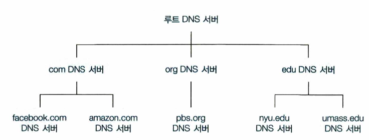
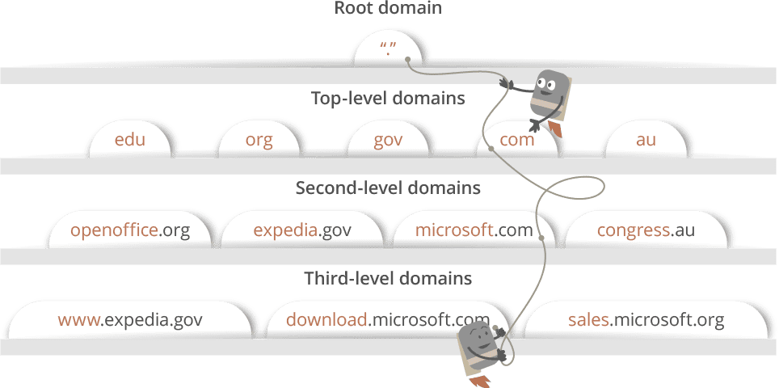
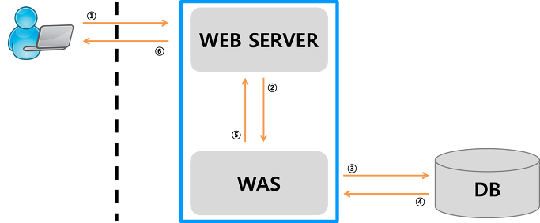
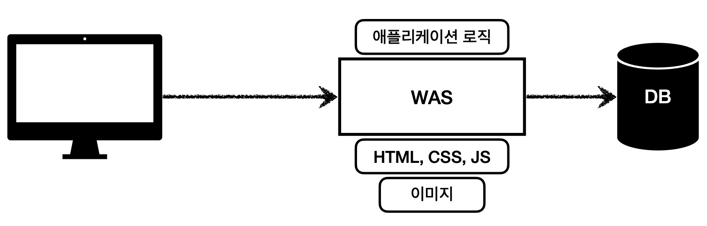
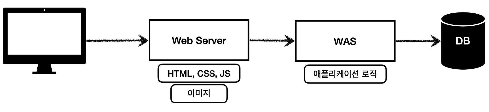

> [해당 포스팅](https://hello-judy-world.tistory.com/189)에서도 내용을 확인할 수 있습니다.

> written by [judy](https://github.com/ParkJungYoon)

## TCP/IP 4계층 모델 

### 1. 애플리케이션 계층

FTP, HTTP, SSH, SMTP, DNS 등 응용 프로그램이 사용되는 프로토콜 계층

- HTTP는 너무 중요해서 따로 주제 분리


### ✔️ Point 1 : DNS

사람은 고정 길이의 주민등록번호와 이름으로 식별할 수 있다. 컴퓨터는 주민등록번호를 선호할 것이고, 일반 사람들은 이름을 선호할 것이다.

이와 같이 `www.google.com`와 같은 호스트 이름은 사용자들이 기억하기 좋아 선호한다. 하지만 이 호스트 이름으로는 호스트 위치에 대한 정보도 얻을 수 없고, 가변 길이로 라우터가 처리하는 데도 어려움이 있다. 그래서 IP 주소로 식별된다.

즉, 호스트를 식별하는 방법은 호스트 이름과 IP 주소로 두 가지이다.

### [ DNS(Domain Name System Servers) ]

사람과 라우터는 서로 선호하는 식별자가 다르다. 이를 절충하기 위해서 호스트 이름을 IP 주소로 변환해줄 필요가 있는데, 이때 DNS를 이용한다.

DNS는 도메인 이름과 IP 주소를 저장하고 있는 분산 데이터베이스로, **웹사이트를 위한 주소록**이라고 생각하면 된다.

숫자로 된 IP 주소(ex. 63.245.217.105) 대신 사용자가 사용하기 편리하도록 주소를 매핑해주는 역할을 한다.

### 1) 분산 계층 데이터베이스

만약에 DNS 한 곳에 모든 질의를 한다면 간단하다. 하지만 <u>중앙 집중 데이터베이스</u>는 서버의 고장, 트래픽양, 먼 거리의 중앙 집중 데이터베이스, 유지관리 등의 문제를 고려하여 **확장성이 없다**는 것을 알 수 있다.

💡그래서 DNS는 많은 서버를 이용해 **계층 형태로 분산**시킨다.

<div align='center'>
    
</div>

세 가지 DNS 서버로 나뉜다.

- 루트 DNS 서버
    - 1000개 이상의 루트 서버 인스턴스가 전세계에 흩어져 있다.
    - 루트 네임 서버는 TLD 서버의 IP 주소들을 제공한다.

- 최상위 레벨 도메인 네임 (top-level domain, TLD) DNS 서버
    - com, org, net, edu, gov와 같은 상위 레벨 도메인과 kr, uk, fr와 같은 모든 국가의 상위 레벨 도메인에 대한 TLD 서버가 있다.
    - TLD 서버는 책임 DNS 서버에 대한 IP 주소를 제공한다.

- 책임 (authoritative) DNS 서버
    - 조직의 자체 DNS 서버, 조직의 명명 된 호스트에 대한 IP 매핑에 권한있는 호스트 이름을 제공한다.


### 2) DNS query

ISP(Internet Service Provider)의 DNS서버(**DNS recursor**)가 호스팅하고 있는 서버의 IP주소를 찾기 위해 DNS query를 날린다.

- **DNS query의 목적**
    - DNS 서버들을 검색해서 해당 사이트의 IP주소를 찾는데에 있다. IP주소를 찾을 때 까지 DNS서버에서 다른 DNS서버를 오가며 에러가 날때까지 반복적으로 검색한다.
    - `재귀적 질의`(recursive search), `반복적 질의`(iterative query)

<div align='center'>
    
</div>

```
'www.google.com' 주소에 대해 검색할 때,
1. DNS recursor가 루트 DNS 서버에 요청
2. .com 도메인 TLD 서버로 리다이렉트
3. google.com 책임 DNS 서버로 리다이렉트
4. 최종적으로 DNS기록에서 'www.google.com' 에 매칭되는 IP주소 찾기
5. 찾은 주소를 DNS recursor로 보내기
```

요청한 호스트에게 매핑 결과를 전달하기 위해 많은 질의 메세지가 필요하다.

그래서 질의 전송을 줄이기 위해서 <u>**DNS 캐싱**</u> 방법을 사용한다.


### 3) DNS 캐싱

DNS 지역 성능 향상과 네트워크의 DNS 메세지 수를 줄이기 위해서 캐싱을 사용한다.

- DNS 서버가 DNS 응답을 받았을 때 그것을 로컬 메모리에 응답 정보를 저장할 수 있다.
- 호스트 이름과 IP 주소 쌍이 DNS 서버에 저장되면 처음 브라우저가 캐싱된 DNS를 확인하고 캐싱된 기록이 없을 때 DNS 질의로 넘어간다.
- 호스트 이름과 IP 주소 사이 매핑과 호스트는 영구적이지 않기 때문에 특정 기간마다 저장된 정보를 제거한다.

<br>

🎯 브라우저에 입력된 도메인 이름을 통해 해당 도메인의 IP 주소를 얻은 뒤 통신을 시작할 수 있다.

🎯 DNS를 통해 이 과정을 얻는 것에 대해 알았으니 이 내용을 토대로 웹 통신 흐름에 대해서 알아보자.

<br>

### ✔️ Point 2 : 웹 통신의 흐름

`www.google.com` 주소창에 해당 URL을 입력한 뒤 클라이언트에 화면이 렌더링 되기까지 어떤 과정이 있을까?

### 1) 사용자가 웹브라우저 검색창에 www.google.com 입력

### 2) 웹브라우저는 해당 도메인 주소와 상응하는 IP 주소를 찾기 위해  캐싱된 DNS 기록을 확인

- 이때, 브라우저는 DNS 기록을 찾기 위해 browser → OS → router → ISP 순으로 확인한다.
- 이 단계에서 캐싱된 기록에 없을 경우, 다음단계로 넘어간다.

### 3) 만약 캐시가 없다면 ISP의 DNS 서버는 IP주소를 찾기 위해 DNS query를 시작

- DNS 쿼리는 IP주소를 찾을 때까지 반복한다. (recursive search)
- DNS를 통해 IP 주소를 응답받는 과정은 위 Point 1에서 설명하여 넘어간다. 

### 4) DNS가 웹브라우저에게 찾는 사이트의 IP주소를 응답

### 5) IP 주소를 받으면 일반적으로 TCP 통신을 시작

- TCP 연결은 TCP/IP three-way handshake 과정을 통해 만들어진다.

### 6) HTTP 프로토콜로 요청

- TCP로 연결이 되면, 브라우저는 GET요청을 통해 서버에게 www.google.com의 웹페이지를 요구한다.

### 6) 웹 어플리케이션 서버(WAS)와 데이터베이스에서 우선 웹페이지 작업 처리

- 웹 서버 혼자서 모든 로직 처리 및 데이터 관리를 하게되면 서버에 과부하가 일어날 가능성이 높다. 그렇기에 서버의 일을 돕는 조력자 역할을 하는 것이 WAS다.

> 웹서버 : 정적인 컨텐츠(HTML, CSS, IMAGE 등)를 요청받아 처리하여 제공하는 서버

> WAS : 동적인 컨텐츠(JSP, ASP, PHP 등)를 요청받아 처리하여 제공하는 서버 => 주로 DB서버와 함께 사용

<div align='center'>
    
</div>

### 7) WAS에서의 작업 처리 결과들을 웹 서버로 전송

### 8) 웹서버는 웹브라우저에게 html 문서 결과를 응답

- 응답 status code로 서버 요청에 따른 상태를 보낸다.

```
1xx ▶️ 정보만 담긴 메세지
2xx ▶️ response 성공
3xx ▶️ 클라이언트를 다른 URL로 리다이렉트
4xx ▶️ 클라이언트 측에서 에러 발생
5xx ▶️ 서버 측에서 에러 발생
```

### 9) 웹브라우저는 html 컨텐츠를 표시

<br>

### ✔️ Point 3 : 웹 서버와 WAS

### 1) 웹 서버

> 정적인 컨텐츠(HTML, CSS, IMAGE 등)를 요청받아 처리하여 제공하는 서버

- 웹 서버는 정적인 컨텐츠만 처리할 수 있기 때문에 동적 컨텐츠를 요청받았을 때 WAS에게 요청하고 응답받아 클라이언트에게 전달해준다.

👉 **Web Server의 예**
: Apache Server, Nginx 등


### 2) WAS (Web Application Server)

> 동적인 컨텐츠(JSP, ASP, PHP 등)를 요청받아 처리하여 제공하는 서버 (+정적 리소스 제공 가능)

- 웹 서버(Web Server)와 웹 컨테이너(Web Container)가 합쳐진 형태
- HTTP를 통해 컴퓨터나 장치에 애플리케이션을 수행해주는 미들웨어
- 주로 DB 서버와 함께 사용

👉 **WAS의 예**
: Tomcat, JBoss, Jeus, Web Sphere 등

👉 **WAS의 필요성**

웹 페이지는 정적 컨텐츠와 동적 컨텐츠가 모두 존재한다.

사용자의 요청에 맞게 적절한 동적 컨텐츠를 만들어서 제공해야 한다. 예를 들어 로그인 정보에 따라 화면에 표시되는 이름은 변경될 수 있다.

이때, Web Server만을 이용한다면 사용자가 원하는 요청에 대한 결과값을 모두 미리 만들어 놓고 서비스를 해야 한다. 하지만 이렇게 수행하기에는 자원이 절대적으로 부족하다.

따라서 WAS를 통해 요청에 맞는 데이터를 DB에서 가져와서 비즈니스 로직에 맞게 그때 그때 결과를 만들어서 제공함으로써 자원을 효율적으로 사용할 수 있다.

<div align='center'>
    
</div>

👉 웹 시스템 구성

**[ WAS + DB ]**

- WAS는 동적, 정적 컨텐츠를 모두 제공할 수 있기 때문에 웹 서버(Web Server)가 없이 시스템을 구성할 수 있다.
- 하지만 WAS에 모든 역할이 부여되었을 경우 서버 과부하로 가장 비싼 애플리케이션 로직이 정적 리소스로 인해 수행이 어려울 수 있다는 우려가 있다. 

<div align='center'>
    
</div>

**[ WEB + WAS + DB ]**

- 정적 컨텐츠는 웹 서버가 처리하고, 동적인 애플리케이션 로직을 처리는 WAS에 요청한다.
- 이렇게 시스템을 나누었을 때 정적 리소스가 많이 사용할 경우에는 웹 서버를 증설하고, 애플리케이션 리소스가 많이 사용될 경우 WAS를 증설하면 되어 효율적인 리소스 관리를 할 수 있다.

<div align='center'>
    
</div>

---

### 📢 같이 공부하면 좋을 면접 질문
1. 웹 통신 전반적인 흐름 | www.google.com을 브라우저의 주소바에 입력하고 엔터를
입력하였을 때 일어나는 일들을 설명해보세요.
2. OSI 7계층과 TCP/IP 4계층의 차이점에 대해 설명해보세요.
3. OSI 7계층과 그 존재 이유, TCP/IP 4계층에 대해 설명해보세요.

---

### 📌 Reference  

- James F. Kurose, Keith W. Ross, 『컴퓨터 네트워킹 하향식 접근』, 최종원 옮김, 퍼스트북(2022), p112~120.
- [[Web] Web Server와 WAS의 차이와 웹 서비스 구조](https://gmlwjd9405.github.io/2018/10/27/webserver-vs-was.html)
- 이미지 출처: 김영한, 스프링 MVC 1편 강의