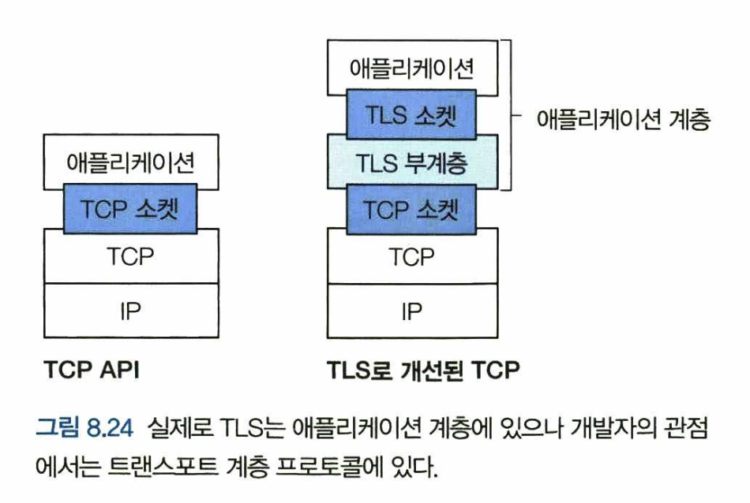
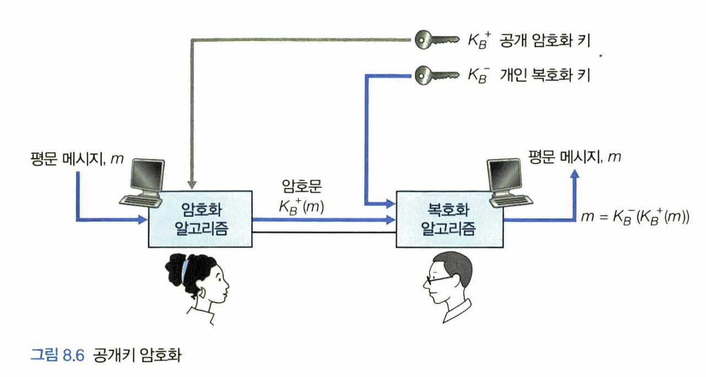
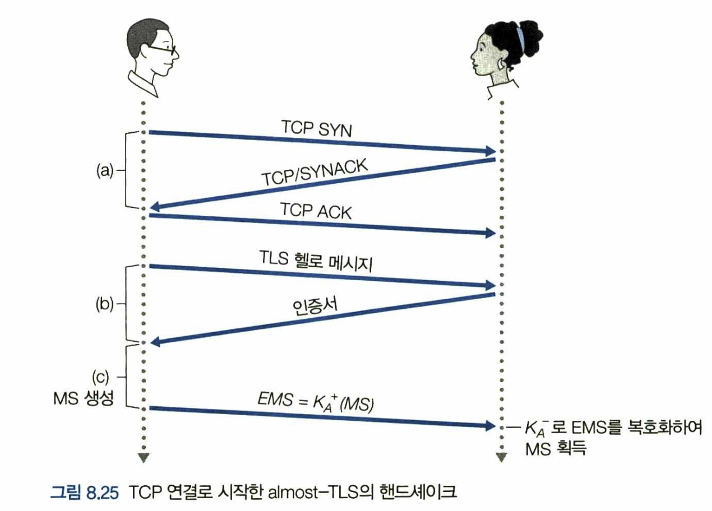

> [해당 포스팅](https://hello-judy-world.tistory.com/201)에서도 내용을 확인할 수 있습니다.

> written by [judy](https://github.com/ParkJungYoon)

우리는 웹으로 많은 일을 할 수 있다. 그 중 웹 사이트에서 신용카드로 물건을 구매한 경험이 있을것이다.

이때 우리의 브라우저와 서버 간의 통신은 거의 확실하게 TLS 위에서 사용하고 있을 것이다. (URL이 https:로 시작한다면 TLS를 사용하고 있는 것이다.)

금융 정보나 메일 등 중요한 정보를 보호하기 위해서 가장 기본적인 기술이 **HTTPS**라고 할 수 있다.

지금부터 HTTPS에 대해서 알아보자.

<br>

# 🔒  HTTPS (Hypertext Transfer Protocol Secure)

> 인터넷 상에서 정보를 **암호화**하는 `TLS 프로토콜`을 사용해 클라이언트와 서버가 자원을 주고 받을 때 쓰는 통신 규약

HTTP는 평문 텍스트, 즉 암호화되지 않은 텍스트를 전송하는 TCP 프로토콜의 일종이다. 여기에 S(Secure)를 더한 것이 HTTPS이다.

안전한 계층을 추가하기 위해 웹 서버에 설치하는 것이 SSL/TLS 인증서이다.

HTTPS의 원천 기술은 TLS 전송 기술이다. 그럼 이것에 대해 알아보자.

<br>

## ✔️  TCP 연결의 보안: TLS

SSL 프로토콜, TLS 프로토콜 헷갈릴수도 있다.

SSL 프로토콜은 원래 넷스케이프(Netscape)가 고안했다. 하지만 넷스케이프가 SSL 통제권을 IETF[RFC 4346]로 넘기면서 TLS로 표준화되었다.

TLS 프로토콜은 SSL 프로토콜에서 발전한 것으로 이해하면 좋겠다.

### [ 필요성 예시 : 인터넷 상거래 ]

필요성 설명을 위해 인터넷에서 물건을 구매하는 상황을 예로 들어 생각해보자.

```
주디가 네오 선물을 사기 위해 인터넷 쇼핑몰을 구경한다.

🐰 주디: 어? 팬시네 과자점? 괜찮네 여기서 사야겠다! 주문 버튼 클릭!

 팬시네 과자점은 과자 종류, 수량, 주소, 신용카드번호를 입력할 양식을 제공한다.
 
🐰 주디: 정보 다 입력했고 구매 완료!

이렇게 정보를 전송하고 주디는 과자 배송을 기다린다
```

완벽하게 주문이 완료된 것 같아 보인다. 하지만 이 과정에서 보안이 되어있지 않다면 몇 가지 잘못된 상황이 발생할 수 있다.

<br>

간단하게 설명하면 **안전한 통신**에는 3가지 특성이 요구된다.

1. `기밀성` : 송신자와 지정된 수신자만이 전송되는 메시지 내용을 이해할 수 있어야 한다.
2. `메시지 무결성` : 통신하는 내용이 전송 도중에 변경되지 않아야 한다.
3. `종단점 인증` : 송신자와 수신자는 통신에 참여하는 상대방이 실제 누구인지 확인하기 위해 상대방의 신원을 확인할 수 있어야 한다.

<br>

이 3가지가 지켜지지 않은 상황을 살펴보자.
 
1. `기밀성(암호화) X` : 침입자가 주디가 주문한 내용을 가로채서 신용카드 정보를 얻을 수 있다. 이 카드는 이제 제 겁니다. 침입자는 카드를 득템했다. 

<div align='center'>
    
</div>

<br>

2. `메시지(데이터) 무결성 X` : 침입자가 주디의 주문 내용을 수정해서 주문 수량의 100배 넘는 과자를 구매하도록 할 수 있다.

3. `종단점(서버) 인증 X` : 팬시네 과자점를 가장한 사이트를 만들어 주디의 주문을 받고 돈을 가지고 달아날 수 있다. 또한 주디가 입력한 정보도 가지고 달아난다.

TLS는 이러한 위험을 없애고 TCP를 향상함으로써 문제를 해결한다.

<div align='center'>
    
</div>

<br>

## ✔️ 암호화 방식

### 1. 대칭키 암호화

> 암호화를 할 때와 복호화를 할 때 **같은 암호키**를 사용하는 알고리즘

대칭키 암호화 방식은 대문의 열쇠와 같다. 자물쇠를 잠근 열쇠 만으로 그 자물쇠를 다시 열 수 있다.

하지만 그 키를 잃어버린다면 누군지 모르는 사람이 우리 집에 문을 열 수 있으니 위험하다!

### 2. 공개키 암호화

> 메시지 암호화 하는 키와 복호화 하는 **키가 다른** 알고리즘 (공개키와 비공개키)

두 개의 키를 가진다. 이것을 <u>키페어(key pair)</u>라고 부른다.

1. **공개키** (public key)
2. **비공개키** = 개인키 = 비밀키 (private key)

<br>

주디가 네오와 통신하는 과정을 천천히 살펴보자.

```
네오는 키가 두가지 있다. 한 가지는 세상의 모든 사람에게 알려진 공개키(public key)(KB+)이고, 다른 하나는 네오만 아는 비밀키(private key)(KB-)이다.

1. 주디는 네오에게 보낼 m 메시지를 공개키로 암호화한다. KB+(m)
2. 암호문을 받은 네오는 자신이 가신 비밀키로 복호화한다. m = KB-(KB+(m))
```

이 방법으로 <u>비밀키를 나눠가질 필요없이 주디는 **네오의 공개키**를 가지고 와서 비밀 메시지를 보낼 수 있다.</u>

그리고 그 메시지는 네오만이 복호화해서 열어볼 수 있다.

<div align='center'>
    
    <p>좌: 주디, 우: 네오</p>
</div>

<br>

### ✔️  TLS  핸드셰이크(handshake)

TLS를 어떻게 사용하는지 큰 그림을 이해하기 위해서 아래 단순화된 그림으로 살펴보자. 

이 과정은 세 단계로 나눠져 있다. 클라이언트(네오)와 서버(주디)의 통신을 살펴보자.

```
1. 핸드셰이크(handshake)
2. 키 유도(key derivation)
3. 데이터 전송(data transfer)
```

서버(주디)는 개인키, 공개키를 가지고 있으며 신뢰할 수 있는 CA 기업에 공개키 관리를 부탁하며 계약을 한다.

\* CA(Certificate Authority) : 공개키를 저장해주는 신뢰성이 검증된 민간기업

```
a) TCP 연결을 설립한다.

b) 연결이 설립되면 클라이언트는 헬로(hello)메세지를 보내고, 서버는 공개키를 담은 인증서로 응답한다.

(이때 인증서는 CA 인증을 받았기 때문에, 클라이언트는 인증서 내 공개키가 서버(주디)의 것이라는 것을 신뢰할 수 있다.)

c) 클라이언트는 MS(Master Secret)을 서버(주디)의 공개키로 암호화하여 보내면, 서버는 개인키로 복호화한다.
```

TLS 핸드셰이크 과정이 끝나고 HTTPS 통신을 시작합니다.

<div align='center'>
    
    <p>좌: 클라이언트 네오, 우: 서버 주디</p>
</div>

<br>

이 과정에서 TLS 인증서에는 대칭키 방식과 공개키 방식 모두 사용한다. 모든 것을 공개키 방식으로 한다면 웹 서버와 브라우저에 많은 부담이 된다. 그래서 TLS 핸드셰이크 과정은 공개키 방식, 그 이후의 HTTPS 통신은 대칭키 방식을 사용한다.

<br>

---

### 📢 같이 공부하면 좋을 면접 질문
- HTTPS에 대해서 설명하고 SSL(TLS) Handshake에 대해서 설명해보세요.
- 대칭키, 비대칭키 암호화 방식에 대해 설명해주세요.
- HTTP와 HTTPS의 차이를 설명해보고, HTTP를 사용하는 REST API 서버에게 HTTPS를 사용하게 하기 위해서는 어떠한 절차를 거쳐야 하는지 아는 대로 설명해보세요.

<br>

---

### 📌 Reference

- James F. Kurose, Keith W. Ross, 『컴퓨터 네트워킹 하향식 접근』, 최종원 옮김, 퍼스트북(2022), p584~590.
