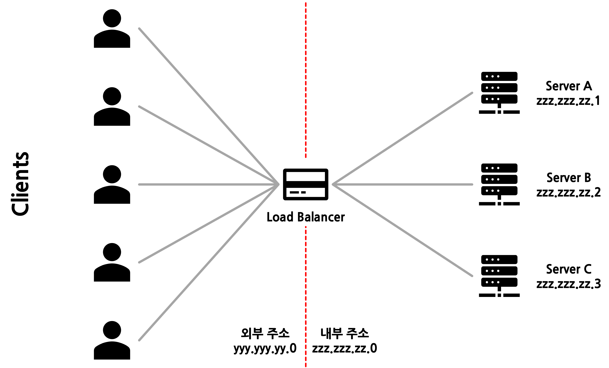
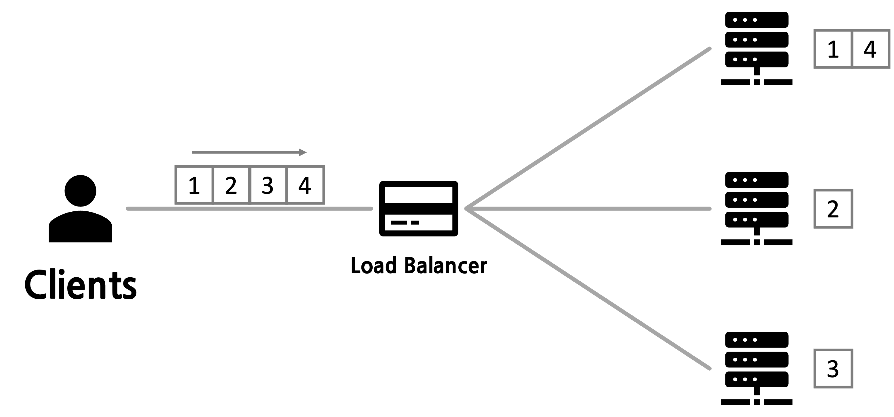
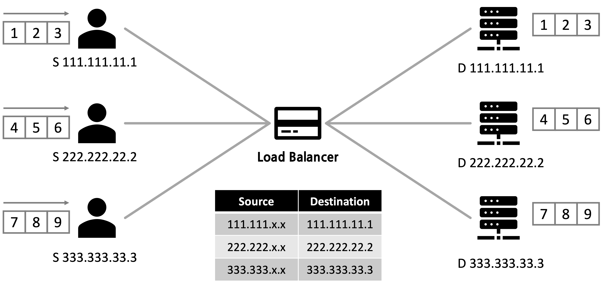
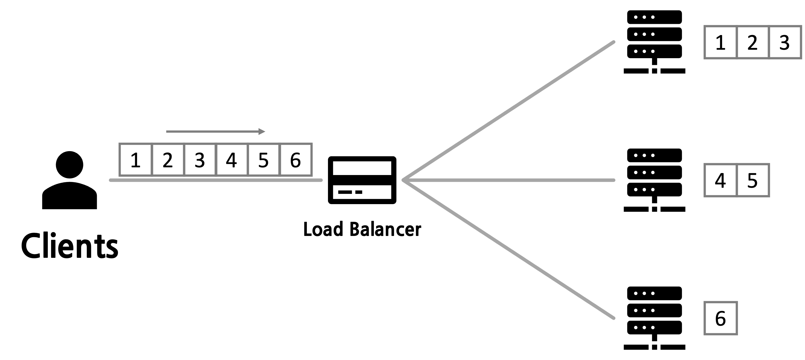

# 🚀 L7/L4 스위치, 로드밸런싱

# 📌 로드밸런싱

### ✔️ 개요

- 로드밸런서는 서비스용 주소를 가진 가상서버로 동작한다.
- 클라이언트로와 다중화된 각각의 실제서버를 중계하는 역할 수행.

> 개발자 `김말랑`은 자신의 웹 서버를 구축해 서비스를 제공했다. 얼마 뒤 서비스 사용자가 많아지고 접속량과 트래픽이 증가해 기존에 운용하던 서버 `A(xxx.xxx.xx.1)`만으로는 안정적인 서비스를 
> 제공할 수 없게 됐다.  
> 서버 자체의 성능개선(Scale-Up) 후에도 트래픽을 감당할 수 없게되자 추가로 서버 2대`B(xxx.xxx.xx.2)`, `C(xxx.xxx.xx.3)`를 증설(Scale-Out)했다.  
> 이 때 각각의 서버 url을 바꿔가며 클라이언트가 직접 서버 상태를 보고 요청하는것이 아닌 `로드밸런서`에 클라이언트 요청을 전달하게되고 `로드밸런서`는 하위 네트워크에 서버로 요청을 전달한다.

- 로드밸런서 채용 전후 네트워크 도식은 다음과 같다
- 전)  
  
- 후)  
  

### ✔️ 목적
- 서버 자원 사용의 최적화
- 데이터 처리량의 증가
- 클라이언트와 서버 간 응답속도 감소
- 특정 서버의 과부화 방지
- 안정성, 가용성 극대화

### ✔️ 알고리즘

#### 정적 부하분산 Static Load Balancing

>- **Round Robin**
   >  - 입력받은 요청을 각각의 서버에 순차적으로 할당하는 방식.
>  - 클라이언트의 요청을 순서대로 분배하기 때문에 알고리즘이 단순하고 각 서버가 트래픽을 골고루 나눠서 처리한다.
>  - 각 서버의 처리량이 비슷할 경우 운용.  
     >  
>- **IP Hash**
   >  - 클라이언트의 IP주소를 특정 서버에 매핑해 특정 IP에서 전달받은 요청을 항상 매핑된 서버로 보내는 방식.
>  - 클라이언트는 항상 동일한 서버로 접속하게된다.  
     >  
#### 동적 부하분산 Dynamic Load Balancing

>- **Weighted Round Robin**
   >  - 각 서버별로 가중치를 설정하고 가중치가 가장 높은 서버에 트래픽을 우선 배정한다.
>  - 클라이언트 입력이 100이고 서버 A, B, C의 가중치가 2, 3, 5라고 가정했을 때 각 서버에는 20, 30, 50의 입력이 Round Robin 방식으로 전달된다.
>  - 각 서버의 처리량이 상이할 경우 운용.  
     >  
>- **Least Connection**
   >  - 해당 시점에서 연결된 요청이 가장 적은 서버로 요청을 보낸다.
>  - 세션 유지시간이 길거나 서버에 분산된 트래픽이 일정하지 않은 경우 운용.
>- **Least Response Time**
   >  - 클라이언트 요청을 전달하기 전 각 서버에 응답을 요청하고 응답시간이 가장 짧은 서버에 클라이언트 요청을 전달한다
>  - 각 서버의 성능이 상이할 경우 운용.
### ✔️ 로드밸런서의 종류

> 로드밸런싱에는 L4 로드밸런싱과 L7 로드밸런싱이 사용된다.  
> 자세한 내용은 다음 장 `L4/L7스위치` 참조

- **L4 로드밸런싱**
    - IP, MAC, PORT 등 OSI 7 계층 중 4계층(전송계층) 이하 프로토콜의 헤더를 기반으로 부하를 분산한다.
- **L7 로드밸런싱**
    - L4의 기능 + HTTP, FTP, SMTP 등 OSI 7 계층 중 7계층(애플리케이션계층) 이하 프로토콜 헤더를 기반으로 부하를 분산한다.

### ❗️ 주의할 점

- 로드밸런서 또한 일종의 `장치`이기때문에 다중화 등 장애 대비책을 마련해야한다.

## 📌 L4/L7 스위치

### 네트워크 스위치란?

- 네트워크 스위치는 클라이언트를 요청한 주소에 맞게 목적지와 중계해주는 역할을 한다.
- 이는 스위치 레이어 레벨에 관계 없이 서버의 실제 주소를 숨기는 역할을 한다.
- 특히 L4/L7스위치는 앞선 장에서 다룬 로드밸런싱의 기능을 수행한다.
- 4 ~ 7 계층 스위치는 하위계층 스위치의 기능을 포함한다.

### L4 스위치

- 클라이언트 요청의 프로토콜 헤더(IP, PORT)를 기반으로 Source IP와 Destination IP를 변조해 다중화된 서버와 중계해주는 역할을 하기에 IP, PORT 를 기반으로 한 로드밸런싱을 수행한다.
- 클라이언트가 TCP 프로토콜로 서버에 접속하려 할 경우 목적지 서버와 `연결 성립 과정(3-Way HandShake)`을 거쳐 커넥션이 생성되는데 L4스위치에서도 커넥션 데이터를 생성해 관리한다.
    - 이때 연결이 일정시간동안 사용되지 않을 경우 커넥션을 삭제하는 값을 가진다.

### L7 스위치

- 어플리케이션 계층에서 동작하는 `L7 스위치`는 트래픽 내용(URI, Payload, Cookie, HTTP 헤더 등)을 직접 분석할 수 있어 `L4 스위치`보다 정교한 로드밸런싱에 사용된다.
- `L4 스위치`에 비해 자원의 소모가 크다.

### L4 vs L7

#### 공통점

- 도달한 패킷을 적절한 목적지로 보내준다.
- 로드밸런싱기능을 수행한다.

#### 차이점

- TCP 프로토콜
    - `L4 스위치`는 중계된 서버와 클라이언트간 `연결 성립 과정(3-Way HandShake)`을 통해 하나의 세션을 생성한다.
    - `L7 스위치`는 클라이언트와 스위치, 스위치와 서버간 `연결 성립 과정(3-Way HandShake)`을 통해 각각의 TCP 세션을 생성한다.
- `L7 스위치는` 패킷, 페이로드의 분석을 통해 `패킷 필터링` 기능을 수행할 수 있다.
- Mega Proxy Problem
    - `L4 스위치`에서 `IP Hash`방식으로 부하를 분산할 경우 특정 서버에 요청이 집중되는 현상이 발생할 수 있다.

---

# ❓ 예상 질문

**Q1** 로드밸런싱이란?
> **A1** 하나의 서버로 안정적으로 서비스를 제공하기 어려워 Scale Out 할 경우
> 클라이언트에게 다수의 서버 선택지를 주는것이 아닌 글로벌 서버 주소를 제공하고 요청받은 트래픽을 적절히 분산해주는 기술입니다.

**Q2** L4 로드밸런싱과 L7 로드밸런싱의 장단점?
> **A2** L4 로드밸런싱의 경우 패킷 페이로드까지 접근하지 않아 속도가 빠르고 자원 효율이 좋으며 비용이 저렴하지만
> 세밀한 로드밸런싱이 어렵고 서버와의 4계층 연결이 끊어지지 않는 이상 장애를 판단하기 어렵습니다.
> L7 로드밸런싱의 경우 비정상 트래픽을 판단할 수 있고 정교한 로드밸런싱이 가능하지만 비용이 크고 속도와 자원 효율성이 감소합니다.

**Q3** 로드밸런싱 알고리즘 중 라운드로빈 방식의 장단점?
> **A3** 패킷을 요청받은 각 서버에 순서대로 할당하기때문에 알고리즘이 간단합니다.  
> 하지만 이경우 특정 서버에 장애가 발생해 성능이 저하될 경우 처리속도가 느려질 가능성이 있습니다.
---
## 참고자료
- 로드 밸런싱의 작동 방식 이해 : https://www.cisco.com/c/ko_kr/support/docs/ip/border-gateway-protocol-bgp/5212-46.html
- [네트워크] 로드밸런서의 기본 : https://etloveguitar.tistory.com/136
- 로드밸런싱 (Load Balancing) : https://velog.io/@come_true/%EB%A1%9C%EB%93%9C%EB%B0%B8%EB%9F%B0%EC%8B%B1-Load-Balancing