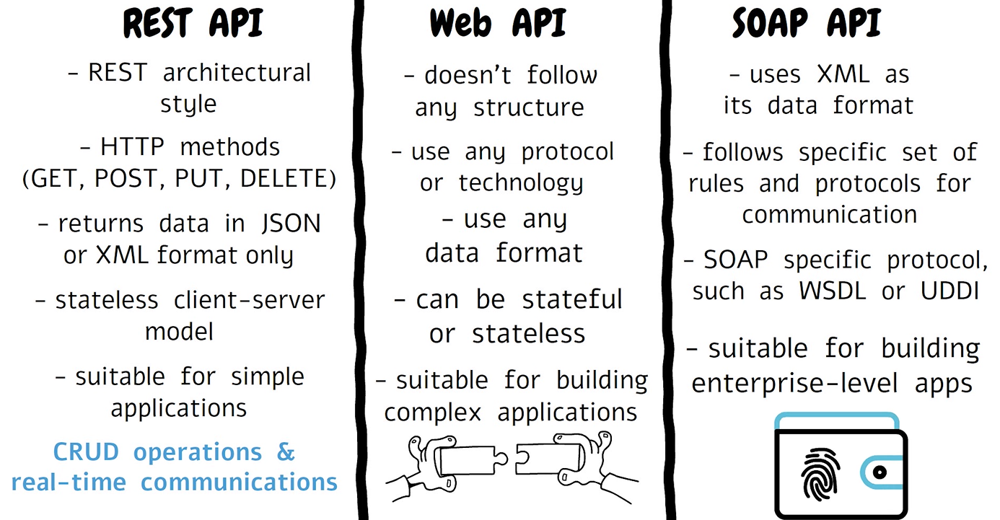
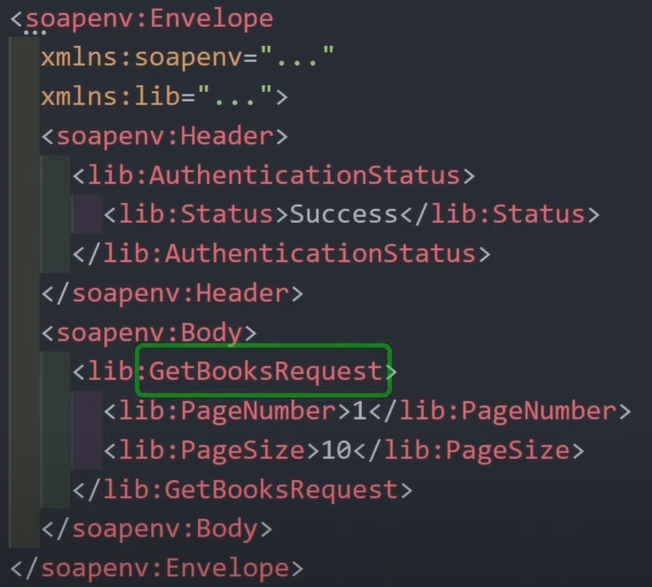
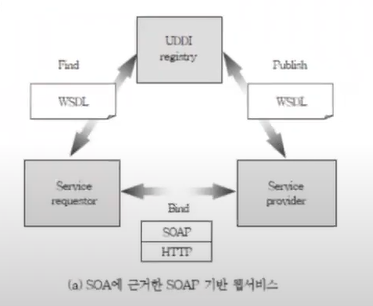

# 🧼 SOAP(Simple Object Access Protocol)

    

`정의` : 
- 일반적으로 널리 알려진 HTTP, HTTPS, SMTP 등을 통해 XML 기반의 메시지를 컴퓨터 네트워크 상에서 교환하는 프로토콜이다.
- 웹 서비스에서 기본적인 메시지를 전달하는 기반이 된다.
- but, SOAP이 사용되는 경우는 적다 => REST API로 많이 대체되었다.
- 플랫폼/프로그래밍 언어에 관계없이 데이터를 교환하기 위해 사용한다.

### SOAP의 특징
- REST API에서는 HTTP 메소드 및 URI로 요청들을 구분했기 때문에, 요청의 내용에 따라 이와 같이 URI가 달리질 수 있었지만 SOAP에서는 모든 요청이 지정된 한 URI로 보내진다.  
- REST API에서는 JSON, SOAP에서는 XML을 사용 ⇒ 주고받는 데이터 분량이 REST API보다 크다. 이에 BODY에 담아 보낼 수 있도록 POST가 자주 사용된다.  
- 이때문에 CORS와 같은 문제 상황을 대비하기 위해 SOAP는 웹 프론트엔드에서는 거의 사용되지 않는다.  

### SOAP 문법

    

- evelope 태그로 시작하고 끝이 난다.  
- function driven으로 어느 서비스를 요청하는지를 메시지에 표현한다는 점이 특징이다.  
- REST API와는 대조적으로 동사를 포함한 문장들로 표현한다. ⇒ REST API가 가독성이 높다.  

### 📄 WSDL이란?
`정의` : 
- **Web Services Description Language** 의 약자로 SOAP로 구현된 서비스의 사용 설명서이다.
    - REST API 문서가 개발자들이 요청하거나 응답하는 기능을 프로그래밍할 때 참조하도록 하는데 목적이 있다면 (사람이 보도록 초점을 맞췄다면) WSDL은 사람보다는 **프로그램**이 읽으라고 작성한 문서이다.
    - 클라이언트와 서버의 프로그램들은 일반적으로 이 WSDL 파일을 로드한 다음 그 명세에 따라 기능을 구현한다. (XML로 작성된다)
    - UDDI에 저장된다.

### 💽 UDDI란?
`정의` :
- **Universal Description, Discovery and Integration** 의 약자로 WSDL의 저장소이다
    - 사용자가 서비스를 사용하고 싶을 때 접근하는 저장소이다.

### 😊 SOAP의 장점
- 서비스에 대한 상세한 표준화를 할 수 있다는 점.
- 문서 기반으로 클라이언트/서버 기능들을 자동화해서 개발 과정을 간소화 할 수 있다는 점.

### 😡 SOAP의 단점
- 사람이 작성하고 읽기 복잡하고 장황하다는 점.
- 유연성이 부족하다.
    - WSDL이 변경되면 서버와 클라이언트 모두 코드를 변경해야한다.
- 캐싱이 용이하지 않다.
    - 복잡한 XML로 작성되어있기에 이를 기준으로 캐싱하는데 어려움이 있다.
- 모든 메시지가 POST로 보내진다.
    - HTTP의 POST는 일반적으로 캐싱이 안된다. 왜냐하면 대상이 가진 데이터에 영향을 끼치는 작업에 주로 사용되기 때문이다.
- SOAP의 한계(UDDI라는 중개소 존재, 즉 덜 개방적)를 극복하기 위해 새로운 아키텍처 필요해짐 ⇒ **REST 등장**

  

    

  

### SOAP의 사용처
- 보안업계
    - WS-Security와 같은 보안 프로토콜 지원하기에 메시지의 무결성과 기밀성을 인증할 수 있기 때문이다.
    - 금융 거래, 의료 정보 시스템, 정부 서비스 등 높은 보안 수준을 요구하는 서비스에서 사용한다.
    - 특히 금융 거래와 같은 서비스에 있어서는 여러 작업이 하나의 트랜젝션으로 처리될 수 있어야 하는데 SOAP은 트랜젝션을 안전하게 처리하는 프로토콜 또한 지원하므로 복잡하고 민감한 절차들이 진행되는 서비스에 적합하다.
    - 즉, 단점으로 꼽혔던 유연하지 않다는 부분도 클라이언트와 서버간 엄격한 규약이 필요한 경우에는 장점으로 작용한다.
    - stateless한 REST와는 달리 필요에 따라 상태를 저장가능하기에 여러 단계의 작업에서 이전 단계의 상태를 기억해야 하는 트랜잭션 작업에서 선호된다.
    - 즉, 복잡하고 민감한 로직을 처리하는 대규모 서비스에서 SOAP은 여전히 사용되고 있습니다.

  

---

### 📌 Reference

[SOAP (REST API가 대세가 된 이유)](https://www.youtube.com/watch?v=5o1IiHuUxPk)