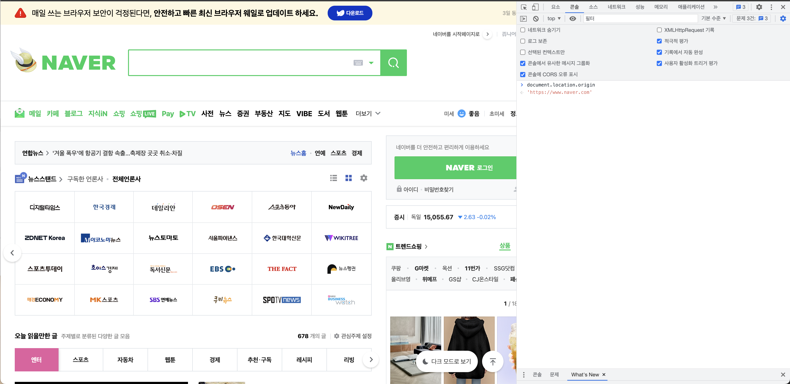
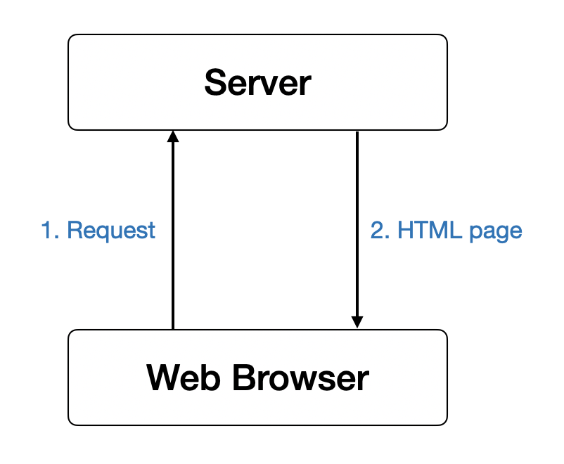
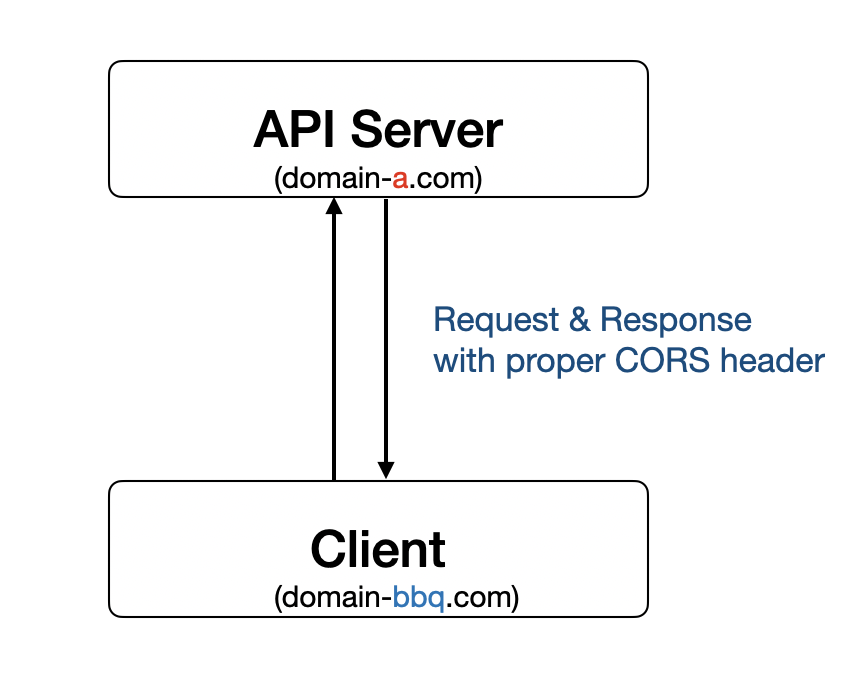
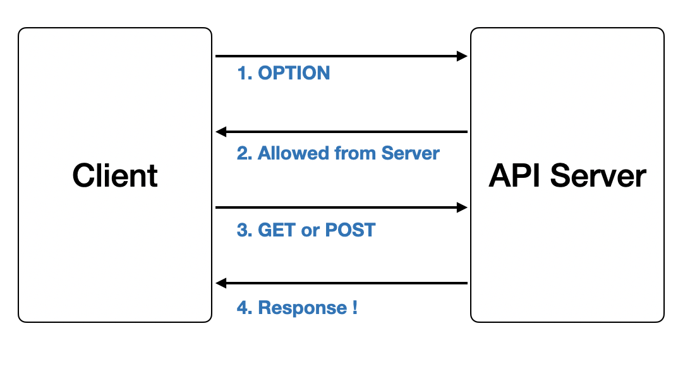
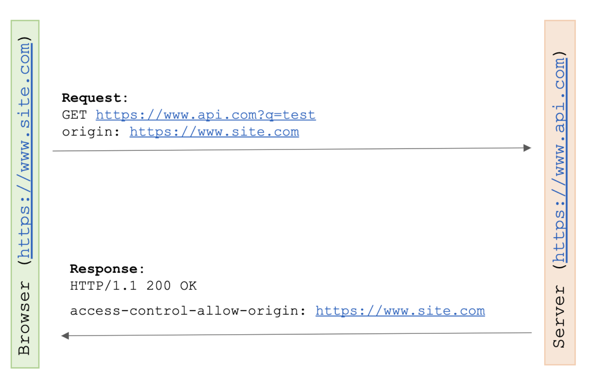
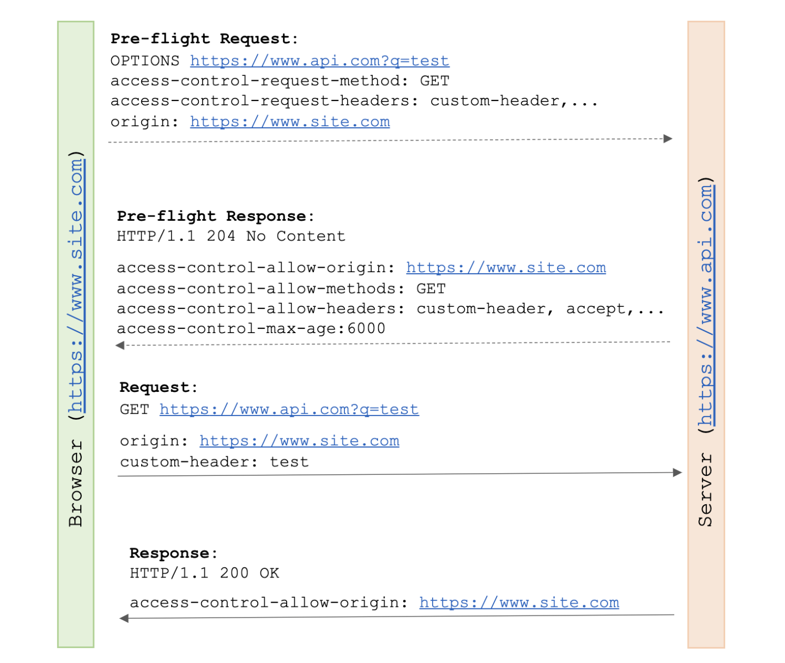

## 출처(Origin)의 정의

* SOP와 CORS에 대하여 이야기 하기 전에, 두 개념과 관련된 출처(Origin)에 대해 짚고 넘어가자.

* 출처는 프로토콜(Protocol or Scheme), 호스트(Host), 포트(Port)로 구성되어 있고 모두 같아야 동일한 출처라고 말한다.

* `https://www.domain.com:443`에서 `https://` 는 프로토콜, `www.domain.com`은 호스트, `:443`은 포트에 해당한다.

<div align='center'>
    
</div>

* 네이버에서 f12눌러서(Mac은 fn+12) Console 창에서 다음과 같이 `document.location.origin`이라고 치면 해당 출처를 확인할 수 있다.

### 동일 출처 예시

* `https://www.starbucks.co.kr` 과 `http://www.starbucks.co.kr/` 은 프로토콜이 다르므로 동일 출처가 아니다.

* `https://www.apple.com/kr/` 과 `https://www.apple.com/kr/iphone/` 는 경로만 다르므로 동일 출처이다.

* `https://www.youtube.com/` 과 `https://www.youtube.com/:443` 은 https의 기본 포트가 443이므로 동일 출처이다.

## SOP(Same-Origin-Policy, 동일 출처 정책)란 ?

* SOP는 어떤 출처(origin)에서 불러온 문서(document)나 스크립트(script)가 다른 출처에서 가져온 리소스와 상호작용하는 것을 제한하는 중요한 보안 방식이다.

* 쉽게 말해, 기본적으로 출처가 다를 경우 서로 간의 문서나 스크립트에 접근을 할 수가 없고 극히 제한적인 객체에만 접근이 가능하다.

* 동일한 출처 정책을 구현하는 브라우저는 한 출처에서 제공되는 웹 사이트 스크립트가 `XMLHttpsRequesst` 또는 `FetchAPI` 와 같은 메서드를 사용하여 다른 출처에 요청하는 것을 제한한다.

## CORS(Cross-Origin-Resource Sharing, 교차 출처 리소스 공유)가 나오게 된 배경

* 현재는 프론트엔드 레이어와 API 서버 레이어를 따로 구성하는 경우가 많다. 웹 프론트엔드 사이트 따로, 서버 사이트 따로 둔다는 의미이다.

* 이런 경우에 보통 웹 프론트엔드에서 다른 도메인에 위치한 API 서버로 요청을 넣아야 하는 상황이 생긴다.

* 하지만 과거에는 이런 기능이 당연하게 제공하지 않았다.

* 사실 원래는 도메인이 다르면 요청을 주고 받을 수 없게 하려는게 `웹 브라우저의 기본 정책`이였다.

* 과거) 이전에 웹사이트를 만든다고 하면 이런 구조였다.

<div align='center'>
    
</div>

* 유저가 웹 브라우저 주소칭에 주소값을 입력을 하면 해당하는 서버로 요청이 보내진다.

* 그러면 서버에서는 응답을 할 때 HTML 페이지를 반환한다.

* 즉, 하나의 서버에서 비즈니스 로직과 HTML 페이지 빌드를 같이 하는게 일반적이였다.

* 왜 예전에는 같은 도메인에서 요청을 주고 받아야 했냐고 묻는 다면, 개인정보 유출, 피싱 사이트와 같이 보안상 악의적인 행동을 하는 걸로 의심을 하였기 때문이다.

* 하지만, 시간이 지남에 따라 웹사이트에서 할 수 있는 일이 많아졌다.

* 단순히 문서작성 뿐만 아니라 무언가 어플리케이션을 만들기 시작했고 그러한 상황들이 많아지다 보니, 기존 웹브라우저 보안 정책에 대해 불편한 점들이 조금씩 생기기 시작했다.

* 그래서 결국엔 웹브라우저에서 공식적인 루트를 열어준 것이 바로 `CORS`다.

## CORS(Cross-Origin-Resource Sharing, 교차 출처 리소스 공유)란?

* 타사 API에 액세스해야 하는 필요성을 해결하기 위해 CORS 정책은 **한 출처에서 제공하는 스크립트가 다른 출처의 리소스를 요청할 수 있는 방법을 결정**한다.

* 쉽게 말해, 서로 다른 도메인간에 자원을 공유하는 것을 의미한다.

* CORS 정책은 요청/응답 상호 작용에 포함되어야 하는 특정 HTTP 헤더를 정의한다.

* 서버가 요청을 허용할 출처를 통신할 수 있도록 한다.

* 그런 다음 브라우저는 스크립트가 응답에 액세스하는 것을 허용하거나 금지하여 이를 실행한다.

<div align='center'>
    
</div>

* 일반적으로 이 CORS 세팅을 직접 할 일은 거의 없고, 웹 프론트엔드에서 요청 넣을 때 CORS 옵션만 넣어주면 요청 헤더까지 알아서 다 넣어준다.

* 웹 서버에서도 마찬가지로, 간단한 옵션을 통해서 CORS를 켜고 끌 수 있게 구성을 해두었다.

* 다시 말해, 프론트의 경우에는 Request Header에 CORS 관련 옵션을 넣어주고, 서버의 경우에는 Response Header에 프론트의 요청을 허용한다는 내용을 넣어주면 된다.

* 조금 특별한 점이 있다면, 다음 그림처럼 HTTP OPTION 메소드이다.

<div align='center'>
    
</div>

* 크로스 도메인 요청을 보내는 작업은 `2번` 보내게 된다(Client -> Server)

* 그래서 서버에서 웹브라우저로부터 크로스 도메인 요청을 받으려면 동일한 라우터에 대해서 OPTION 메소드 처리를 따로 하도록 작업을 해주어야 한다.

* 보통은 서버 라이브러리에서 간편하게 알아서 해준다.

* 위의 예시들을 아래에 조금 더 자세하게 살펴보겠다.

* 원본 간 요청의 경우 브라우저에서 처리하는 세 가지 유형이 있다.

### 1. 간단한 요청(Simple Requests)

<div align='center'>
    
</div>

* 이미지에 있는 내용을 설명하면 이렇다.

* 먼저 브라우저는 서버에 원본을 식별하는 헤더를 포함시켜 요청을 보낸다.

* 서버는 요청된 데이터로 응답하고 `https://www.site.com`으로 설정된 **access-control-allow-origin** 헤더도 포함한다.

* 브라우저는 requestHandler 메서드가 응답 데이터에 액세스 하도록 허용하여 이를 실행한다.

* **access-control-allow-origin** 헤더는 서버가 허용할 요청을 표시하는 데 사용할 수 있는 기본 CORS 헤더 중 하나이다.

* 모든 곳에서 CORS를 허용하기 위해서는 모두를 의미하는 *를 입력하면 된다.

* 위의 이미지에서는 특정 출처에 대한 액세스를 허용하도록 브라우저에게 알리는 단일 출처이다.

```
- Example - 
(If 특정 출처에 대한 액세스 허용)
Access-Control-Allow-Origin: https://www.site.com

(If 모든 출처에 대한 액세스 허용)
Access-Control-Allow-Origin: *
```

* 서버가 access-control-allow-origin 헤더로 응답하지 않거나 헤더 값이 요청 원본과 일치하지 않는 도메인인 경우 브라우저는 응답이 스크립트로 다시 전달되는 것을 방지한다.

* 단순 요청은 다음을 충족하는 요청이다.

    * `GET`, `HEAD` 또는 `POST`요청을 허용한다.

    * `Accept`, `Accept-Language`, `Content-Langauage`, `Content-Type`와 같은 User-Agent 헤더 또는 **CORS Safelisted** 헤더만 전송한다.

    * `ReadableStream` 개체를 사용하지 않는다.

    * `XMLHttpRequest.upload` 에 연결된 이벤트 리스너가 없다

### 2. 프리플라이트 요청(Preflighted requests)

<div align='center'>
    
</div>

* 실제 요청을 보내기 전에 브라우저는 이러한 유형의 요청을 허용하는지 서버에 확인하는 요청이다.

* 실행 전 요청은 다음 헤더를 포함하는 OPTIONS 요청이다.

``` markdown
- origin : 서버에 요청이 오는 출처를 알려준다.
  
- access-control-request-method : 요청이 구현하는 HTTP 메서드를 서버에 알려준다.
  
- access-control-request-headers : 요청이 포함된 헤더를 서버에 알려준다.
```

* 이에 대한 응답으로 서버는 다음 헤더로 응답하여 이 출처에서 이러한 종류의 요청을 수락할지 여부를 결정할 수 있다.

``` markdown
- access-control-allow-origin – 서버가 허용할 원본
  
- access-control-allow-methods – 서버에서 허용할 쉼표로 구분된 메서드 목록
  
- access-control-allow-headers – 서버에서 허용하는 쉼표로 구분된 헤더 목록

- access-control-max-age – 실행 전 요청에 대한 응답을 캐시하는 시간(초)을 브라우저에 알려준다.
```

#### 왜 Preflight 요청을 해야할까?

* 프리플라이트 요청을 통해 서버는 요청이 실행되기 전에 검사하고 허용 여부를 표시할 기회를 얻을 수 있기 때문이다.

* 그리고 서버가 다른 출처에서 허용하지 않는 특정 요청을 차단함으로써 서버를 보호하는데 도움을 준다.

* 이 외에도 서버는 개발될 때 허용하는 요청 및 헤더의 종류를 변경할 수 있다.

### 3. 인증된 요청(Credentialed Requests)

* 인증 관련 헤더를 포함할 때 사용하는 요청이다.

* 자격증명은 쿠키, 인증 헤더 또는 TLS 클라이언트 인증서일 수 있다.

* 클라이언트측에서 자격증명(`credentials`)이 포함되어있고 서버에서 `Access-Control-Allow-Credentials` 가 true로 응답해야만 허용한다.

* 이때, 서버는 반드시 "*" 와일드카드를 지정하는 대신 `Access-Control-Allow-Origin` 헤더 값에 출처를 지정해야 합니다.

## 참고

* [동일 출처 정책](https://developer.mozilla.org/ko/docs/Web/Security/Same-origin_policy)

* [교차 출처 리소스 공유 (CORS)](https://developer.mozilla.org/ko/docs/Web/HTTP/CORS)

* [CORS가 나오게 된 배경](https://www.youtube.com/watch?v=yTzAjidyyqs&ab_channel=Taehoon)

* [CORS-Origin 리소스 공유 및 실행 전 요청이 필요한 이유](https://www.baeldung.com/cs/cors-preflight-requests)

