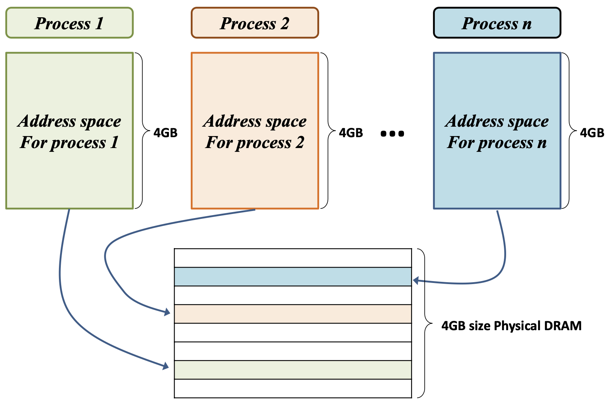
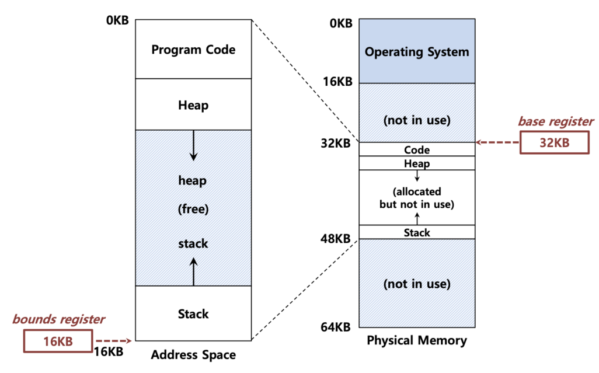
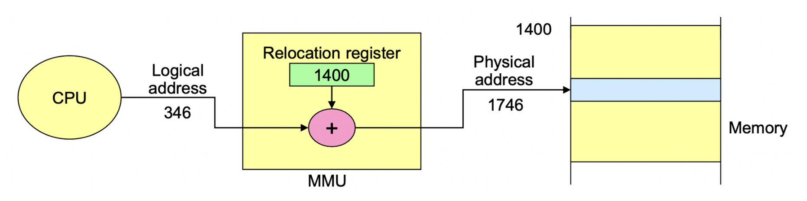
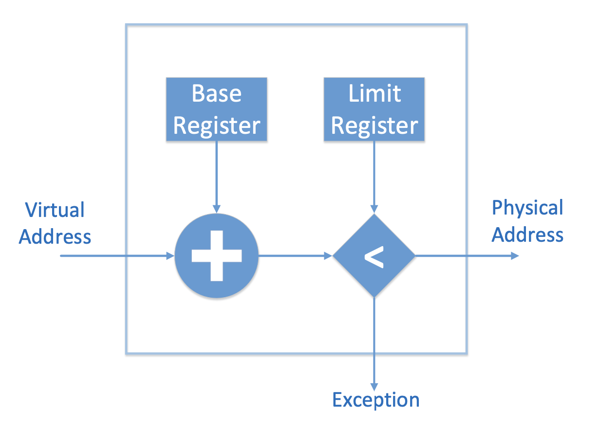
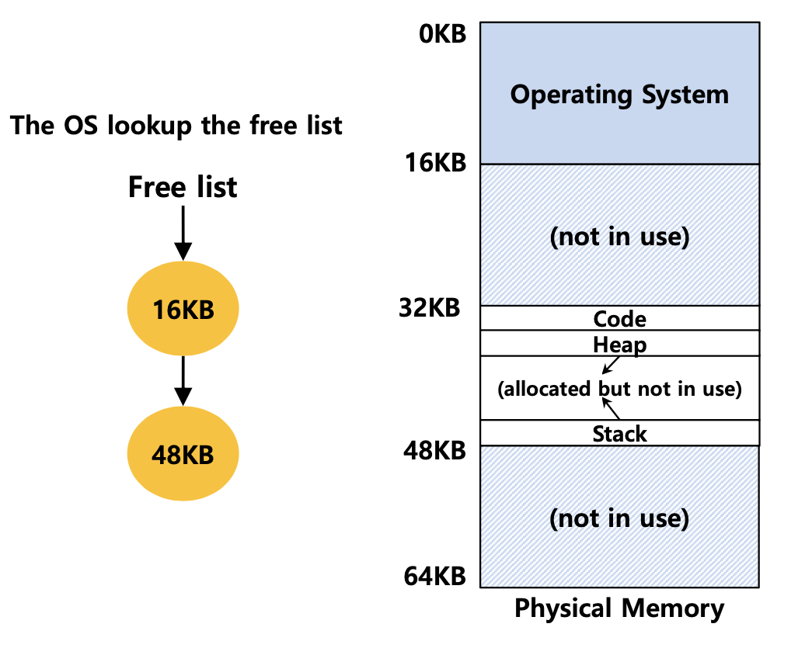
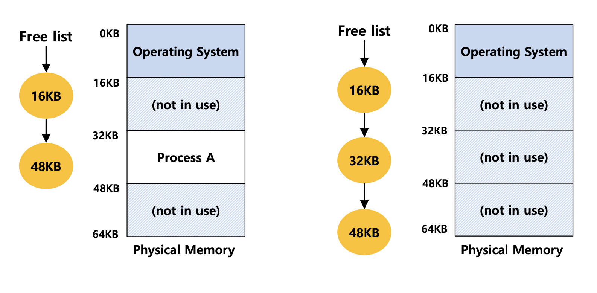
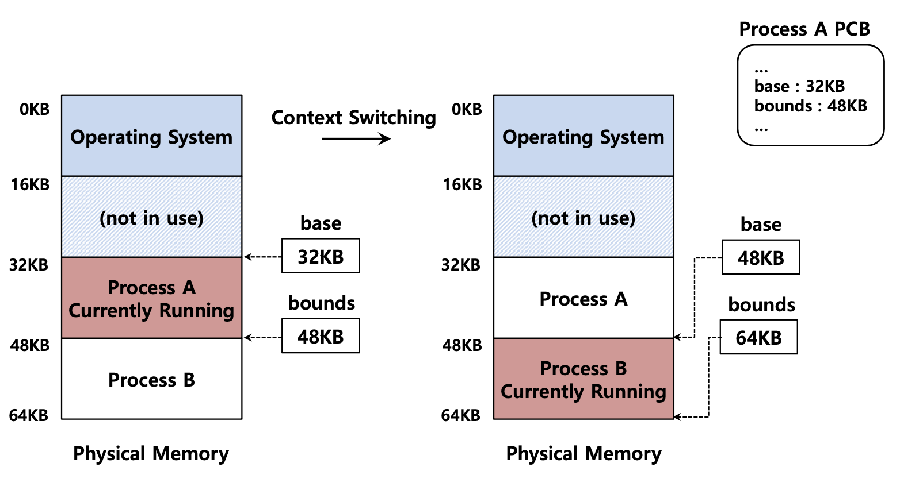

> 이 글의 사진과 내용은 대학교 수업 자료를 기반으로 작성했으므로 가급적 복사는 지양해 주시면 감사하겠습니다.

## Per Process Address Space

* 위의 그림처럼 OS가 Address space를 Physical memory 주소로 변환하는 과정에 대해 알아보자.

## Memory Virtualizing with Efficiency and Control

* 이전 Chapter13 [Address space](https://github.com/Fancy96/2023-CS-Study/blob/main/OS/os_address_space.md)에서 말했던 것처럼 메모리를 가상화한다는 것은 **OS가 프로세스에게 자신의 개인적인 메모리 공간이 있는 것처럼 착각하게 만드는 것**을 의미한다.

* 효율성(Efficiency), 제어성(Controllability), 그리고 유연성(Flexibility)을 위해 LDE(Limited Direct Execution)와 비슷한 전략을 가진다.

* LDE를 간단히 소개하면, 프로그램을 하드웨어에서 직접 실행하도록 하는데 특정 시점(디스크에 대한 I/O 요청이 발생하거나, CPU 혹은 메모리에서 더 많은 시스템 리소스에 대한 접근 권한을 획득하는 경우)에는 OS가 프로그램의 실행에 직접 관여하는 방식이다.

* 메모리를 가상화를 도입할 수 있는 방법은 **하드웨어 지원을 받아서 OS가 virtual address(=logical address)를 physical address로 변환하는 주소 변환 기법**을 사용한다.

## Address Translation

* 메모리 가상화를 위한 매커니즘을 위해 하드웨어 기반 `주소변환`에 대해 알아보자.

* `주소 변환`이란 **CPU에 있는 가상 주소를 DRAM에 있는 실제 메모리의 주소로 변환하는 하드웨어의 지원을 의미한다**. `주소 재배치`와 같은 말이다.

* 이를 통해 OS가 프로세스를 가상 주소에서 실제 메모리 주소로 착각하게 만드는 가상화를 수행하게 된 것이다.

## Base and Bounds Register

* 주소 변환 기법을 사용하기 위해서는 CPU에 2개의 하드웨어 레지스터가 필요하다.

* 하나는 base 레지스터, 다른 하나는 bound 레지스터라고 한다.

    * `base 레지스터` : 가상 주소 공간이 실제 메모리에 재배치되었을 때 **주소 공간의 시작 부분**을 가리킨다.

    * `bound 레지스터` : **가상 주소 공간의 크기**를 나타낸다.

* 참고로 base, bound 레지스터 모두 CPU에 존재하는 하드웨어(DRAM)라는 점을 잊지 말자.

* 위의 그림과 같이 `bound register` 는 16KB로 가상 주소 공간의 크기를 알려준다. 그리고 `base register` 는 32KB로 실제 메모리 주소 공간의 시작 부분을 가리킨다.

* 2개의 레지스터를 사용하면 실제 메모리의 원하는 위치에 가상 주소 공간을 배치할 수 있고, 프로세스가 자신의 주소 공간에 접근할 수 있게 해준다.

## Dynamic(Hardware-based) Relocation

* **base, bound 레지스터를 이용하여 하드웨어 기반 주소 변환하는 방법**인 `동적 재배치 기술`에 대해 알아보자.

* 프로그램 실행이 시작했을 때 OS는 프로세스를 로드해야 하는 물리적 메모리 위치를 결정한다.

    * 먼저 base register에 값을 결정한다.

  > physical address = virtual address + base

    * 가상 주소는 bound 보다 크면 안되고 0보다 크거나 같아야 한다.

  > 0 <= virtual address < bound

* 이를 통해 주소변환 처리와 프로세스를 보호할 수 있고, 만약 base, bound 레지스터에 문제가 발생하게 되면 OS가 개입해서 문제를 처리할 수 있다.

### Essential prerequisite(필수 전제조건)

* 오로지 OS에 의해서만 base, bound 레지스터에 접근해서 값을 바꿀 수 있다.

## Memory Management Unit

* 다음은 단순한 MMU에 대해 알아보자.

* `MMU`는 Memory Management Unit의 약자로 `메모리 관리 장치`라고 말하며, CPU가 메모리에 접근하는 것을 관리해 주는 하드웨어 장치이다.

* 가상 주소가 실제 주소로 주소 변환 기법을 사용할 때 도와주는 역할이다.

* MMU는 bound 레지스터의 범위 안에 들어가면 가상 주소(virtual address)가 실제 주소(physical address)로 변환해 준다.

* 즉, 다른 physical address로 가는 것을 막아주면서 메모리를 보호해 준다.

* 정리하자면, MMU를 통해 가상 주소와 Base 레지스터의 합이 bound 레지스터(=Limit 레지스터)의 범위 안에 들었으면 실제 주소로 변환해 주고, 범위에 벗어나면 예외 처리를 해준다.

## OS Issues for Memory Virtualizing

* 지금까지 하드웨어가 주소 변환에서 어떤 역할을 하는지 알아봤다면, 이제는 OS의 역할을 알아보자.

* base 레지스터와 bound 레지스터를 구현하기 위해 **OS가 개입해야 하는 상황들**은 다음과 같다.

1. 프로세스가 **생성될 때**(When a process start running), 주소 공간(address space)을 위해 실제 메모리(physical memory)에서 여유 공간이 있는지 찾아야 한다.

2. 프로세스가 **종료될 때**(When a process is terminated), 종료된 프로세스가 사용하던 메모리 공간을 다른 프로세스가 사용할 수 있도록 확보해야 한다.

3. **Context Switch가 발생할 때**(When context switch occur), base 레지스터와 bound 레지스터의 정보를 저장하고 복원하는 작업을 해줘야 한다.

4. 위에 설명한 3가지를 제외한 다른 예외가 발생했을 때 호출할 핸들러(**exception handlers**)나 함수(functions)를 제공해야 한다.

### OS Issues: 1. When a Process Starts Running

* 프로세스가 생성될 때, OS는 새로운 주소 공간을 위해 반드시 여유 공간을 찾아야 한다.

* `Free list`는 사용되지 않는 physical memory의 범위 목록을 의미한다. 쉽게 말해 **사용할 수 있는 여유 공간**이다.

* 즉, 왼쪽의 Free list가 가리키고 있는 (동그라미로 표시된) `16KB`, `48KB`는 사용되지 않는 여유 공간을 의미한다.

* 실제로 OS는 physical memory(DRAM)에서 어디에 빈 공간이 있는지 계속 추적하고 있어야 한다.

### OS Issues: 2. When a Process Is Terminated

* 프로세스가 종료될 때, OS는 종료된 프로세스를 반드시 Free list(사용 가능한 목록)에 다시 올려야 한다.

* `Process A`가 exit 되면, 이후에 사용할 수 있도록 Free list에 추가해 준다.

### OS Issues: 3. When Context Switch Occurs

* Context Switch가 발생했을 때, OS는 base와 bound 레지스터를 동시에 저장하고 복구해야 한다.

* 개별 Process의 base, bound 레지스터의 값은 OS에 의해서 Process 별로 `process structure`(프로세스 구조) 또는 `PCB`(프로세스 제어 블록)에 관리가 된다.

* 예를 들어, `Process A` 가 실행하는 도중에 Context Switching 이 되면, `Process A`의 base 레지스터와 bound 레지스터를 본인의 PCB에 저장을 한다.

* 그리고 `Process B`가 실행되고 종료될 때, 다시 PCB에서 저장된 `Process A`의 base 레지스터와 bound 레지스터를 가져와서 다시 실행한다.

## 예상 질문

* 주소 변환 기법에 대한 개념은 무엇인가요?

* 동적 재배치 기술에 대해 설명해 주세요.

* MMU에 대해 설명해 주세요.

* OS가 개입해야 하는 상황들(3가지)에 대해서 설명해 주세요.

## Reference

* 학교 수업 내용 - [Operating Systems Three Easy Pieces](https://www.amazon.com/Operating-Systems-Three-Easy-Pieces/dp/198508659X)

* [[OS] 메모리 가상화를 위한 주소 변환](https://icksw.tistory.com/143)

* [Memory](https://github.com/Seongwon97/tech-interview/blob/main/Operation_System/Memory.md)