# CPU Scheduling
CPU 이용률을 극대화하기 위해서는 멀티프로그래밍(multiprogramming)이 필요하다.
하지만 만약 CPU core가 하나라면 한 번에 하나의 프로세스만 실행 가능할 것이다. 
이때 필요한 것이 **CPU 스케줄링**이다. 

✔ 즉, CPU 스케줄링은 **언제 어떤 프로세스에 CPU를 할당할지 결정하는 작업**이라고 할 수 있다.

## 1. CPU - I/O Burst Cycle
#### 프로세스 실행은 CPU 실행과 I/O  대기 사이클로 구성된다.

    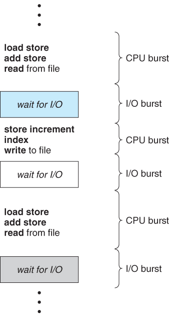
    
CPU 및 I/O 버스트 교대 순서

- **CPU burst** : 프로그램 실행 중 CPU 연산이 연속적으로 실행되는 상황
- **I/O Burst** : 프로그램 실행 중 I/O 장치의 입출력이 이루어지는 상황
- 모든 프로그램은 CPU, I/O burst의 연속이지만, 프로그램의 종류에 따라서 각 burst의 빈도나 길이가 다르다.

### [ CPU Burst 기간의 히스토그램 ]

    
    
CPU Burst 기간의 히스토그램

- **I/O bound job** : CPU를 짧게 쓰고 중간에 I/O가 끼어드는 job
    - CPU burst가 짧은 경우 (many short CPU bursts)
    - interactive함
    - 빈도 잦음
- **CPU bound job** : CPU만 오랫동안 쓰는 job 
    - CPU burst가 긴 경우 (few very long CPU bursts)
    - 빈도 낮음(한번에 길게)
- CPU bound job는 CPU를 많이 쓰고, I/O bound job은 CPU를 짧게, 잦게 쓴다 
- ✅ 컴퓨터 안에는 I/O bound job, CPU bound job이 섞여 있으므로 적절한 **CPU scheduling이 필요**
    - CPU bound job이 CPU를 잡고 놓지 않으면 I/O bound job이 너무 오래 대기하게 됨 -> 사용자 답답
    - 가능하면 사람과 interactive하는 I/O bound job에 CPU를 우선적으로 주는 것이 필요함

## 2. CPU Scheduler
#### CPU가 유후상태가 될 때마다, OS는 Ready queue에 있는 프로세스들 중에 누구에게 CPU를 줄것인지, 얼마나 쓰게 할 것인지 결정해야한다. 이를 수행하는 kernel code

CPU 스케줄링 알고리즘에 따라 프로세스에서 해야 하는 일을 스레드 단위로 CPU에 할당합니다.

Ready Queue는 반드시 FIFO 방식의 queue가 아니어도 되고, 우선순위 큐, 트리 등으로 구현될 수 있다.
일반적으로 Queue에 있는 레코드들은 프로세스의 프로세스 제어블록(PCB)들이다.

### [ CPU Scheduler가 필요한 경우 ]

    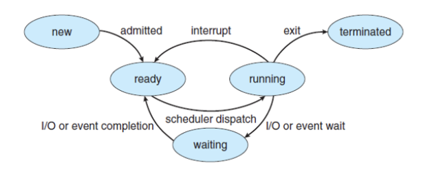
    
프로세스의 상태

- 선점 스케줄링 : `Interrupt`, `I/O or Event Completion`, `I/O or Event Wait`, `Exit`
- 비선점 스케줄링 : `I/O or Event Wait`, `Exit`

1. 실행(running) 상태에서 대기(waiting) 상태로 전환(switching)될 때 ( ex : I/O 발생 )
2. 실행(running) 상태에서 준비(ready) 상태로 전환(switching)될 때 ( ex : intterupt 발생 )
3. 대기(waiting) 상태에서 준비(ready) 상태로 전환(switching)될 때 ( ex : I/O 완료 시 )
4. 종료(Terminated)될 때

### [ 비선점 스케줄링 (_nonpreemptive ) ]

- 1,4번의 경우
- CPU가 한 프로세스에 할당되면 프로세스가 종료되거나 입출력 등의 이벤트가 있을 때까지 실행을 보장(**뺏을 수 없음**)
- 필요한 문맥 교환만 일어나기 때문에 Overhead가 상대적으로 적음
- 프로세스의 배치에 따라 효율성 차이 많이 남
- 응답 시간 예측 가능
- 짧은 작업을 수행하는 프로세스라도 긴 작업이 종료될 때까지 기다려야함

> #### 문맥교환 (Context Switching)
> CPU가 어떤 하나의 프로세스를 실행하고 있는 상태에서 인터럽트 요청에 의해 다음 우선 순위의 프로세스가 실행되어야 할 때 
> 기존의 프로세스의 상태 또는 레지스터 값(Context)을 저장하고 
> CPU가 다음 프로세스를 수행하도록 새로운 프로세스의 상태 또는 레지스터 값(Context)를 교체하는 작업

### [ 선점 스케줄링 ( preemptive ) ]

- 비선점을 제외한 모든 경우
- 시분할 시스템에서 타임 슬라이스가 소진되었거나, 인터럽트나 시스템 호출 종료 시에 더 높은 우선 순위 프로세스가 발생되었음을 알았을때, **현 실행 프로세스로부터 강제로 CPU를 회수**하는 것
- 높은 우선 순위을 가진 프로세스를 빠르게 처리하려는 시스템에 유용
- 빠른 응답을 요구하는 시분할 시스템에 유용
- CPU 처리 시간이 매우 긴 프로세스의 사용 독점을 막을 수 있어 효율적임
- 높은 우선 순위를 가진 프로세스들만 들어오는 경우 **Overhead 발생**

> #### 인터럽트 (Interrupt)
> CPU가 특정 기능을 수행하는 도중에 급하게 다른 일을 처리하고자 할 때 사용할 수 있는 기능
>
> 어느 시점에서건 일어날 수 있고, 커널에 의해서 항상 무시될 수는 없기 때문에, 
> 인터럽트에 의해서 영향을 받는 코드 부분은 반드시 **동시 사용으로부터 보호되어야 한다.**

> #### 오버헤드 (Overhead)
> 어떤 일을 처리할 때 추가적으로 소모된 자원
> 
> 예를 들어 , 프로그램의 실행흐름 도중에 동떨어진 위치의 코드를 실행시켜야 할 때 , 추가적으로 시간,메모리,자원이 사용되는 현상

### [ 디스패처 (Dispatcher) ]
#### CPU 코어의 제어를 CPU 스케줄러가 선택한 프로세스에 주는 모듈

디스패처에 대한 추가 설명

####  디스패처가 하는 일
- 한 프로세스에서 다른 프로세스로 문맥을 교환
- 사용자 모드로 전환
- 프로그램을 다시 시작하기 위해 사용자 프로그램의 적절한 위치로 이동(jump)

#### 디스패치 지연 ( dispatch latency )
디스패처가 하나의 프로세스를 정지하고 다른 프로세스의 수행을 시작하는데까지 소요되는 시간

    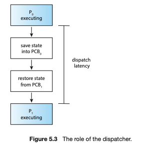
    
디스패치 지연

#### 문맥 교환 ( Context Switching )
- **자발적 문맥 교환**
    - 현재 사용 불가능한 자원을 요청했을 때 프로세스가 CPU 제어를 포기한 경우 발생
- **비자발적 문맥 교환**
    - 타임 슬라이스가 만료되었거나 우선순위가 더 높은 프로세스에 의해 선점되는 경우와 같이 CPU를 빼앗겼을 때 발생

## 3. 스케줄링 성능 척도, 기준 ( Scheduling Criteria )
#### 수 많은 프로세스들을 어떤 순서로 정렬할지 정책을 수립하는 것이 스케줄링이라면, 좋은 정렬 방법과 나쁜 정렬 방법이 있을 것이다. 이렇게 스케줄링 알고리즘을 평가할 수 있는 기준을 스케줄링 Criteria라고 한다.

**CPU 관점에서 따지고 있으므로, `한 프로세스가 시작해서 종료할 때까지` 가 아닌, `매 CPU burst 건 1개에 대한 것에 한해서만` 따진다고 이해해야 한다.**

1. 시스템 입장에서의 성능 척도
    1) **CPU 이용률(Utilization)** :
       - 시간당 CPU를 사용한 시간의 비율
       - 프로세서를 실행상태로 항상 유지하려고 해야 한다.
    2) **처리량(Throughput)** : 
       - 단위 시간당 완료된 프로세스의 개수

    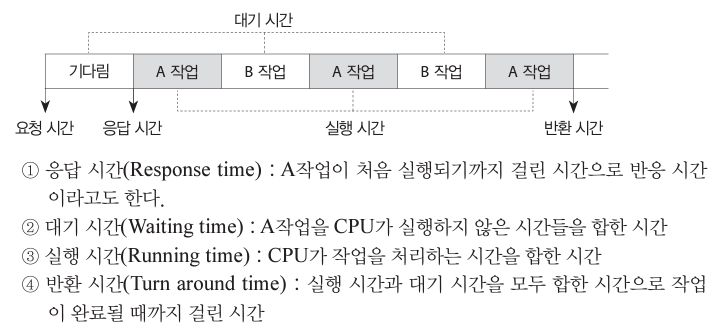

2. 프로그램 입장에서의 성능청도
    1) **총처리 시간, 반환 시간(Turnaround Time)** : 
       - 프로세스가 생성된 후 종료되어 사용하던 자원을 모두 반환하는 데까지 걸리는 시간
       - 작업이 준비 큐(ready queue)에서 기다린 시간부터 CPU에서 실행된 시간, I/O 작업 시간의 합
    2) **대기 시간(Waiting Time)** : 
       - 대기열에 들어와 CPU를 할당받기 까지 기다린 시간
       - 프로세스가 준비 큐에서 대기하면서 보낸 시간의 합
    3) **응답 시간, 반응 시간(Response Time)** : 
       - 대기열에서 처음으로 CPU를 얻을 때까지 걸린 시간
       - 대기시간과 비슷하지만 다른 점은, 대기시간은 준비 큐에서 기다린 모든 시간을 합친 것이지만 반응 시간은 CPU를 할당받은 최초의 순간까지 기다린 시간 한번 만을 측정

✔ `CPU Utilization`, `Throughput`을 최대화하고 `Turaround Time`, `Waiting Time`, `Response Time`을 최소화 하는 알고리즘의 선택이 바람직한 선택

하지만 대부분의 알고리즘의 경우는 Trade-Off 임으로 본인의 Context에 맞춰서 선택하는 것이 가장 좋은 방법이다.

## 4. 시스템 별 목표
#### CPU 스케줄링의 세부적인 목표는 시스템마다 다르다.

1. **Batch System** :
    - 한 번에 하나의 프로그램만 수행하는 것
    - 가능한 한 많은 일을 수행하기 위해 throughout과 CPU utilization이 중요하다.
2. **Interactive System** :
    - 사용자가 컴퓨터 앞에서 대화형으로 동작하는 시스템
    - Time Sharing 기법을 이용해야함
    - Response Time → 프로세스가 Ready Queue에서 대기하는 시간을 최소화한다.
    - Waiting Time → 프로세스가 Wait Queue에 서 대기하는 시간을 최소화한다.
    - Proportionality → 사용자가 요구하는 바를 이루어야 한다.
3. **Real-Time System** :
    - 시간 제약 조건이 걸려 있는 시스템
    - Meeting Deadlines
    - Predictability

# CPU Sheduling Algorithm
## 1. 선입 선처리 알고리즘 (First Come First Served Scheduling, FCFS)
#### CPU를 먼저 요청하는 프로세스가 CPU를 먼저 할당받는 방식

    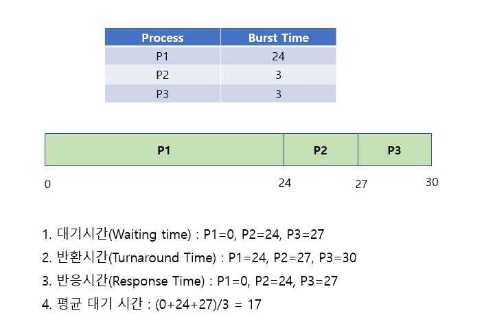
    
FCFS 예시

- **비선점형**
- 작성이 간단하고 이해하기 쉽다.
- 평균 대기 시간(Average Waiting Time)이 길어질 수 있다.
- 응답 시간(Response Time)이 길어질 수 있다.
- 반환시간(Turnaround Time) 면에서는 좋을 수 있다.
- Convoy Effect(호위 효과)가 발생할 수 있다.

> #### 호위 효과 (Convoy Effect)
> CPU 사용시간이 긴 프로세스에 의해 사용시간이 짧은 프로세스들이 오래 기다리는 현상
> 
> 호위효과가 발생할 경우 CPU와 장치 이용률이 낮아진다.

## 2. 최단 작업 우선 스케줄링 (Shortest Job First Schduling, SJF)
####  CPU 버스트 길이가 가장 작은 프로세스부터 순서적으로 CPU 코어를 할당하는 방식

- **비선점형 + 선점형**
- CPU burst time의 길이를 고려해서 스케줄링을 결정하는 알고리즘
- 평균 대기 시간을 줄일 수 있다.
- 다음 프로세스의 CPU burst time을 예측하는 것이 어렵다는 문제가 존재한다.

    
    
비선점형 SJF 예시

- 비선점형 : 실행되고 있는 프로세스는 끝까지 실행함

    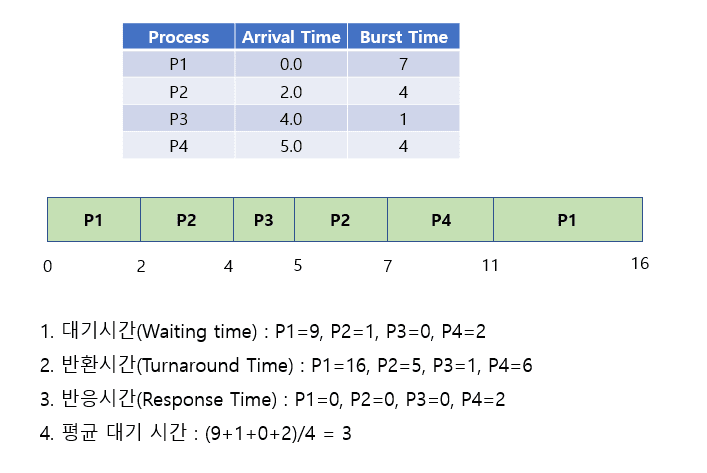
    
선점형 SJF 예시

- 선점형 : 현재 실행되고 있는 프로세스의 남은 시간보다 도착한 다음 프로세스가 더 빨리 끝낼 수 있는 프로세스이면 다음 프로세스를 실행
- **SRTF, SRF(Shortest Remaining Time First)** 라고도 부른다.

## 3. 라운드 로빈 스케줄링 (Round Robin Scheduling, RR)
####  각 프로세스가 CPU를 연속적으로 사용할 수 있는 시간을 특정 시간으로 제한하여 이 시간이 경과하면 프로세스로부터 CPU를 회수해 준비 큐에 있는 다른 프로세스에게 CPU를 할당 

    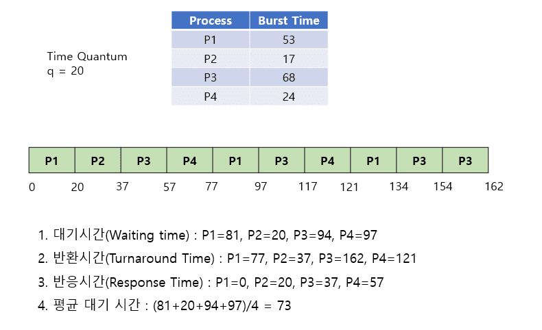
    
RR 예시

- **선점형**
    - 할당 시간 내에 처리를 완료하지 못하면 다음 프로세스로 넘어가므로 선점형 방식이다.
- 각각의 프로세스에 동일한 CPU 할당 시간을 부여해서 해당 시간 동안만 CPU를 이용하게 한다.
    - 시간 할당량(time quantum), 타임슬라이스(time slice) : 실행의 최소단위 시간
- 여러 종류의 이질적인 프로세스가 같이 실행되는 환경에서 효과적
    - n개의 프로세스가 있을 때 할당 시간을 q로 설정하면, 어떤 프로세스도 (n-1)q 시간 이상을 기다리지 않아도 된다.
- **타이머 인터럽트** : 할당 시간이 만료되어 CPU를 회수하는 방법
- 응답 시간을 빠르게 할 수 있다는 장점이 있다.
- 성능이 q의 크기에 많은 영향을 받는다.
    - q가 커진다면 :  FCFS처럼 작동한다. 
    - q가 매우 작아지면 : process sharing이라고 부름, 이것은 n개의 프로세스가 프로세서 속도의 1/n 씩으로 작동함을 의미한다. 문맥 교환의 오버헤드가 커지게 된다.

## 4. 우선순위 스케줄링 (Priority Scheduling)
#### 준비 큐에서 기다리는 프로세스들 중에서 우선순위가 가장 높은 프로세스에게 제일 먼저 CPU를 할당하는 방식

    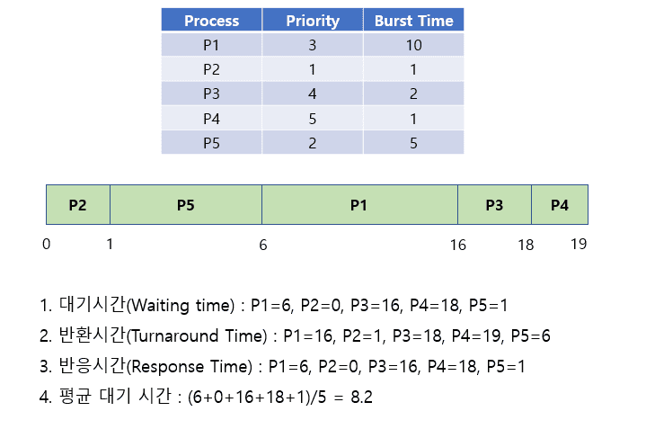
    
우선순위 예시

- **비선점 + 선점**
- 정적/동적으로 우선순위를 부여, 높은 순으로 CPU에 할당하는 방식이다.
    - 내부 : 제한 시간, 기억장소 요청량, 사용 파일 수, 평균 프로세서 버스트에 대한 평균 입출력 버스트의 비율
    - 외부 : 프로세스의 중요성, 사용료를 많이 낸 사용자, 작업을 지원하는 부서, 정책적 요인
- SJF의 경우 CPU Burst Time이 우선순위인 것처럼 작동하기 때문에 우선순위 스케줄링이라고 할 수 있다
- 문제 :
    - 무기한 봉쇄(Indefinite Blocking): 실행 준비는 되어 있으나 CPU를 사용하지 못하는 프로세스는 CPU를 기다리면서 봉쇄 된 것으로 간주
    - 기아 상태(Starvation) : 부하가 과중한 컴퓨터 시스템에서는 높은 우선순위의 프로세스들이 꾸준히 들어와서 낮은 우선순위의 프로세스들이 CPU를 얻지 못하게 될 수 도 있다
- 해결법 :
    - 노화(Aging) : 오랫동안 시스템에서 대기하는 프로세스들의 우선순위를 점진적으로 증가시킨다.
    - 우선순위 스케줄링과 라운드 로빈 스케줄링을 결합(다단계 큐 스케줄링)

## 5. 다단계 큐 스케줄링 (Multilevel Queue Scheduling)
#### 우선순위 스케줄링이 라운드 로빈과 결합한 스케줄링 알고리즘

    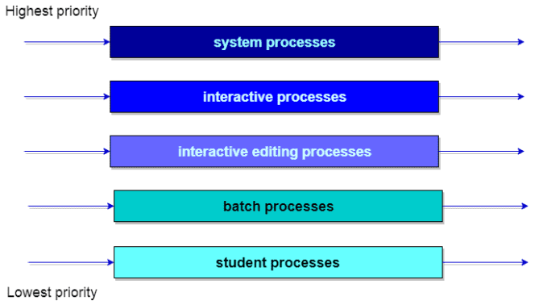
    
다단계 큐 예시

- **선점형**
- 성격이 다른 프로세스들을 별도로 관리하고 프로세스의 성격에 맞는 스케줄링을 적용하기 위해 준비 큐를 여러개로 분할하여 관리한다.
- 각 큐는 각자의 스케줄링 알고리즘을 가지고 있다. 
- 각 큐 사이에서 프로세스들이 이동할 수 없다. 
- 우선 순위가 낮은 큐들이 실행 못하는 것을 방지하고자 큐마다 다른 Time Quantum을 설정해 준다.
    - 우선 순위가 높은 큐 : 작은 Time Quantum, 낮은 큐 : 큰 Time Quantum
- 전위 큐와 후위 큐로 분할하여 운영
    - Foreground 프로세스 : 응답 시간 짧게 하기 위해 Round Robin 방식 사용
    - Background 프로세스 : 계산 위주의 작업을 하며 응답 시간이 큰 의미 없어서 FCFS 사용
    - 보통 CPU 시간의 80%는 Foreground의 RR, 20%는 Background의 FCFS에 할당된다.
- 기아(Starvation) 문제가 발생할 수 있다.

## 6. 다단계 피드백 큐 스케줄링 (Multilevel Feedback Queue Scheduling)
##### Multilevel Queue와 비슷하지만, MFQ는 각 큐 간에 프로세스들이 이동할 수 있다. 

    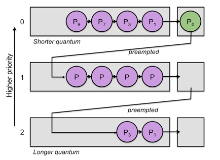
    
다단계 피드백 큐 예시

- **선점형**
- 다단계 큐에서 자신에게 할당된 Time Quantum을 다 사용한 프로세스는 밑으로 내려가고 Time Quantum을 다 채우지 못한 프로세스는 원래 큐 위치 그대로 둔다.
- 짧은 작업에 유리하며 입출력 위주의 작업에 우선권을 준다.
- 처리 시간이 짧은 프로세스를 먼저 처리하기 때문에 Turnaround 평균 시간을 줄여준다.
- Starvation의 해결방안인 Aging 구현 가능하다.
- 특정 시스템에 부합하도록 구성이 가능함으로 현대 사용되는 CPU 스케줄링 알고리즘 중 가장 일반적인 CPU 스케줄링 알고리즘이다.
- 가장 좋은 스케줄러로 동작하기 위해서는 모든 매개변수 값들을 선정하는 특정 방법이 필요하기 떄문에 가장 복잡한 알고리즘이다.

## 7. HRN (Highest Response-ratio Next)
#### 점유 불평등 현상이 발생하는 SJF 알고리즘을 보완하기 위해 만들어졌다. 우선 순위를 계산하여 동작한다.

    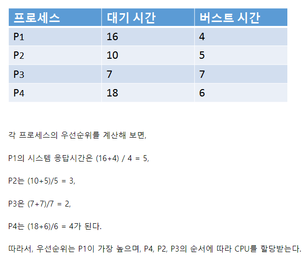
    
다단계 피드백 큐 예시

- **비선점형**
- 준비 큐에서 우선순위에 밀려서 오랫동안 CPU를 받지 못하는 프로세스의 우선순위를 높이는 방식(기아현상 보완)
- 우선 순위 = (대기시간 + 실행시간) / (실행시간)

## ❓ 관련 질문
#### Q1. SJF를 preemptive한 방식으로 구현하기 위해서는 ready queue에 새로운 프로세스가 도착할 때마다 CPU에게 interrupt를 걸어야하나? 어떻게 새로운 프로세스가 도착했음을 알고, 그것이 더 짧은 프로세스임을 알고, CPU 제어권을 넘기는가?

#### Q2. time slice방식에서 각 queue에 CPU time을 비율로 할당한다는 것의 의미는 무엇인가? 어떤 것에 대한 비율인가?

#### Q3. 별개의 queue를 두는 방식이 왜 load sharing과 관련이 있는가?

## 📖 참고 자료
[[OS] CPU burst와 CPU Scheduler](https://velog.io/@kmjoo/OS-CPU-Scheduling-1)

[[Operating System - Chapter 5] CPU 스케줄링](https://imbf.github.io/computer-science(cs)/2020/10/18/CPU-Scheduling.html)

[[운영체제] CPU 스케줄링 알고리즘 정리 및 요약 | FCFS, SJF, Round Robin](https://code-lab1.tistory.com/45)

[KOCW 운영체제 - 이화여대 반효경 교수 (2014-1)](http://www.kocw.net/home/search/kemView.do?kemId=1046323)

Abraham Silberschatz, Greg Gagne 및 Peter Baer Galvin, "운영 체제 개념, 제9판", 6장

[OS는 할껀데 핵심만 합니다. 5편 스케줄링2, 비선점형 스케줄링 알고리즘(FCFS, SJF, HRN)](https://velog.io/@chappi/OS%EB%8A%94-%ED%95%A0%EA%BB%80%EB%8D%B0-%ED%95%B5%EC%8B%AC%EB%A7%8C-%ED%95%A9%EB%8B%88%EB%8B%A4.-5%ED%8E%B8-%EC%8A%A4%EC%BC%80%EC%A4%84%EB%A7%812-%EB%B9%84%EC%84%A0%EC%A0%90%ED%98%95-%EC%8A%A4%EC%BC%80%EC%A4%84%EB%A7%81-%EC%95%8C%EA%B3%A0%EB%A6%AC%EC%A6%98FCFS-SJF-HRN)
