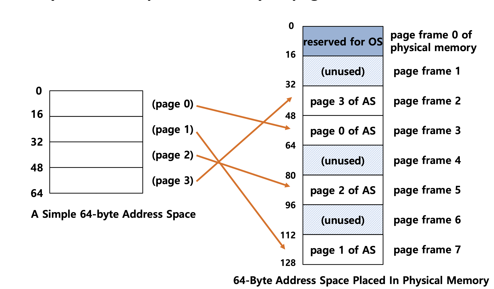
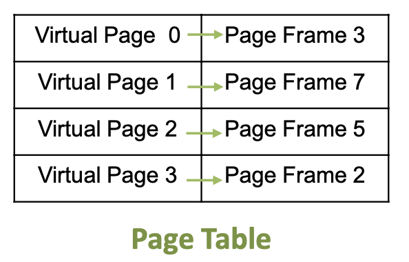
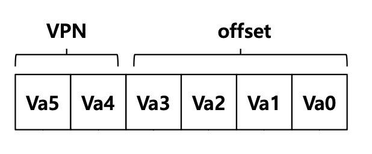
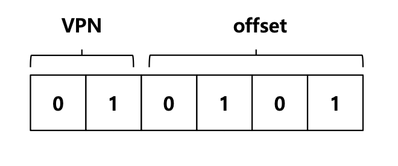
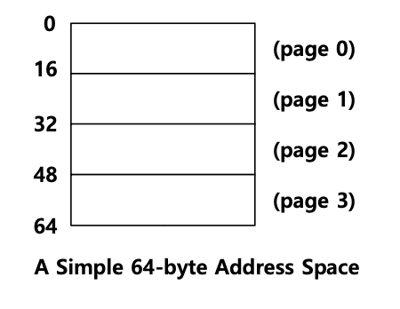
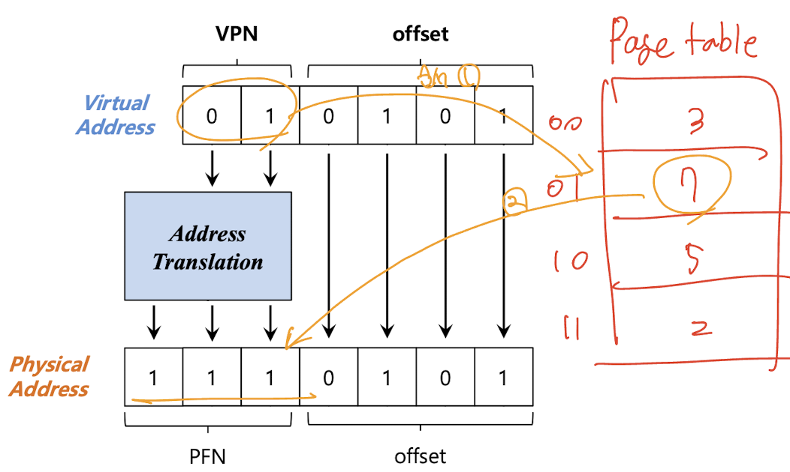

> 작성자 : 팬시 / [출처](https://fancy96.github.io/OS-18-Paging/)

> 이 글의 사진과 내용은 대학교 수업 자료를 기반으로 작성했으므로 가급적 복사는 지양해 주시면 감사하겠습니다.

# Paging

## Concept of Paging

* `Paging`은 프로세스의 가상 주소 공간을 **고정적인 크기(fixed-sized)로 나누어서 메모리에 할당**하는 방식이다. 이때 고정적인 크기 단위를 `page`라고 부른다.

* 그리고 이러한 가상공간의 page 를 실제 메모리에 할당할 때 이를 `page frame`이라고 부른다.

* 즉 가상 메모리(주소 공간)에서는 page, 실제 메모리(주소 공간)에서는 frame 이라고 불리는 고정 크기의 공간으로 프로세스를 실행하겠다는 의미이다.

## Advantages Of Paging

* **Flexibility** : 주소 공간의 추상화를 효율적으로 지원한다.

    * 얼마나 heap과 stack이 커지고 사용하는지에 대한 고민을 할 필요가 없다.

* **Simplicity** : 여유 공간(free-space)의 관리가 쉽다.

    * 가상 메모리의 page와 page frame이 같은 크기를 가진다.

    * 할당이 쉽고 여유 공간을 유지한다.

## A Simple Paging

* **128-byte physical memory** with 16 bytes `page frames`

* **64-byte address space** with 16 bytes `pages`

* 위의 그림에서 4개의 page로 구성된 가상 주소 공간을 8개의 page frame으로 쪼갠 것을 볼 수 있다.

## How To Store Address Translation

* Paging 기법을 사용하기 위해서 가상 주소 공간에 있는 프로세스의 `page`들이 실제 메모리의 어디에 위치를 하는 지를 기억하는 `Page table`을 가지고 있어야 한다.

* `Page table` 이란 가상 주소 공간의 page가 실제 메모리(주소 공간)에 어디에 위치해 있는 지를 기록한다.

    * Per-process structure(프로세스별 구조)

    * OS 메모리의 영역에 저장된다.

## Address Translation

* **Paging 기법을 이용하여 주소 변환을 구하는 방법**에 대해 알아보자.

* 가상 주소 공간에는 두 가지 요소가 있다.

    * VPN : **V**irtual **P**age **N**umber -> 상위 2개의 bit이 Page를 표현한다.

    * Offset : page 안에 있는 offset -> 나머지 4개의 bit이 offset을 표현한다.

* Example: virtual address **21** in 64-byte address space

A Simple 64-byte Address Space

* Page table을 통해서 Virtual Page, Physical Page frame 의 i번째를 찾는다.

    * VPN 에서 상위 2개의 bit 값이 1이므로 page 1에 해당한다.

* Offset을 통해 그 Page 안에 몇번째 메모리 주소인지 찾는다.

    * offset 값이 5이므로 16부터 시작해서 5번째인 21를 의미한다.

## Example: Address Translation

* The virtual address 21 in 64-byte address space

* 가상 주소 공간에서 VPN 값을 Page Table을 통해 해당하는 값을 찾아서 실제 주소 공간의 PFN 값을 찾는다.

    * VPN 값 : 01 -> Page table 01에 해당 하는 값은 7 (= PFN 값)

    * PFN = Physical Frame Number (= PPN, Physical Page Number)

##  Where Are Page Tables Stored?

* `문제점 1` : Page table은 가변 크기 할당에서 사용하던 segment table이나 base, bound 레지스터를 사용하는 것보다 **필요한 크기가 훨씬 커질 수 있다.**

* 예를 들어 `4KB` page를 갖는 `32bit`의 가상 주소 공간(address space)를 생각해보면,

  * 이 가상 주소은 `20bit`의 VPN, `12bit`의 offset 으로 분할됩니다.

  * 참고로 `address space`는 32bit 이고 `Virtual address space` 와 같은 말이다.

  * `VPN` = 페이지(page)의 수 = 전체 주소 size / 페이지 size = 2^32 / 2^12 = 2^20 = `20bit`

  * `offset` = 전체 주소 size - VPN = 32bit - 20bit = `12bit`(2^32 / 2^20 = 2^12)

  * 4MB = 2^20 entries * 4 Bytes per page table entry

* 각각의 프로세스를 위한 Page table은 **OS 가상 메모리**에 저장된다.

## What Is In The Page Table?

* Page table 이란 무엇인가 ?

* `Page table`은 **가상 주소를 실제 메모리 주소로 매핑(변환)힐 때 사용되는 자료 구조**이다.

  * 이를 위해 가장 간단한 구조는 `1차원 배열`을 사용하는 것이다.

* `VPN`으로 해당 프로세스의 page table 배열을 인덱싱하고 변환을 위해 해당 인덱스의 `page table entries(PTE)`를 조회한다.

  * 여기서 `PTE`는 **page table에서 각 page의 정보**라고 생각하면 된다.

## Example: x86 Page Table Entry

* Page table entries(PTE)에는 다양한 정보가 있다.

> 0번 인덱스 부터 살펴보겠다.

* Present bit : 현재 실제 메모리나 디스크에 존재하는 page인지 확인하는 비트

* Read/Write bit (Protection bit) : page가 쓰기가 허용되는지 여부를 결정하는 비트

* U/S(User/supervisor bit) : User Mode 프로세스가 page에 접근할 수 있는지에 대한 비트

* PWT, PCD, PAT, G : page에 대해 하드웨어 캐싱이 작동하는 방식을 결정하는 비트

* A(Accessed bit) (Reference bit) : 최근 참조된 적이 있는지에 대한 정보 (페이지 교체 정책에서 사용됨)

* D(Dirty bit) : page가 수정된 적이 있는지에 대한 정보

* 나머지는 **Page frame number**(= Page Base Address, `PFN`)로 구성된다.

> 자세한 정보는 여기 [source](https://www.cs.uaf.edu/2007/fall/cs301/lecture/11_30_cache.html) 에 가보시면 됩니다. (retrieved 2015.05.03)

## Paging: **Too Slow**

* 가상 주소를 실제 메모리 주소로 변환하는 과정을 다음과 같이 요약할 수 있다.

1. 프로세스의 가상 주소로 VPN과 offset을 알아낸 뒤, 해당 프로세스의 VPN 값으로 프로세스의 page table에서 `PTE` 정보를 가지고 온다.

2. PTE(page table entry)정보에서 `PFN`(page frame number)을 추출한다.

3. PFN, offset을 사용해서 실제 메모리 주소를 얻는다.

* `문제점 2` : 하지만 이러한 과정은 **컴퓨터 성능을 떨어지게 하는 문제점**을 발생시킨다.

  * 원하는 `PTE`의 위치를 찾으려면 **page table의 시작 위치**가 필요하다.(To find a location of the desired PTE, the starting location of the page table is needed.)

  * 모든 메모리 참조에 대해 페이징을 수행하려면 OS에서 하나의 추가 메모리 참조를 수행해야 한다.(For every memory reference, paging requires the OS to perform one extra memory reference.)

  * 즉, 메모리에서 데이터를 가지고 오는데 주소 변환 정보를 알아야 하므로 추가적인 메모리 접근이 필요하다.

## 정리

* Paging은 가변 크기 할당 방법인 segmentation의 외부 단편화 문제점을 해결하였고, 유연성을 가져와주는 장점을 가진다.

* 하지만, paging을 지나치게 사용한다면, `문제점 2`에서 말한 것 처럼 [1] 메모리 접근이 너무 잦아져서 성능 저하를 일으킬 수 있고,

* [2] 실제 메모리에서 데이터를 가지고 오는데 주소 변환 정보를 알아야 하므로 추가적인 메모리 접근이 발생하여 메모리 낭비가 발생할 수 있다.

* 이러한 두 가지의 문제들을 보완하기 위해 나온 방법이 `TLB(Translation Lookaside Buffer)`가 있다.

## 예상 질문

1. Paging(페이징)이 왜 나오게 되었고, 개념에 대해 말씀해주세요.

2. Paging의 장점과 단점에 대해 말씀해주세요.

3. Paging을 이용한 주소 변환 과정에 대해 말씀해주세요. (Page table, PTE, PFN 개념 언급)

## Reference

* 학교 수업 내용 - [Operating Systems Three Easy Pieces (Remzi H. Arpaci-Dusseau & Andrea C. Arpaci-Dusseau)](https://www.amazon.com/Operating-Systems-Three-Easy-Pieces/dp/198508659X)

* [[OS] Paging을 사용한 고정 크기 메모리 관리 및 추상화](https://icksw.tistory.com/148)
