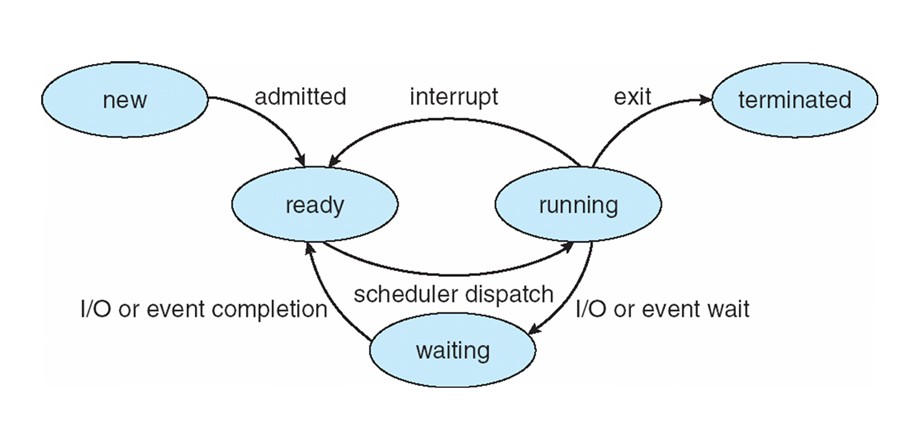
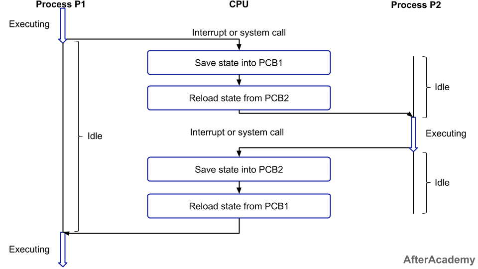

# PCB(Process Controll Block)
pcb(process control block)으로 프로세스에 대한 정보를 저장한 자료구조이다. 프로세스 테이블에 저장이 되어 사용하게 된다.
주기억장치에서 저장이된다. 문맥 교환(context Changeing)을 하기위해 필요하다.

## 프로세스의 상태
프로세스는 여러가지 상태를 가지고 있다.   

### new와 terminated
new와 프로세스가 생성된 것을 의미하고, terminated는 프로세스의 종류를 의미한다. 위의 두 상태는 임시적인 상태이며, 주로 아래의 세가지의 경우가 돌아가면서 프로세스를 동작 시킨다.

### ready
프로세스의 실행될 준비가 다 된 상태입니다. 실행 상태인 것을 스캐줄링(scheuler)하여 디스패치(dispatch)합니다.
running은 프로세스가 실행중인 상태이고, waiting은 사용자의 입력을 기다리는 상태입니다
> 스캐줄링(scheuler): 프로세스들중에 하나를 고르는 것 
디스패치(dispatch): 고른 프로세스를 cpu에 할당하는 것

### running & waiting
running은 프로세스가 실행중인 상태이고, waiting은 사용자의 입력을 기다리는 상태입니다
터미널에서 프로그램을 다운로드을 할때, 프로그램을 다운로드하다가 사용자의 허용이 필요한 상황이 있다. 그때 다운로드하는 중을 running 상태이고, 사용자의 허용이 필용한 상태를 waiting 라고 이해하면 된다.

## pcb의 구조

- 프로세스 식별자: 프로세스를 식별하는 용도
- 프로세스 상태: 준비, 대기,await, 실행 등의 상태를 가진다.
- 프로세스 권한: 프로세스의 현재 위치를 저장하는 것
- 프로세스 카운터: 프로그램 카운터는 이 프로세스가 다음에 실행할 명령어의 주소를 가리킴
- cpu 스케줄링 정보: 우선 순위, 최종 실행시각, CPU 점유시간
- 계정 정보: 페이지 테이블, 스케줄링 큐 포인터, 소유자, 부모
- i/o 상태 정보: 프로세스에 할당된 입출력장치 목록, 열린 파일 목록 등
- cpu 레지스터

# Context Switching(문맥 교환)
Context Switching이란, CPU가 이전의 프로세스 상태를 PCB에 보관하고, 또 다른 프로세스의 정보를 PCB에서 읽어 레지스터에 적재하는 과정이다.

- idel: 유후상태
- excuting: 실행중인 상태

1. precess p1에서 interrupt나 System call을 만나면 PCB1에 프로세스의 정보가 저장이 된다.
2. precess p2의 정보를 가지고 오고, 상태를 변경하여 cpu에 할당한다.
3. precess p2의 일이 interrupt나 System call을 만나면 PCB2에 프로세스의 정보가 저장이 된다.
4. precess p1의 정보를 가지고 오고, 상태를 변경하여 cpu에 할당한다.

## Context Switching이 발생하는 원인
선점형 스케줄링의 방식으로 진행이 되기 때문이다. 
선점형 스케줄링은 CPU에 우선순위가 높은 프로세스가 할당되면, 기존에 실행되고 있는 프로세스를 중지하고, 우선순위가 높은 프로세스가 진행이 된다.  
중지되는 프로세스의 정보를 저장하고, 우선순위가 높은 프로세스를 실행하는 방식이 Context Switching이다

## Context Switching의 문제점
Context Switching이 잦으면 오버헤드(Overhead) 비용이 발생하여 성능이 떨어진다.
> 오버헤드(Overhead): 사용된 시간과 사용된 메모리의 양

실행할 프로세스의 정보를 PCB에서 가지고 올 동안 CPU에 할당된 프로세스가 없어서 아무일도 하지 못하게 된다.  
이러한 상황이 잦이면 성능 저하로 이류어진다

## Context Cost
- Cache 초기화
- Memory mapping 초기화
- Kenel의 실행 유지

위의 같은 문제점을 해결할려면, 여러 프로세스에 context switching을 하지 말고, 단일 프로세스에 여러 쓰레드를 생성하여 쓰레드에서 Context Switching을 하면 된다.  
쓰레드의 경우, 메모리 공간을 공유하고 있어, 스택을 정리만 하면 되기 때문에 프로세스보다 비용이 적게 든다.

# 면접 질문 
- Context Switching은 무엇인가요? 
- 프로세스의 Context Switching Cost의 해결방안은 무엇일까요?

# 레퍼런스
- [레지스터](https://m.blog.naver.com/mjnms/220460806744)
- [양햄찌가 만드는 세상](https://jhnyang.tistory.com/33)
- [yoongrammer](https://yoongrammer.tistory.com/52)
- [초보개발자 긍응성](https://ckddn9496.tistory.com/13)
- [Binary Terms](https://binaryterms.com/process-control-block-pcb.html)
- [profile_exe](https://velog.io/@profile_exe/%EC%9A%B4%EC%98%81%EC%B2%B4%EC%A0%9C-Queue-Swap)
- [하고싶은게너무많아](https://somuchthings.tistory.com/45)
- [앨리스 로그 수집](https://sweetday-alice.tistory.com/171)
- [passion_man](https://velog.io/@passion_man/%EC%9A%B4%EC%98%81%EC%B2%B4%EC%A0%9C-3.-%ED%94%84%EB%A1%9C%EC%84%B8%EC%8A%A4%EC%99%80-%ED%94%84%EB%A1%9C%EC%84%B8%EC%8A%A4-%EA%B4%80%EB%A6%AC#%ED%94%84%EB%A1%9C%EC%84%B8%EC%8A%A4-%EC%A0%9C%EC%96%B4)
- [after academy](https://afteracademy.com/blog/what-is-context-switching-in-operating-system/)
- [위키독스](https://wikidocs.net/65528)

