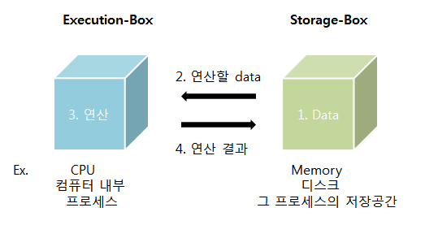
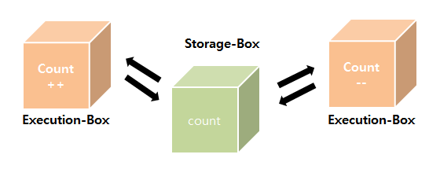
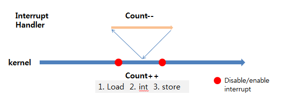
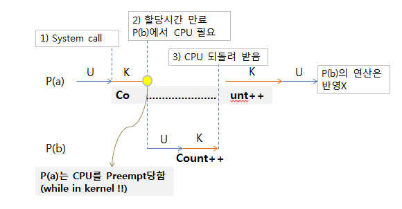
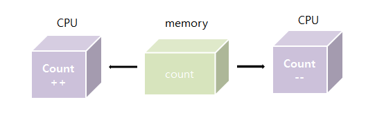
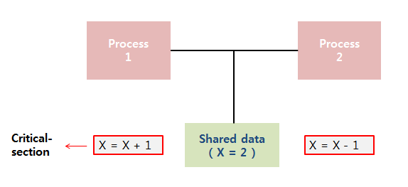

> [해당 포스팅](https://hello-judy-world.tistory.com/193)에서도 내용을 확인할 수 있습니다.

> written by [judy](https://github.com/ParkJungYoon)

### [ 데이터 접근 ]

데이터가 저장되어 있는 위치로부터 데이터를 읽어와서 연산한 뒤, 연산한 결과를 이전에 저장되어있던 그 위치에 다시 저장한다.

데이터를 읽기만 하면 문제가 없는데, 데이터를 연산하고 수정하게 되면 누가 먼저 읽어 갔는지에 따라 결과가 달라질 수 있다.

이때 발생할 수 있는게 **Synchronization(동기화)** 문제이다.

<div align='center'>
    
</div>

```
load X, reg1
inc   reg1
store X, reg1
```

<br>

## 🤼‍♂️  Process Synchronization

> 공유 데이터(shared data)의 동시 접근(concurrent access)은 데이터의 불일치 문제(inconsistency)를 발생시킬 수 있다.

> 따라서 일관성(consistency) 유지를 위해서는 협력 프로세스(cooperating process) 간의 **실행 순서**(orderly execution)를 정해주는 메커니즘이 필요하다.

<br>

### ✔️  race condition (경쟁 상태)

> 여러 프로세스/스레드가 동시에 같은 데이터를 조작할 때 타이밍이나 접근 순서에 따라 결과가 달라질 수 있는 상황

> 이것을 막기 위해서는 concurrent processs는 동기화(synchronize)되어야 한다.

- Storage-Box를 공유하는 Execution-Box가 여러 개 있는 경우 <u>race condition</u> 가능성 있다.
    - Count++ 연산이 실행되는 동안 연산 이전 데이터를 읽어간 Count-- 에서 연산을 마치고 저장하면 Count-- 연산만 적용된다.

*추상적인 예시* 
<div align='center'>
    
</div>

### [ OS에서 race condition은 언제 발생할까 ]

### 1) kernel 수행 중 인터럽트 발생

> ex) Initial counter = 10

커널모드 running 중 Count++ 하고 있었다.

(1번)에 CPU 레지스터로 데이터를 읽어온 상황에서 (2번)인터럽트가 들어오면 인터럽트 처리루틴이 수행되며 Count--를 하고 반영한다.

그리고 다시 (3번)이 실행되는데 이미 1번에서 읽어오는 작업은 끝났기 때문에 Count++후 저장한다.  

<div align='center'>
    
</div>

🙋‍♀️  **Expected** : Counter = 10

💁‍♀️  **Unexpected** : Counter = 11

-> 그래서 running 중에 작업이 끝날 때까지는 disable interrupt 상태로 해서 현재 작업이 끝나기 전까지는 인터럽트가 실행되지 않도록 한다.

### 2) Process가 system call을 하여 kernel mode로 수행 중인데 context switch가 일어나는 경우

-*이때 U는 유저모드, K는 커널모드*

<div align='center'>
    
</div>

-> 커널 모드에서 수행 중일 때는 CPU를 preempt하지 않는다. 커널 모드에서 유저 모드로 돌아갈 때 preempt한다.

(CPU 할당 시간에 편차가 생길 수 있다.)

### 3) Multiprocessor에서 shared memory 내의 kernel data에 접근할 때

<div align='center'>
    
</div>

**(방법1)**

한 번에 하나의 CPU만이 커널에 들어갈 수 있도록 하고, 하나의 커널을 lock으로 막고, 커널을 빠져나올 때 unlock. (커널 전체를 lock하기 때문에 비효율적)

**(방법2)** 

커널 내부에 있는 각 공유 데이터에 접근할 때마다 그 데이터에 대한 lock/unlock

<br>

### ✔️  synchronization (동기화)

여러 프로세스/스레드를 동시에 실행해도 공유 데이터의 일관성을 유지하는 것
 
<br>

### ✔️  critical section (임계 영역)

공유 데이터의 일관성을 보장하기 위해 하나의 프로세스/스레드만 진입해서 실행(mutual exclusion) 가능한 영역

- `Problem` : 하나의 프로세스가 <u>critical section</u>에 있을 때 다른 모든 프로세스는 critical section에 들어갈 수 없어야 한다.

<div align='center'>
    
</div>


### [ 프로세스 일반적인 구조 ]

critical section problem을 해결하기 위한 기본 뼈대

```
do {
    entry section       // 공유 데이터에 접근하기 이전에 lock을 건다 - acquire lock
    	critical section    // 공유 데이터를 접근하는 코드
    exit section        // 끝나면 unlock(다른 프로세스가 critical-section에 들어갈 수 있게) - release lock
    	remainder section
} while(1);
```

### [ critical section problem 해결책이 되기 위한 조건 ]

아래 조건이 모두 만족해야한다.

- **mutual exclusion** (`상호 배제`)
    - 한 번에 하나의 프로세스/스레드가 critical section에서 실행할 수 있다.
- **progress** (`진행`)
    - 아무도 critical section에 있지 않으면 들어가고자 하는 프로세스가 있으면 critical section에 들어가게 해주어야 한다.
- **bounded waiting** (`한정된 대기`)
    - 하나의 프로세스/스레드가 critical section에 들어가기 위해서 무한정 기다리는 상황이 되면 안된다.
    - 다른 프로세스들의 기아(Starvation)을 막기 위해서

<br>

## 💡 Solution

> mutual exclusion 보장 -> 락(lock) 사용 <br> 락을 획득하기 위해 경쟁

```
do {
    acquire lock
    	critical section   
    release lock
    	remainder section
} while(1);
```

## 1. spinlock (스핀락)

> 락을 가질 수 있을 때 까지 반복해서 시도

> 임계영역이 lock이 걸려서 진입이 불가능할 때, <br> 임계영역이 unlock되어 진입이 가능해질 때까지 루프를 돌면서 재시도하여 스레드가 CPU를 점유하고 있는 상태


**`단점`**
- 기다리는 동안 CPU를 낭비한다는 단점
- **`Busy-Waiting`** 상태


**[ 예시로 설명 ]**
- TestAndSet을 통해 T1, T2가 동시에 실행하지 않도록 함

```
- T1 시작) while 루프 조건문, 내부적으로 lock은 1로 바꾸고 기존 lock 0을 반환
- 조건문을 만족하지 않아 루프 탈출
- critical section 실행
- T2 시작) while 루프 조건문, 내부적으로 - lock1로 바꾸고 기존 lock 1을 반환
- 조건문 만족하여 루프 반복
- T1이 lock=0 반환 및 종료
- T2 while 루프 탈출
- critical section 실행
- T2이 lock=0 반환 및 종료
```

```c++
volatile int lock = 0; // global

void critical() {
    while (test_and_set(&lock) == 1);
    ...critical section
    lock = 0;
 }
```

### TestAndSet

기존 lock을 반환하는 함수. 반환 전 lock을 1로 바꾼다.

실제 구현부가 해당 코드로 이루어져 있진 않다. 
- 설명을 위한 코드

```c++
int TestAndSet(int*lockPtr) {
    int oldLock = *lockPtr;
    *lockPtr = 1;
    return oldLock;
}
```

🤔 동시에 두 개의 스레드가 실행하면??

🙋‍♀️💡 **CPU의 도움 (하드웨어의 도움)**

### [ TestAndSet은 CPU atomic 명령어 ]

- 실행 중간에 간섭받거나 중단되지 않는다.
- 같은 메모리 영역에 대해 동시에 실행되지 않는다.
    - 두 개 이상의 프로세스/스레드가 동시에 호출해도 CPU 레벨에서 먼저 하나를 실행시키고 다른 하나를 실행시킨다.

<br>

## 2. Mutex (뮤텍스)
> 여러 스레드를 실행하는 환경에서 자원에 대한 접근에 제한을 강제하기 위한 동기화 매커니즘

> 락을 가질 수 있을 때까지 휴식

> Mutual Exclusion의 약자

### [ 스핀락과 차이점 ]
 
- 스핀락이 임계영역이 unlock(해제)되어 권한을 획득하기까지 Busy-Waiting 상태를 유지한다면, 뮤텍스는 Block(Sleep) 상태로 들어갔다 Wakeup 되면 다시 권한 획득을 시도한다.
- **`Block-Wakeup 상태`**
- 뮤텍스 lock은 내부적으로 value로 컨트롤하는데 value를 가질 수 없을 때는 큐에서 Block하면서 기다린다. 그래서 CPU 사이클을 불필요하게 낭비하는 것을 최소화시켜준다.

이때에도 mutex의 lock을 획득하기 위해 프로세스/스레드가 경합하게 된다.

```
mutex -> lock();
...critical section
mutex -> unlock();
```

**`value`**
- value = 1을 취득해야 critical section에서 동작 가능하다.
- 이때 value 역시 서로 취득하려고 하는 공유되는 데이터이다.
- 뮤텍스는 상태가 0, 1이다.

**`guard`**
- **race condition 발생을 막기 위해 지켜주는 장치**이다.
- 아래 lock과 unlock을 보면 value값을 바꿔주는 로직을 보호하기 위해서 guard를 사용하고 있다.
- 이때도 **TestAndSet은 CPU atomic 명령어**를 사용하고 있다.

```c++
class Mutex {
    int value = 1;
    int guard = 0;
}
```

그래서 만약 value가 누군가 가지고 있다면 큐에 들어가게 되고, 획득할 수 있다면 value를 가지고 다른 프로세스가 가질 수 없도록 value는 0으로 설정해둔다.

```c++
Mutex::lock() {
    while (test_and_set(&guard));
    if (value == 0) {
    	...현재 스레드를 큐에 넣음;
        guard = 0; & go to sleep
    } else {
    	value = 0;
        guard = 0;
    }
}
```

unlock 시에는 큐에 있을 때는 그 중 하나를 깨우고, 없다면 다시 획득할 수 있는 상태로 value를 1로 설정해둔다.

```c++
Mutex::unlock() {
    while (test_and_set(&guard));
    if (큐에 하나라도 대기중이라면) {
    	그 중 하나를 깨운다;
    } else {
    	value = 1;
    }
    guard = 0;
}
```

🤔 뮤텍스가 스핀락보다 항상 좋을까?

🙋‍♀️💡 **멀티 코어** 환경이고, **critical section에서의 작업**이 컨텍스트 스위칭보다 **더 빨리 끝난다면 스핀락이 뮤텍스보다 더 이점**이 있다.

<br>

## 3. semaphore (세마포어)

> 멀티프로그래밍 환경에서 다수의 프로세스나 스레드의 여러 개의 공유 자원에 대한 접근을 제한하는 방법으로 사용된다.

> **signal mechanism**을 가진, 하나 이상의 프로세스/스레드가 critical section에 접근 가능하도록 하는 장치 <br>
🚩 `목적`: Mutual Exclusion이 아닌 공유 자원에 대한 관리

> 스핀락과 뮤택스와 달리 표현형이 정수형이다. 아래 value가 0,1,2, .... 가능하다. <br>
이 점을 살려 <u>하나 이상의 컴포넌트</u>가 **공유자원에 접근**할 수 있도록 허용할 수 있다.

컴포넌트가 특정 자원에 접근할 때 wait이 먼저 호출되어 임계영역에 들어갈 수 있는지 먼저 확인한다.

임계영역에 접근이 가능하다면 wait을 빠져나와 임계영역에 들어가고, 이후 signal이 호출되어 임계영역에서 빠져나옵니다.

### [ 세마포어 P, V 연산 ]

```
semaphore -> wait();  // P : 임계 구역 진입할 때 외친다.
...critical section
semaphore -> signal();  // V : 임계 구역을 빠져나올 때 외친다.
```

### [ 종류 ]

- **`Binary Semaphore`** : mutex(뮤텍스)와 동일하게 value를 1을 가지는 세마포어
- **`Counting Semaphore`** : value값이 1보다 큰 세마포어

```c++
class Semaphore {
    int value = 1;
    int guard = 0;
}
```

**`wait 연산`**

세마포어의 값을 감소. 만약 값이 음수가 되면 wait을 호출한 스레드는 블록되지만 음수가 아니면 작업을 수행한다.

```c++
Semaphore::wait() {
    while (test_and_set(&guard));
    if (value == 0) {
    	...현재 스레드를 큐에 넣음;
        guard = 0; & go to sleep
    } else {
    	value -= 1;
        guard = 0;
    }
}
```

**`signal 연산`**

세마포어의 값을 증가. 만약 값이 양수가 아니라면 wait 연산에 의해 블록된 스레드를 다시 wake시킨다.

```c++
Semaphore::signal() {
    while (test_and_set(&guard));
    if (큐에 하나라도 대기중이라면) {
    	그 중 하나를 깨워 준비 시킨다
    } else {
    	value += 1;
    }
    guard = 0;
}
```

### [ Signaling 메커니즘 ]

세마포는 순서를 정해줄 때 사용한다.

세마포어는 **Signaling** 메커니즘으로 락을 걸지 않은 스레드도 signal을 통해 락을 해제할 수 있다.

### [ 예시 : 멀티 코어 환경 ]

- 상황

```c++
class Semaphore {
    int value = 0;
    int guard = 0;
}
```
```
< P1 >
task1
semaphore -> signal()
< P2 >
task2
semaphore -> wait()
task3
```

**`[ 경우 1 ]`**

- task1과 task2 실행
- task1이 먼저 수행을 끝내고 signal() 호출 -> value = 1
- 그 다음 task2 수행이 끝나고 wait() 호출 -> value = 0
- task3 실행


**`[ 경우 2 ]`**

- task1과 task2 실행
- 먼저 task2 수행이 끝나고 value = 0 이라서 wait에 들어가지 못하고 queue에 넣고 block
- 그 다음 task1이 수행을 끝내고 signal() 호출 -> 잠자는 P2 깨운다.
- task3 실행

-> 순서가 있다. 

-> P2가 wait하고 P1이 signal을 보낸다.

<br>

### ✔️ 예시로 설명

식당을 예시로 생각해 보자.

```
🍽️ 식당: 임계 영역
🧍‍♀️ 손님: 프로세스/스레드
🔒 가게 문 잠금: lock 
💤 대기실: 큐
👩‍🍳 직원: 코어
```

### [ 상황 1 - 뮤텍스]

가게가 작아서 좌석이 **하나**뿐이다. 그래서 한 명씩 입장해서 식사를 할 수 있다. 

<br>

이때 가게로 손님1 팬시가 가게로 들어온다.

**🙋‍♂️🙆‍♂️ 손님1 (팬시)** : 떡볶이 1인분이요~

자리가 꽉 찼기 때문에 직원은 가게 문을 **lock** 잠근다.

<br>

이어서 맛집 소문이 났는지 손님2 주디가 가게 앞으로 온다.

**🙋‍♀️🙅‍♀️ 손님2 (주디)** : 엇 ㅠㅠ 꽉 찼네? 

이때 주디가 <u>대기하는 방법</u>은 두 가지가 있다.

<br>

🌀 **1) 자리가 생길 때까지 계속 문을 두드린다. -> spinlock (스핀락)**

배고픈 주디.. 계속 문을 두드린다..!! 자리 없어요??? 자리 없어요???

**💡 Busy-Waiting 상태**

계속 문을 두드리는 주디.. 직원은 계속 대답해야 해서 다른 설거지 등 업무를 할 수 없다. 효율적이지 않아 ㅠㅠ

그래도 이 방식이 빠른 경우가 있다.

1. 대기실로 가는 시간(=<u>컨텍스트 스위칭</u>)보다 손님의 식사 속도가 더 빠른 경우
2. 직원이 여러 명(=<u>멀티 코어</u>) 있는 식당인 경우

💤 **2) 대기실에서 기다리다가 부르면 들어간다. -> 큐에 Block-Wakeup**

계속 기다리다가 먼저 온 손님부터 차례로 입장한다.

**💡 뮤텍스(Mutex), Block-Wakeup, Blocking-lock**

<br>

떡볶이를 다 먹은 팬시.

**🙋‍♂️ 손님1 (팬시)** : 잘 먹었습니다~

손님이 나가기 때문에 문을 연다. **unlock**

<br>

**🙋‍♀️ 손님2 (주디)** : 이야~~ 자리가 생겼다. 들어가자~

드디어 주디가 입장한다.

<br>

### [ 상황 2 - 세마포어]

> 스핀락과 뮤택스와 달리 표현형이 정수형이다. 아래 value가 0,1,2, .... 가능하다. <br>
이 점을 살려 하나 이상의 컴포넌트가 공유자원에 접근할 수 있도록 허용할 수 있다.

식당이 '또간집' 프로그램에 소개되었다. sns 맛집이 된 식당. 리모델링으로 **3자리**로 늘렸다.

문 앞에 남은 좌석 3으로 걸려있다.

손님 3명이 입장한다.

이때 남은 좌석을 정확하게 표시하기 위해 식당에 규칙이 생겼다. 일명 **PV**(wait, signal) 규칙!

<br>

입장하는 손님은 **P**를 외치면서 들어온다.

**🙋‍♂️ 손님1 (팬시), 🙋‍♀️손님2 (주디), 🙋 손님3 (해시)** : 하잉 P~P~P~

남은 좌석은 0이 된다.

<br>

이때 뒤늦게 등장한 손님4 네오.

**🤦 손님4 네오** : 아~~ 아쉽다. 네오 역시 계속 문을 두드릴 수도 있고 대기실에서 기다릴 수도 있다.

네오가 대기실로 가는 순간 남은 좌석은 -1가 된다. 

<br>

먹는 속도가 빠른 해시! 먼저 온 팬시, 주디보다 먼저 식사를 마치고 식당을 빠져나간다.

**🙋 손님3 (해시)** : V~~

이때 나가면서 대기실을 보니 네오가 있다. 네오를 깨운다.

<br>

### ✔️  뮤텍스 vs 이진(binary) 세마포어

**`뮤텍스`**

- 락(lock)을 가진 자만 락을 해제할 수 있다.
- **priority inheritance** 속성을 가진다.


**`세마포어`**

- **Signaling** 메커니즘으로 락을 걸지 않은 스레드도 signal을 통해 락을 해제할 수 있다.


**`정리`**

- 상호 배제만 필요하면 뮤텍스 권장
- 작업 간의 실행 순서 동기화가 필요하면 세마포 권장

---

### 📢 같이 공부하면 좋을 면접 질문

- 임계영역이 무엇인가요? 임계영역이 만족해야 하는 조건이 있나요?
    - 키워드 : 상호 배제(Mutual exclution), 진행(Progress), 한정 대기(Bounded waiting)
- Race Condition(경쟁 상태)에 대하여 간단한 예시를 들어 설명해주세요.
- 뮤텍스와 세마포어 차이점에 대해 설명해주세요.

---

### 📌 Reference  
- [이화여대, 반효경 교수님, 운영체](http://www.kocw.net/home/cview.do?cid=3646706b4347ef09)
- 쉬운 코드 채널
- [식당 예시 참고 - [10분 테코톡] 🎲 와일더의 Mutex vs Semaphore](https://youtu.be/oazGbhBCOfU)