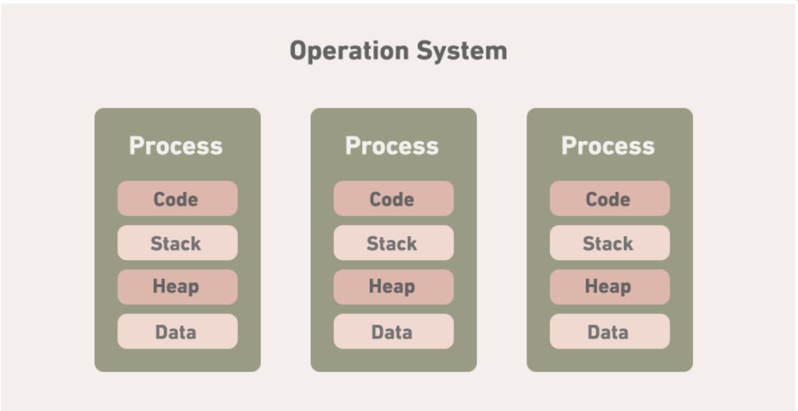
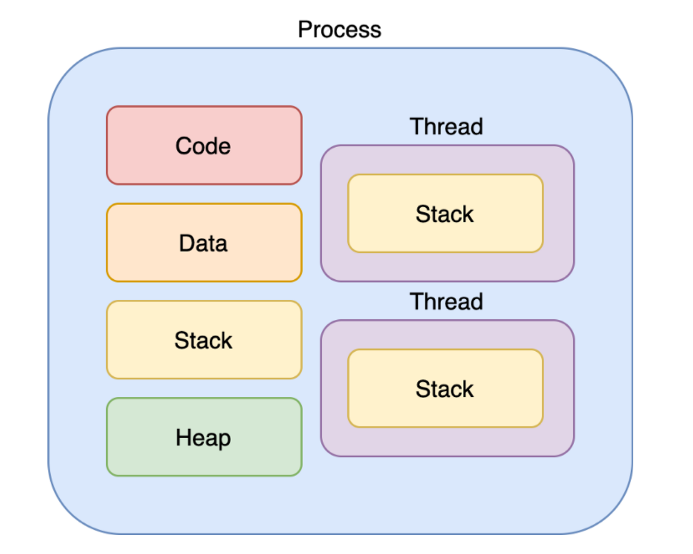

# 프로세스(Process)
메모리에 적재되고 CPU자원을 할당받아 프로그램이 실행되고 있는 상태

# 멀티태스킹(multi process)
OS를 통해 CPU가 작업하는데 필요한 자원(시간)을 프로세스 또는 스레드간에 나누는 행위

## 각 구조의 특징
- 코드 영역: 프로그래머가 작성한 프로그램이 코드영역에 작성된다.
- 데이터 영역: 코드가 실행되면서 사용한 변수나 파일들의 각종 데이터들이 모여딨다.
- 스택 영역: 호출한 함수가 종료되면 되돌아올 메모리의 주소를 스택에 저장하거나 변수 사용 범위에 영향을 미치는 영역을 구현 할때 사용된다.
- 힙 영역: 동적으로 할당되는 데이터들을 위해 존재하는 공간

코드 영역과 데이터 영역은 선언할 때, 그 크기가 결정되는 정적 영역이지만,   스택 영역과 힙 영역은 프로세스가 실행되는 동안 크기가 늘어났다 줄어들기도 하는 동적 영여이다.
서로 다른 프로세스 간의 메모리 공간 접근은 허용되지 않는다.

 
---
 

# 스레드(Thread)
스레드는 어떠한 프로그램 내에서, 특히 프로세스내에서 실행되는 흐름의 단위
  
하나의 프로그램은 하나 이상의 프로세스를 가지고 있고, 하나의 프로세스는 반드시 하나 이상의 스레드를 갖는다.

스레드는 프로세스 내에서 각각 Stack만 따로 할당받고, Code,Data,Heap 영역은 공유한다.
스레드는 한 프로세스 내에서 동작되는 여러 실행의 흐름으로, 같은 프로세스 안에 있는 여러 스레드들은 같은 힙공간을 공유한다.
  

프로세스는 다른 프로세스의 메모리에 직접 접근할 수 없다.

# 멀티 프로세스
멀티 프로세스란 하나의 애플리케이션을 여러 개의 프로세스로 구성하여 각 프로세스가 하나의 작업을 처리하도록 하는 것이다.

## 멀티 프로세스의 특징
- 안정성이 좋다 
  여러 개의 자식 프로세스 중 하나에 문제가 발생해도, 다른 자식 프로세스에 영향이 확산되지 않는다.
- 구현이 비교적으로 간단하고, 각 프로세스들이 독립적으로 동작하며 자원의 서로 다르게 할단된다.
- 프로세스 간 콩신을 하기 위해서는 IPC를 통해야 한다.
- 메모리 사용량이 많다.
- 스케줄링에 따른 Context Switch이 많아지고, 성능 저하의 우려가 있다.

# 멀티 스레드
멀티 스레드란 하나의 프로그램을 여러 개의 스레드로 구성하여 하나의 스레드가 하나의 작업을 처리하도록 하는 것이다.

## 멀티 스레드의 특징
- 응답성이 좋다  
  프로그램의 자식 스레드가 오류 또는 긴 작업으로 인해 중단되어도 프로그램이 계속적으로 수행된다.
- 자원 공유가 쉽다.
  스레드들은 부모 프로세스의 자원과 메모리를 공유할 수 있다.
- 멀티프로세스 구조에서 각각의 스레드가 다른 프로세스에서 병렬로 수행될 수 있다.
- 구현 및 테스트, 디버깅이 어렵다.
- 너무 많은 스레드 사용은 오버헤드를 발생시킨다.
- 동기화 그리고 교착상태가 발생하지 않도록 주의해야 한다.
- 자식 스레드 중 하나에 문제가 생긴 경우, 전체 프로세스에 영향을 줄 수 있다.

# 예상 질문?
- Process와 Thread의 차이를 설명해 보세요.
  - 프로세스는 운영체제로 부터 자원을 할당받는 작업의 단위이다.
  - 스레드는 할당 받은 자원을 이용하는 실행의 단위이고 프로세스 내에 여러개 생길 수 있다.
  - 프로그램 하나가 프로세스이고, 그 안에서의 분기 처리가 스레드가 된다.
      
- Multi Process & Multi Thread
  - multi process는 하나의 흐로그램을 여러개의 프로세스로 구성하여 각 프로세스가 하나의 작업(task)를 처리하는 것이다.
    - 장점: 하나의 프로세스가 잘못되어도 프로그램은 동작함
    - 단점: context switching 비용 발생
  - multi thread는 프로그램을 여러개의 쓰레드로 구성하고 각 쓰레드가 작업를 처리하는 것
    - 장점: 시스템 자원 소모 감소, 처리 비용 감소(실행 속도 향상), 쓰레드간 자원 공유
    - 단점: 디버깅 어려움, 동기화 이슈 발생, 하나의 쓰레드의 오류로 전체 프로세스에 문제 발생
        
- Thread Safe란?
- thread safe란 것은 여러 thread가 동싱에 사용되어도 안전한단 것을 뜻한다.
    
- Context Switching 이란?
  - CPU에서 여러 프로세스를 돌아가면서 작업을 처리하는데 이 과정을 Context Swiching이라고 한다.
  - 동작중인 프로세스가 대기를 하면서 해당 프로세스의 상태(Context)를 보관하고 대기하고 있다가 다시 실행시 복구하는 비용(시간)을 의미한다.

# 레퍼런스
[Inpa Dev](https://inpa.tistory.com/entry/%F0%9F%91%A9%E2%80%8D%F0%9F%92%BB-%ED%94%84%EB%A1%9C%EC%84%B8%EC%8A%A4-%E2%9A%94%EF%B8%8F-%EC%93%B0%EB%A0%88%EB%93%9C-%EC%B0%A8%EC%9D%B4) 
[개발자 성장 일기](https://brunch.co.kr/@babosamo/100)