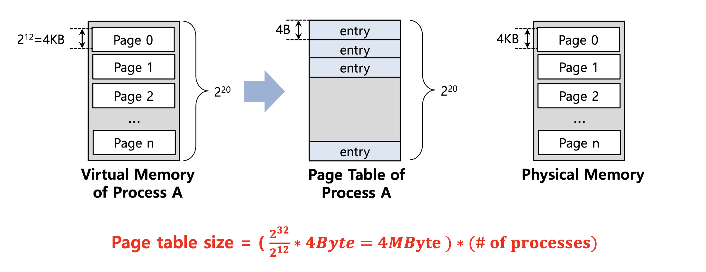
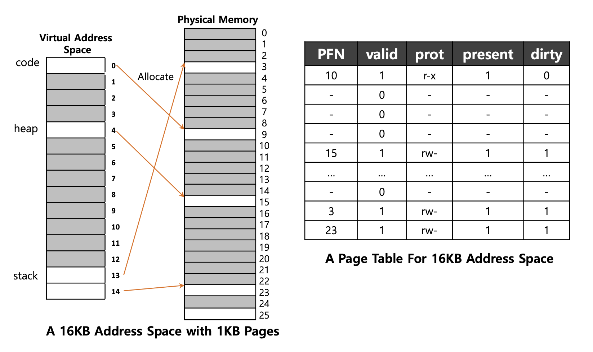
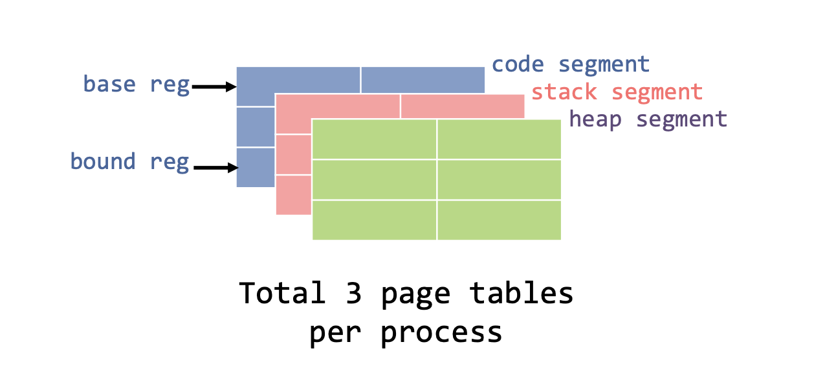
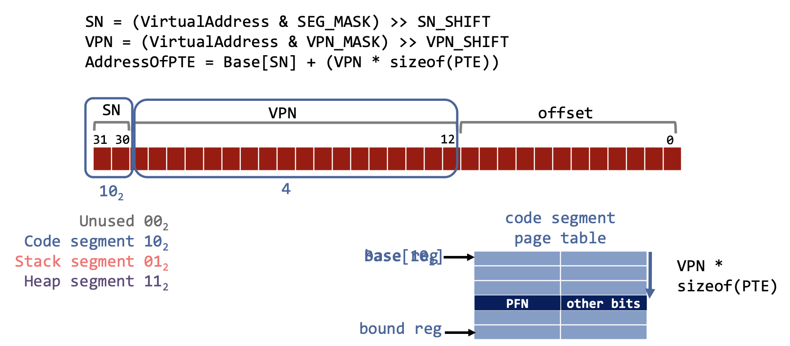

> 작성자 : 팬시 / [출처](https://fancy96.github.io/OS-20-Paging-Smaller-Tables/)

> 이 글의 사진과 내용은 대학교 수업 자료를 기반으로 작성했으므로 가급적 복사는 지양해 주시면 감사하겠습니다.

# Paging: Smaller Table

## Motivation

* TLB가 관리할 수 있는 page보다 더 많은 page를 요구하는 프로세스를 처리하는 경우

  Page table에 사용되는 메모리 공간을 줄이는 방법에 대해서 알아보자.

## Paging: Linear Tables

* `Linear (Page) Tables`(선형 페이지 테이블) : 일반적으로 시스템에서 모든 process에 대해 하나의 page table을 가진다.

* 예) 4KB(2^12) 크기의 `Page`와 4-byte 크기의 `Page table entry`를 가지는 32-bit 크기의 `가상 주소(address space)`가 있다.

* 여기서 `Page table size`를 구하는 방법은 **(가상 주소 공간의 크기 / page의 크기 ) x page table entry의 크기**로 구하면 된다.

  * `가상 주소 공간`의 크기 : 32-bit = 2^32

  * `Page`의 크기 : 4KB = 2^12

  * `Page table entry`의 크기 : 4B = 4byte = 2^2

* 계산) Page table size = (2^32 / 2^12) x 2^2 = 2^20 x 2^2 = 1MByte x 4Byte = **4MByte** (Process 한개당)

* 하나의 Process를 위해 총 4MByte의 page table이 필요하다는 의미이다.

* 결론적으로 Page table 이 **너무 커서 너무 많은 메모리를 사용**하고 있다.

## 1. Large Page: Smaller Table

* Page table이 너무 클 경우를 대비해서 **Page table의 크기를 줄여 메모리를 절약하는 방법**에 대해 알아보자.

*  Page table의 크기를 줄이는 방법 중 하나는 **Page의 크기를 늘려서 Page table size를 줄이는 것**이다.

* 예) **16KB** 크기의 page 와 4byte 크기를 갖는 page table entry를 가지는 32-bit의 가상 주소(adress space)이 있다.

  (이전에는 page 크기는 4KB이고, 현재의 page 크기는 16KB 이다)

* 위의 예시를 통해 `Page table size` = **1MByte**로 이전 예시보다 Page table 크기가 작아져서 메모리를 절약할 수 있다는 점을 확인할 수 있다.

* 하지만, Page 자체가 **활용도가 낮아서**(under-utilized)(= page 자체 크기가 커서) **내부 단편화**가 발생하는 문제점이 있다. (낭비하는 공간이 크다는 점)

  * `내부 단편화`란  메모리를 할당할 때 프로세스가 필요한 양보다 더 큰 메모리가 할당되어서 프로세스에서 사용하고 남은 공간을 의미한다. (예) 메모리가 10KB가 할당되었고 프로세스가 필요한 양은 7KB일 때, 남는 공간인 3KB가 낭비된다)

* 더 큰 Page size는 더 적은 page 수를 의미하며 이는 메모리가 빨리 소모된다는 것을 의미한다.

* 결론적으로 Page의 크기를 늘리는 방법은 **완전한 해결책은 아니다**.

### Problem

* 예) 1KB 크기의 Page와 16KB 크기를 갖는 가상 주소 공간이 있다.

* code 영역에서 1개, heap 영역에서 1개, stack 영역에서 2개로 총 4개의 page table를 사용하는 것을 확인할 수 있다.

* 위의 예시를 통해 알게 된 점은 4개를 제외한 **나머지의 Page table이 안쓰는 것(un-used)을 확인**할 수 있다. (어두운 색깔 : 안쓰는 영역)

## 2. Hybrid Approach: Paging and Segments

*  이런 상황에서 Page table의 크기를 줄이는 방법 중 다른 하나는 **Paging 기법과 Segmentation** 같이 사용하는 것이다.

* Page table의 메모리 오버헤드를 줄이기 위해서는

  `base` 레지스터는 실제주소의 page table를 가리키는데 사용한다.

  `bound` 레지스터는 해당 page table의 끝을 나타내는데 사용한다.

### Simple Example

* 다음 예시를 통해 `Paging과 Segments`을 같이 사용하는 방법에 대해 알아보자.

* 예) 각각의 Process는 연관된 3개의 Page table을 가진다고 가정한다.

  * Page의 크기는 `4KB`, 가상 주소 공간의 크기는 `32-bit`, 4개의 Segment 중 `3개`만 사용한다고 가정한다.

  * Process가 실행 중일 때 이러한 각 Segment의 `base 레지스터`는 해당 Segment에 대한 linear page table의 **실제 주소(physical address)가 포함**된다.

### TLB miss

* **하드웨어**는 Page table 으로 부터 **실제 주소(physical address)** 를 얻을 수 있다.

  * 하드웨어는 세그먼트 비트(SN)를 사용하여 사용할 base 및 bount 쌍을 결정한다.

  * 그런 다음 하드웨어는 **실제 주소(physical address)** 를 가져와서 다음과 같이 VPN과 결합하여 page table entry(PTE)의 주소를 형성한다.

* 위의 예시는 `Code segment`(10)와 VPN 값 4를 가지고 있다.

* 여기서 TLB miss가 발생했어도 segment 비트를 사용해서 주소 변환을 진행하면 된다.

* 기존 paging 기법과의 차이점은 bount 레지스터가 page table의 끝 값을 가지기 때문에 **사용하지 않는 page table의 공간을 유지할 필요가 없어지므로** 메모리 낭비를 줄일 수 있다.

### Problem

* 하지만 이런 Hybrid Approach에는 문제점이 있다.

* 그리고 만약 **사용 빈도가 낮지만 큰 Heap이 있다면**, 여전히 너무 많은 Page table이 낭비가 될 수 있다.

* 이러한 문제점은 **외부 단편화**(external fragmentation)을 다시 발생시킨다.

## 3. Multi-level Page Tables

* 이번에는 **Page table에서 사용하지 않는 공간은 메모리에서 제거하는 방법**인 `Multi-level Page Tables`에 대해 알아보자.

* 이 방법은 **실제 OS에서도 사용**되며, 아주 효과적으로 작동된다고 한다.

* **개념 설명** : Linear page table(선형 페이지 테이블)을 **Tree**(트리) 와 같은 무언가로 바꿔준다.

  * Page table을 **page크기의 단위로 잘라준다**.

  * 만약 Page table entries의 전체 page에 유효하지 않은 경우(하나라도 유효한 entry가 없다면), 해당 Page table을 할당하지 않는다.

  * Page table의 page가 유효한지 아닌지 추적하기 위해 `Page Directory`라는 새로운 구조를 사용한다.

### **Page Directory**

* 다음 예시를 통해 `Multi-level Page Tables`을 이해하자.

* 위의 **개념 설명**에서 Page table을 `page`로 자른 뒤 하나라도 유효한 entry가 없다면, page table을 유지하지 않는다고 했다.

  * 위의 예시를 확인해보면, `PFN202` 와 `PFN203`은 유효하지 않으므로, 해당 Page table을 할당하지 않는 것을 확인할 수 있다.

* `Page Directory`의 역할은 page table의 page가 어디에 있는지, 해당 page table에 유효한 page가 있는지 알려주는 것이다.

### Page directory entries

* Page Directory는 **page당 하나의 page entry만 가지고 있다**. (즉, page table의 시작부분, base 레지스터와 같은 역할을 한다고 보면 된다)

  * 그리고 Page Directory는 다수의 **page directory entries(PDE)** 로 구성되어 있다.

* **PDE** 는 `유효한 bit` 과 `page frame number(PFN)`을 가지고 있다.

  * Invalid : Page table의 전체 page에 유효한 page가 없는 것을 의미한다.

  * Valid : 이 PDE가 가리키는 **해당 페이지의 PTE가 적어도 하나는 유효하다**는 것을 의미한다.

### Advantage & Disadvantage

#### Advantage

* Only 사용 중인 주소 공간에 비래하여 page-table space(페이지 테이블 공간)만 할당한다.

* OS가 page table을 할당하거나 확장해야 할 때 다음의 free page(무료 페이지)를 잡을 수 있다.

#### Disadvantage

* TLB miss인 경우, page table에서 올바른 변환 정보를 얻으려면 메모리에서 2개의 load가 필요하다.

* 여기서 `2개의 load에 접근한다` 라는 의미는 Page table에 접근하기 위해 Page directory에도 접근할 때의 1번, Page directory 에서 유효한 PFN 정보를 가져오기 위해 접근할 때의 1번 을 의미한다.

* 이것을 **Time-space trade-off** 라고 부른다.

  * Smaller page table size(더 작은 페이지 테이블 크기)

  * TLB miss -> two loads from memory -> one for the page directory, and one for the PTE itself(TLB miss -> 메모리에서 두 개의 로드 -> 페이지 디렉토리에 대한 로드와 PTE 자체에 대한 로드)

* 그리고 기존의 방법보다 복잡하므로 **Increased complexity** 이라고 부른다.

## Review

* 이번 Post에서는 TLB가 관리할 수 있는 page보다 더 많은 page를 요구하는 프로세스를 처리하는 경우, Page table에 사용되는 메모리 공간을 줄이는 방법에 대해 정리했다.

* `Multi-level Page Tables` 에 대해 개념과 장,단점에 대해 이해를 하고 정리를 하니까 확실히 이전보다 더 깊은 이해가 되었다.

  (비록 계산과 관련된 부분까지 정리하면, 이 Post 이후의 다음 OS 개념에 대해 정리하는 것에 대한 부담감으로 와닿아서, 생략하기로 했다)

  (CS 개념에 대해 정리를 우선적으로 하고, 나중에 시간이 여유가 되면 추가적으로 업로드하자)

* 지금까지는 page table을 **메모리(Memory)에 저장**한다고 가정을 했다면, 다음 `Swapping`에 대한 개념은 page table을 메모리가 아닌 **디스크(Disk)에 저장**했을 경우에 대한 설명이다.

## 예상 질문

* Page table의 크기를 줄이는 방법 3가지 중 2가지를 각각의 장단점을 포함하여 설명해 주세요.

* Multi-level Page Tables에 대해 설명해 주세요. (page directory 언급)

* Multi-level Page Tables의 장점과 단점은 무엇인가요?

## Reference

* 학교 수업 내용 - [Operating Systems Three Easy Pieces](https://www.amazon.com/Operating-Systems-Three-Easy-Pieces/dp/198508659X)

* [[OS] Paging기법의 Page Table의 크기 줄이기](https://icksw.tistory.com/150)