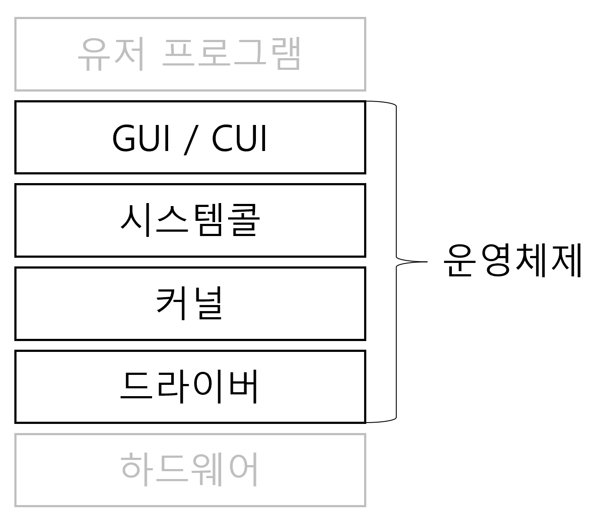
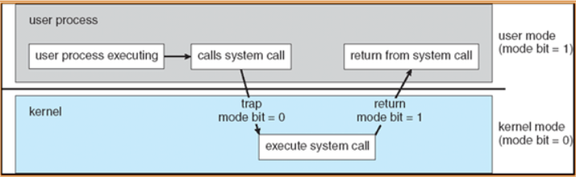
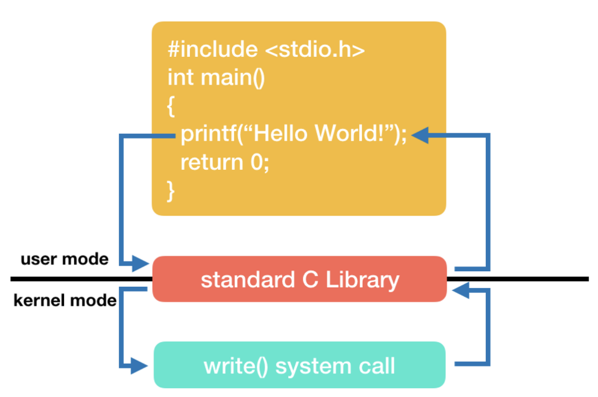
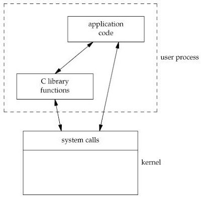
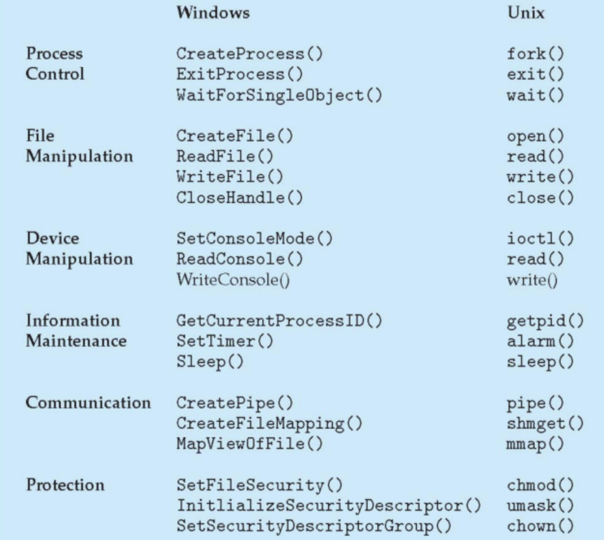
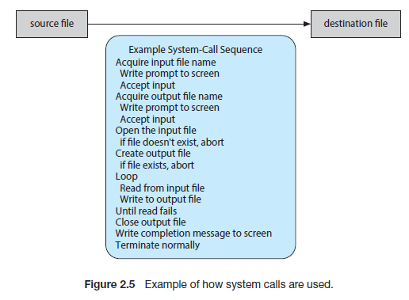
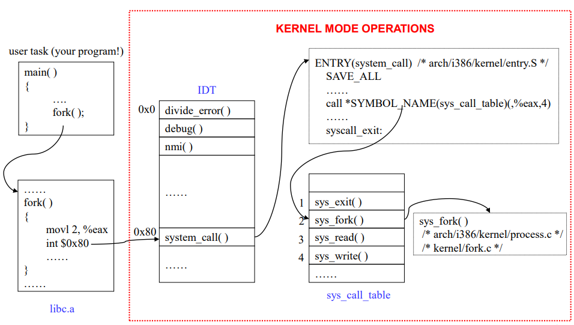

## 🎛️ 운영체제(Operating System)

운영체제(Operating System)는 컴퓨터 시스템의 하드웨어, 소프트웨어 자원들을 효율적으로 운영 및 관리함으로써 사용자가 컴퓨터를 편리하고, 효과적으로 사용할 수 있도록 도와주는 시스템 소프트웨어이다. 

컴퓨터 하드웨어 바로 위에 설치되어 사용자 및 다른 소프트웨어와 하드웨어를 연결하는 소프트웨어 계층, 즉, 중개자 역할을 하는 프로그램이다.

<div align='center'>
    
</div>

## 커널(Kernel)

커널(Kernel)은 운영 체제의 다른 부분 및 응용 프로그램 수행에 필요한 여러가지 서비스를 제공하는 운영체제의 핵심 부분이다.

컴퓨터의 전원을 켜면 운영체제는 이와 동시에 수행된다. 소프트웨어가 컴퓨터 시스템에서 수행되기 위해서는 메모리에 그 프로그램이 올라가 있어야 한다. 마찬가지로 운영체제 자체도 소프트웨어로서 전원이 켜짐과 동시에 메모리에 올라가야 한다.

하지만 운영체제처럼 규모가 큰 프로그램이 모두 메모리에 올라가면 한정된 메모리 공간이 낭비가 심할 것이다.

따라서 운영체제 중 항상 필요한 부분만을 전원이 켜짐과 동시에 메모리에 올려놓고, 그렇지 않은 부분은 필요할 때 메모리에 올려서 사용하게 된다.

이 때 메모리에 상주하는 운영체제의 부분을 커널(Kernel)이라고 한다.

### 커널의 역할

1. 보안

2. 자원관리 

3. 추상화

> **컴퓨터의 자원(resource)** : CPU 메모리, 가상메모리, 키보드, 마우스 등 물질적인 것과 스레드, 패킷, 프로토콜, 테스크와 같은 추상적인 것들로 구성된다.

운영체제의 커널은 이러한 자원을 효율적으로 관리하기 위해서 CPU 스케줄링, 메모리관리, 입출력관리, 파일 시스템 관리 등의 업무를 수행한다.

운영체제는 여러 프로그램이 동시에 실행될 수 있는 다중 프로그래밍 환경에서 동작한다. 각 프로그램들이 다른 프로그램 실행에 방해되거나 충돌이 발생하는 문제를 방지하기 위해 하드웨어에 대한 각종 보안법들을 필요로 한다.

이를 위해 운영체제는 사용자 모드(User Mode)와 커널 모드(Kernel Mode)가 제공되는 이중 동작 모드 기법을 사용한다. 

## 👫 이중 동작 모드(Dual-mode Operation)

사용자와 운영체제는 시스템 자원을 공유한다. 

그렇기에 사용자에게 제한을 두지 않으면 사용자가 메모리 내 주요 운영체제 자원을 망가뜨릴 위험이 생긴다. 

즉, 운영체제의 원활한 작동과 기능을 위해서는 사용자의 시스템 자원 접근을 제한하는 보호 장치가 필수적이다.

이중 동작 모드는 사용자 모드와 커널 모드로 나뉘어진다.

### 1) 사용자 모드(User Mode)

사용자 모드(User Mode)란 일반 사용자(유저)가 접근할 수 있는 영역을 제한적으로 두고, 프로그램 자원에 함부로 침범하지 못하는 모드이다. 

사용자는 사용자 모드에서 코드를 작성하고 프로세스를 실행하는 등의 행동을 할 수 있다.

시스템에 중요한 영향을 미치는 연산은 커널 모드에서만 실행 가능하도록 함으로써 하드웨어의 보안을 유지한다.

접근을 위해서는 시스템 콜(System Call)을 사용해야한다.

### 2) 커널 모드(Kernel Mode)

커널 모드(Kernel Mode)는 `수퍼바이저 모드(Supervisor Mode)`, `특권 모드(Previliged Mode)`, `시스템 모드(System Mode)` 라고도 불리며, 운영체제가 CPU의 제어권을 가지고 운영 체제 코드를 실행하는 모드이다.

커널 모드에서는 시스템의 모든 메모리에 접근 가능하며 모든 종류의 CPU 명령을 실행할 수 있다.

운영체제 코드나 디바이스 드라이버 같은 커널 모드 코드를 실행한다.

> **디바이스 드라이버** : 특정 하드웨어나 장치를 제어하기 위한 커널의 일부분으로 동작하는 프로그램. 컴퓨터를 구성하는 다양한 입출력 장치마다 각각 장치 드라이버가 프로그램 커널에 통합되어 실행된다.

## 👨‍💻 modebit

커널 모드와 사용자 모드를 구분하기 위해 참고되는 1(사용자 모드) 또는 0(커널 모드)의 값을 가지는 플래그 변수이다.

카메라, 키보드 등 I/O 디바이스를 운영체제를 통해서만 사용할 수 있게 하여 외부로부터 사용자 장비를 보호한다.

<div align='center'>
    
</div>

## 📞 시스템 콜(System Call)

운영체제에서 제공하는 서비스들을 사용하기 위한 프로그래밍 인터페이스이다. 보통 직접적으로 시스템 콜을 사용하기보다 API(라이브러리 함수)를 통해 사용하게 된다.

C나 C++과 같은 고급 언어로 작성된 프로그램들은 직접 시스템 콜을 할 수 없기 때문에 고급 API를 통해 시스템 호출에 접근하게 하는 방법이다.

운영체제는 메모리에 프로그램 적재, I/O 처리, 파일 시스템 처리 등 여러 서비스들을 제공하고, 사용자 프로세스는 시스템 콜을 통해 서비스를 제공받는다.

통상적으로 시스템 콜은 여러 종류의 기능으로 나뉘어져 있다. 각 시스템 콜에는 번호가 할당되고 시스템 콜 인터페이스는 이러한 번호에 따라 인덱스 되는 테이블이 유지된다.

<details>
<summary>왜 직접 사용을 하지 않고 API를 통해 사용할까?</summary>

## 📚 라이브러리 함수(Library Function)

문자열/표준 입출력 등 사용자가 많이 사용하는 기능들을 미리 함수로 만들어 놓은 것이다.

내부적으로 시스템 콜을 사용하지만 호출 시 사용자 모드에서 실행된다. 

목적에 따라 다양한 타입의 리턴 값을 가지며 개발을 쉽게 만들거나 시스템 콜 호출을 최소화 하기 위해 제공된다. 

예를 들어 write 시스템 콜을 관찰해보자.

```
ssize_t write(int fd, const void * buf, size_t count);
```

단순히 buf에 들어있는 데이터를 count만큼 fd로 지정된 파일에 쓰는 기능을 가지고 있습니다.

다음으로 write 시스템 콜을 사용해 만들어진 printf를 관찰해보자.

```
int printf(const char *format-string, argument-list);
```

format string을 사용하여 손쉽게 문자열을 출력할 수 있도록 해줍니다. 

이는 printf가 내부적으로 파라미터 포매팅을 알아서 해주고 최종적으로 write 시스템 콜을 사용하기 때문이다.

c 언어를 이용한 예제도 확인해보자.

```
#include <stdio.h>
int main()
{
  ...
  printf("Hello World!");
  ...
  return 0;
}
```

printf() 함수는 사용자 모드에서 수행되어 stdio 라이브러리를 호출한다. stdio 라이브러리는 시스템 콜인 write()를 호출하고, 실행의 흐름은 커널 모드로 전환된다. 

커널은 호출을 실행하여 모니터에 문자열을 출력하고 실행의 흐름은 다시 사용자 모드로 넘어와 printf()함수의 다음 단계를 실행한다.

<div align='center'>
    
</div>

파일 입/출력 시 read(), write()와 같은 시스템 콜들을 호출할 때마다 커널 모드로 전환되어 파일에 기록된다. 

반면 라이브러리 함수인 fread(), fwrite()의 경우 버퍼를 사용해 내부적으로 한 번만 read(), write()를 실행하기에 시스템 자원을 효율적으로 사용하게 된다. 내부적으로 시스템 콜을 호출하기 때문에 wrapper 함수라고도 부른다.

즉, 직접적으로 시스템 콜을 호출하지 않는 이유는, 사용하는 곳마다 시스템 콜을 하는 환경이 다를텐데 API는 인자만 반환하면 되기 때문이다. 이러한 특성을 `Portablility(이식성)`라 한다.

쉽게 말해 System call, 즉 호출 인터페이스는 각 운영체제 마다의 표준 규약에 맞게 설계되어 있기 때문에 유저 어플리케이션의 버전 등의 관리와 이식성을 보장하여 주기 때문에 시스템 콜이 이러한 이식성을 보장한다는 것이다. 

> Windows API, POSIX API, JAVA API 등이 있다.

<div align='center'>
    
</div>

</details>  


### 시스템 콜 종류

#### 1) 프로세스 제어(Process Control)
- 끝내기(exit), 중지(abort)
- 적재(load), 실행(execute)
- 프로세스 생성(create process) - fork
- 프로세스 속성 획득과 속성 설정
- 시간 대기(wait time)
- 사건 대기(wait event)
- 사건을 알림(signal event)
- 메모리 할당 및 해제

#### 2) 파일 조작(File Manipulation)
- 파일 생성/삭제 (create, delete)
- 열기/닫기/읽기/쓰기 (open, close, read, write)
- 위치 변경(reposition)
- 파일 속성 획득 및 설정(get file attribute, set file attribute)

#### 3) 디바이스 조작(Device Manipulation)
- 하드웨어의 제어와 상태 정보를 얻음(ioctl)
- 장치를 요구(request device), 장치를 방출(release device)
- 읽기(read), 쓰기(write), 위치 변경
- 장치 속성 획득 및 설정
- 장치의 논리적 부착 및 분리

#### 4) 정보 유지(Information Maintenance)
- getpid(), alarm(), sleep()
- 시간과 날짜의 설정과 획득(time)
- 시스템 데이터의 설정과 획득(date)
- 프로세스 파일, 장치 속성의 획득 및 설정

#### 5) 통신(Communication)
- pipe(), shm_open(), mmap()
- 통신 연결의 생성, 제거
- 메시지의 송신, 수신
- 상태 정보 전달
- 원격 장치의 부착 및 분리

#### 6) 보호(Protection)
- chmod()
- unmask()
- chown()

<div align='center'>
    
</div>

그 외 명령어들은 아래 링크를 참고하여 주시길 바랍니다.

https://kangtegong.github.io/self-learning-cs/system_calls/syscalls.html

#### 시스템 콜 예시
```
cp in.txt out.txt
```

일반적으로 윈도우 운영체제의 경우 마우스, 리눅스라면 키보드가 사용자의 입력을 받는다. 이 때 I/O 시스템 콜을 사용한다.

위와 같은 문장을 입력 받아서 `cp` 프로그램을 실행시키면 먼저 `in.txt` 파일이 현재 디렉터리에서 접근할 수 있는 파일인지를 검사하기 위해 시스템 콜을 호출한다.

만약 파일이 존재하지 않는다면 에러를 발생시켜야 하고 프로그램을 종료하는데 이 때 시스템 콜이 사용된다.

만약 파일이 존재할 경우, 복사한 파일을 저장하기 위해 `output.txt` 파일명이 있는지 검사한다.

그리고 이 때도 마찬가지로 파일명이 존재하는지 존재하지 않는지 검사하기 위해 시스템 콜을 통해 확인한다.

파일이 이미 존재한다면 덮어 씌워야 할지 아니면 이어 붙여야 하는지 사용자에게 물어볼 수 있다.

만약 저장하고자 하는 파일 이름이 겹치지 않는다면, 파일을 저장해야하는데 이 때도 시스템 콜을 이용한다.

<div align='center'>
    
</div>

### 시스템 콜 동작 과정

<div align='center'>
    
</div>

1. 응용 프로그램에서 시스템 콜 호출(일반적으로 API 형태로 Wrapped 되어 있기 때문에 의식하지 않고 사용가능) -> 0x80 인터럽트 발생

2. IDT(Interrupt Descripter Table : 인터럽트의 종류를 판단하기 위해 사용됨)에서 0x80 인터럽트는 system_call()이기 때문에 커널이 시스템 콜과 관련된 동작을 수행함 -> 시스템 콜 구분을 위해 추가적인 매개변수가 필요

3. 매개변수를 전달함
    1. 매개변수를 레지스터에 담는다
        - 하지만, 매개변수가 레지스터의 수 보다 많은 경우가 존재하므로 적합하지 않은 방법이다
    2. 매개변수를 연속적(블록) 또는 불연속적(테이블 사용)으로 메모리에 담은 뒤 주소를 레지스터에 담는다
        - 크기에 제한이 없으므로 많이 사용된다
    3. 스택에 매개변수를 담는다
        - 스택에 담긴 모든 데이터를 레지스터에 옮기고 스택에 원소를 담아야 하기 때문에, 결과적으로 첫 번째 방법과 큰 차이가 없다

    -> **2번째 방법을 많이 사용!!**

<details>
<summary>fork() 함수에 대해서</summary>

fork()는 os가 생성한다.  

fork() 함수는 다른 프로세스를 복제 및 생성한다.

fork() 함수 호출 시 자식 프로세스를 생성한다.
    
이 때, pid 값을 제외 한 나머지 값들을 복제한다.
    
자식 프로세스의 pid 값은 무조건 0!!
    
자식 프로세스가 반환이 안되면 -1을 의미한다. (fork 함수가 실행이 안되는 경우)
</details>
    
 
---

### 📢 면접 질문
1. 시스템 콜에 대해 설명하세요
2. 운영체제의 Dual Mode 에 대해 설명해 주세요
3. 시스템 콜의 유형에 대해 설명해 주세요
4. 서로 다른 시스템 콜을 어떻게 구분하는지 설명해 주세요

---

### 📌 References
- https://nstgic3.tistory.com/16
- https://didu-story.tistory.com/311
- https://luckyyowu.tistory.com/133


