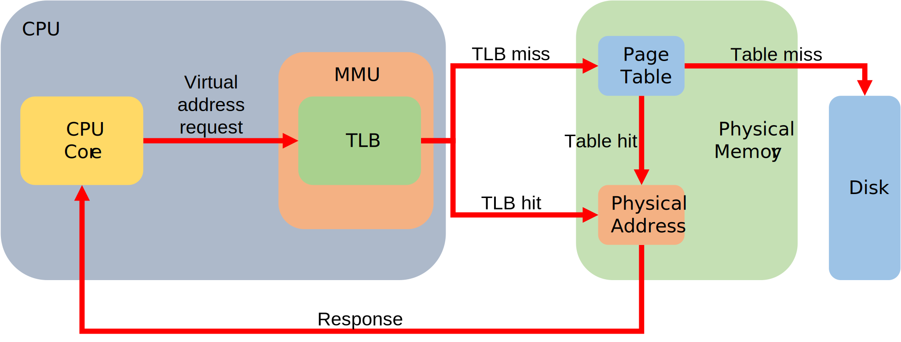
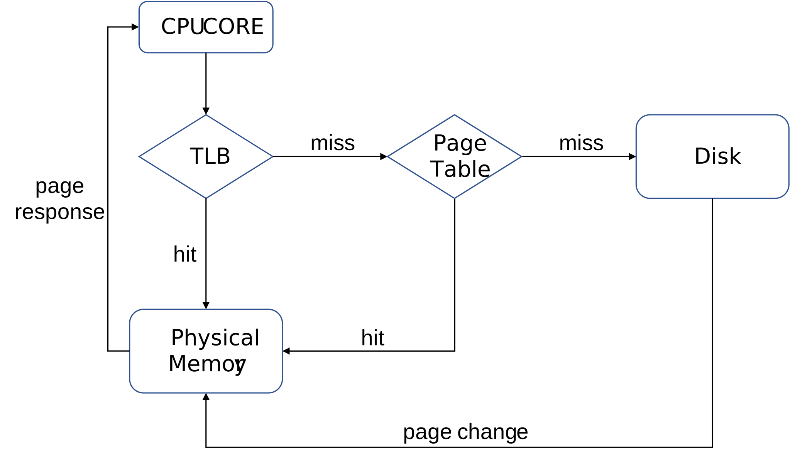

# 🚀 TLBs

> **Translation Look-aside Buffer**  
> 변환참조버퍼, 변환우선참조버퍼, 변환색인버퍼 등 다 같은말

## 🎯 개요

- 페이지 테이블을 캐싱한 저장장치
  - 일종의 캐시 개념
- MMU 내부에 존재한다.
- 페이지 교체에는 LRU 알고리즘 적용
- TLB 는 MMU 내부에 여러 계층으로 존재 할 수 있다.
  - L1 TLB, L2 TLB 와 같은 형태로 다수 존재 할 수 있다.

## 🎯 동작

## 🎯 구조

- **_VPN(VPFS Virtual Page Frame Number)_**
  - TLB KEY
  - CPU 코어가 요청한는 가상주소(Virtual Address)는 `VPN`과 `VPO(offset)`로 구성
  - TLB 에서는 코어에서 요청한 가상주소에서 `VPN`을 추출해 내부 검색
- **_PPN(PPFN Physical Page Frame Number)_**
  - `VPN`과 1:1 대응되는 TLB VALUE
  - 코어가 요청한 가상주소에 해당하는 페이지의 주기억장치 주소를 저장
  - `PFO(offet)`와 결합해 주기억창지 주소 완성
- **_other bits_** 상태관리비트들
  - valid
    - hit/miss 여부를 표시
    - 시스템 시작시 invalid 로 초기화됨
  - protection
    - `TLB` 페이지 접근 방식에 대한 표시, read/write/execute 에 대한 상태 표시
    - 일종의 보호 비트
  - **_ASID(Address Space ID)_**
    - 단일 프로세스 환경
      - VPN 충돌이 일어나지 않아 사용되지 않음
    - 다중 프로세스 환경
      - `TLB`가 하나인 경우 프로세스가 `TLB`에 접근하려 할 때 충돌 방지목적으로 프로세스 별 ID 부여하고 ID 별로 VPN 을 관리하게 됨.
      - `ASID`가 등장하기 전에는 새로운 프로세스가 `TLB`에 접근시 매번 초기화 하는 방법을 사용했으나 큰 오버헤드 발생으로 고안됨.
  - dirty
    - 페이지가 `TLB`에 적재된 이후 수정 여부를 나타내는 비트

> `TLB`에 코어가 요청한 페이지가 없을 경우 페이지 주기억장치 내부 페이지테이블 탐색하고 
> 페이지 로드과정을 거친 후 `TLB` 정보를 갱신 한다.

---

## ❓ 예상 질문

### Q1. 전체적인 페이지 탐색과정은?

> **_A1._**  
> 페이지 탐색 과정 순서도로 대체하겠습니다.  
> 

### Q2. TLB 히트, 미스, 페이지 히트 미스의 경우 속도 차이는?

> **_A2._**  
> 페이지 로드에는 TLB 히트로 즉시 페이지 로드가 가능한 경우 수십 클럭,
> 페이지 폴트의 경우에 비해 수십만 ~ 수백만 클럭이 소모되므로 수만 ~ 수십만 배의 속도 차가 발생 할 수 있다고 볼 수 있습니다.

---

## 📚 참고자료

[기술사과정 TLB, Translation Look-aside Buffer, VPN, PFN, PPN, ASID](https://www.youtube.com/watch?v=MC_GBOf5KI8)  
[[운영체제] MMU, page table, inverted page table, TLB](https://about-myeong.tistory.com/35)  
[Computer System Design - 12 : TLB (1)](https://etst.tistory.com/66)  
