> 작성자 : 팬시 / [출처](https://fancy96.github.io/OS-19-TLB/)

> 이 글의 사진과 내용은 대학교 수업 자료를 기반으로 작성했으므로 가급적 복사는 지양해 주시면 감사하겠습니다.

# TLB(Translation Lookaside Buffers)

## Prologue

* Paging 기법을 사용하여 메모리 가상화를 지원한다면 오버 헤드가 발생한다.

* [1] Page Table에 한번 접근하고, [2] Page Table을 기반으로 실제 메모리에 접근하기 때문에 메모리 낭비가 발생하는 문제점이 있다.

* 즉, Paging 기법은 메모리 낭비가 발생하고, 느리기 때문에 이를 좀 더 빠르게 만들기 위해 `TLB`가 나오게 되었다.

## TLB (Translation Lookaside Buffers)

* `TLB`는 **Memory-Management Unit(MMU)의 일부분이자, 주소 변환의 하드웨어 캐시**이다.

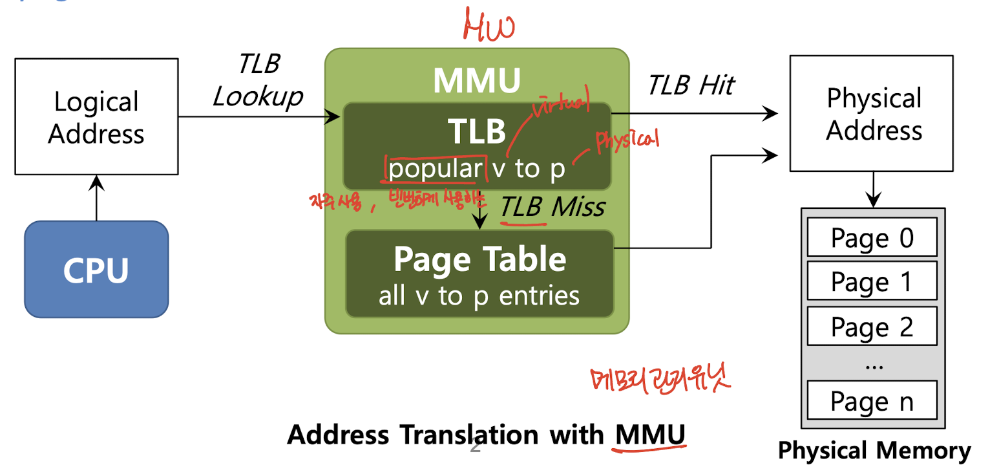

* TLB에는 **자주 사용**하는 VPN(virtual page number)와 PFN(physical frame number) 정보가 쌍으로 존재하며 이를 사용해 가상 주소를 실제 주소로 변환하도록 도와주는 Hardware cache이다.

* 이를 사용해 CPU가 Paging 기법으로 주소 변환을 할 때 Page Table이 아닌 TLB에 접근하는데, CPU가 원하는 VPN과 PFN의 정보가 TLB에 있다면, 해당 정보로 빠르게 주소변환을 할 수 있다.

* 즉, 해당 정보를 Page Table 없이 TLB로 가져오기 때문에 주소 변환이 빠르게 수행하는 장점이 있다.

* 하지만, 해당 정보가 TLB에 없다면 어쩔 수 없이 Page Table에서 가져오는 단점이 있다.

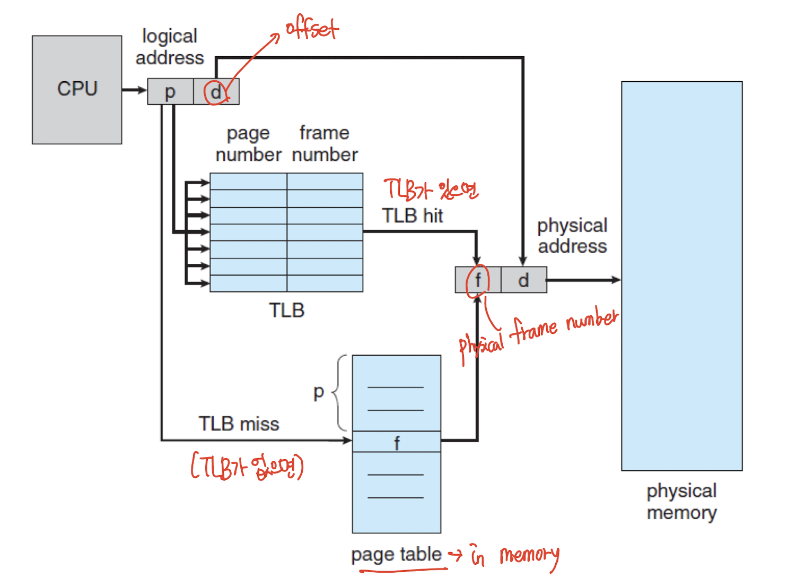

* 위의 그림은 TLB를 사용한 Paging Hardware 예시이다.

* `TLB hit`(= TLB가 있으면) Page Table 거쳐갈 필요 없이 가상 주소를 실제 주소로 변환한다.

* `TLB miss`(= TLB가 없으면) Memory에 있는 Page Table에서 가상 주소에 해당하는 정보를 가져와서 실제 주소로 변환한다.

## TLB entry (TLB 안에는 무엇이 있을까?)

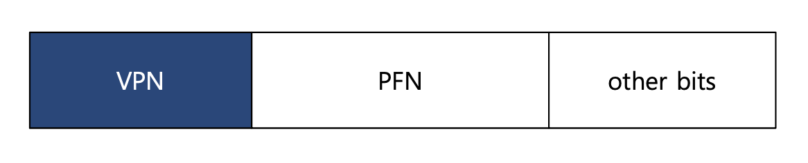

* TLB는 **Full Associative** method에 의해 관리된다.

    * 일반적인 TLB는 32, 64 또는 128개의 항목을 가질 수 있다.

    * 하드웨어는 전체 TLB를 병렬로 검색하여 원하는 변환을 찾습니다

    * Other bits : valid bits , protection bits, address-space identifier, dirty bit

* 정리하자면, 자주 사용하는 TLB에는 VPN(virtual page number)과 PFN(Page Frame Number) 정보가 쌍으로 존재하며, 이를 사용해 주소 변환을 하도록 도와주는 Hardware Cache이다.

### Appendix: Cache

* Cache는 임시로 쓰이는 버퍼(buffer) 메모리이다.

* 빈번하게 사용하는 데이터들을 하위 메모리보다 빠른 공간에 임시로 넣어두고, 필요할 때마다 바로 쓸 수 있도록 하기 위해 생겨난 기술이자, 구조이자 장치라고 할 수 있다.

* 메모리가 다른 I/O 장치보다는 빠르지만, Process의 속도보다는 많이 느리다. 그래서 전체적인 시스템 성능을 높이기 위해서 메모리에서 데이터를 읽어오는 속도를 빠르게 하기 위해 `Cache`(캐시)가 등장한 것이다.

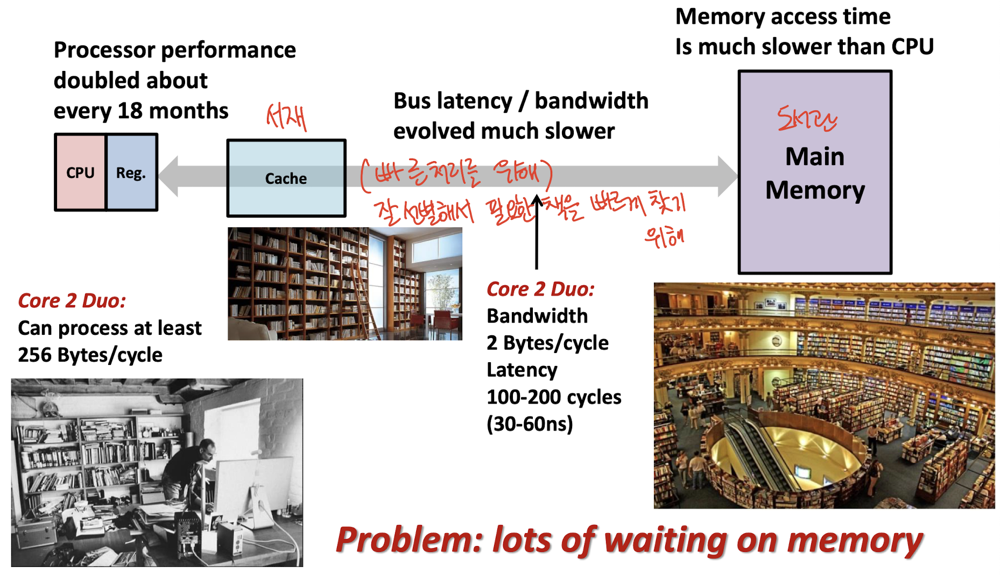

* 예로 들자면, `팬시`가 "Operating Systems Three Easy Pieces" 이라는 운영체제 책을 빌리려고 학교 도서관(Main Memory)에 갔다.

* 하지만, 운영체제 책뿐만 아니라 다른 책들도 빌릴 때마다 도서관을 이용하게 되는데, 문제는 도서관까지 가고, 원하는 책을 찾는데 시간이 너무 오래 걸린다는 점이다.

* 이러한 점을 해결하기 위해 IT 학부에서는 컴퓨터학부생들의 시간 효율성을 위해 IT 융복합관(5호관) 지하 1층에 서재(Cache)를 만들었다.

* 서재(Cache)를 만든 이후부터 `팬시`는 컴퓨터학부와 관련된 책을 IT 융복합관 지하에 있는 서재(Cache)에 가서 빌림으로써 도서관(Main Memory)에서 빌리는 시간보다 더 효율적이고 빠르게 해결했다.

## Example: Accessing An Array

* TLB가 메모리 성능을 어떻게 향상시키는 지 다음 예시를 가져와 봤다.

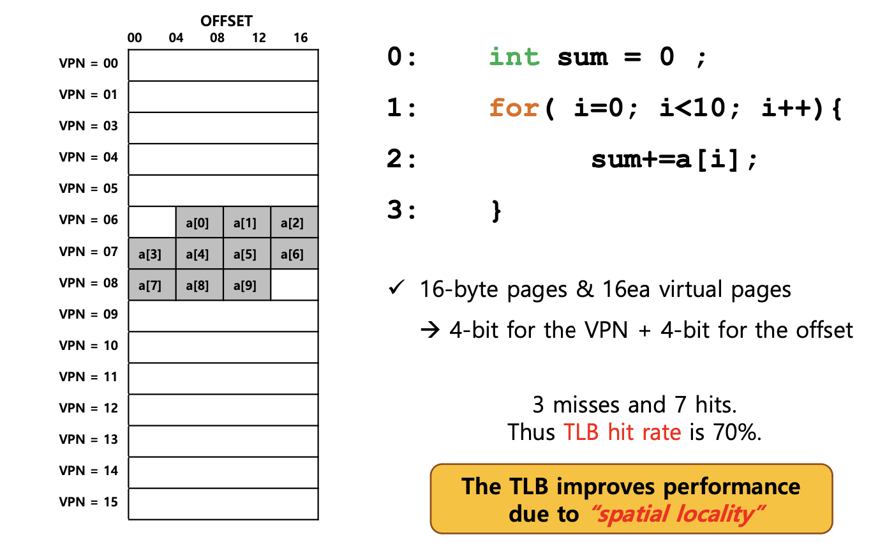

* 가정) Page의 크기는 16-byte이며 가상 주소 공간의 크기를 8-bit(2^8=196byte)라고 가정한다.

* 가상 주소 공간에 존재하는 Page 수는 16개(가상 주소 공간의 크기 / Page의 크기)가 된다.

* int 자료형이 4byte이므로 for문에 적용하면 총 배열의 크기는 40byte이다. (배열이 가상 주소 공간 100에서 시작하면 Page Table이 왼쪽 그림과 같이 그려진다)

1. for문을 돌리고, [1] a[0]이 요청이 오면 VPN = 6(a[0] ~ a[2])이 전부 올라간다.

2. a[3]이 요청이 오면 VPN = 6에 없으므로 `miss` 가 되고, VPN = 7(a[3] ~ a[6])에 올라간다.

3. 결론적으로 3개의 miss와 7개의 hit이 생겼고, 그러므로 **TLB hit rate = 70%** 이라는 결론이 나왔다.

* 3개의 `miss`는 a[0], a[3], a[7]이며, 7개의 `hit`은 a[1], a[2], a[4], a[5], a[6], a[8], a[9]이다.

    * a 배열에 요청이 올 때 해당하는 값이 VPN에 없으면 miss가 발생하고, 한 번 접근한 뒤에 다시 a 배열에 요청이 오면 이미 TLB에 변환 정보가 존재하기 때문에 hit으로 처리된다.

    * 여기서는 page의 크기가 16byte이므로 hit rate가 70%라는 값이 나왔지만, 배열의 요소 개수가 이 보다 더 많이 증가한다면, 100%에 가깝게 될 것이다.

* TLB에서 주소변환이 성공한 것을 `TLB Hit`이라고 한다.

* TLB가 없는 상황에서는 총 10번의 반복이 발생하고, 반복할 때 마다 page table에 접근하여 주소 변환을 해줘야 한다.

* 하지만, 위의 그림처럼 TLB가 있는 상황에서는 a 배열에 대한 10번의 접근 중 3번의 TLB miss만 발생했기 때문에, 3번만 page table에 접근하여 주소 변환을 해주면 된다.

* TLB는 **`Spatial Locality`(공간 지역성)로 인해, 성능을 향상**시킨다.

## Locality

* `Temporal Locality`(시간 지역성)란 **최근에 접근한 데이터에 접근할 가능성이 높다**는 의미이다. 주로 반복문에서 확인할 수 있다.

  하드웨어에서는 cache(캐시)라는 작고 빠른 메모리에 정보를 저장하여 지역성을 활용하다.

  캐시의 크기가 작기 때문에 빠르게 메모리에 정보를 저장하는 것이지, 만약에 캐시의 크기가 커진다면 빠르게 될 수 없다.

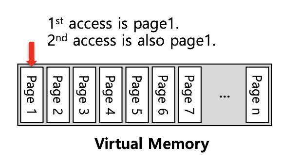

* `Spatial Locality`(공간 지역성)란 **어떤 요소에 접근한 상황이라면 그 주변의 요소들에 접근할 가능성이 높다**는 의미이다.

  배열과 같은 데이터에 접근할 때 순차적으로 접근(연속적인 접근)하게 되므로 apple 이라는 요소에 접근한 상황이라면 다음에 접근할 때에는 apple 주변의 요소들에 접근할 가능성이 높다는 것이다.

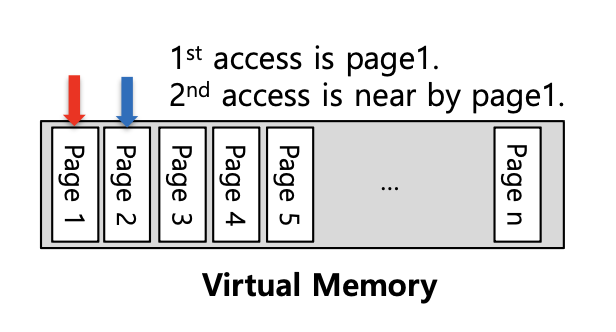

## Effective Access Time(EAT)

* **실제 메모리에 접근하는 시간(EAT)를 구하는 방법**에 대해 알아보자.

* 다음 예시를 가정해보자.

    * TLB hit ratio $\alpha$ = 80%

    * TLB search : 20 ns (TLB에서 해당 정보를 찾는 시간)

    * Memory access : 100 ns (메모리에 한번 접근하여 데이터를 가져오는 시간)

* `EAT` = 0.80 x (20 + 100) + 0.20 x (20 + 100 + 100) = 140 ns

    * `(20 + 100)` : TLB Hit이 된 경우 TLB에 가서 메모리가 접근한 시간을 의미한다.(TLB가 있는 경우)

    * `(20 + 100 + 100)` : TLB search + Page table에 접근한 시간 + Memory access 합한 값을 의미한다. (TLB가 없는 경우)

* **ns** 로 표기하는 것이 중요하고 잊지 말자.

## TLB Issue: Context Switching

* TLB를 사용할 때 Context Switching이 발생한다면 어떻게 되는지 다음 예시를 통해 알아보자.

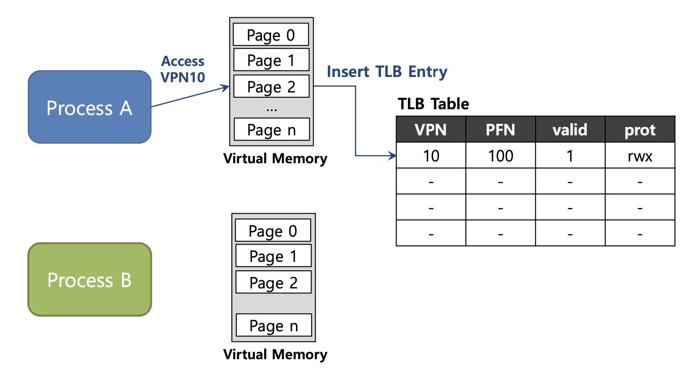

* `Process A`의 VPN 10에 대한 주소 변환 정보가 TLB에 저장되어 있다.

* 참고로 Process마다 각자의 Virtual Memory를 가지고 있다.

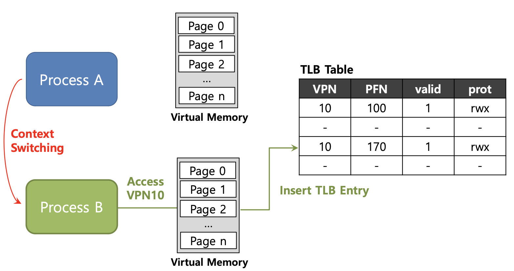

* 이때 Context Switching이 발생하여 `Process B`로 넘어가게 되는데, Process B 역시 VPN 10에 대한 주소 변환 정보가 TLB에 저장되어 있다.

* 이런 경우 Process A, B 둘다 **VPN은 10으로 동일하지만 PFN은 서로 다른 것을 확인**할 수 있다.

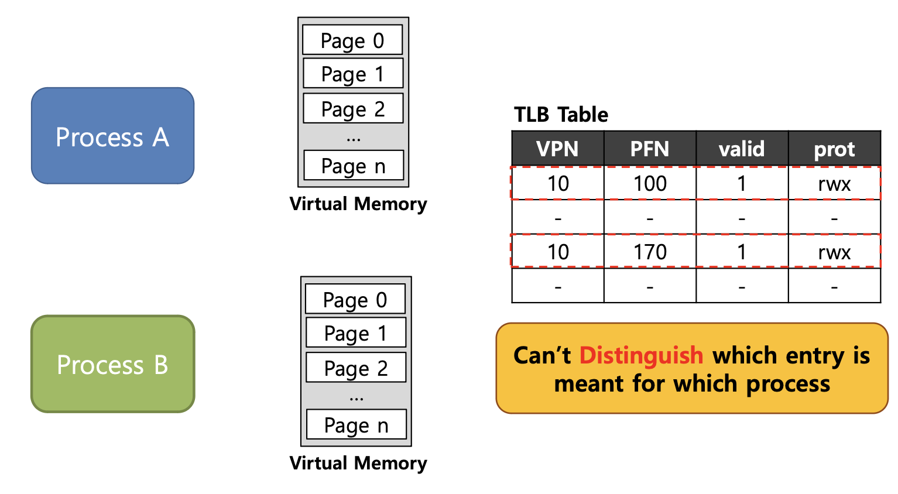

* 하지만 위와 같이 TLB에 정보를 저장하게 되면 **어떤 정보가 어떤 Process의 정보인지 알 수가 없다**.

* Process에서 서로의 주소 공간이 아닌 곳에 접근을 하게 될 경우 문제가 발생하므로 이를 해결할 방법이 필요하다.

## To Solve Problem

* 위의 문제를 해결하기 위해 하드웨어의 도움을 받아 TLB에서 `ASID`(address space identifier)라는 정보를 추가하여 문제를 해결하는 것이다.

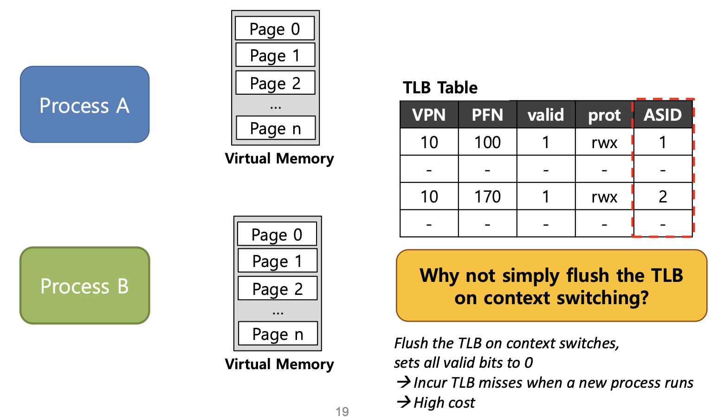

* 어떤 프로세스의 정보인지 구별하기 위해 TLB에서 `ASID`를 제공한다.

* 이를 통해 프로세스마다 다른 ASID 정보를 저장하여 주소 변환을 성공적으로 수행할 수 있도록 한다.

## Another Case

* 위에서는 VPN이 동일한 예시를 봤고, 이번에는 PFN이 동일한 경우에 대해서 알아보자.

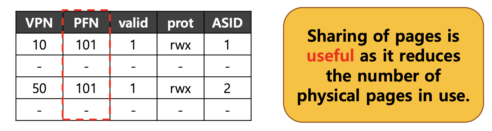

* 위의 예시를 가정해보면 Process 1은 Process 2와 같은 PFN 값이 101로 동일하다.

    * Process1의 VPN은 10이고, Process2의 VPN은 50이다.

* 두 개의 Process가 **PFN 값이 같으므로 Page를 공유**할 수 있다.

* 그러면 메모리의 사용을 줄일 수 있으므로 메모리의 공간을 이전보다 더 확보할 수 있게 된다.

* 하지만, **어떤 프로세스인지 구별을 확인하기 위해 `ASID` 값도 같이 저장**한다.

## TLB Replacement Policy

* TLB에 저장 가능한 공간이 꽉 찼을 경우 새로운 프로세스가 실행된다면, 어떤 프로세스를 빼고 새로운 것을 넣어야 하는지에 대해 알아보자.

* 우선, 목표는 **TLB miss rate를 최소화** 하는 것이다. (TLB hit rate를 향상시키는 것과 같은 말이다)

* 전형적으로 2가지 간단한 접근 방법이 있다. (LRU, Random policy)

* `LRU`(Least-recently-used) : 최근에 사용하지 않는(예전에 사용하고 지금은 사용하지 않는) Process를 내보내는 방법이다.

    * LRU는 위에서 설명한 `Temporal Locality`의 장점을 이용한다.

* `Random policy` : 이름 그대로 랜덤하게 제거하는 방법이다.

### Example: LRU

* LRU 접근 방법을 이용하여 TLB miss rate를 최소화하는 과정을 알아보자.

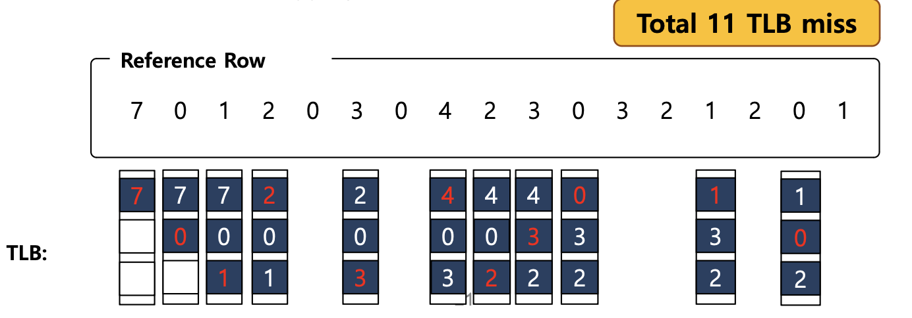

* Reference Row : 주어진 새로운 숫자(프로세스)가 순차적으로 실행한다는 것을 의미한다.

* 4번째에 숫자 '2'라는 새로운 프로세스가 발생했을 때, 가장 오래 사용하지 않았던 숫자 '7'를 빼고 '2'를 넣는 것을 확인할 수 있다.

* 이처럼 최근에 가장 사용하지 않았던 프로세스를 내보내고, 그 자리에 새로운 프로세스가 들어온다.

* 18번 중에 11번의 miss가 발생했기 때문에, 결론적으로 `TLB miss ratio` = 11/18 = 0.61 = 61% 값을 확인할 수 있다.

## 예상 질문

1. TLB가 나오게 된 배경은 무엇이고, TLB 개념에 대해 설명해주세요.

2. TLB가 메모리 성능을 어떻게 향상시키는지 `TLB hit rate` 와 `Spatial Locality` 개념과 연관지어 설명해주세요.

3. TLB를 사용할 때 `Context Switching`이 발생한다면 어떻게 해결하는 지 설명해주세요. (2가지 해결방안)

4. TLB에 저장 가능한 공간이 꽉 찼을 경우 새로운 프로세스가 실행된다면, 어떤 프로세스를 빼고 새로운 것을 넣어야 하는지 과정에 대해 설명해주세요. (TLB Replacement policy)

## Reference

* 학교 수업 내용 - [Operating Systems Three Easy Pieces](https://www.amazon.com/Operating-Systems-Three-Easy-Pieces/dp/198508659X)

* [[OS] Paging 메모리 관리를 빠르게 하기 위한 TLB](https://icksw.tistory.com/149)

* [Ch5-4. 캐시(Cache memory)](https://brunch.co.kr/@lkj28/129)