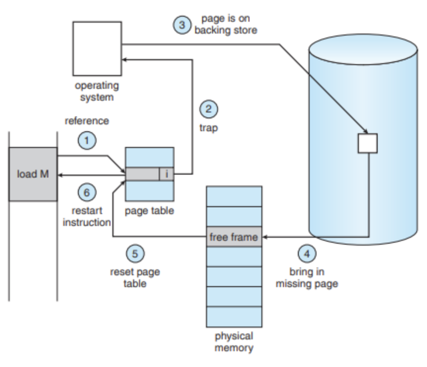

# 🚀 가상메모리와 요구 페이징, 페이지 교체

## 🎯 가상메모리 Virtual Memory

> - 실제 메모리 용량보다 커보이게 하는 기술.  
> - 어떤 프로세스가 실행될 때 해당 프로세스 전체가 메모리에 올라가지 않아도 실행 할 수 있다는점에서 착안.  
> - 참조 지역성과 관련이 깊다.  
> - 램과 디스크를 하나의 추상화된 메모리 영역으로 제공.  
> - 운영체제는 가상메모리 기법을 통해 프로그램의 논리적 주소 영역에서 필요한 부분만 메모리에 적재하고 나머지 부분은 디스크에 저장.

### 등장배경

- 프로그램이 메모리를 점유하다가 비정상 종료되는 경우 시스템 전체에 영향을 끼치던 문제를 해결하기 위함.
- 프로세스가 점유하는 공간을 가상세계로 제한해 시스템 안정성을 확보한다.
- 실제 메모리보다 큰 공간을 필요로 하는 프로세스를 실행하기 위함.
- 참조 지역성에 의해 실제 메모리에 전체 프로세스가 올라가 있지 않아도 실행 할 수 있다는 점에서 착안.

### 가상메모의 장점

- 프로그램이 실제 물리메모리 크기에 제한받지 않는다.
- 여러개의 프로그램을 동시에 실행 할 수 있어 CPU 이용률과 처리율이 증가한다.
- 프로그램 스왑 필요한 입출력이 감소한다.

### 가상(논리) 주소 공간 Virtual Address Space

- 사용자/프로세스의 논리적인 메모리 공간.
  - 0번지 부터 시작.
  - 메모리관리장치(MMU)에 의해 물리 메모리 주소로 변환.

### 가상메모리 구현을 위한 핵심 기술

- 요구 페이징 Demand Paging
  - 스왑된 페이지를 필요할 때 메모리에 적재.
  - 기본적인 페이징 기법에 따라 주소 변환.
- 페이지 교체 Page Replacement
  - 메모리의 공간이 부족할 경우 페이지를 스왑해 교체.

## 🎯 요구 페이징 Demand Paging

- 논리 주소 공간의 각 페이지가 실제로 필요할 경우 메모리에 적재.
  - 사용되지 않는 페이지는 스왑공간에 저장됨.
  - 메모리의 물리적 필요량을 절약할 수 있다.
  - 스왑 시간 감소.

### 요구 페이징과 페이지 테이블

- 일반적인 페이징과 달리 각각의 페이지가 메모리와 스왑공간에 나뉘어 있어 페이지의 논리적 위치 구분하는 정보를 나타내는 하드웨어 메모리관리장치(MMU)가 필요하다.
  - 유/무효 비트 Valid/Invalid bit
    - valid : 페이지가 메모리에 있는 상태.
    - invalid : 페이지가 스왑공간에 있는 상태.
- invalid 상태 페이지를 참조하는 경우
  - 운영체제는 인터럽트로 페이지 폴트 트랩 page fault trap 을 발생시키고 페이지를 스왑공간에서 가져와 메모리에 올리는 IO발생
  - 해당 프로세스는 IO 작업이 끝날때 까지 대기상태

> ### 페이지 폴트의 처리 과정
> 
> 
> 1. 프로세스가 새로운 데이터에 접근하기위해 페이지 테이블 참조, 해당 페이지는 invalid 마킹
> 2. 내부 인터럽트 페이지 폴트 트랩 발생, 운영체제 인터럽트 핸들러로 전달
> 3. 스왑공간에서 해당 데이터를 읽어오는 IO 작업 시작
> 4. 필요한 데이터를 메모리상 적절한 위치에 적재
> 5. 페이지 테이블 갱신 invalid -> valid
> 6. 프로세스 재시작 인터럽트 발생, 프로세스로 전달, 프로세스 진행

### 이론적 성능

- 페이지 폴트를 고려한 메모리 접근 시간.
  - 페이지 폴트율에 영향을 받는다.
  - 모든 정보가 메모리에 적재 되어 있을 때 보다 통상적으로 10배 가량 성능 저하 발생
  - 하지만 프로세스의 실행 특성상 메모리를 참조하는데 있어 참조 지역성에 의해 실제로 가상메모리 접근을 통한 성능저하는 드물게 발생한다.

### 성능 고려 사항

- 스왑공간의 효율적인 관리
  - 일반적인 파일 IO 시스템보다 빠른 IO 제공.
    - 한번에 많은 데이터 입출력 단위(block)를 사용.
    - 파일 검색, 간접 할당 기법을 사용하지 않음.
  - 프로세스 실행 시 스왑공간의 사용 방법 선택
    - 프로세스 전체 이미지를 스왑공간에 가져온 뒤 요구 페이징 처리.
  - 프로그램 실행 파일의 스왑공간 저장 여부
    - 프로그램 실행 파일의 경우 read only 형태이기 때문에 스왑 아웃된 경우 스왑공간에 저장하지 않는다.
- 페이지 폴트의 최소화
  - 프로세스의 형태에 매우 의존적이다. 운영체제에서 컨트롤 할 수 없는 부분
  - 페이지 교체의 영향 
    - 페이지 교체의 알고리즘에 의존적
    - 페이지 접근패턴의 분석과 적절한 페이지 교체가 이뤄져야 한다.

## 🎯 페이지 교체 Page Replacement

### 메모리 과할당

- 물리메모리의 모든 영역이 다른프로세스에 할당되어있는 상태
- 요구 페이징을 처리할 빈 메모리 프레임이 없는 상태

### 해소 방법

- 프로세스 종료
  - 프로세스의 실행 상황이 변경되어 메모리 관리 서비스의 원래 목적에 위배
- 프로세스 스와핑(swap out)
  - 특정 프로세스 전체를 스와핑 해버리면 다시 메모리에 적재하는데 비용이 크기때문에 멀티 프로세싱 정도를 낮추게된다.
- 일부 페이지 스와핑
  - 페이지 교체
  - 요구 페이징 과정의 필수 요소

### 페이지 교체 알고리즘

> - 프레임 할당 알고리즘과 함께 요구 페이징 에서 가장 핵심적인 문제.
> - 목표 : 페이지 폴트의 최소화 

- **FIFO First In First Out**
  - 메모리에 들어온 페이지 중 가장 오래된 페이지를 교체.
    - 각 페이지에 대한 데이터를 Queue 형태로 관리.
    - 가장 간단하게 구현 가능하지만 성능을 보장할 수 없다.
  - Belady 모순 발생 가능성 존재
- **OPR Optimal Page Replacement**
  - Belady 모순이 발생하지 않으면서 다른 페이지 부재율을 최소화 할 수 있다.
  - 앞으로 가장 오랜시간동안 사용되지 않은 페이지를 교체 하는 알고리즘
  - 실제 구현이 불가능하다.
    - 미래의 페이지 참조 형태를 알아야 하기 때문
    - 다른 알고리즘의 성능을 비교하기위해 사용된다.
      - 미리 주어진 참조열과 메모리 프레임을 적용해 계산
- **LRU Least Recently Used**
  - OPR 알고리즘에 근사한 방법
  - 과거의 참고 이력을 기반으로 페이지를 교체하는 알고리즘.
  - 고려사항
    - 페이지 이력을 가져올 수 있어야 한다.
    - 모든 메모리 참조에 대해 참조 시간 정보를 갱신 할 수 있는 하드웨어적 지원이 필요하다.
    - 사용된 페이지에 대한 시간 정보를 기록.
    - 페이지 정보의 스택 유지
      - 가장 최근에 참조된 페이지는 스택의 top 으로 이동.
      - 교체될 페이지는 스택 최하단의 페이지가 된다.
- **Counting**
  - 각 페이지의 사용 횟수를 기록
    - 실제 구현이 쉽지 않고 최적 알고리즘에 근사하기 어렵다.
    - LFU, MFU 로 나뉜다
    - LFU Least Frequently Used - 참조 횟수가 가장 적은 페이지를 교체
    - MFU Most Frequently Used - 참조 횟수가 가장 많은 페이지를 교체

---

# 📚 References
[[OS/운영체제] 가상 메모리 (Virtual Memory)](https://4legs-study.tistory.com/51)  
[가상 메모리의 개념과 요구 페이징](https://www.youtube.com/watch?v=OPS8LSbumPU)  
[가상메모리와 요구 페이징, Valid-Invalid Bit, 페이지 부재 과정](https://code-lab1.tistory.com/59)  
[가상메모리(virtual memory)](https://dding9code.tistory.com/100)  
