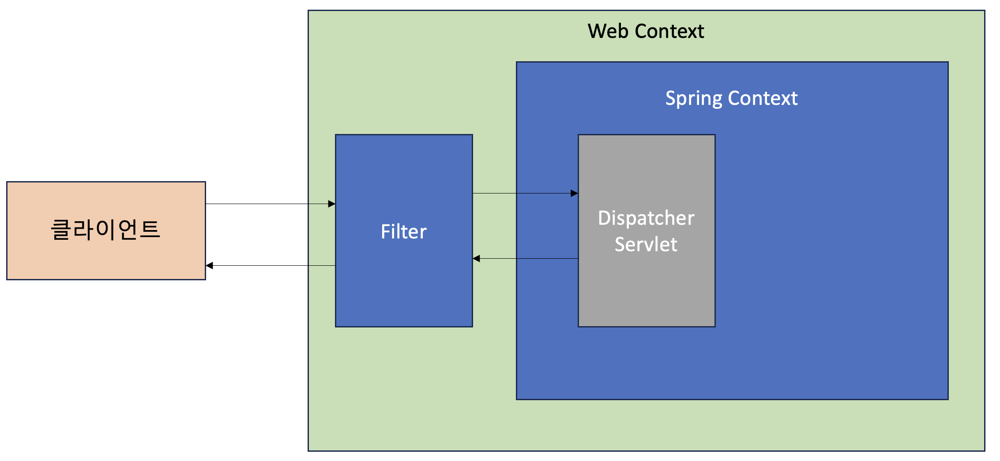
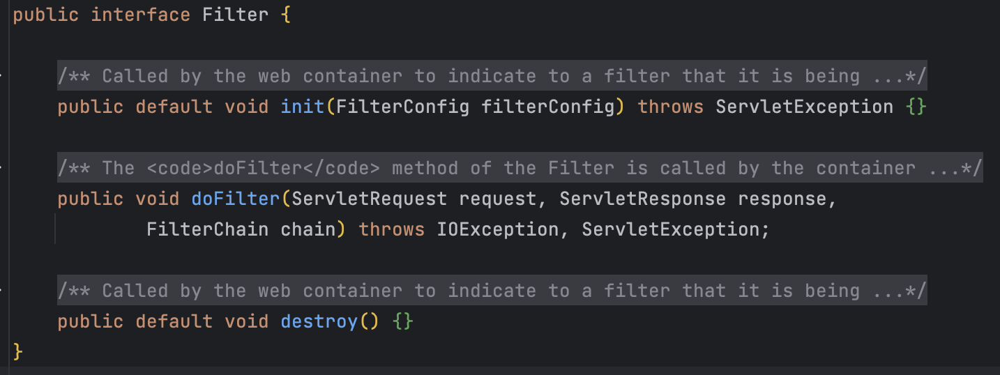
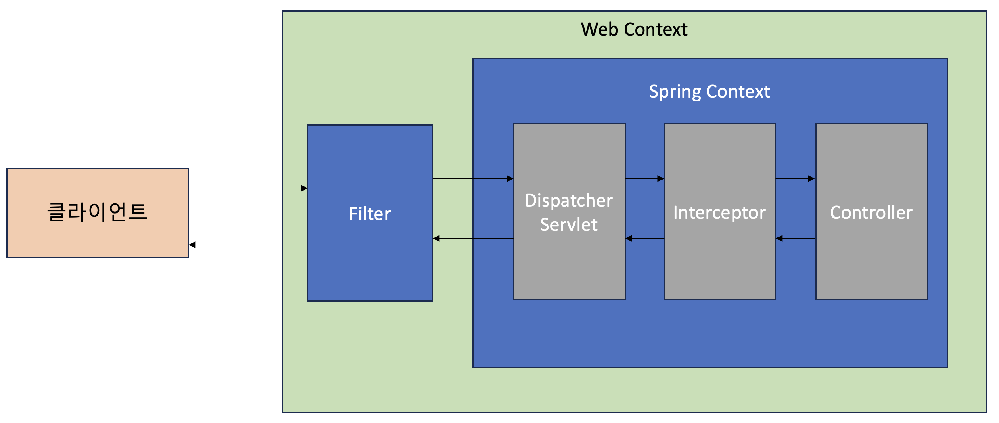
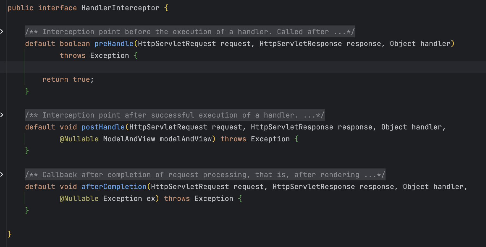

# Filter, Interceptor

# 필터 (Filter)

필터는 디스패처 서블릿에 요청이 전달되기 전/후 url 패턴에 맞는 모든 요청에 대해 부가작업을 처리할 수 잇는 기능을 제공한다. 디스패처 서블릿은 스프링의 가장 앞단에 존재하는 프론트 컨트롤러이므로, 필터는 스프링 범위 밖에서 처리가 된다.

톰캣과 같은 웹 컨테이너에 의해 관리가 되고, 디스패처 서블릿 전/후에 처리한다. 웹 컨테이너에 의해 관리가 되지만 스프링 빈으로 등록은 가능하다.

## 필터의 메소드

1. init 메소드
    
    필터 객체를 초기화하고 서비스에 추가하기 위한 메소드이다. 웹 컨테이너가 1회 init 메소드를 호출하여 필터 객체를 초기화하면 이후의 요청들은 doFilter를 통해 처리된다.
    
2. doFilter 메소드
    
    url-pattern에 맞는 모든 HTTP 요청이 디스패처 서블릿으로 전달되기 전에 웹 컨테이너에 의해 실행되는 메소드이다. doFilter의 파라미터로 FilterChain이 있는데, FilterChain의 doFilter 통해 다음 대상으로 요청을 전달하게 된다. chain.doFilter() 전/후에 필요한 처리 과정을 넣어줌으로써 원하는 처리를 진행할 수 있다.
    
3. destroy 메소드
    
    필터 객체를 서비스에서 제거하고 사용하는 자원을 반환하기 위한 메소드이다. 웹 컨테이너에 의해 한번 호출되며 이후 doFilter에 의해 처리되지 않는다.
    

# 인터셉터 (Interceptor)

spring이 제공하는 기술로, 디스패처 서블릿이 컨트롤러를 호출하기 전과 후에 요청과 응답을 참조하거나 가공할 수 있는 기능을 제공한다. 웹 컨테이너에서 동작하는 필터와 달리 인터셉터는 스프링 컨텍스트에서 동작을 한다.

디스패처 서블릿은 핸들러 매핑을 통해 적적한 컨트롤러를 찾도록 요청하는데, 그 결과로 실행체인을 돌려준다. 이 실행체인은 1개 이상의 인터셉터가 등록되어 있다면 순차적으로 인터셉터들을 거쳐 컨트롤러가 실행 되고, 인터셉터가 없다면 바로 컨트롤러를 실행한다.

위 그림은 처리 순서를 도식화한 것으로 실제로는 Interceptor가 Controller로 요청을 위임하지 않는다.

## 인터셉터의 메소드

1. preHandle메소드
    
    컨트롤러가 호출되기 전에 실행된다. 컨트롤러 이전에 처리해야 하는 전처리 작업이나 요청 정보를 가공하거나 추가하는 경우에 사용할 수 있다. 3번째 파라미터인 handler 파라미터는 핸들러 매핑이 찾아준 컨트롤러 빈에 매핑되는 HandlerMethod라는 새로운 타입의 객체로써, @RequestMapping이 붙은 메소드의 정보를 추상화한 객체이다. 또한 preHandle의 반환 타입은 boolean인데 반환값이 true이면 다음 단계로 진행이 되지만, false라면 작업을 중단하여 이후의 작업(다음 인터셉터 또는 컨트롤러)은 진행되지 않는다.
    
2. postHandle 메소드
    
    컨트롤러를 호출한 후에 실행된다. 그래서 컨트롤러 이후에 처리해야 하는 후처리 작업이 있을 때 사용할 수 있다. 이 메소드는 컨트롤러가 반환하는 ModelAndView 타입의 정보가 제공되는데, 최근에는 Json 형태로 데이터를 제공하는 RestAPI기반의 컨트롤러(@RestController)를 만들면서 자주 사용되지 않는다. 컨트롤러 하위 계층에서 작업 중 예외가 발생하면 postHandle은 호출되지 않는다.
    
3. afterCompletion 메소드
    
    afterCompletion 메소드는 이름 그대로 모든 뷰에서 최종 결과를 생성하는 일을 포함해 모든 작업이 완료된 후에 실행된다. 요청 처리 중에 사용한 리소스를 반환할 때 사용하기에 적합하다. postHandler와 달리 컨트롤러 하위 계층에서 작업을 진행하다가 중간에 예외가 발생하더라도 afterCompletion은 반드시 호출된다.
    

| 대상 | 필터 | 인터셉터 |
| --- | --- | --- |
| 관리되는 컨테이너 | 서블릿 컨테이너 | 스프링 컨테이너 |
| 스프링의 예외처리 여부 | X | O |
| Request/Response 객체 조작 가능 여부 | O | X |
| 용도 | 1. 공통된 보안 및 인증/인가 관련 작업  2. 모든 요청에 대한 로깅 또는 감사  3. 이미지/데이터 압축 및 문자열 인코딩  4. spring과 분리되어여 하는 기능 | 1. 세부적인 보안 및 인증/인가 공통 작업  2. API 호출에 대한 로깅 또는 감사  3. Controller로 넘겨주는 정보(데이터)의 가공 |