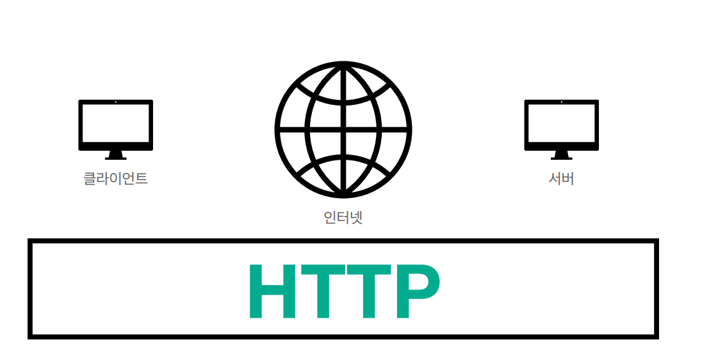
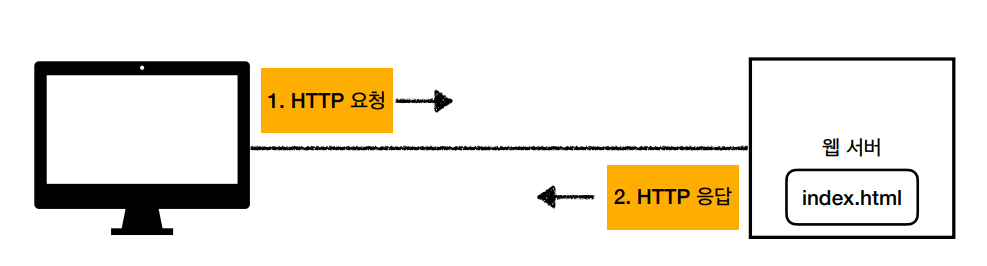
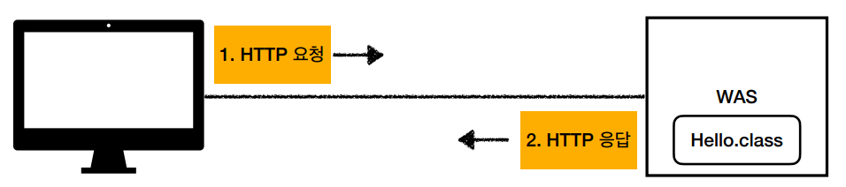
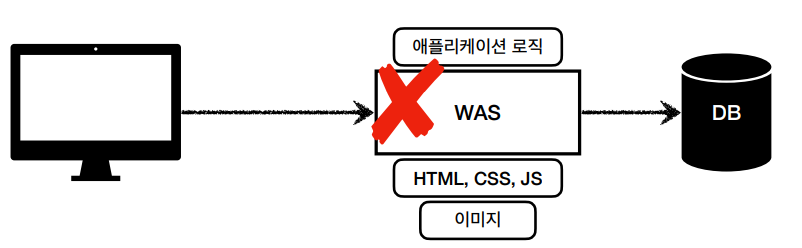
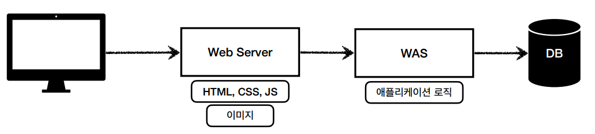
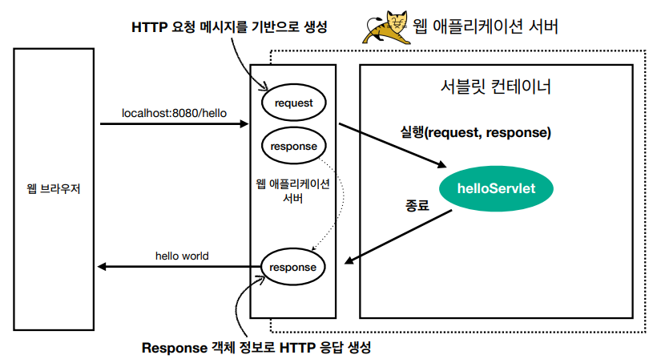
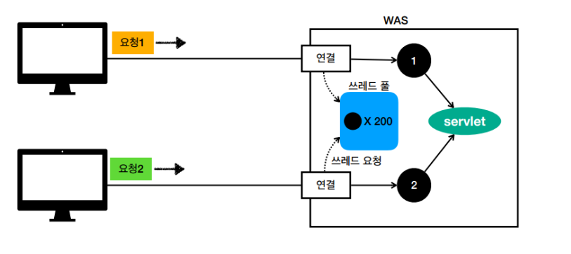
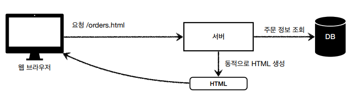
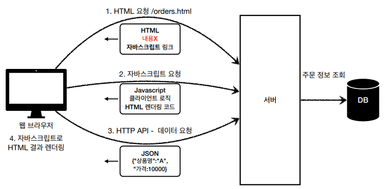

# 웹 어플리케이션 이해 🌎
> **웹 어플리케이션(Web Application)** : 인터넷이나 인트라넷을 통해 웹 브라우저에서 이용할 수 있는 응용 프로그램 

## 웹 서버, 웹 어플리케이션 서버
### 모든 것이 HTTP
<div align='center'>
    
</div>

과거 초기의 웹 어플리케이션은 클라이언트-서버 컴퓨팅 환경에서의 각 응용 소프트웨어마다 UI를 가지고 있었으며, 사용자 PC마다 따로 설치했어야 했다.

현재는 **HTTP** 라는 통일된 프로토콜을 사용하지만, 과거에는 회사마다 독자적인 통신 프로토콜을 사용했었기 때문이다.

대개 독자적인 규격을 가지는 것은 회사입장에서 매우 큰 이득이지만, Web에서 만큼은 매우 큰 비용을 초래하여 생산성이 떨어진다는 문제가 발생한다.
<br> HTTP 프로토콜의 정립으로 인해 웹 어플리케이션을 제공하는 기업의 유지 비용이 줄었다.

### 웹 서버(Web Server)
<div align='center'>
    
</div>

- HTTP 기반 동작
- **정적** 리소스 (정적 HTML, CSS, JS, 이미지, 영상) 제공

### 웹 어플리케이션 서버 (Web Application Server)
<div align='center'>
    
</div>

- HTTP 기반 동작
- 웹 서버 기능 포함 (정적 리소스 제공)
- 프로그램 코드를 실행하여 **어플리케이션 로직** 수행
    - ⇒ 동적 HTML, HTTP API, 서블릿, JSP, 스프링 MVC
- ex) 톰캣(Tomcat)

**=> `WAS`가 어플리케이션 코드를 실행하는 데에 있어서 더 특화되어 있다.**

### 웹 시스템 구성
<div align='center'>
    
</div>

- WAS가 웹 서버의 기능도 다 할 수 있지만, 너무 많은 역할을 담당할 시 서버 과부하
- WAS 장애 시 오류화면도 노출 불가능

<div align='center'>
    
</div>

- 웹 서버는 정적 리소스 처리,
- WAS는 애플리케이션 로직같은 동적인 처리 ⇒ 효율적인 리소스 관리
- WAS, DB 장애 시 웹 서버가 오류 화면 제공 가능

<br>

## 서블릿
### 서버에서 처리해야 하는 업무
<div align='center'>
    
</div>

HTTP 요청이 왔을 때, 의미있는 비즈니스 로직을 제외하고 나머지 업무들을 서블릿을 지원하는 WAS가 처리해준다.

```
@WebServlet(name = "helloServlet", urlPatterns = "/hello")
public class HelloServlet extends HttpServlet {
    @Override
    protected void service(HttpServletRequest request, HttpServletResponse response) {
        // 애플리케이션 로직
    }
}
```

- urlPatterns의 URL이 호출되면 서블릿 코드가 실행
- `HttpServletRequest` : HTTP 요청 정보 편리하게 사용
- `HttpServletResponse` : HTTP 응답 정보 편리하게 제공

=> 개발자는 HTTP 스펙을 매우 편리하게 사용할 수 있다.

<div align='center'>
    
</div>


### 서블릿 컨테이너
- 서블릿을 지원하는 WAS
- 서블릿 객체를 생성, 초기화, 호출, 생명주기 관리
- 싱글톤으로 관리, 멀티 쓰레드 처리 지원

<br>

## 동시 요청 - 멀티 쓰레드
### 쓰레드(Thread)
- 어플리케이션 코드를 하나하나 순차적으로 실행(하나의 코드 라인만 수행)
- 자바 메인 메서드를 처음 실행하면 main이라는 이름의 쓰레드가 실행
- 쓰레드가 없으면 자바 어플리케이션 실행 불가능
- 동시 처리가 필요하면 쓰레드 추가 생성

쓰레드 생성 비용이 매우 비싸며, 요청마다 쓰레드를 생성하면 응답 속도가 느려지고, 너무 많은 요청이 오면 CPU, 메모리 임계점이 넘어 서버가 죽을 수 있다.

그래서 이를 해결하기 위해 쓰레드 풀을 사용한다.

### 쓰레드 풀
> 요청마다 쓰레드 생성의 단점 보완

<div align='center'>
    
</div>

필요한 쓰레드를 **쓰레드 풀**에 보관하고 관리한다.

쓰레드가 필요하면, 이미 생성되어 있는 쓰레드를 쓰레드풀에서 꺼내어 사용한다.

쓰레드를 다 쓰면 쓰레드 풀에 다시 **반납**을 하고, 쓰레드풀에 쓰레드가 없으면 쓰레드 요청을 대기, 거절시킨다.

쓰레드가 미리 생성되어 있으므로 쓰레드를 생성하고 종료하는 비용(CPU)과 시간이 절약된다.
<br> 생성 가능한 쓰레드의 최대치가 있으므로 너무 많은 요청이 들어와도 안전하게 처리할 수 있다.

### 쓰레드 풀의 적정 숫자
- WAS의 주요 튜닝 포인트는 **최대 쓰레드 수**
    - 이 값이 너무 낮으면 : 동시 요청이 많을 때, 서버 리소스는 여유롭지만 클라이언트는 금방 응답 지연
    - 너무 높으면 : 동시 요청이 많을 때, CPU, 메모리 리소스 임계점 초과로 서버 다운

멀티 쓰레드에 대한 부분은 `WAS`가 처리하여, 개발자는 싱글 쓰레드 프로그래밍을 하듯이 편리하게 소스 코드를 개발하면 된다.

<br>

## HTML, HTTP API, CSR, SSR
### 정적 리소스
웹 서버에 요청하여 고정된 HTML 파일, CSS, JS, 이미지 영상 등을 제공

### HTML 페이지
WAS에 요청하여 DB에 정보를 조회한 정보를 동적으로 HTML 파일을 생성해 JSP, 타임리프를 통해 제공

### HTTP API
- WAS에 요청하여 DB에 정보를 조회한 정보 HTML이 아니라 주로 JSON 형식의 데이터를 전달
- 데이터만 주고 받아, UI 화면이 필요하면 클라이언트가 별도 처리
    - ex) {"주문번호": 100, "금액": 5000}

### 서버사이드 렌더링, 클라이언트 사이드 렌더링
#### SSR - 서버 사이드 렌더링

<div align='center'>
    
</div>

- 서버에서 최종 HTML을 생성해서 클라이언트에 전달
- 주로 정적인 화면에 사용
- 관련 기술 : JSP, 타임 리프 (백엔드 개발자)

#### CSR - 클라이언트 사이드 렌더링

<div align='center'>
    
</div>

- HTML 결과를 자바스크립트를 사용해 웹 브라우저에서 동적으로 생성해서 적용
- 주로 동적인 화면에 사용
- 관련 기술 : React, Vue.js (웹 프론트엔드 개발자)


## 자바 백엔드 웹 기술 역사
애노테이션 기반의 스프링 MVC 등장

@Controller

### 스프링 부트의 등장
- 스프링 부트는 서버를 내장
- 스프링 부트는 빌드 결과(Jar)에 WAS 서버 포함 -> 빌드 배포 단순화

### 자바 뷰 템플릿
- JSP
    - 속도 느림, 기능 부족
- 프리마커(Freemarker), Velocity(벨로시티)
    - 속도 문제 해결, 다양한 기능
- 타임리프(Thymeleaf)
    - HTML의 모양을 유지하면서 뷰 템플릿 적용 가능
    - 스프링 MVC와 강력한 기능 통합
    - 최선의 선택

### 참고자료
[스프링 MVC 1편 - 백엔드 웹 개발 핵심 기술](https://www.inflearn.com/course/%EC%8A%A4%ED%94%84%EB%A7%81-mvc-1/dashboard)

[[React] React에 대해 : 서론, 소개(Class Based Component, Hooks)](https://nitro04.blogspot.com/2020/01/web-web-application-web-site.html)
