# JSP

> ### JSP?
> - **Java Server Pages**의 약자로 HTML + Java 형태의 서버사이드 템플릿 엔진
> - JSP페이지(파일) 자체가 자바 클래스
> - 최근 스프링 프레임워크 5 버전부터 공식 지원 중단

## 0. 예제로 알아보기

- 간단한 예제로 직접 따라해보며 학습
- 도메인 객체를 만들고 그 정보를 저장하는 기능 구현

### 0.1 회원 관리 웹앱

#### 0.1.1 요구사항

- 회원정보(도메인)
  - 이름
  - 나이

- 기능 요구사항
  - 신규 회원 저장 (in-memory)
  - 회원 목록 조회

## 1. 프로젝트 생성/설정

### 1.1 신규 프로젝트 생성/설정

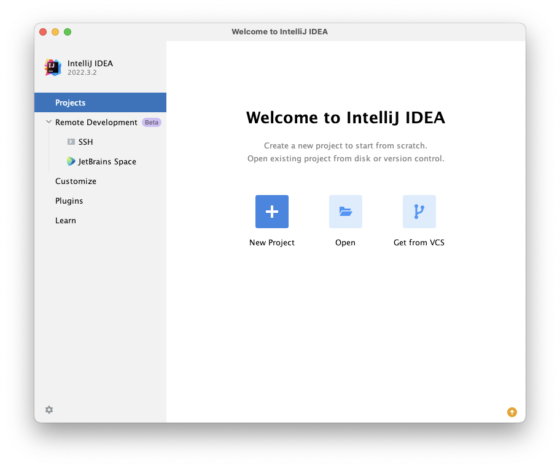

#### 1.1.1 메타데이터 설정

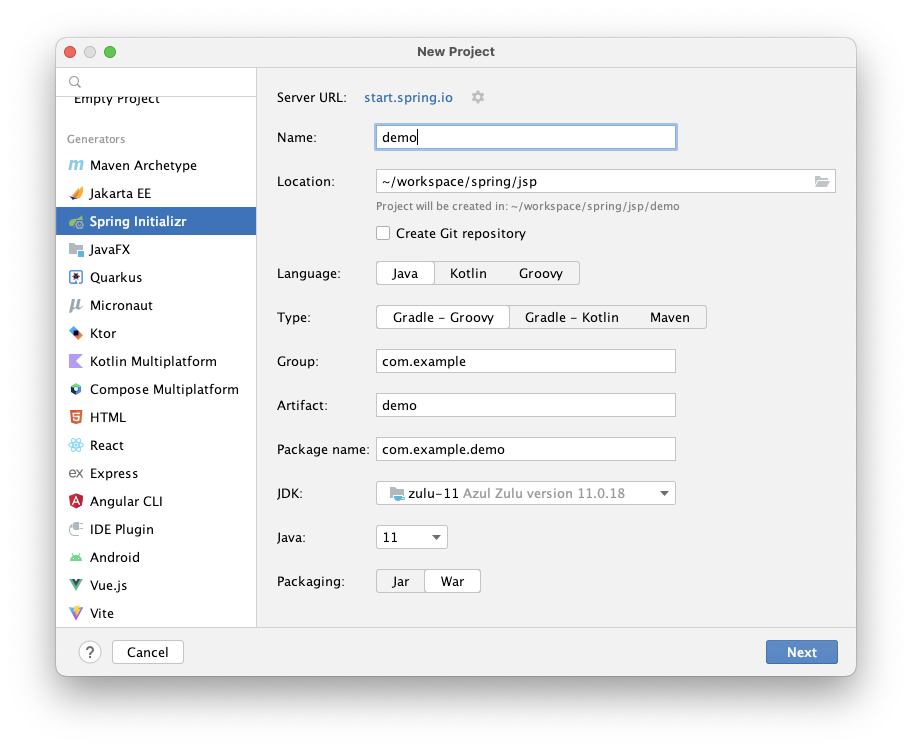

> ### 🔥 주의 🔥
> 빌드 결과물은 `War`로 설정

#### 1.1.2 의존성 추가

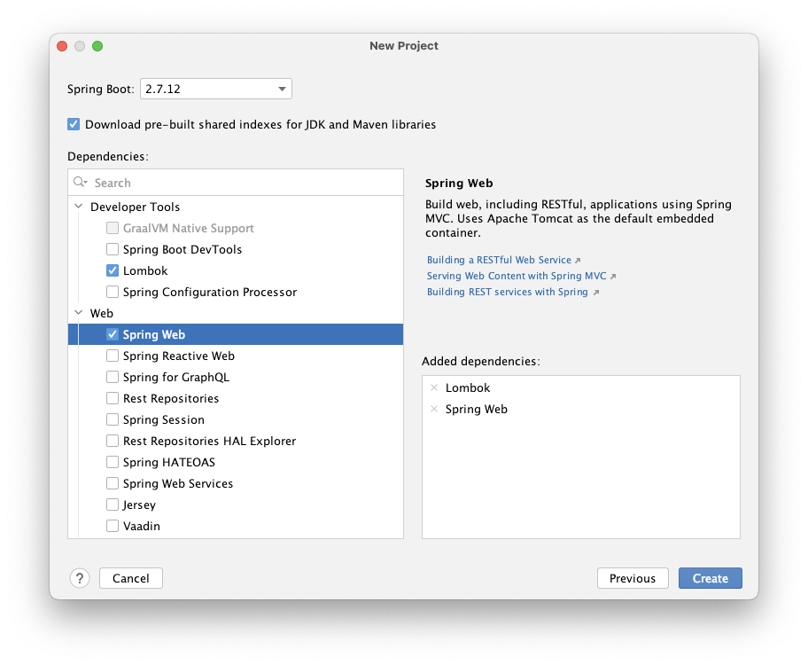

#### 1.1.3 생성 결과

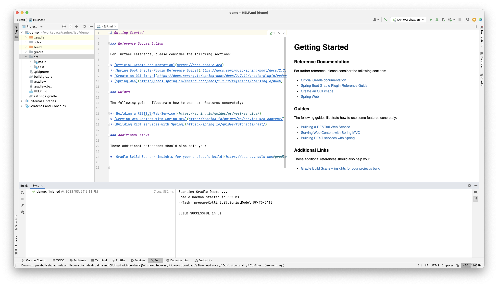

#### 1.1.4 롬복(Lombok) 사용을 위한 어노테이션 프로세싱 활성화

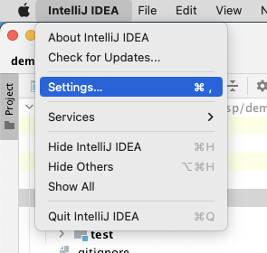

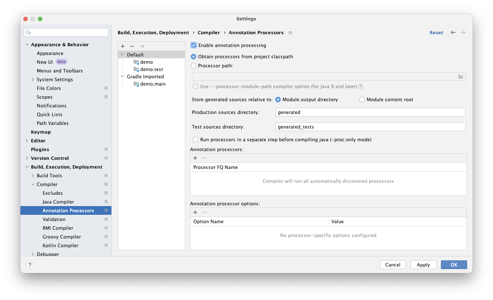

#### 1.1.5 JSP 사용을 위한 라이브러리 의존성 추가

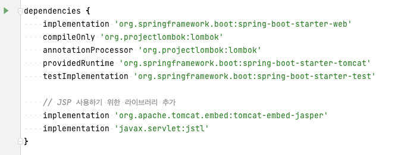

- `gradle.build`파일에 의존성 추가 후 화면 우상단 reload 클릭


#### 1.1.6 빌드 결과

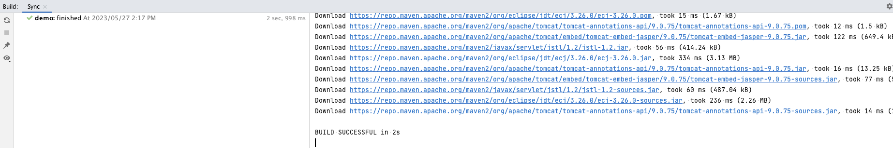

#### 1.1.7 JSP 파일이 위치 할 디렉토리 생성

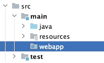

#### 1.1.8 index.html 작성


- webapp 디렉토리 내 index.html 생성

```
<!DOCTYPE html>
<html lang="en">
<head>
  <meta charset="UTF-8">
  <title>Title</title>
</head>
<body>
  <h1>index.html</h1>
  <p><a href="/join-form.jsp">add new member</a></p>
  <p><a href="/members.jsp">show all members</a></p>
</body>
</html>
```

## 2. 도메인, 저장소 코드

### 2.1 회원정보(도메인)

- 객체 생성시에 빌더 패턴을 이용할 수 있도록 `@Builder` 어노테이션을 사용했다.
- [참고자료 - Lombok 너무 편리하기 때문에 주의해야 한다. (Lombok 주의점)](https://lkhlkh23.tistory.com/159)
- [참고자료 - Lombok 사용상 주의점(Pitfall)](https://kwonnam.pe.kr/wiki/java/lombok/pitfall)

```
package com.example.demo.member;

import lombok.Builder;
import lombok.Getter;
import lombok.Setter;

@Getter
public class Member {

    @Setter
    private Long id;
    private String username;
    private Integer age;

    private Member() {}

    @Builder
    public Member(
            String username,
            Integer age
    ) {
        this.username = username;
        this.age = age;
    }

}

```

### 2.2 도메인(회원 정보) 저장소

```
package com.example.demo.member;

import java.util.ArrayList;
import java.util.HashMap;
import java.util.List;
import java.util.Map;

public class Repository {

    private static final Repository instance = new Repository();
    private Map<Long, Member> members;
    private static Long id;

    private Repository() {
        this.members = new HashMap<>();
        this.id = 0L;
    };

    public static Repository getInstance() {
        return instance;
    }

    public Member save(Member member) {
        member.setId(++id);
        members.put(member.getId(), member);
        return member;
    }

    public Member findById(Long id) {
        return members.get(id);
    }

    public List<Member> findAll() {
        return new ArrayList<>(members.values());
    }

    public void clear() {
        members.clear();
    }

}

```

### 2.3 테스트 해보기

#### 2.3.1 테스트 코드

- 테스트 디렉토리에 테스트 코드 생성

  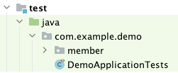

```
package com.example.demo.member;

import org.junit.jupiter.api.AfterEach;
import org.junit.jupiter.api.DisplayName;
import org.junit.jupiter.api.Test;

import java.util.ArrayList;
import java.util.List;

import static org.assertj.core.api.Assertions.assertThat;

class RepositoryTest {

    private Repository repository = Repository.getInstance();

    @AfterEach
    void afterEachTests() {
        repository.clear();
    }

    @Test
    @DisplayName("싱글톤_저장소_객체의_생성")
    void getInstance() {
        assertThat(repository != null).isTrue();
    }

    @Test
    @DisplayName("새로운_멤버_객체_생성과_저장")
    void save() {
        // G
        Member newMember = Member.builder()
                .username("username01")
                .age(22)
                .build();
        // W
        Member saved = repository.save(newMember);

        // T
        assertThat(newMember).isNotEqualTo(
                Member.builder()
                        .username("username01")
                        .age(22)
                        .build()
        );
        assertThat(newMember).isEqualTo(saved);
    }

    @Test
    @DisplayName("저장된_회원의_반환여부")
    void findById() {
        // G
        Member newMember = Member.builder()
                .username("username01")
                .age(22)
                .build();
        // W
        Member saved = repository.save(newMember);

        // T
        assertThat(newMember).isEqualTo(repository.findById(saved.getId()));
    }

    @Test
    @DisplayName("전체_회원_목록_반환")
    void findAll() {
        // G
        int howMany = 100;
        List<Member> createdMembers = new ArrayList<>();
        for (int i = 0; i < howMany; i++) {
            Member newMember = Member.builder()
                    .username("username" + i)
                    .age(20 + (100 % (i + 1)))
                    .build();
            repository.save(newMember);
            createdMembers.add(newMember);
        }

        // W
        List<Member> members = repository.findAll();

        // T
        assertThat(members.size()).isEqualTo(howMany);
        assertThat(members).containsAll(createdMembers);
    }
}

```

#### 2.3.2 테스트 결과

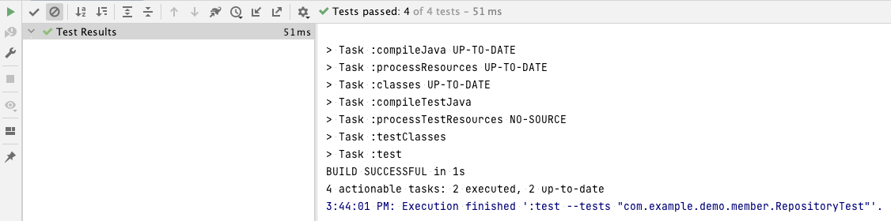

## 3. JSP로 웹앱 구현

이제 직접 다음 3가지 JSP페이지를 만들어 브라우저 화면에서 동작 가능한 실제 서비스를 구현해보자.

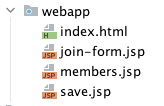

### 3.1 들어가기 전에

- `.jsp`파일은 그 자체로 하나의 자바 클래스가 된다.
- 앱 실행시에 서블릿 컨테이너에 의해 서블릿 클래스로 변환된다.

#### 3.1.1 여러가지 JSP 태그

- `<%@ ... %>`: 지시자
  - 페이지 속성 설정
- `<%-- ... --%>`: 주석
  - 주석 처리
- `<%! ... %>`: 선언
  - 변수, 메서드 선언
- `<%= ... %>`: 표현식
  - 결과값 출력
- `<% ... %>`: 스크립트
  - Java 코드 삽입
- `<jsp:action>...</jsp:action>`: 액션
  - 페이지 삽입, 공유, 자바빈 사용 등

#### 3.1.2 `<%@ page contentType="text/html;charset=UTF-8" language="java" %>`

- JSP 사용 시 첫줄에 선언해야하는 구문
- 이 문서가 JSP라는 의미

### 3.2 join-form.jsp

```
<%@ page contentType="text/html;charset=UTF-8" language="java" %>
<html>
<head>
    <title>join</title>
</head>
<body>
    <form action="./save.jsp" method="post">
        <label>
            username:
            <input type="text" name="username" />
        </label>
        <label>
            age:
            <input type="text" name="age" />
        </label>
        <button type="submit">submit</button>
    </form>
    <p><a href="/">back to main</a></p>
</body>
</html>
```

### 3.3 save.jsp

```
<%@ page contentType="text/html;charset=UTF-8" language="java" %>
<%@ page import="com.example.demo.member.Member" %>
<%@ page import="com.example.demo.member.Repository" %>
<%
    Repository repository = Repository.getInstance();

    String username = request.getParameter("username");
    Integer age = Integer.parseInt(request.getParameter("age"));

    Member newMember = Member.builder()
            .username(username)
            .age(age)
            .build();
    Member savedMember = repository.save(newMember);
%>
<html>
<head>
    <title>result</title>
</head>
<body>
    <p>id: <%=savedMember.getId()%></p>
    <p>username: <%=savedMember.getUsername()%></p>
    <p>age: <%=savedMember.getAge()%></p>
    <p><a href="/">back to main</a></p>
</body>
</html>
```

### 3.4 members.jsp

```
<%@ page contentType="text/html;charset=UTF-8" language="java" %>
<%@ page import="com.example.demo.member.Member" %>
<%@ page import="com.example.demo.member.Repository" %>
<%@ page import="java.util.List" %>
<%
    Repository repository = Repository.getInstance();
    List<Member> members = repository.findAll();
%>
<html>
<head>
    <title>members</title>
</head>
<body>
    <h1>all members</h1>
    <table>
        <thead>
            <th>id</th>
            <th>username</th>
            <th>age</th>
        </thead>
        <tbody>
        <%
            for (Member member : members) {
                out.write("<tr>");
                out.write("<td>" + member.getId() + "</td>");
                out.write("<td>" + member.getUsername() + "</td>");
                out.write("<td>" + member.getAge() + "</td>");
                out.write("</tr>");
            }
        %>
        </tbody>
    </table>
    <p><a href="/">back to main</a></p>
</body>
</html>
```

### 3.5 결과

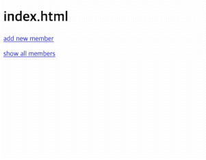

## 4. 결론

- 서블릿과 자바코드만을 이용해 HTML 문서를 생성하는것 보단 가독성과 작성 난이도가 쉬워졌음에도 불구하고 여전히 다음과 같은 문제점을 갖고있다.
- HTML과 자바코드가 섞여있어 가독성이 떨어진다.
- 비즈니스 로직을 비롯한 모든 코드가 JSP에 노출되어있다.

### 해결방안?

- 각각의 JSP가 너무 많은 역할을 담당하고 있다.
- MVC패턴을 적용해 코드를 분리하는(역할을 분리하는) 작업으로 해결할 수 있다.
