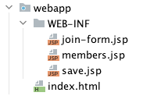

# MVC 패턴

> - 앞서 살펴본 JSP만으로 구현한 웹앱에서는 비즈니스 로직의 노출, 가독성 저하와 같은 몇가지 문제점이 발생했다.
> - 문제 해결을 위해 JSP는 View로직만 처리 하게, 나머지 비즈니스 로직은 서블릿과 같은 다른 부분에서 처리 할 수 있도록 리팩토링 해보자.

## 1. MVC?

- Model, View, Controller의 각 머릿글자를 따온 표현으로 프로젝트나 앱을 구성할 때 구성요소를 세가지 역할로 구분한 것.

> #### 참고
> 비즈니스 로직 제체를 컨트롤러에서 핸들링 하게되면 컨트롤러에 너무 많은 책임이 부과된다.
> 그래서 일반적으로 비즈니스 로직은 Service 계층을 두어 따로 처리한다.

## 2. 적용

### 2.1 `.jsp` 경로 변경



- webapp 디렉토리 내 WEB-INF 디렉토리를 생성해 .jsp 파일들을 넣는다.

> #### 🧐 왜?
> - 외부(클라이언트 ex 브라우저)에서 .jsp파일을 직접 호출 할 수 없게 하기위함.
> - 이 경로에 있는 파일은 컨트롤러를 통해서만 호출 할 수 있다.

### 2.2 index.html 수정

```html
<!DOCTYPE html>
<html lang="en">
<head>
  <meta charset="UTF-8">
  <title>Title</title>
</head>
<body>
  <h1>index.html</h1>
  <p><a href="/join">add new member</a></p>
  <p><a href="/members">show all members</a></p>
</body>
</html>
```

### 2.3 JoinFormServlet

새로운 회원을 등록하기위해 값을 입력받는 페이지 서블릿 구현

```java
package com.example.demo.servlet;

import javax.servlet.RequestDispatcher;
import javax.servlet.ServletException;
import javax.servlet.annotation.WebServlet;
import javax.servlet.http.HttpServlet;
import javax.servlet.http.HttpServletRequest;
import javax.servlet.http.HttpServletResponse;
import java.io.IOException;

@WebServlet(name = "joinFormServlet", urlPatterns = "/join")
public class JoinFormServlet extends HttpServlet {

    @Override
    protected void service(
            HttpServletRequest request,
            HttpServletResponse response
    ) throws ServletException, IOException {
        String viewPath = "/WEB-INF/join-form.jsp";
        RequestDispatcher dispatcher = request.getRequestDispatcher(viewPath);
        dispatcher.forward(request, response);
    }
}
```

> #### `redirect` vs `forward`
> 리다이렉트는 실제 클라이언트에 응답이 출력되고나서 클라이언트가 `redirect`에 설정된 경로로 다시 요청한다.
> 클라이언트가 인지 할 수 있고, URL경로도 실제로 변경된다.
> `forward`의 경우 서버 내부에서 일어나는 호출이기 때문에 클라이언트가 알 수 없다.

### 2.4 join-form.jsp

- 7라인 action 경로 수정
  - "save.jsp" => "save"
  - save.jsp 파일을 요청하는게 아니라 현재 계층 경로 + 작성한 경로로 요청하는것.
  - 요청 경로: `/save`

```html
<%@ page contentType="text/html;charset=UTF-8" language="java" %>
<html>
<head>
    <title>join</title>
</head>
<body>
    <form action="save" method="post">
        <label>
            username:
            <input type="text" name="username" />
        </label>
        <label>
            age:
            <input type="text" name="age" />
        </label>
        <button type="submit">submit</button>
    </form>
    <p><a href="/">back to main</a></p>
</body>
</html>
```

### 2.5 SaveServlet

입력 폼에서 전달 받은 값을 저장하고 그 값을 View 계층으로 전달 하는 로직 구현

```java
package com.example.demo.servlet;

import com.example.demo.member.Member;
import com.example.demo.member.Repository;

import javax.servlet.RequestDispatcher;
import javax.servlet.ServletException;
import javax.servlet.annotation.WebServlet;
import javax.servlet.http.HttpServlet;
import javax.servlet.http.HttpServletRequest;
import javax.servlet.http.HttpServletResponse;
import java.io.IOException;

@WebServlet(name = "saveServlet", urlPatterns = "/save")
public class SaveServlet extends HttpServlet {
    private Repository repository = Repository.getInstance();

    @Override
    protected void service(
            HttpServletRequest request,
            HttpServletResponse response
    ) throws ServletException, IOException {
        String username = request.getParameter("username");
        Integer age = Integer.parseInt(request.getParameter("age"));

        Member newMember = Member.builder()
                .username(username)
                .age(age)
                .build();
        Member savedMember = repository.save(newMember);

        request.setAttribute("member", savedMember);

        String viewPath = "/WEB-INF/save-result.jsp";
        RequestDispatcher dispatcher = request.getRequestDispatcher(viewPath);
        dispatcher.forward(request, response);
    }
}
```

### 2.6 save-result.jsp

- 변경사항
  - 파일명: save.jsp -> save-result.jsp
  - 내부 비즈니스 로직 제거
  - `${}`문법으로 서블릿에서 설정한 속성 가져오기

```html
<%@ page contentType="text/html;charset=UTF-8" language="java" %>
<html>
<head>
    <title>result</title>
</head>
<body>
    <p>id: ${member.id}</p>
    <p>username: ${member.username}</p>
    <p>age: ${member.age}</p>
    <p><a href="/">back to main</a></p>
</body>
</html>
```

### 2.7 MemberListServlet

- 전체 회원 목록 조회 서블릿 구현

```java
package com.example.demo.servlet;

import com.example.demo.member.Member;
import com.example.demo.member.Repository;

import javax.servlet.RequestDispatcher;
import javax.servlet.ServletException;
import javax.servlet.annotation.WebServlet;
import javax.servlet.http.HttpServlet;
import javax.servlet.http.HttpServletRequest;
import javax.servlet.http.HttpServletResponse;
import java.io.IOException;
import java.util.List;

@WebServlet(name = "memberListServlet", urlPatterns = "/members")
public class MemberListServlet extends HttpServlet {
    private Repository repository = Repository.getInstance();

    @Override
    protected void service(
            HttpServletRequest request,
            HttpServletResponse response
    ) throws ServletException, IOException {
        List<Member> members = repository.findAll();

        request.setAttribute("members", members);

        String viewPath = "/WEB-INF/members.jsp";
        RequestDispatcher dispatcher = request.getRequestDispatcher(viewPath);
        dispatcher.forward(request, response);
    }
}
```

### 2.8 members.jsp

- 회원 목록 조회 View
- jstl 적용 

```html
<%@ page contentType="text/html;charset=UTF-8" language="java" %>
<%@ taglib prefix="c" uri="http://java.sun.com/jsp/jstl/core"%>
<html>
<head>
    <title>members</title>
</head>
<body>
    <h1>all members</h1>
    <table>
        <thead>
            <th>id</th>
            <th>username</th>
            <th>age</th>
        </thead>
        <tbody>
            <c:forEach var="item" items="${members}">
                <tr>
                    <td>${item.id}</td>
                    <td>${item.username}</td>
                    <td>${item.age}</td>
                </tr>
            </c:forEach>
        </tbody>
    </table>
</body>
</html>
```

## 3. 결과


## 4. 결론

- JSP가 거의 모든 영역의 역할을 담당하던 것에서 코드를 분리해 **모델, 컨트롤러, 뷰**를 명확하게 **분리** 할 수 있다.
- 하지만 그럼에도 남아있는 문제점이 있다.

### MVC 패턴을 적용했음에도 여전히 남아있는 문제점

#### 1. 중복된 코드가 여전히 많다.

각 서블릿 클래스에서 다음과 코드가 중복되어 사용되고 있다.
- `viewPath`변수의 상위 디렉토리 경로와 `.jsp`접미사
- 서블릿에서 View를 호출하기위한 `forward`메서드 관련 코드

#### 2.2 유의미하지 않은 코드

- 모든 서블릿에서 인자값으로 `request`, `response를` 가진다.
- 하지만 이번 예제에서 `response는` 유의미하게 사용되지 않았다.

### 해결방안?

- 종합하면 공통처리에 대한 문제가 발생하고있다.
- 이러한 문제를 해결하기위해 컨트롤러 호출 전에 공통처리가 가능해야하는데, 이는 `프론트 컨트롤러 패턴`을 통해 해결 가능하다.
